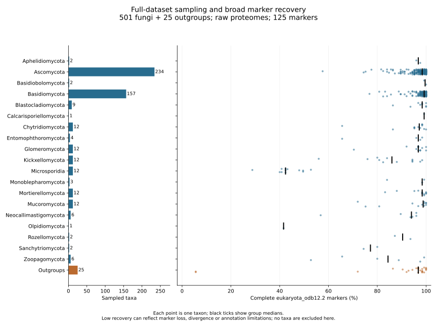
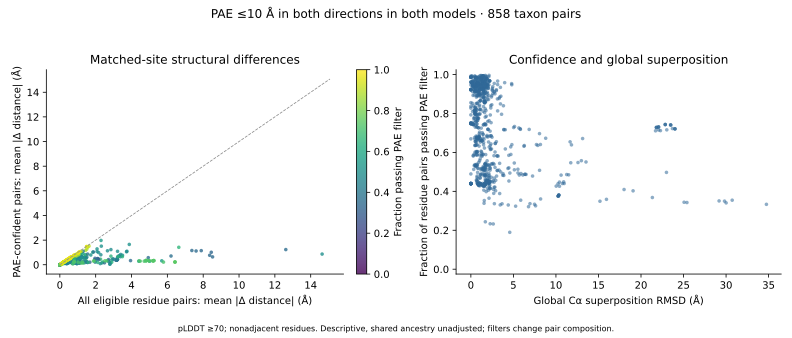
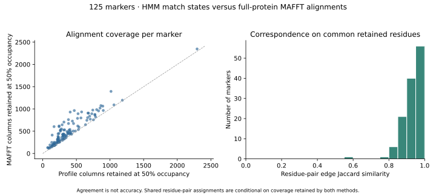

# Fungal structural evolution

Comparative structural genomics of approximately **500 fungal species plus 25 non-fungal outgroups**. The central question is where structural evolution accelerates or decouples from sequence evolution, and how these changes relate to duplication and ecology.

Status: proteomes acquired and broad-marker QC completed for **501 fungal entries and 25 genome-backed outgroups (526 taxa)**. A [taxon-label audit](metadata/taxon_label_review.tsv) flags one hybrid and 21 incompletely identified fungal entries for species-level review. Gene-representative preparation is complete with unresolved mappings flagged. All 125 profile-based marker alignments are complete; an initial tree search is running on a 49,027-position matrix. OrthoFinder reference-core inference is complete and assignment of all 462 additional taxa has started. All 125 MAFFT sensitivity alignments are complete, with a 63,750-position alternative matrix; existing-structure acquisition continues. Pfam 38.2 searches and raw-hit validation are complete across the full marker-protein set (163,650 hits; overlaps retained). Domain-search inputs are also prepared and verified for all 5,815,847 representative proteins; additional full-proteome searches are now running after successful marker-search validation. The first 128 local ESMFold v1 predictions passed independent artifact validation; the remaining eligible short-marker queue is now running. Supported species trees, full orthology and evolutionary analyses remain pending. Full-scale design; no separate pilot.

## Project records
- [Original objective](docs/objective.txt)
- [Research plan](docs/research-plan.md)
- [Progress and completion evidence](docs/progress.md)
- [Decisions and questions](docs/decisions.md)
- [Literature](docs/bibliography.md)
- [Resource assessment](docs/resources.md)
- [Phylogenetic workflow](docs/phylogenetic-workflow.md)
- [Gene and isoform reconciliation](docs/gene-isoform-mapping.md)
- [Assembly-quality workflow](docs/assembly-quality-workflow.md)
- [Orthology workflow](docs/orthology-workflow.md)
- [Domain annotation workflow](docs/domain-annotation-workflow.md)
- [Domain geometry and placement confidence](docs/domain-structure-comparisons.md)
- [Structural alphabet benchmark](docs/structural-alphabet-benchmark.md)
- [Fitted tree paths and direct geometry](docs/tree-path-geometry.md)
- [Prediction-source controls](docs/prediction-source-controls.md)
- [Final outgroup query resolution](docs/chromosphaera-taxonomy-resolution.md)
- [Local structure prediction](docs/structure-prediction-workflow.md)
- [Ecological evidence and curation](docs/ecology-evidence-workflow.md)
- [Structure-to-phylogeny residue mapping](docs/marker-structure-integration.md)
- [Methods draft: executed work and pending analyses](docs/methods-draft.md)
- [Metadata definitions](metadata/README.md)

## Reproduction
Python 3.10+ standard library suffices for NCBI metadata inventory; openpyxl is used to import published supplementary tables. Run `make inventory` to retrieve public NCBI fungal catalogs, record checksums, and generate candidate tables. These are discovery catalogs, not a final sample. Raw downloads remain in ignored `data/`; versioned metadata records source URLs and hashes.

BUSCO uses the isolated environment specified in `environments/busco.yml`; marker workflows additionally use Biopython and MAFFT. Commands and validation gates are documented in the phylogenetic workflow. Large files must not enter Git history. GitHub: public repository https://github.com/JLSteenwyk/fungal-structural-evolution (user-confirmed).

## Full-dataset QC

These are raw-proteome results for the 125-marker broad eukaryotic panel, not a universal assembly-quality score. Reproduce with `python scripts/summarize_busco.py` and `python scripts/plot_full_dataset_qc.py`; the latter writes PNG, SVG, PDF and table artifacts under `results/qc/`. Copy its SVG to `docs/figures/marker_recovery.svg` to refresh the displayed figure. Plot dependencies are in `environments/qc-figures.yml`.

## Exploratory structure confidence assessment

Version-matched PAE matrices were validated for 422 models, enabling confidence sensitivity for all 858 marker taxon pairs qualifying at pLDDT ≥70. The figure compares residue-distance changes before and after a directional PAE filter. Filters change which residue pairs are compared; these descriptive measurements do not establish branch rates, domain movement or adaptation. Reproduction and interpretation are in the [structure integration workflow](docs/marker-structure-integration.md).

## Alignment-method sensitivity

All 125 markers have completed profile and MAFFT alignments. Their alternative 526-taxon matrices retain 49,027 and 63,750 columns, respectively. Median residue-pair Jaccard agreement among residues retained by both methods is 0.945, with substantial disagreement in a few markers. Agreement is not accuracy; tree and structural-result sensitivities remain pending. See the [phylogenetic workflow](docs/phylogenetic-workflow.md).

Domain annotation is now linked to structural geometry for the existing AFDB marker snapshot: 738 comparisons across 84 Pfam domains, plus 375 domain-pair/taxon-pair placement assessments. These measurements separate internal domain geometry from global-fit effects and uncertain interdomain placement; they are not yet evolutionary rate estimates. [Methods, figure and an artifact-control example](docs/domain-structure-comparisons.md).

Coordinate-derived 3Di encodings and all ten native features have been audited for the 422-model comparison snapshot. The matched-site sequence/3Di/geometry benchmark covers the 858 whole-marker and 738 domain comparisons under three confidence regimes. Invalid terminal states are explicitly masked and spatial-partner confidence is retained. [Benchmark figure, methods and limitations](docs/structural-alphabet-benchmark.md); matched-topology point estimates now cover 52 markers and 416 branches under three structural models. [Paired phylogenetic methods and audit](docs/paired-structural-phylogenetics.md); 31,200 paired site/block resampling draws have now been audited, providing conditional interval sensitivities. Nonlocal feature dependence, broader uncertainty, model adequacy and acceleration tests remain unresolved.

The expanded source-specific catalog now contains 13,153 GDM models linked to 13,654 marker proteins in 322 taxa. A [full-design coverage audit](docs/prediction-source-controls.md#expanded-model-catalog-and-full-design-coverage) retains all 526 taxa and separates acquisition candidates, query gaps and missing marker sequences. Expanded residue mapping is complete with 4,895,692 residue links; native structural-alphabet extraction and export-identity checks are complete, while confidence retrieval and full native feature validation remain pending. These counts do not establish confidence-qualified structural coverage or evolutionary results.

A [full-sampling gene-copy annotation audit](docs/gene-isoform-mapping.md#full-sampling-busco-copy-annotation-audit) separates 312 raw duplicated BUSCO calls attributable to one annotated gene’s multiple products from 1,989 calls spanning multiple annotated genes and four unresolved calls. Biological duplication, assembly redundancy and contamination remain to be assessed.

Both full-taxon alignment strategies now have guide-tree searches running. A [taxon-coverage sensitivity audit](docs/phylogenetic-workflow.md#full-sampling-taxon-coverage-sensitivity-definitions) shows that a 50% coverage filter would eliminate all sampled Microsporidia and Olpidiomycota; the production design retains all 526 taxa. Supported trees and filtered-tree comparisons remain pending.

[Assembly-matched coding-sequence acquisition](docs/coding-sequence-workflow.md) is running for the 519 NCBI-backed taxa. All seven external taxa now have available CDS sources or verified extracted subsets, including 8,558 exact translated Creolimax CDSs; exceptions remain explicit. Translation/codon validation and selection tests remain to be completed.
