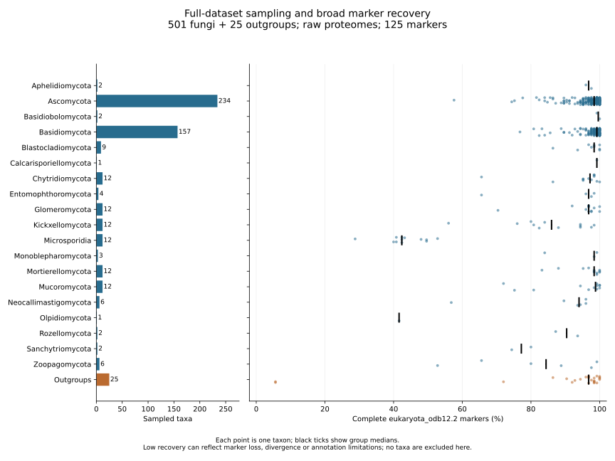
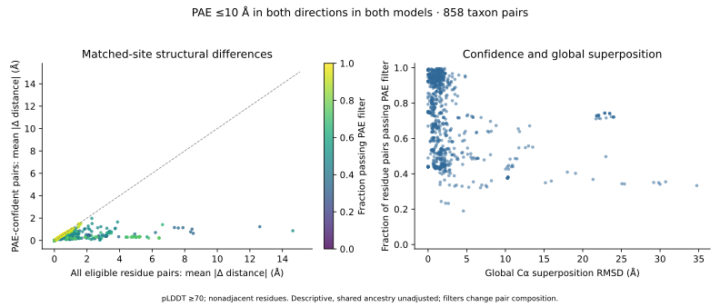
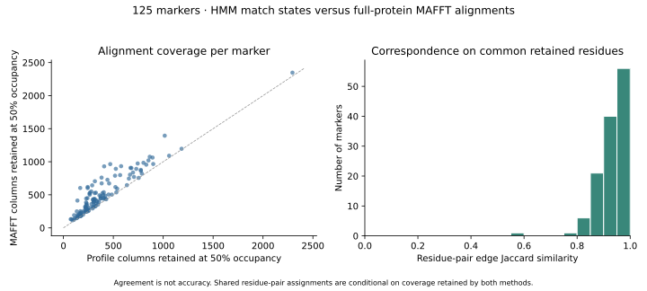

# Fungal structural evolution

Comparative structural genomics across approximately **500 fungal species plus
25 non-fungal outgroups**. We aim to identify where protein structures change
across the fungal phylogeny, how those changes relate to sequence evolution,
and their associations with duplication, domain architecture and ecology.

## Current checkpoint — 5 October 2026

The [full annotation-coordinate registry](docs/full-annotation-coordinate-registry-20261005.md)
producer has completed across all 526 entries and **5,927,745 source protein products**,
retaining all alternatives and the unchanged 5,815,847 representatives.
The original NCBI annotations contain **60,434,823 features/23,306,261 CDS
segments**. All coordinates, phases, exceptions, Parent links and unresolved
candidate associations are retained for later assembly-to-CDS checks. Sixteen
offline controls pass; full independent replay and original execution closure
are complete. Genomic agreement remains pending. The [genome-to-CDS software](docs/full-genome-annotation-cds-20261005.md)
passes 19 producer and 18 independent-reader offline controls. Its full run
remains gated on original independent assembly-DNA closure. These stages add annotation controls, not structures or inferred events.

**The project is not complete.** The scheduled ESMFold prediction batches have
finished; this does not mean every fungal protein has a structure or that the
evolutionary analyses have finished. GPU prediction remains paused. Authorized
CPU analyses continue. The original retrieval queue has finished its accession
attempts; individual errors and no-match outcomes remain explicit.

The [completed retrieval snapshot and full catalog refresh](docs/completed-retrieval-catalog-refresh-20261005.md)
preserve all **526 taxa and 5,815,847 representative proteins**. The entire
3.3 GiB retrieval log is frozen and validated. Full matching, coordinate hashing
and independent reconstruction are complete: **2,994,868 linked proteins**,
**2,935,733 selected models**, **51.5% availability** before confidence/PAE
filtering and ESMFold integration. The complete old/new comparison verifies
1,039,174 new links, no losses and 16,470 replacements. Both 526-row taxon
tables and a descriptive PNG/PDF figure are available; 2,820,979 proteins
remain unlinked in this AFDB snapshot. The structural atlas is unfinished.

The [full refreshed domain registry](docs/completed-retrieval-domain-registry-20261005.md)
is complete across all 2.94 million AFDB models with unchanged annotation
policies and full independent interval/protein-link readback. A
[full AFDB/ESMFold availability union](docs/full-prediction-atlas-union-20261005.md)
now independently verifies every representative protein: **3,019,669 have
at least one model (51.9%)**, **2,796,178 have neither source**. All 501 fungi
and 25 outgroups have at least one model. Overlapping predictors and an
annotated alternative-product exception are retained; no predictor is chosen
by confidence score. Full confidence/PAE, structural comparisons and
evolutionary event inference remain separate requirements.

The [expanded domain manifest](docs/completed-domain-extraction-20261005.md)
now independently verifies **2,454,565 candidate intervals from 976,357 models**,
about 56% more intervals than the previous manifest. Full coordinate extraction
has started with four CPU workers. Its completion and full independent atom
readback remain pending. The first wrapper reporting failure is preserved;
the saved manifest passed a separate full independent check without regeneration.

The [full source coordinate/confidence audit](docs/full-atlas-coordinate-confidence-20261005.md)
is also running across **all 2,961,055 models and 1.165 billion inventory
residue positions**, with eight CPU workers. Literal producer and independent
reader controls pass; full producer completion and independent readback are
pending. Original coordinates, predictor identities and every exclusion remain
explicit. PAE/context qualification and accuracy calibration are still required.

The [full PAE inventory and validation](docs/full-atlas-pae-20261005.md) now retain
every source model and independently reconstruct the entire missing queue.
All **55,959 previously available matrices** pass source/body validation and
full independent decoding/statistic reconstruction across all 112 jobs. The
corrected complete-queue downloader has verified **15,700 new PAE matrices**
at 22:29 UTC, with no failures.
Its initial cache-path failure, stopped output and unreceipted bytes are retained
and excluded. PAE retrieval adds uncertainty data for existing structures;
it does not add predicted structures or complete scientific atlas qualification.
Native completion of the available-matrix validation is journal-proven; its
lost original API terminal remains explicit.

The independent PAE reader has complete original API/native execution closure.
The [full assembly-DNA stage](docs/full-assembly-dna-20261005.md) has completed
across all 526 taxa with zero acquisition errors: 519 exact NCBI assembly files
and seven publisher genomes checked in place, containing 26.65 billion bases.
Original acquisition API/native/journal closure is complete. Its independent
reader is running with four CPUs/32 GiB/no swap, with 423 genomes reconstructed
at 22:26 UTC. Full reader completion remains required before genome-to-CDS
comparison; contamination, haplotig and duplication checks remain subsequent
requirements. DNA and PAE acquisition add supporting data, not structures.

All **24 ancestral failed-role comparisons** now finish without native crashes.
Independent readback and original execution closure pass, with **22 finite
integrity checks and two excluded special-value reviews**. This does not
qualify an adequate ancestral posterior or repair the installed formatter.
[Completed comparison and remaining issues](docs/baliphy-joint-fasta-v7-20261004.md).

A [full alpha diagnostic](docs/ancestral-log-alpha-diagnostic-20261005.md)
independently checks all 34,020 current scalar rows and demonstrates a native
log-scale exponentiation overflow mechanism in 57 deterministic cases.
This explains a possible source of infinite parameters without proving the
historical cause: latent log-alpha was not saved. Reviewed arrays remain
excluded. Reproducible diagnostic PNG/PDF figures retain nonfinite counts.

The [direct coordinate benchmark and phylogenetic handoff](docs/predictor-coordinate-and-phylogeny-controls-20261004.md)
verifies all 643 matched predictor pairs at 12 masks: 7,716 dispositions,
5,171 geometry comparisons and 2,545 coverage exclusions. Independent geometry,
summary and taxon-set readers pass. All 8,750 marker/tree-view cases and 31,290
internal paths link coordinate controls, AA estimates and paired structural
distributions; merged paths remain explicit. Reproducible PNG/PDF figures are
published. These controls do not establish accepted evolutionary accelerations
or complete the full fungal atlas and eight aims.

The [full historical numeric assessment](docs/full-historical-number-assessment-20261004.md)
has checked all 1,620 ancestral short-run roles and 34,020 scalar rows. It found
33 altered alpha values, 19 malformed scalar JSON rows and 14 discrepant rate
frames, including two missed by normalization alone. Separate full readback
and both original execution journals are verified. Historical numbers remain
unqualified; the installed formatter and ancestral posterior are not accepted.

A [future scalar JSON correction](docs/baliphy-scalar-json-v6-20261004.md)
now passes complete 405-program source checks, paired native comparisons for
all three priors, 63 scalar-row readbacks and explicit nonfinite-state checks.
All 1,620 future roles are prepared with fresh seeds. A separate
[V6 scalar admission adapter](docs/baliphy-scalar-v6-joint-admission-20261004.md)
now checks the full role construction and retained native scalar/joint outputs,
keeping malformed and special-value states in review without admitted arrays.
The [complete V6 native startup grid](docs/baliphy-scalar-v6-startup-20261004.md)
has passed all 1,620 roles and 405 quartets, with independent readback and full
source/artifact/two-journal closure. The
[V6 sampler controller](docs/baliphy-scalar-v6-controller-20261004.md)
now passes software serialization checks. The
[V6 resource observer](docs/baliphy-scalar-v6-resource-observer-20261004.md)
also passes full role-accounting software checks. The
[complete corrected sampler and concurrent telemetry](docs/baliphy-scalar-v6-execution-20261004.md)
have closed all 1,620 roles: 1,584 finite integrity checks, twelve special-value
reviews and 24 native segmentation faults in OG0000972 across two effective
inputs, all three priors and four chains. Independent sampler/telemetry readers
and original journals are closed; all 122,718 archive bindings were freshly
verified. The corrected scalar path passes 1,430,352 mapped values. Reviewed
ancestral arrays remain excluded. These 20-iteration runs do not establish
adequate ancestral posterior uncertainty. A
[separate native debugger diagnostic](docs/scalar-native-signal-diagnostic-20261004.md)
captured SIGSEGV at a native call writing below the fully grown 8 MiB stack.
The original debugger terminal and stack evidence are verified. A separate
controlled comparison uses a 64 MiB process-local stack with input, seed and
other native caps unchanged. That diagnostic has now ended: the debugger exits
zero, but the native sampler is killed by SIGKILL with its last saved iteration
at nine of twenty. Independent readback checks its ten saved scalar rows.
Termination is consistent with the fixed native CPU cap; the kernel cause is
not separately captured. This is not a validated correction. Failed
roles are retained; no production attempt is retried or global limit changed.
Existing jobs and historical outputs remain unchanged.

A [joint FASTA serialization candidate](docs/baliphy-joint-fasta-v7-20261004.md)
has completed a full 622-tip comparison at the original 8 MiB stack and other
native caps. The native exit is zero; independent readers checked 903 scalar
values and 956,096 ancestral residue/category pairs over three saved frames.
The original wrapper's separate reporting failure is preserved and resolved
by a fresh read-only review. The complete 24-role comparison preserves original
inputs, seeds, priors and caps. Both original executions and independent
readback have closed: 22 roles pass finite integrity checks, while two retain
eight infinite alpha values and have no accepted arrays. Full failure-grid
output integrity, a global repair and adequate ancestral posterior uncertainty
remain unqualified.

The retained uniform covariance basis has now completed all 1,302,000 audits
and 6,220,800 setting links with original independent readback and two-journal
closure. A [fresh full closure check](metadata/full_reduced_covariance_qualification_completed_verification_20261004_v3.json)
verified all 45 archive bindings and three original terminal-success handles.
Retained timing stopped after 10 cohort receipts on a covariance agreement
guard; its original failure and downstream failures are retained with unchanged
tolerances. A new exact-cohort diagnostic passes all 40 selected guards and
an independent wider-precision raw reference agrees, but the original failure
is unexplained. An [ordered timing-probe replay](docs/retained-covariance-ordered-probes-20261004.md)
captured eight changed entries in a separate species-factor buffer. The responsible
operation is now narrowed to the [native SVD call](docs/retained-native-svd-write-isolation-20261004.md);
the exact write and validated repair remain unresolved. A
[protected-factor diagnostic and unprotected hardware watchpoints](docs/retained-factor-watchpoints-20261004.md)
retain both the 40-probe protected nonrecurrence and the V8 target's 40-probe
nonrecurrence with its original debugger post-exit failure. A
[fresh traced hardware-watchpoint diagnostic](docs/retained-factor-traced-watchpoints-20261004.md)
completed all 40 groups without recurrence and its original wait exited zero
at 11:12 UTC. All target artifact hashes and original wrapper journals are
verified. The corrected
debugger's native-write/normal-exit controls pass; the original error remains
unresolved. Weighted numerical qualification
continues independently; fitting and calibration remain unfinished.

The [dependent Gaussian simulation code](docs/weighted-shared-entity-simulation-20261004.md)
is qualified for future uncertainty calibration: 192 dense covariance checks
and 576 exact response replays across all 64 existing synthetic weighted models.
It preserves phylogenetic/shared-entity/residual-weight dependence and retains
unresolved replicate outcomes. The [actual simulation-refit bridge](docs/weighted-shared-entity-simulation-refits-20261004.md)
now passes 128 unmocked refits and serialized independent replays using unchanged
production optimizer settings: 44 independently checked working results and
84 retained reviews. These are synthetic software cases. Full-data simulation
and production biological refits have not started; these checks do not establish
calibrated effects.

The [full four-control covariance source census](docs/full-weighted-covariance-source-census-20261004.md)
has completed all 4,340 original cohorts, 130,200 designs, 260,400 response
inputs and 622,080 settings, including serialized readback and full provenance
closure. A fresh check verified all 13,119 stage bindings and three original
terminal jobs. It reconstructs every X/y input, verifies the saved reuse controls
and retains every setting link. The numerical grid has
5,208,000 audits and 24,883,200 setting links; these have **not** been computed
by this source stage. Software checks passed all declared synthetic cases and
18 rehashed corruptions. Numerical qualification,
timing, weighted fits and biological acceptance remain pending.

The [full parallel numerical qualification](docs/full-weighted-parallel-qualification-20261004.md)
has closed all **4,340 cohorts, 5,208,000 audits and 24,883,200 setting links**
with independent arithmetic readback. A [fresh full verification](metadata/full_weighted_parallel_qualification_full_closure_verified_20261004_v1.json)
rehashes all 30,561 archive bindings, checks every producer/reader checkpoint,
and matches the complete original wrapper/native/manager journals and waits.
The reader's large terminal message was reconstructed from all nine journal
chunks. All four policies, both loading modes and five trees remain included;
original comparison tolerances are unchanged. This does not repair the earlier
native SVD write or establish biological effects.

The [full parallel timing stage](docs/full-weighted-parallel-timing-20261004.md)
is now running under its original 16-CPU/200-GiB/no-swap limits. At 15:35 UTC,
its parent and sixteen workers are live, with nine producer checkpoints and
no failure files. The full scope remains 20,832,000 candidates. Guarded fitting
and controller software are qualified, but actual timing/readback/closure
still gate full weighted optimization: **zero full weighted biological fits**
have been computed. Old serial jobs and failed namespaces remain unchanged.
Full independent numerical closure, actual timing, optimization, uncertainty
calibration and all eight evolutionary aims remain required.

A [four-control fitting source adapter and numerical bridge](docs/weighted-shared-entity-candidates-20261004.md)
preserve actual residual diagonals through both likelihood implementations.
The [complete checkpointed fitting exports and independent reader](docs/full-weighted-fitting-20261004.md)
are now software qualified: 72,000 candidate rows and 144,000 setting links
across three complete synthetic grids with explicitly mocked native fit branches,
plus independent replay of all 64 actual saved numerical fits. These are software
results. The full unlaunched configuration retains 20,832,000 potential ML/REML
candidates and 49,766,400 original-setting links. Real numerical closure,
full-data timing, real fits and biological inference remain unfinished.

The [complete four-control timing workflow](docs/full-weighted-timing-20261004.md)
is implemented and queued behind the original weighted numerical closure.
Software checks passed 72,000 candidate identities, 320 eligible groups with
actual numerical probes and 64 additional q4/q5/q6 cases. Every real candidate,
source review and eligible group remains in scope. The reader reconstructs
all selections, replays every numeric probe and checks runtime accounting;
shared review arrays retain their original bytes. Full-data timing and real
weighted fitting have not started. GPU prediction remains paused.

The [full fitting admission gate](docs/full-weighted-fit-admission-20261004.md)
is now software qualified over the same 72,000 test candidate identities.
It requires both original closures and reconstructs every source/census/selection
and runtime-accounting record while preserving the measured model configuration.
The real preflight is pending; no fit resources or workers are installed.
The [fitting resource controller](docs/full-weighted-fit-controller-20261004.md)
is implemented and checked with actual CPU/file/address-space probes,
50 scope/capacity rejections and 28 custody rejections. Both original closures
remain pending; production fitting and its actual completion closure have not
run. Real fitting/readback and calibration remain required.

A [matched predictor branch control](docs/matched-predictor-branch-controls-20261003.md)
has completed all 931 fixed-topology native fits and independent full readback.
It holds complete protein identity, sequence positions, observation masks and
topology constant between AlphaFold and ESMFold. All 125 marker slots and
70 views remain accounted: 4,970 comparisons are ready, 3,780 insufficient.
Exact input reuse leaves 133 inputs spanning 71 markers and 21 fungal taxa;
this selected control does not replace broad lineage sampling. All 15,365
branch values have full source/artifact/original-journal closure. Predictor
differences remain substantial in descriptive comparisons, including after
small-branch sensitivity checks. Figures and all-view/all-marker tables are
published; uncertainty, model adequacy and accepted evolutionary effects
remain unqualified.

The [paired site/block uncertainty control](docs/matched-predictor-paired-resampling-20261003.md)
has closed all **53,200 draws and 372,400 native roles**, with independent
archive/tree/report/array readback. A fresh check rehashes all 176,656 bindings
and verifies the complete original native terminal summaries and journals.
The [paired branch summaries and figure](docs/matched-predictor-distributions-20261004.md)
now cover all 13,170 branch/model/mode rows and pass separate independent scalar
and sorted-rank replay. They describe conditional predictor sensitivity for
71 markers and 21 selected fungal taxa, with no accepted evolutionary effects
or calibrated confidence intervals. Direct structural controls and broad
fungal replication remain required.

A [full structural-marker tree coverage audit](docs/structural-marker-tree-coverage-20261003.md)
has produced all 17,500 view/predictor/marker cases and 9,047,500 original-branch
projection entries across all 70 closed tree views. All 125 marker slots, both
complete predictor sources and all five declared cohorts remain included.
The primary panel retains 25 outgroups. Independent actual raw-tree/pruning
readback and full execution/source closure passed for every entry. Complete
140-group source/view tables and an all-70-view figure also passed readback.
Across primary views, distinct internal branches account for 37.4–38.9% of
AlphaFold entries and 27.2–28.7% of ESMFold entries. These are coverage states
and arithmetic path sums, not fitted evolutionary rates.

The installed numeric formatter failure is now bypassed by a separately
qualified [V5 native CJSON logger](docs/baliphy-native-number-encoder-correction-20261003.md).
All 405 programs and 1,620 roles passed static checks; nine native software
runs across all priors, including small-alpha cases, passed 720 exact native
numeric roundtrips and eighteen independently decoded saved frames.
The model, priors, initializer and strict rate-mean assertion remain unchanged.
All old failed jobs and outputs stay preserved.

The [V3 historical replay](metadata/independent_short_sampler_replay_v3_completed_20261003.json)
has closed all 1,620 roles, 4,860 saved alignments and 19,440 candidate frames,
with 38,314 bound sources/artifacts and two original completion journals.
All 388,800 original rate cells remain unchanged and unqualified: twelve
frames fail the strict mean check, and mean-passing frames do not gain rate
eligibility. Unknown-residue disagreements between separate conditional draws
remain explicit; historical ancestral categories are unavailable.

The full corrected V5 startup grid has closed all 1,620 checks with zero
unsuccessful roles. The completed corrected short-sampler output includes
4,788 checked joint frames and 54,527,895 ancestral residue/category pairs.
Output integrity does not establish adequate ancestral posteriors.
[Full correction and pending gates](docs/baliphy-native-number-encoder-correction-20261003.md).

The complete short sampler has now closed all 1,620 outcomes: **1,596 pass
output checks and 24 SIGSEGV failures remain**, with 84,071 bound hashes and
both original journals. All failures belong to two 622-protein `OG0000972`
inputs. Controlled diagnostics reproduced 8-MiB native stack exhaustion on
both; a scoped 64-MiB limit allowed initial logging to finish. The
[fresh follow-up](docs/baliphy-native-stack-correction-20261003.md) has now
closed all 24 new attempts; every attempt timed out. A
[fresh full closure verification](metadata/baliphy_stack_followup_completed_verification_20261004_v2.json)
checked 90,987 bindings and all three original terminal controllers.
The 1,596 original successes remain; six quartets are unresolved. Originals
and global defaults stay unchanged. These short checks do not qualify
ancestral posteriors or repair the two older allocation failures.

The [fresh full covariance reader](docs/full-process-covariance-readback-20261003.md)
has completed all 4,340 cohorts, 1,302,000 audits and 6,220,800 setting links,
including full provenance closure over 2,378,669 bindings and both original
journals. Original seven-kernel covariance reviews remain explicit. The old
mismatch is unexplained despite 2,700 passing diagnostic comparisons; this
reader's success does not establish its cause or historical repair. The
retained-basis V3 qualification has now closed; production fitting
has not started. Original failed outputs and serial queues stay preserved.

The [complete retained fitting and timing workflow](docs/full-retained-fitting-and-timing-20261003.md)
is now software qualified. It preserves all 5,208,000 potential candidates and
12,441,600 setting links. Full-data timing stopped on a numerical guard after
10 cohort receipts; its failure is preserved. No production fitting has been launched
or queued. Independent fitting readback and numerical reviews remain explicit.
The process reader and retained qualification have finished; complete timing
and the cause of the original mismatch remain unresolved. Runtime remains
uncalibrated, and all eight biological aims remain incomplete.

The [full positive-diagonal covariance-cone proof](docs/nonuniform-covariance-cones-20261003.md)
has completed for all 4,340 cohorts and 8,680 certificates, with independent
rational-arithmetic readback and complete source/artifact/original-journal
closure. It keeps residual weighting distinct from target-protein covariance
and preserves every pair exception. Actual weighting policies, weighted
numerical qualification and fitted effects remain unqualified.

The [full original-cohort reuse controls](docs/inverse-reuse-weight-controls-20261003.md)
are software qualified and launched across all 4,340 cohorts and 34,110,120
cohort-row occurrences. Uniform and three mean-one inverse-reuse controls
use original background nodes, versioned physical pairs and connected family
components. The reader reconstructed every count and weight with SQL and exact
fractions. Full independent readback and source/artifact/two-original-journal
closure passed, with all 13,071 bindings freshly checked. These are
sensitivity assumptions, with no calibrated confidence-to-variance or effective
sample-size claim. Weighted numerical qualification and fitted effects remain
separate gates; GPU prediction remains paused.

The [independent nonuniform raw/REML arithmetic and reuse layer](docs/positive-diagonal-kernel-products-20261003.md)
passed 24 diagonal cases against complete component, latent and dense
calculations at unchanged tolerances. Constant and near-uniform dependencies
remain reviews. Fresh products can be shared across controls; full-data
performance and weighted qualification remain unmeasured/pending.

An [input ambiguity census](metadata/independent_short_sampler_full_input_ambiguity_census_20261003.json)
identified a validation issue affecting 24 original roles. The
[observation-aware reader v2](docs/independent-short-sampler-replay-v2-20261003.md)
is preserved as a failed historical stage after the numeric-formatter error.
The completed V3 replay above retains those unknown-residue disagreements
without combining separate draws. Original jobs and sources remain unchanged.
Full corrected joint sampling,
posterior qualification and all eight biological aims remain open.

The [full independent native-alignment replay](docs/independent-native-alignment-replay-20261002.md#october-3-complete-serialized-and-provenance-closure)
has completed serialized/source/artifact closure: all 163,418 alignments,
9.73 billion state observations and 4.24 billion count cells, with 53,331
bound hashes and both original journals. Both failed chains remain retained.
These are output-integrity results; adequate posterior mixing and biological
model/root acceptance remain open.

A [model-preserving reference-alignment initializer](docs/baliphy-reference-initialization-20261003.md)
has completed startup execution and corrected full readback: all 1,620 roles,
405 quartets, 135 inputs and 324 original aliases passed. The separate reader
recognized 72 native timing footers without rerunning any native attempt;
the original parser dispositions remain preserved. Full corrected closure
binds 13,960 source/artifact hashes and both original journals. Startup fidelity
does not establish adequate mixing or repair either historical allocation
failure. The 10,000-iteration posterior proposal remains unlaunched.
[Verified startup completion](metadata/baliphy_reference_startup_footer_completed_20261003.json).

The [full independent categorical comparison](docs/independent-ancestral-categorical-completion-20261003.md)
has completed serialized/source/artifact/journal closure for all 405 quartets,
2,032,526 pattern records and 44,715,572 state indicators. Both failed quartets
and 15 numerical review indicators remain explicit. Published tables include
all 810 group/cutoff rows and all 17 affected metric flags. No quartet is
qualified as an adequate ancestral posterior by these integrity checks.

The [full sampler/resource qualification](docs/baliphy-reference-sampler-qualification-20261003.md)
has started after complete corrected startup closure for all 1,620 roles.
It exercises 20 sampling iterations per role under a 16-CPU/200-GiB cap,
with a shared 192-GiB reservation budget held through each native run and
output check. Full scheduler, native software fixtures, serialized-reader and
startup-admission contracts passed. No role is excluded or automatically
retried; this computational checkpoint does not establish posterior mixing.
At 07:15 UTC, 19 roles had successful unclosed output checks and four native
48-GiB workers were live. A separate [read-only resource observer](docs/baliphy-sampler-resource-observation-20261003.md)
records every role, missed observations and actual enforced limits. Full
sampler/observer closure, original memory failures and posterior qualification
remain open. [Verified original execution](metadata/baliphy_reference_sampler_execution_checkpoint_20261003_v3.json).

The [full independent short-sampler replay v2](docs/independent-short-sampler-replay-v2-20261003.md)
is now queued after complete sampler closure for all 1,620 roles. It will
independently decode all saved alignments, candidate-node mappings, residue
projections and available tip category/state arrays, retaining every failure.
Internal category labels are absent from this native logger and remain
explicitly unavailable. Complete-grid software serialization and read-only
native checks passed; the original jobs were not restarted. At 08:45 UTC,
the sampler had 869 successful unclosed roles and all six original version-2
replay/sampler handles and 1,008 pins were verified.
[Queue evidence](metadata/independent_short_sampler_replay_v2_execution_checkpoint_20261003_v1.json).

The [earlier full project runtime checkpoint](metadata/project_runtime_checkpoint_20261002_v20.json)
checks 16 pipeline handles and six original scientific/retrieval jobs, with
70 terminal successes and 2,301,852 verified source/artifact bindings. A
[broader original-launch inventory](metadata/project_live_launch_inventory_20261002_v3.json)
verifies 31 distinct live project jobs, including nine older wrappers with
legacy launch schemas.
The [fresh expanded-work execution checkpoint](metadata/full_expanded_measurement_execution_checkpoint_20261002_v2.json)
reverified 2,299,379 closed source/artifact bindings for the completed context
and case handoffs and checked 49 original process identities: 34 live handles,
six newly terminal successes and nine preserved integration/dependency
failures at that observation. Native scientific jobs were not restarted.
Full sequence alignment, geometry, all-order comparison against structural
correspondences and original-context eligibility linkage have passed complete
readback and provenance closure.
The complete [original-context contrast analysis](docs/full-triad-context-contrasts-20261002.md)
has passed independent readback and full provenance closure, with verified
tables and figures. Joint sequence/structural contrast-direction controls
have also [completed with verified tables and figures](docs/full-triad-joint-directions-20261002.md#complete-production-and-published-results-october-2-utc).
Their [full integration into original contexts and reference pools](docs/full-triad-context-joint-directions-20261002.md)
has [completed full independent readback and closure](metadata/full_triad_context_joint_directions_completed_20261002.json)
across all 459,122,580 dependent policy decisions, with 493,914 bound hashes
and both original journals. All original gates and exclusions remain explicit.

Expanded background measurements and post-screen matching/balance checks have
completed. The [new results and figures](docs/full-screened-background-results-20261002.md)
show that matched target–control balance can coexist with substantial shifts
between retained targets and the full target collection.

The [complete expanded measurement handoff](docs/full-expanded-matched-measurements-20261002.md)
is implemented. Its full case producer and independent reader passed all
4,250,692 selections, identifying 75,188 logical cases across 3,331 families
and 199 focal taxa per guide; [final provenance closure](metadata/full_matching_case_index_completed_20261002.json)
passed 1,830,493 hashes and both original journals.
The corrected directed catalog has [completed full provenance closure](metadata/full_expanded_measurement_catalog_v3_completed_20261002.json)
for all 1,123,936 states, with 2,369,743 bound hashes and both original journals.
The full join has [completed independent Decimal readback and closure](metadata/full_expanded_case_measurements_v2_completed_20261002.json)
for all 150,376 case/mask records, with 2,369,783 bound hashes and both original
journals, retaining all four target–control orders,
explicit failures, original sequence/gene identities and quality gates.
This prepares expanded model inputs; calibrated phylogenetic effects remain
unfinished. Two catalog integration failures are preserved in the workflow
record, with corrected immutable versions launched.

The [expanded dependence and species covariance workflow](docs/full-expanded-covariance-20261002.md)
has [completed independent readback and closure](metadata/full_expanded_covariance_completed_20261002.json)
for all 75,188 cases: 1,052,632 endpoint/entity occurrences and 9,812 species
contrast patterns across 3,413 families and 3,330 shared-entity components.
The new rank-301 factors passed all 481,376,720 ordered covariance comparisons
against original branches across five working trees. Closure checked 1,830,546
bindings and both original journals. Expanded model fitting and calibration
remain pending. The older factors do not cover this expanded cohort.

The [full expanded model-input workflow](docs/full-expanded-model-inputs-20261002.md)
has finished producing all 751,880 case/mask/order rows and 51,840 fixed setting
counts. It retains gene/model identities, null measurements and nonlinear
sequence contrasts. Independent Decimal/SQLite readback passed all 10,526,320
numeric-cell checks, and [final provenance closure](metadata/full_expanded_model_inputs_completed_20261002.json)
verified 2,369,865 bindings plus both original process journals.
Software checks rejected 18 altered exports; full expanded model fitting
remains pending. No GPU prediction was resumed.
The [complete design and recipe inventory](docs/full-expanded-model-designs-20261002.md)
automatically started after that closure for all 622,080 fixed model-setting
records. Its original reader checked all 4,340 cohorts, 130,200 designs
and 260,400 response inputs; [full source/artifact closure completed](metadata/full_expanded_model_designs_v2_completed_20261002.json)
across 2,374,229 bindings and both original journals.
Both producer and reader report full rank throughout, with original exclusions
and review rules retained. Software contracts rejected
23 altered exports, including a corrected rank-boundary diagnostic check in
version 2. The original design queue was preserved before production began.
Expanded covariance fits remain pending.

The [complete shared-entity operator bank](docs/full-entity-operator-bank-20261002.md)
has finished producing all 75,188 cases and 1,052,632 original occurrences. It preserves
distinct genes and shared predictions in 13 signed/unsigned/family incidence
matrices, with complete kernel dependency checks and ten fixed numerical
benchmarks across five working trees. The numerical backend passed independent
dense and 80-digit checks; full-bank software tests rejected 15 altered exports.
Independent production readback passed all operators, Grams and ten full-case
benchmarks; [final provenance closure](metadata/full_entity_operator_bank_completed_20261002.json)
verified 1,830,606 source/artifact bindings and both original journals.
Expanded variance fitting remains pending.
A complete scan of all original matching selections verifies that target-node
variance aliases uniform residual variance within each setting. New error-contrast
checks also audit covariance dependencies after fixed effects are removed;
these are required before qualifying the final variance models.

The [full uniform covariance qualification stage](docs/full-uniform-covariance-qualification-20261002.md)
started automatically after original design closure. It retains all 622,080 fixed settings,
both loading modes and five working trees: 6,220,800 setting/mode/tree links.
Exact target/residual and family/intercept combinations remove known redundant
parameterizations; other dependencies remain review states. Reusable kernels
passed 48 dense/latent comparisons, and full contracts rejected 17 altered
exports with complete interruption replay. Production qualification, weighting,
variance optimization and calibrated inference remain pending.

The original producer generated all 1,302,000 audits and 6,220,800 setting
links, reporting every seven-term basis as requiring review. Its full
independent arithmetic readback/closure remains pending. A separate exact
operator proof has now closed across all 4,340 cohorts and both modes:
four composite kernels suffice in 3,616 cohorts, while 724 retain a fifth
pair kernel. Nonnegative forward/right-inverse maps preserve every original
covariance and all original cases. All 8,680 certificates have independent
integer-algebra, source/artifact and original-journal closure.
[Complete identities and variance-cone evidence](docs/full-covariance-dependency-review-20261003.md).

The [full retained-kernel numerical qualification](docs/full-reduced-covariance-qualification-20261003.md)
has completed original V3 production/readback/closure. It
retains all 1,302,000 audits and 6,220,800 links, copies the exact principal
Gram/error submatrices and independently checks every entry and rank.
Numerical review states, original failed/non-ready settings, nonuniform
controls, full timing/fitting and biological interpretation remain pending.

A [separate full parallel arithmetic reader](docs/full-parallel-covariance-readback-20261003.md)
validated 43 cohorts before failing a projected-Gram comparison. Its closer
and new numerical queues stopped on that failed dependency; original serial
jobs and their queued consumers remain intact. All 1,302,000 audits and
6,220,800 links stay in scope. The failed run and software fixture-restoration
finding are preserved; full numerical closure remains pending.
[Source-bound discrepancy diagnosis and retained fitting numerics](docs/retained-covariance-fitting-numerics-20261003.md):
the new four/five-term fitting bridge passes dense/score and independent
candidate tests while preserving inherited and fresh guards separately.
Full fitting source/output/link contracts, timing and production optimization
remain required; no biological effect is accepted.

The [shared-entity likelihood/optimizer backend](docs/shared-entity-likelihood-20261002.md)
now has analytic ML/REML gradients and explicit nonnegative-boundary checks.
It passed 36 dense score comparisons, an 80-digit correlated signed example
and six independent optimizer comparisons. Separate spectral replay/local
curvature checks passed 48 dense cases, an 80-digit signed case and 15 altered
candidate exports. Complete prospective uniform ML/REML accounting retains
up to 5,208,000 unique candidates and 12,441,600 original setting links.
Closed qualification, full-scope timing, production fitting/global numerical
audits and calibrated inference remain pending.

Complete source-bound fitting and independent spectral SLSQP/readback are now
implemented with immutable cohort checkpoints. Full software contracts passed
7,200 candidates/14,400 links, rejecting 19 altered exports. The faster component
spectral reader also passed the complete contracts, dense comparisons and an
80-digit precision check. An [80-pin replacement draft](metadata/full_shared_entity_fit_draft_plan_20261002_v2.json)
preserves every original setting and tolerance; it remains unlaunched pending
closed qualification and measured runtime. Its software benchmark is not a
project ETA.

The [full-scope runtime preflight](metadata/full_shared_entity_timing_plan_20261002.json)
is now queued behind original covariance-qualification closure. It retains all
4,340 cohorts and up to 5,208,000 candidate identities, benchmarking every
eligible cohort/loading/tree/ML-or-REML/response group with both numerical
backends. Full-grid checkpoint/count contracts and separate eligible-selection
checks passed; these are software tests. Conditional budget-weighted timing
will remain separate from fit acceptance and a production finish ETA.
Production fitting is still unlaunched; [scope and reproduction](docs/shared-entity-likelihood-20261002.md#full-scope-runtime-preflight).

The [full ancestral first-horizon accounting](metadata/baliphy_initial_horizon_completed_20261002.json)
is closed: 1,617 of 1,620 chains passed output integrity, with three preserved
memory failures and 402 of 405 scalar-diagnostic quartets complete. No quartet
passes every scalar mixing check at either burn-in cutoff. Five chains logged
allocation warnings. All three separate same-seed recovery attempts have
finished: one passed saved-output integrity and two again failed with allocation
errors. [Full recovery accounting](metadata/baliphy_memory_recovery_completed_20261002_v2.json)
verified 22,486 source/artifact bindings and both original completion journals.
The selected whole-attempt overlay retains 1,618 intact chains and 403 complete
quartets, with two failures explicit. [Corrected full-grid diagnostics](metadata/baliphy_recovery_full_diagnostics_completed_20261002.json)
have completed readback and provenance closure across 50,019 bindings and both
original journals. They reuse the 402 unchanged quartets and add the recovered
quartet's scalar, length and categorical reports. None of the 403 complete
quartets passes every scalar or candidate-length screen at either cutoff.
Posterior qualification remains open; original receipts, failed attempts and
published first-horizon results stay intact. The separate [updated 810-row table
and visually inspected figure](docs/baliphy-full-first-horizon-diagnostics-20261002.md#recovered-overlay-publication)
include the recovered group without replacing the original publication.
The [complete ancestral diagnostic table and inspected eight-panel figure](docs/baliphy-full-first-horizon-diagnostics-20261002.md)
now cover all 405 groups at both cutoffs, with failed groups explicit. Full
state/length/category accounting closed 49,902 hashes and three original
journals. A full scalar-log census and matching-version source review retain
initialization and allocation concerns separately from post-burn-in mixing.
Ancestral posterior qualification remains incomplete.

A [separate full-grid scalar numerical check](docs/independent-ancestral-scalar-readback-20261002.md)
completed all 33,046 scalar/length variable-cutoff rows, retaining both
failed quartets. A direct-lag implementation passed 107 locked-oracle fixtures
and complete source/checkpoint contracts. Its serialized reader rebuilt every
row; [closure](metadata/independent_baliphy_scalar_completed_20261002_v2.json)
checked 50,449 bindings and both original journals. Defined metrics agree on
30,478 rows; 2,568 constant-chain rows retain their no-metric review.
A percentile-boundary discrepancy in its first
version is preserved; the replacement matches the locked weighted interpolation
without changing tolerances. Numerical agreement does not qualify a joint
ancestral posterior or resolve the native allocation failures.

[Separate categorical verification software](docs/independent-ancestral-categories-20261002.md)
passed 84 locked-oracle cases over the full 22-state alphabet, including unknown
residues and gaps, label permutations and lossless temporal pattern grouping.
The complete source inventory retains all 405 groups, 2,032,526 pattern/cutoff
rows and 44,715,572 declared state-indicator rows. The first production replay
stopped after 37 complete groups on an ESS discrepancy at an exactly zero
autocorrelation pair; its failed invocations and outputs remain preserved.
The [replacement full replay](metadata/independent_baliphy_category_v2_plan_20261002.json)
is running with two CPU equivalents/32 GiB/no swap. Exact binary arithmetic
certifies the two rounding outcomes and retains differing values as explicit
numerical review; ordinary comparison tolerances remain unchanged. All 405
software workflow cases passed, including the real failing trace and 12
altered-export rejections. Full serialized replay and provenance closure remain
pending. The [saved output for the originally failing group](metadata/independent_baliphy_category_v2_boundary_checkpoint_20261002.json)
has been rechecked and retains its numerical review flag. A separate native FASTA/Newick decoder passed its software contracts
and the [full 1,620-chain source inventory](metadata/independent_native_alignment_inventory_20261002.json),
and the [complete native sample replay](docs/independent-native-alignment-replay-20261002.md)
is now running. It covers all 163,418 saved alignments, 9,732,673,504 projected
states and 4,239,976,576 cutoff-count cells, with both failed chains retained.
The producer has checked the complete raw-sample scope; separate serialized
readback and final provenance closure remain pending.
A [separate source-to-runtime node check](docs/independent-native-clade-mapping-20261002.md)
has completed over all 1,618 intact chains, including full serialized readback
and provenance closure. It independently reconstructs
every rooted clade, compares 159,538 nonroot branch parameters and verifies
all 653,672 candidate-frame mappings. All biological root assumptions remain
explicit; node correspondence does not qualify an ancestral posterior.
The [full sampling resource survey](docs/baliphy-horizon-resources-20261003.md)
has also closed all 1,620 identities and 1,623 initial/selected-recovery attempts.
It retains early nonfinite parameters and allocation warnings, with all
405 quartets in the published table and figure. A complete 10,000-iteration
fresh-chain scenario remains unlaunched pending sampler and resource review.

The [complete whole-protein model-comparison workflow](docs/full-whole-protein-comparisons-20261002.md)
is implemented and queued for all 375,350 fits and 4,147,200 comparisons. It
incorporates every verified optimization follow-up and saves selected
coefficients and conditional covariance with their exact source identities.
Production awaits full optimization closure; numerical reviews and errors stay
explicit, and inferential calibration remains required.

The analyzed cohort contains **501 fungal entries and 25 outgroups** (526
entries). The candidate manifest has 527 entries; *Saccharomyces jurei* is
excluded from analysis because no usable annotated proteome was acquired. Twenty-one uncertain fungal labels and two curated hybrids remain
explicit; these entries are not yet established as 501 unique fungal species.
See the [taxon identity review](docs/taxon-identity-sensitivities.md).
The [full assembly/taxonomy identity audit](docs/selected-taxon-identity-audit-20261003.md)
checks all 526 entries against frozen primary records. It identifies a mislabeled
amphioxus outgroup: the selected assembly is the deposited *B. belcheri*
principal haplotype from an interspecific specimen. A separate evidence overlay
preserves the stable ID and all 25 outgroups; biological species delimitation
and independent parental purity remain unverified.

| Component | Verified scope | Remaining work |
|---|---|---|
| Completed local predictions | 25,322 ESMFold models across five cohorts, preserving seven prediction configurations | Remaining marker gaps and broader proteome coverage |
| Combined marker availability | September 28 frozen-cache refresh and full reverse-log check leave 3,639 marker/protein records without cached models, representing 3,626 unique sequences; unchanged from September 25 | Availability precedes confidence filtering and is not proteome-wide coverage |
| Whole-proteome AlphaFold catalog | 1,910,138 models linked to 1,955,694 of 5,815,847 representative proteins (33.63%); full catalog and old/new comparison readbacks passed | Source-specific coverage excludes local ESMFold; confidence qualification and comparative atlas analyses remain incomplete |
| Complete ESMFold paired inputs | Full input readback passed for 122 markers, 294 taxa and 6,758,598 observed paired AA/3Di cells; all 488 fits and their audit completed | Resampling and evolutionary integration |
| Refreshed AlphaFold marker fits | Verified 125-marker collection: 500 fits from 95 unchanged and 30 refitted markers; 61,893 paired branch rows | Full 75,000-draw resampling, native audit and [warning census](docs/afdb-paired-resampling-review-20260928.md) completed; branch-information checks and calibrated evolutionary tests remain |
| Direct geometry and fitted tree paths | 2,527,033 pairs across 122 markers; all 10,108,132 tree-path values and 1,464 descriptive rank rows checked | Geometry numerically sampled one pair per marker; phylogenetic dependence, uncertainty and biological acceleration tests remain |
| Candidate domains — September 22 catalog | All 1,078,592 intervals extracted and atom-audited; database sequence/coordinate readback and 70,537-cluster partition verified; all 594,797 boundary pairs compared; complete family/taxon source joins audited | These results retain the older catalog; confidence and clustering-parameter sensitivity, phylogenetic integration and evolutionary tests remain |
| Expanded domains — September 28 catalog | All 1,575,294 intervals from 627,567 models passed full exported-atom and database checks; the complete 95,456-cluster partition and all 868,338 paired boundary assignments were independently checked; [completion evidence](metadata/expanded_domain_pipeline_completed_20260929.json) | Boundary alternatives change cluster assignment for 130,084 pairs. Confidence and clustering-parameter sensitivity, homology assessment and phylogenetic domain-event inference remain required; structural clusters are not orthogroups |
| Expanded family coverage — September 28 catalog | All 1,955,694 protein links independently reconstructed across both full family partitions; 42,396 profile and 42,390 MAFFT families have models in multiple taxa | Overlapping guide counts are not pooled; model availability does not establish confidence-qualified orthology or statistical power |
| Expanded duplication coverage — September 28 catalog | All 935,353 terminal singleton-side event records rejoined and independently checked; both proteins modeled in 141,724 profile and 141,685 MAFFT events, spanning 210 taxa per guide; [lineage figure](docs/figures/duplication_lineage_coverage_20260928.png) checked | About 30.3% event coverage; completed comparative results retain their older frozen scope. Availability does not establish structural divergence, independent predictions or unbiased sampling |
| Expanded duplication comparisons | All 539,248 dispositions and 501,324 successful alignment geometries checked. Input-order checks covered all 269,624 pair/mask rows and 500,806 usable maps. Full six-screen coverage readback checked 1,617,744 pair and 11,224,236 event decisions across all 935,353 terminal candidates; [evidence and figures](docs/duplication-sampling-coverage-20260926.md#expanded-original-length-screening-completed-september-30) | Numerical exclusions remain explicit. At 50 residues/70% original coverage, 53,962 full-protein and 31,274 pLDDT70 pairs pass; 31,271 pass both masks. Predictor calibration, domain/orientation controls, expanded matched backgrounds, phylogenetic effects and calibrated inference remain required |
| Expanded duplication annotations and backgrounds | Full 140,719-tree background/support pipeline and 5,059,122-edge graph independently checked. Fixed matching passed all 61,216,344 scenario decisions, with 4,250,692 selections and all unmatched/reuse dispositions retained; [evidence](metadata/expanded_background_fixed_matching_completed_20260930.json) | All 432 matching-balance strata and 3,456 feature summaries passed; the [figure](docs/figures/expanded_background_control_balance_20260930.png) shows target-selection shifts. All 303,802 supplemental coordinate models/133,998,473 residues and 607,604 PDB input dispositions passed independent checks; [651 bindings/four original journals](metadata/expanded_background_inputs_completed_20261001.json). Complete expanded measurement/coverage/matching/balance production is now closed; [results](docs/full-screened-background-results-20261002.md). Expanded working models, PAE/orientation/predictor quality and calibrated phylogenetic effects remain required; [workflow](docs/terminal-sister-backgrounds-20260927.md#full-expanded-fixed-matching-completed-september-30) |
| Expanded duplication sibling references | Full native choices, 121,490-row comparison ledger and cross-guide checks passed. All 24,804 additional raw-coordinate models and 49,608 written input dispositions passed independent checks. Sequence-first sensitivity checked all 283,409 targets; [evidence](metadata/expanded_sequence_first_references_completed_20260930.json) | About 25.9% of provisionally available references use a farther gene because the nearest sequence-tree genes lack models. Full sequence-first guide comparison passed 142,107 pairs. All 99,788 new-native and 123,016 reused states completed with exclusions retained; full 222,804-state union passed independent reconstruction and exact journals; [completion](metadata/reference_measurement_union_completed_20260930.json). Full native orthology membership passed all 166,829 queries/428,922 links; [completion](metadata/reference_orthology_completed_20260930_v2.json). Full cohort attrition passed independent SQL reconstruction of 566,818 context/design records; [all policies](docs/tables/reference_native_orthology_context_policy_counts_20260930.tsv). Sequence-first structural contrasts, biological orthology, common-residue geometry and calibrated asymmetry remain required; [workflow](docs/duplication-sister-references-20260926.md#sequence-first-reference-choice-completed-september-30) |
| Full reference order and original-protein coverage — September 30 | All 55,701 pairs, 222,804 directions, 111,402 pair/mask rows and 668,412 fixed decisions passed independent reconstruction and both original journals; [completion](metadata/full_reference_order_coverage_completed_20260930.json) | Both orders and original lengths required. At 50 residues/70% coverage, 23,574 full and 15,783 pLDDT70 pairs pass; 15,782 pass both masks. Shared-core/sequence-locked/domain/PAE/prediction, phylogeny and calibration remain required |
| Full native context-to-measurement design — September 30 | All 283,409 contexts, both designs and 428,922 logical sides independently reconstructed; all 121,490 availability-side links checked. [Forty hashes and both original journals](metadata/reference_context_measurement_design_completed_20260930.json); [work counts with explicit units](docs/tables/reference_context_measurement_work_dispositions_20260930.tsv) | Missing models, ties, lexical choices, identical comparisons and parent exclusions retained; physical measurement availability never overrides parent eligibility. Full context coverage/native-assignment attrition and common-triad/sequence-locked/domain/PAE/prediction/phylogeny/calibration remain required |
| Full reference-context coverage and assignment — September 30 | All 283,409 contexts/both designs/masks/six screens passed independent SQL checks: 6,801,816 context/screen states, 34,009,080 policy decisions and 5,147,064 side decisions; [completion](metadata/full_reference_context_coverage_completed_20260930.json) | Original parent eligibility and lexical choices remain mandatory, with missing/excluded states retained. Common-triad/sequence-locked/domain/PAE/prediction controls, phylogeny and calibrated effects remain pending |
| Full duplicate/reference three-way work design — September 30 | All 283,409 source contexts, 214,461 ties and 428,922 sides passed independent SQL reconstruction of primary AB plus reference AR/BR work and model-identity screens; [both original journals and source hashes](metadata/full_reference_triad_work_design_completed_20260930.json). All lexical/missing/excluded states retained; [workflow and exact count units](docs/full-reference-triad-work-design-20260930.md) | 31,235 ordered model triples, including 27,056 with source-ready links, define 432,896 two-mask/eight-order correspondence states, now independently mapped in the next row. Source readiness precedes measured three-edge coverage and common-residue/cycle-consistent fitting. Sequence-locked/domain/PAE/prediction, biological orthology/phylogeny and calibration remain required |
| Full duplicate/reference residue correspondence — verified October 1 | All 27,056 source-ready ordered triples under two masks/eight native orders (432,896 states) passed independent position/relation reconstruction; 321,723 bindings and both original journals; [workflow](docs/full-triad-common-residues-20260930.md) | 81,029,452 reference-common and 73,255,758 cycle-consistent residue occurrences retain all excluded/short cores and order alternatives. Geometry and original-context/order summaries passed the following stages; evolutionary controls and calibrated inference remain required |
| Full same-residue duplicate/reference geometry — October 1 | All 865,792 fit dispositions passed full independent quaternion reconstruction; maximum distance/contrast discrepancy 5.107e-14 Å; 464,600 bindings and both original journals; [completion](metadata/full_triad_same_residue_fit_completed_20261001.json) | All-order physical and original-context summaries have passed the next stage. Sequence-locked/domain/PAE/prediction/phylogeny controls and calibrated effects remain required; [workflow and exact units](docs/full-triad-same-residue-geometry-20261001.md) |
| Full sequence-derived correspondence — October 2 UTC | All 324,672 native MAFFT/FAMSA states, 85,050,227 common-residue occurrences, full preflight and 649,344 geometry dispositions passed independent readback/hash/two-journal closure; [complete scope](docs/full-triad-sequence-correspondence-20261002.md#complete-production-and-closure-october-2-utc). | Alternatives use the same predicted coordinates; independent predictor, domain/orientation/PAE, phylogenetic and calibrated uncertainty controls remain required. |
| Full correspondence sensitivity — October 2 UTC | All 216,448 sequence/structural comparison groups and 10,389,504 order-pair states passed full source/geometry/SQL checks and closure; [493,296 hashes/two journals](metadata/full_triad_correspondence_comparison_completed_20261002.json). | Correspondence agreement does not establish biological homology, predictor independence or calibrated effects. Full joint directions are published separately below. |
| Original-context correspondence linkage — October 2 UTC | All 283,409 contexts/214,461 ties and 459,122,580 dependent policy decisions passed original-source/SQL readback and closure; [493,601 hashes/two journals](metadata/full_triad_context_correspondence_completed_20261002.json). | Original eligibility gates remain intact. This stage checks eligibility; joint contrast direction across complete original reference pools still awaits reader/closure. |
| Full structural order robustness and contextual linkage — October 1 | All 108,224 physical summaries and all 283,409 original contexts/214,461 reference ties passed independent SQL/model-role/source-gate reconstruction. Closure binds 464,618/464,637 hashes and both original journals per stage; [full workflow, tables and figure](docs/full-triad-order-context-robustness-20261001.md) | At 50 residues/70% coverage and both native guides, reference-common pLDDT70 cohorts contain 5,592/5,593 availability contexts versus 3,915/3,916 sequence-first contexts. Original missing lexical choices and parent exclusions remain explicit; these overlapping counts are quality cohorts, not evolutionary effects. Actual expanded-background measurements and calibrated comparative inference remain pending |
| Full signed contrast sensitivity — October 2 UTC | All 243,504 mask/core sensitivity groups and 1,461,024 screening decisions passed independent reconstruction from the complete 865,792 raw fits. Two-original-journal closure binds 464,919 hashes; [full table, figure and methods](docs/full-triad-contrast-sensitivity-20261002.md). Software checks passed checkpoint recovery and rejected 16 false exports | At 50 residues/70% coverage, 1,688 of 5,448 triples passing quality under both masks and both cores have sign-uncertain reference contrasts. These are dependent physical sensitivity results, not confidence intervals or significant biological asymmetry. Full joint sequence/context direction production, predictor/domain/PAE/phylogenetic controls and calibrated inference remain required |
| Original-context contrast directions — verified October 2 UTC | All 283,409 contexts/214,461 ties/428,922 sides, 153,040,860 policy decisions and 10,800 count rows passed independent raw-model SHA/gate/SQL pool/support/count/checkpoint reconstruction. Closure binds 465,222 hashes and both original journals. Full counts and revised PNG/SVG/PDF passed value checks and actual visual review; [results and resources](docs/full-triad-context-contrasts-20261002.md). Software checks passed 2,160 decisions, committed recovery and 20 false-export rejections | Quality eligibility remains separate from direction agreement; incomplete eligible reference pools do not establish complete original-tie agreement. Shared contexts/references/guides are dependent. Joint sequence controls, matched backgrounds, prediction/domain/PAE, accepted phylogeny/reconciliation and calibrated inference remain required |
| Joint sequence/structural contrast directions — verified October 2 UTC | All 730,512 joint groups, 4,383,072 screens and 1,134 counts passed full raw-fit/SQL readback and closure; [493,605 hashes/two journals](metadata/full_triad_joint_directions_completed_20261002.json). Complete table and inspected PNG/SVG/PDF [published](docs/full-triad-joint-directions-20261002.md#complete-production-and-published-results-october-2-utc). | Main quality cohort: 5,402 triples; 1,416 positive/1,270 negative/2,716 sign uncertain (50.28%). Measurement envelopes are not confidence intervals or evolutionary polarity. Original-context direction closure, matched common-residue/domain/PAE/predictor/phylogenetic controls and calibrated effects remain required. |
| Joint directions in original contexts — complete October 2 UTC | Full producer, independent source/SQL reader and final closure passed all 283,409 contexts/214,461 ties/459,122,580 dependent policy decisions and 32,400 count rows. [493,914 hashes and both original journals](metadata/full_triad_context_joint_directions_completed_20261002.json) were reverified in the execution checkpoint. | [Full counts and visually reviewed figure](docs/full-triad-context-joint-directions-20261002.md#complete-published-counts-and-figure-october-2) published. Partial eligible pools do not establish complete original-tie agreement. Domain/PAE/predictor/accepted phylogeny/reconciliation/dependence/calibration remain required. |
| Full expanded background measurements — October 1 | All 298,848 new-native states and old-input reuse passed numeric/quaternion/readback and original journals. Full 146,172-pair/584,688-state union passed; [1,830,246 hashes/two union journals](metadata/full_background_measurement_union_completed_20261001.json). Missing/excluded states and old/new ownership retained. | Full measurements do not establish confidence-qualified evolutionary effects. Expanded working-model inputs and matched sequence/common-residue/domain/PAE/predictor/phylogenetic controls remain required; [complete results](docs/full-screened-background-results-20261002.md). |
| Complete background coverage screens — October 1 | All 292,344 pair/mask rows and 1,754,064 fixed decisions passed independent SQL/decimal/original-length reconstruction and closure; [1,830,368 hashes/two journals](metadata/full_background_coverage_completed_20261001.json). At 50 residues/70% coverage, 59,844 backgrounds pass both masks. | Original full-protein denominators and both orders remain mandatory. These distinct-pair counts are not matched effects, biological events or phylogenetic effective sample sizes. |
| Complete fixed matching coverage — October 1 | All 4,250,692 frozen selections/56,965,652 unmatched decisions/76,512,456 selected screening cells passed independent reconstruction and closure; [1,830,469 hashes/two journals](metadata/full_matched_coverage_completed_20261001.json). | Controls were not reselected after screening. Same-model/excluded states remain explicit. Expanded effect models, prediction/domain/PAE/phylogenetic and calibrated uncertainty controls remain required. |
| Complete post-screen balance — October 1 | All 62,208 feature-balance rows/7,776 coverage strata/32,682,096 reuse rows passed independent readback and closure; [1,830,489 hashes/two journals](metadata/full_screened_balance_completed_20261001.json). Complete 4,608 all-scenario summaries and inspected figure [published](docs/full-screened-background-results-20261002.md). | Maximum matched SMD0.1676 coexists with target-selection shift1.2182 baseline SD. Each metric retains its denominator; matched balance does not establish representative coverage. Dependence/sampling and calibrated effects remain open. |
| Native taxon species-tree sensitivities — October 1 | All eight sensitivity matrices independently checked across 233,899,498 retained characters, with 188 bindings and two original journals. Sixteen supported C20-PMSF refits are launched serially; [design, resources and status](docs/pmsf-four-run-sensitivity-20261001.md#native-taxon-sensitivity-refits-started-october-1) | Fresh 525-taxon guide search is running. Mixture phases wait for available memory; all 526 baseline entries/25 outgroups remain primary. No accepted root, species count, robustness or dated framework is claimed |
| Full crossed PMSF species-tree sensitivity — October 1 | All four 526-taxon runs and their 1,000-bootstrap/profile audits completed. Eight ML/consensus views, 4,576 split cells, 16 comparisons and 674 overlapping incompatible-pair records passed independent DendroPy reconstruction; [115 bindings and both journals](metadata/pmsf_four_run_sensitivity_completed_20261001.json) | ML trees share 480/523 splits; [figure and full workflow](docs/pmsf-four-run-sensitivity-20261001.md). P/P places a sparsely represented ingroup taxon with the outgroups. Full 1,052-row character diagnostic verified; taxon/marker/model/root/hybrid sensitivities and final species framework remain open |
| Full retained-reference sensitivity — October 2 UTC | All 16 baseline/cohort projections, 16,000 projected bootstrap states/32 views and 64 comparisons passed independent pruning/split reconstruction and both original journals per stage; [evidence](docs/pmsf-four-run-sensitivity-20261001.md#retained-reference-sensitivity-closed-october-2-utc) | These are projections of original fits. Branch lengths are path sums, projected SH-aLRT is unavailable, and all 16 actual native subset refits plus native-versus-reference comparisons remain required |
| Full gene-tree species estimation — October 2 UTC | All 30 ASTRAL-III alignment/taxon/support sensitivities and complete independent local/global quartet checks passed for 15,510 branches/1,938,750 branch–gene states/3,750 global states; [1,757 hashes and both original journals](metadata/species_coalescent_quartets_completed_20261002_v2.json). Full inputs and native output inventory also closed; [workflow](docs/species-coalescent-sensitivities-20261002.md) | Latest [exact runtime checkpoint](metadata/project_runtime_checkpoint_20261002_v6.json): numerical closure and downstream comparisons complete. Original effective-N failure preserved; installed-tool contracts passed and strict 2e-8 tolerances retained. Gene/taxon/marker/MSC/root/dating/reconciliation qualification remains required. Coalescent lengths are not substitutions, dates or structural displacement |
| Coalescent versus concatenated species trees — October 2 UTC | All 70 views/315 matched-taxon comparisons passed independent raw-tree readback: 48,412 presence cells, 49,847 overlapping incompatible pairs and 70 role rows; [1,805 hashes and both journals](metadata/coalescent_tree_comparisons_completed_20261002_v2.json). Complete ten-panel/two-page figure passed every cell/PDF-value check, 1,833-binding/two-journal closure and [actual visual inspection](metadata/coalescent_comparison_figure_inspected_20261002.json); [figures and results](docs/coalescent-reference-comparisons-20261002.md#full-comparison-figure-completed-october-2-utc) | Primary cohort shares 397 splits across all 14 views. These conditional point-tree comparisons do not establish a preferred model, root, cause of discordance or structural effect. Actual subset refits and biological model/gene/root/reconciliation qualification remain open. Support screens and branch units remain distinct |
| Actual subset-fit comparisons — October 2 UTC | Complete four-cohort/88-view/560-pair workflow queued after all 16 actual subset PMSF fits and independent collection: 192 native/coalescent, 256 native/projected, 112 native/native pairs; [workflow, source requirements and resources](docs/native-subset-tree-comparisons-20261002.md). Full software grid passed and rejected 15 altered exports, including unavailable zero-denominator handling | Native inference remains on its first guide; mixture phases retain their available-memory guard. Software checks do not constitute production results. Consensus resolution, original missing states, support semantics and branch units remain explicit; no GPU or new charges |
| Full gene concordance — October 2 UTC | All 250 audited marker trees against eight candidate species views: 16 native runs, 1,046,000 independently checked branch–gene cells and 8,368 summaries; [1,217 bindings and both original journals](metadata/species_gene_concordance_completed_20261002_v2.json). Complete support join and [inspected figure](docs/species-gene-concordance-20261002.md) retain ten unavailable factors | Concordance conditions on gene/reference inference and taxon coverage. Gene estimation uncertainty, biological discordance, taxon/model/root robustness and accepted species framework remain unresolved |
| Marker alignment/topology sensitivity | All 125 MAFFT marker trees, 30,575,628 input characters, 59,464 support splits and all 80,512 cross-method split rows independently checked. Supported-conflict checks completed all 130,750 independent maxima per method and all 261,500 paired classifications; [evidence and branch summaries](docs/marker-alignment-topology-comparison-20260927.md) | All 125 projected topologies differ; 50,865 guide/marker/cutoff classifications change. Thirty markers have different original tip sets. These descriptive sensitivities do not establish a preferred method, biological discordance or an accepted species tree |
| Functional correspondences | All 17,105 annotation rows checked separately for both sources: 6,444 observed AlphaFold rows (314 taxa/23 markers) and 5,576 ESMFold rows (283 taxa/21 markers). Recovered AlphaFold accessibility/annotation join verified across all 47,529 sites | Branch/site tests, matched backgrounds and biological interpretation; annotation rows are not independent events |
| Functional-site predictor sensitivity | 150 exact protein coordinates observed in both sources; all partner contexts and 600 comparisons on identical coordinate subsets checked | Native descriptors, side-chain/pocket evidence and broader controls; agreeing predictions are not experimental validation |
| ESMFold accessibility and site coupling | All 25,322 models merged; paired projection verified for 6,758,598 observations. Conditional coupling completed for 122 markers/44,198 sites, including marker resampling and copy-omission sensitivity | Phylogenetic, prediction, alignment and model uncertainty; accessibility does not establish binding interfaces |
| Recovered AlphaFold accessibility and site coupling | 30,618 models/15,960,692 residues; 9,453,757 paired observations projected and normalized. Rate optimization and rate/exposure integration completed. Conditional coupling covers 125 markers/47,529 sites, with 24 specifications per full/124-marker omission cohort and 96,000 total bootstrap fits | Phylogenetic, alignment, rate and prediction uncertainty; conditional associations do not establish causal or evolutionary effects |
| Duplication comparisons — older catalog | Matched domain measurements and 82,944 record/family/taxon summary rows verified across all 192 settings; full input-order and weighting sensitivity checked | All 412,800 primary whole-protein tasks processed; strict audit stopped on a two-residue RMSD discrepancy. Full diagnosis confirmed 27 two-residue discrepancies; full geometry readback passed, retaining 327 degenerate short mappings. Full order-summary and residue-mapping sensitivity readbacks passed. Background measurements now cover 71,461 distinct pairs; full new-alignment geometry audit passed with 77 degenerate directions excluded, including five RMSD discrepancies. Phylogenetically adjusted effects, uncertainty and biological interpretation remain |
| Duplication background matching and filtering — older catalog | All 2,786,912 fixed selections independently checked across 432 matching groups. Full target/control coverage screens and all 7,776 attrition cells verified; no rematching after filtering | All 62,208 post-screen covariate summaries and 7,776 coverage rows passed independent reconstruction. Descriptive balance does not establish representative coverage or a duplication effect; [evidence](docs/duplication-control-balance-20260927.md) |
| Whole-protein sequence–structure inputs | All 52,675 unique matched pairs linked to measurements and phylogenetic covariance identities; 421,400 contrast rows independently checked. Full 96-setting summary replay passed 1,492,992 weighted-mean cells. Independent reconstruction passed all 75,070 materialized numerical inputs | All 207,360 design assessments independently verified, with full rank and positive residual degrees of freedom throughout. Whole-protein fitting is running over 375,350 tree-specific fits; full optimization follow-up and comparison export remain gated on complete audits. Inferential calibration remains pending; [workflow and dependencies](docs/whole-protein-workflow-20260929.md), [methods](docs/methods-draft.md#whole-protein-sequencestructure-contrasts-september-29) |

For **13 exploratory ancestral case families**, all 156 refined whole-protein
fits and **8,708,760 amino-acid probabilities** passed independent numerical
checks. Refined domain probabilities (3,365,640 values) also passed. Compared
with the original whole-protein fits, 14 of 435,438 ancestor/site comparisons
change their most probable amino acid; none have opposing calls with at least
90% support in both fits. The two parameter bounds yield no state changes.
See the [refinement sensitivity figure](docs/figures/whole_refinement_sensitivity_20260927.pdf)
and [ancestral methods and evidence](docs/ancestral-case-inputs.md).
The full 468-fit alternate-start probability audit and comparison are also
complete: 128 of 1,306,314 dependent node/site comparisons change the most
probable amino acid, with no opposing calls supported at least 90% in both
fits. One site has a large support shift despite a slightly worse likelihood;
the selected refined fit agrees closely with the baseline there. These are
conditional estimates; model adequacy and joint insertion/deletion uncertainty
remain unresolved. Whole-protein versus domain fits additionally yield 104
opposing high-confidence calls across three exact coordinate sets and five
ancestral nodes. Of these dependent comparisons, 48 lack observed descendant
residues at the domain position; residue confidence does not establish
ancestral residue presence. See the [coverage audit](docs/ancestral-case-inputs.md).

The full 324-configuration Historian diagnostic grid has checked outputs:
320 original runs and four successful higher-memory retries. Original failures
remain recorded. The [Historian assessment](docs/historian-method-assessment-20260927.md)
records an important limitation: both higher-memory MAFFT retries for the 622-protein
family pass output checks, but changing the minimum branch length changes the
three non-root candidate ancestors by 10–15 ungapped edits. These are numerical
sensitivity measurements, not biological events. Both FAMSA retries also passed
output checks. The complete four-alternative comparison finds 8–22 ungapped
edits between non-root candidates across alignments and 8–19 across branch
floors. All original capacity failures and alternative outputs are retained.

All 324 BAli-Phy short sampling runs passed saved-alignment and node-identity
checks, covering 3,888 candidate-node samples. Input-equivalence checks identify
135 distinct effective inputs; all 405 initializations across three explicit
priors also passed. The full **1,620 independent-chain grid** (135 inputs ×
three priors × four seeds) completed its initial 1,000-iteration horizon.
Separately verified same-seed whole-attempt recovery yields 1,618 intact chains
and 403 complete quartets, with two failed quartets retained. Full scalar,
length and categorical accounting covers all 405 groups at both original
burn-in cutoffs; the separate scalar numerical replay also completed.
These are computational checkpoints: posterior convergence, alignment/ancestral-state mixing and
root/model sensitivity remain unresolved. Final ancestral sequences and
structures have not been qualified. See the
[BAli-Phy assessment](docs/baliphy-method-assessment-20260927.md) for resource
estimates, recovery tests, launch records and completion requirements.
An [extant residue-anchor projection](docs/ancestral-residue-anchors-20260928.md)
passed checks on all 405 saved short-run alignments and 1,620 candidate
sequence reconstructions. It provides coordinates for cross-chain assessment;
ancestral-state and homology mixing diagnostics remain unfinished. The [full categorical diagnostic queue](docs/ancestral-categorical-diagnostics-20260928.md) is active for all 405 models and waits for four verified chains per model.

Independent FastML replay now covers all 153 nonempty inputs and 8,058,340
probabilities. Three one-character cases exposed a stale ascertainment cache
after initial branch scaling. A paired precision-controlled regression reduces
their likelihood discrepancy from approximately 0.47 to below 1.24e-7 with a
targeted cache refresh. Full paired inference and separate replay completed
for 306 nonempty fits across both variants, retaining six empty inputs and
tiny probability-boundary excursions without clipping raw values. Remaining
likelihood/probability discrepancies still require review. Original outputs and strict validator failures are retained. The [full paired comparison](docs/fastml-paired-comparison-20260928.md) identifies eight changed OG0000294 fits; the completed native-rate replay reduces the cache-refreshed maximum likelihood discrepancy to 1.82e-8. Optimizer and biological-model qualification remain unresolved. The full log audit found a one-model-iteration cap in all 306 fits; full five-start refinement is active, with native option and exact tree checks.
These fits are not qualified ancestral ensembles; see the
[FastML discrepancy and correction evidence](docs/fastml-indel-likelihood-discrepancy-20260927.md).

The latest [matched contrast sensitivity](docs/matched-record-sensitivity-20260927.md)
shows that weighting can reverse the descriptive difference in some settings.
[Taxon and reuse inputs](docs/selected-taxon-inputs-20260927.md) preserve the
dependence information used by the [full comparative-model run](docs/full-matched-working-models-20260927.md).
Its verified inventory contains 28,808 unique record inputs and 144,040 tree
fits. Production, output checks and analytic-gradient readback completed.
The [analytic refinement](docs/matched-reml-analytic-refinement-20260928.md)
resolved the recorded numerical flags for all 658 targeted fits; the audited
selected export retains all 414,720 setting/tree rows. Complete residual replay
also passed for all 144,040 selected fits, and descriptive summaries are
available in the [calibration record](docs/matched-model-calibration-20260928.md).
Model adequacy and inferential calibration remain pending; these estimates
are not final adjusted effects. Numerical checks do not prove global optimality. See the
[restored-access checkpoint](docs/restored-access-checkpoint-20260928.md).

The [ordinary-ML nonlinear comparison](docs/matched-ordinary-likelihood-20260927.md)
is now running across 432,120 fits: linear, quadratic and cubic identity terms
on the same observations under five trees. Full output audit and linked
likelihood comparison are queued. Expanded joint support is verified for all
57,616 inputs, including separate nonnegative certificates for 112 numerical
edge cases. These sensitivity fits do not yet establish
model preference, significance or calibrated uncertainty.

A frozen prefix of 75,205 completed ordinary-ML fits contained 601 optimization
review flags. Their 449 unique inputs passed exact numerical-hash, membership
and phylogenetic-mapping readback. The separate refinement run completed all
601 fits: 598 pass its numerical criteria and three retain gradient-only flags.
Complete replay passed all 14,424 candidate likelihoods. Interior and boundary
proposal stages and their full readbacks also passed: each of the three flagged
cases has two validated local proposals. Selection and coefficient/covariance
readback now pass for all 601 candidates; production integration is pending. Original
fits and flags remain intact; the subset does not replace full-grid audit or
establish calibrated model comparisons. See the
[flag census and numerical follow-up](docs/nonlinear-identity-contrasts-20260927.md).

The completed [joint-covariate support check](docs/joint-covariate-support-20260927.md)
now covers all 28,808 unique inputs and 82,944 original settings. Twenty-four
tiny negative-weight cases passed a separately recorded nonnegative construction;
original solver flags remain preserved. Numerical overlap does not establish
model adequacy or calibrated uncertainty. The completed reporting export
retains all 414,720 setting/tree dispositions and unresolved-fit flags.

[Ecological edge/coverage integration](docs/ecology-optimal-edge-states-20260927.md)
finds no matched predictor marker coverage for the three currently mapped focal
taxa. The separate [wood-decay diagnostic](docs/wood-decay-phylogenetic-diagnostic-20260927.md)
retains eight reviewed taxa and uncertain classes; minimum-change locations
depend on coding. Mapping and independent verification completed across all
2,000 bootstrap trees and five codings. These diagnostics do not establish replicated
origins or ecological structural effects.

Coverage sources and exact limitations:
[completed prediction inventory](docs/completed-prediction-inventory-20260922.md),
[remaining marker gaps](docs/remaining-marker-model-gaps-20260922.md),
[September 27 residual inventory](metadata/current_marker_residual_gap_summary_20260927.json),
[September 26 completion evidence](docs/recovery-20260926.md),
[whole-proteome catalog](docs/whole-proteome-structure-catalog-20260922.md),
[domain registry and clustering](docs/whole-proteome-structure-domain-registry-20260923.md),
[functional sites](docs/functional-site-workflow.md), and
[ESMFold accessibility](docs/residue-accessibility.md), and
[recovered AlphaFold accessibility](docs/recovered-afdb-accessibility-20260927.md).

Supported species-tree comparisons and branch resampling remain active.
Completed ESMFold conditional site-rate coupling supports a positive sequence-rate
association, including after omission of one copy-flagged marker. This is a
conditional association, with model-dependent interaction evidence, not a causal
effect or a physical displacement estimate. See the
[full-cohort coupling results](docs/conditional-site-coupling.md).
The [recovered AlphaFold coupling comparison](docs/recovered-afdb-coupling-20260928.md)
also retains a positive sequence-rate association across all 24 specifications
before and after omission of the marker with uncertain gene-copy identity.
Its negative exposure interaction persists across these specifications. The
full figure shows all estimates and unadjusted marker-bootstrap intervals;
these dependent sensitivity results do not resolve prediction circularity or
shared ancestry across markers.
The full path and rank benchmark is descriptive, with shared ancestry and
prediction uncertainty still requiring treatment. See the
[September 26 checkpoint](docs/recovery-20260926.md) for completed stages and
[orthogroup validation](docs/hierarchical-orthogroup-validation-20260922.md)
for reconciliation limitations. Queued stages require successful, source-bound
completion records before advancing.

## Evolutionary objectives still open

| Objective | Work still required before completion |
|---|---|
| Branches and clades with elevated structural change | Complete branch uncertainty, direct-coordinate benchmarking, calibrated tests and multiple-testing control |
| Sequence–structure coupling | Integrate completed conditional results from both prediction sources; propagate topology, alignment, rate and prediction uncertainty and calibrate evolutionary tests |
| Domain evolution | Complete structural comparisons and reconcile gains, losses, fusions and rearrangements separately from family turnover |
| Duplication-associated divergence | Complete protein/domain comparisons, model/reference quality sensitivity, matched controls and phylogenetically controlled divergence/asymmetry tests |
| Ecological transitions | Establish usable replicated contrasts, propagate trait uncertainty and test phylogenetically controlled associations |
| Functional locations | Integrate surface/core and functional-site inputs with branch/site changes; assess supported pockets and interfaces where evidence permits |
| Selection | Resolve codon eligibility, saturation, copy and optimization concerns before appropriate tests; the current 1,632 local codon cases have all-case optimization checks running and do not yet establish eligibility |
| Ancestral and mechanistic cases | Complete joint sequence/indel uncertainty for the 13 selected exploratory families, assess convergence and model sensitivity, obtain authorized predictions and formulate testable functional hypotheses |

The [original objective](docs/objective.txt) and [research plan](docs/research-plan.md)
retain the full scope. Earlier subset analyses provide intermediate evidence;
they do not substitute for these requirements. Detailed chronology and
completion receipts are indexed in [progress](docs/progress.md).

## Project records

- [Original objective](docs/objective.txt)
- [Research plan](docs/research-plan.md)
- [Progress and completion evidence](docs/progress.md)
- [Open scientific milestones](docs/scientific-milestones-20260926.md)
- [Duplication coverage and ascertainment](docs/duplication-sampling-coverage-20260926.md)
- [Duplicate/reference domain controls](docs/duplication-domain-controls-20260926.md)
- [Decisions and questions](docs/decisions.md)
- [Literature](docs/bibliography.md)
- [Resource assessment](docs/resources.md)
- [Phylogenetic workflow](docs/phylogenetic-workflow.md)
- [Dating evidence and calibration review](docs/dating-workflow.md)
- [Gene and isoform reconciliation](docs/gene-isoform-mapping.md)
- [Assembly-quality workflow](docs/assembly-quality-workflow.md)
- [Orthology workflow](docs/orthology-workflow.md)
- [Domain annotation workflow](docs/domain-annotation-workflow.md)
- [Domain geometry and placement confidence](docs/domain-structure-comparisons.md)
- [Structural alphabet benchmark](docs/structural-alphabet-benchmark.md)
- [Fitted tree paths and direct geometry](docs/tree-path-geometry.md)
- [Conditional site-level coupling](docs/conditional-site-coupling.md)
- [Prediction-source controls](docs/prediction-source-controls.md)
- [Final outgroup query resolution](docs/chromosphaera-taxonomy-resolution.md)
- [Local structure prediction](docs/structure-prediction-workflow.md)
- [Ecological evidence and curation](docs/ecology-evidence-workflow.md)
- [Structure-to-phylogeny residue mapping](docs/marker-structure-integration.md)
- [Methods draft: executed work and pending analyses](docs/methods-draft.md)
- [Metadata definitions](metadata/README.md)

## Reproduction
Python 3.10+ standard library suffices for NCBI metadata inventory; openpyxl is used to import published supplementary tables. Run `make inventory` to retrieve public NCBI fungal catalogs, record checksums, and generate candidate tables. These are discovery catalogs, not a final sample. Raw downloads remain in ignored `data/`; versioned metadata records source URLs and hashes.

BUSCO uses the isolated environment specified in `environments/busco.yml`; marker workflows additionally use Biopython and MAFFT. Commands and validation gates are documented in the phylogenetic workflow. Large files must not enter Git history. GitHub: public repository https://github.com/JLSteenwyk/fungal-structural-evolution (user-confirmed).

## Figures and earlier cohort-specific checkpoints

The figures and analysis summaries below retain their original dataset scopes.
Some describe earlier execution states; use the current checkpoint above and
linked workflow completion records for current status.

## Full-dataset QC

These are raw-proteome results for the 125-marker broad eukaryotic panel, not a universal assembly-quality score. Reproduce with `python scripts/summarize_busco.py` and `python scripts/plot_full_dataset_qc.py`; the latter writes PNG, SVG, PDF and table artifacts under `results/qc/`. Copy its SVG to `docs/figures/marker_recovery.svg` to refresh the displayed figure. Plot dependencies are in `environments/qc-figures.yml`.

## Exploratory structure confidence assessment

Version-matched PAE matrices were validated for 422 models, enabling confidence sensitivity for all 858 marker taxon pairs qualifying at pLDDT ≥70. The figure compares residue-distance changes before and after a directional PAE filter. Filters change which residue pairs are compared; these descriptive measurements do not establish branch rates, domain movement or adaptation. Reproduction and interpretation are in the [structure integration workflow](docs/marker-structure-integration.md).

## Alignment-method sensitivity

All 125 markers have completed profile and MAFFT alignments. Their alternative 526-taxon matrices retain 49,027 and 63,750 columns, respectively. Median residue-pair Jaccard agreement among residues retained by both methods is 0.945, with substantial disagreement in a few markers. Agreement is not accuracy; tree and structural-result sensitivities remain pending. See the [phylogenetic workflow](docs/phylogenetic-workflow.md).

Domain annotation is now linked to structural geometry for the existing AFDB marker snapshot: 738 comparisons across 84 Pfam domains, plus 375 domain-pair/taxon-pair placement assessments. These measurements separate internal domain geometry from global-fit effects and uncertain interdomain placement; they are not yet evolutionary rate estimates. [Methods, figure and an artifact-control example](docs/domain-structure-comparisons.md).

Coordinate-derived 3Di encodings and all ten native features have been audited for the 422-model comparison snapshot. The matched-site sequence/3Di/geometry benchmark covers the 858 whole-marker and 738 domain comparisons under three confidence regimes. Invalid terminal states are explicitly masked and spatial-partner confidence is retained. [Benchmark figure, methods and limitations](docs/structural-alphabet-benchmark.md); matched-topology point estimates now cover 52 markers and 416 branches under three structural models. [Paired phylogenetic methods and audit](docs/paired-structural-phylogenetics.md); 31,200 paired site/block resampling draws have now been audited, providing conditional interval sensitivities. Nonlocal feature dependence, broader uncertainty, model adequacy and acceleration tests remain unresolved.

The expanded source-specific catalog now contains 13,153 GDM models linked to 13,654 marker proteins in 322 taxa. A [full-design coverage audit](docs/prediction-source-controls.md#expanded-model-catalog-and-full-design-coverage) retains all 526 taxa and separates acquisition candidates, query gaps and missing marker sequences. Expanded residue mapping is complete with 4,895,692 residue links; native structural-alphabet extraction, export checks and coordinate-feature reconstruction are complete; PAE retrieval, final mapping-bound validation and per-model confidence qualification are complete for all 13,153 models, retaining 4,714,151 native states under joint six-residue pLDDT ≥70 and directional PAE ≤10 filters. Expanded paired alignments are complete for 124 markers (5–135 taxa each), retaining 304 fungal entries and 18 outgroups across 23 lineage/role groups. The paired sequence-topology/structural-branch fitting batch is audited; rate-model sensitivity and downstream coupling remain in progress. Four groups still have no usable paired coverage; evolutionary results remain pending.

A [full-sampling gene-copy annotation audit](docs/gene-isoform-mapping.md#full-sampling-busco-copy-annotation-audit) separates 312 raw duplicated BUSCO calls attributable to one annotated gene’s multiple products from 1,989 calls spanning multiple annotated genes and four unresolved calls. Biological duplication, assembly redundancy and contamination remain to be assessed.

Both full-taxon homogeneous guides are complete and audited, sharing 470 of their 523 internal splits. The first supported C20-PMSF analysis and separate full-taxon FCS mask guide sensitivities are running. A [taxon-coverage sensitivity audit](docs/phylogenetic-workflow.md#full-sampling-taxon-coverage-sensitivity-definitions) shows that a 50% coverage filter would eliminate all sampled Microsporidia and Olpidiomycota; the production design retains all 526 taxa. Supported trees and filtered-tree comparisons remain pending.

[Assembly-matched coding-sequence acquisition and translation auditing](docs/coding-sequence-workflow.md) are complete for the 519 NCBI-backed taxa, with separately audited external CDS sources and explicit exceptions. All 125 marker codon alignments passed translation readback. Selection modeling still requires orthology, alignment and divergence review; the completed gene-tree subset already flags conflicts with some genus-based grouping assumptions.

The full local ESMFold resampling run now has an audited 43,200 paired draws
across 72 markers (16 unestimable; 86,368 validated fits). Joint path summaries
are complete for 259,780 accepted structural comparisons and 6,813 exclusions;
independent path readback passed, including 86,368 tree traversals. [Methods and tracked receipts](docs/tree-path-geometry.md).
These conditional sensitivities are an intermediate result. Species phylogeny,
full structural coverage and the evolutionary hypothesis tests remain incomplete.

[Lineage-specific completeness QC](docs/lineage-completeness-workflow.md) is
complete for all 501 fungal entries. The joined quality table retains the 25
outgroups with broad-panel scores; panel differences and missing markers require
lineage-aware interpretation. The [FCS report/CDS overlap audit](docs/assembly-quality-workflow.md) is complete; biological source review and contamination sensitivity analyses remain pending.
