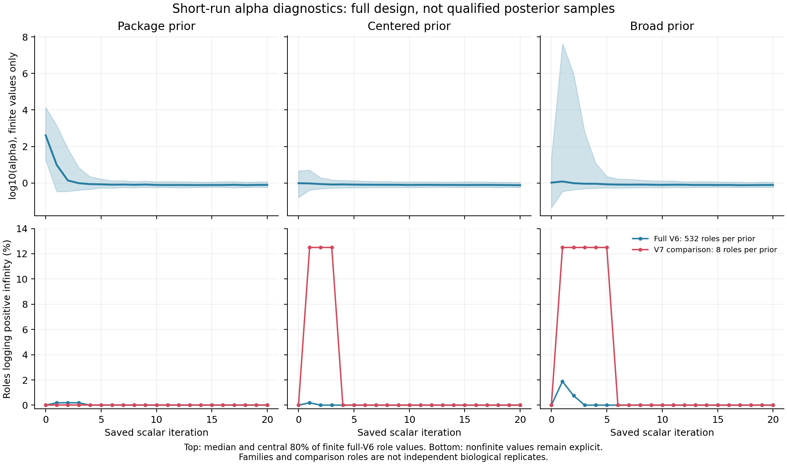

# Full current alpha trace and native overflow diagnostic

The current scalar JSON encoder accurately represents the observed infinite
alpha values. They also occur in the native TSV output. A complete audit of
all 1,620 original V6 roles and 24 V7 comparison roles checks **34,020 scalar
rows** and preserves all 24 original native failures. The successful slots
comprise 1,596 V6 roles and 24 V7 comparisons; comparisons do not replace
the failed originals or constitute independent biological replicates.

There are **26 positive-infinity observations in 14 review roles**: 18
observations in twelve V6 roles, and eight in the two V7 review roles.
Every observation is explicitly tagged at
`parameters//["S1/"]["ASRV.Gamma:alpha"]`; TSV values agree. Native logged
prior, likelihood and posterior remain finite in those rows. Exact
scalar comparisons retain the existing tolerances. All reviewed ancestral
arrays remain excluded, and short-run outputs remain unqualified as
posterior samples.

[Complete diagnostic and figure closure](../metadata/ancestral_log_alpha_diagnostic_completed_20261005_v1.json)
checks **7,108 bound files** and four actual original tool terminals,
full wrapper/native summaries and matching manager invocation records.
The [independent reader](../metadata/ancestral_log_alpha_readback_20261005_v1.json)
uses its own standard JSON/TSV parser and 90-digit Decimal calculations.
It reconstructs all emitted trace rows, original role outcomes and review
identities, checking all **411 actual generated prior programs**.

## Demonstrated native mechanism and its limits

All three generated priors use continuous `LogLaplace(mu,scale)` laws.
The installed Haskell implementation samples the underlying Laplace value
and then exponentiates it: `sample (ExpTransform dist) = exp <$> sample dist`.
This is not a user-defined spike at infinity or a newly bounded prior.

A deterministic native probe covers the same nineteen log-alpha values for
each of the three priors: **57 cases**. Finite log-alpha values just above
the representable exponential boundary produce positive infinity in the
derived alpha. The underlying Laplace log density stays finite. The native
Gamma-mean routine returns four unit rates for those overflow cases, as it
does for sufficiently large representable shapes in this grid.

| Probe log-alpha | Native derived alpha | Underlying log prior | Native four category rates |
|---|---|---|---|
| 709.78 | Finite, near the largest double | Finite for all three priors | 1, 1, 1, 1 |
| 709.79 | Positive infinity | Finite for all three priors | 1, 1, 1, 1 |
| 1000 | Positive infinity | Finite for all three priors | 1, 1, 1, 1 |

The native probe has fifteen overflow cases. Independent Decimal
exponentiation, the finite-double boundary, analytic Laplace density and
transformed density checks pass all 57 cases. General finite-shape Gamma
category accuracy is not newly established by these normalization and
large-shape controls. The native library and prior definitions are unchanged.

This establishes a mechanism compatible with the saved alpha observations.
It **does not prove the historical chain cause**: the original runs did not
save their latent log-alpha values. The probe's finite latent prior density
and its negative-infinity transformed density at an unrepresentable alpha
are different quantities. They are not interchangeable posterior evidence.
We do not recover latent values by taking the logarithm of infinity or
accept a boundary interpretation for existing reviewed arrays.

The first deterministic probe crashed without an output row. A separate
debugger inspection captured a fault in `builtin_function_ejson_null`.
The original failed source, native receipt, wrapper failure and tool
terminal remain preserved. A new V2 probe keeps all 57 cases, priors and
caps, replacing literal JSON-null placeholders with explicitly tagged
strings. It passes, without changing an installed binary or library.
[First failure audit](../metadata/ancestral_log_alpha_diagnostic_failure_audit_20261005_v1.json)
and [original captured backtrace](../metadata/ancestral_log_alpha_probe_original_backtrace_20261005_v1.log).
That probe failure is separate from the original ancestral native crashes.

## Diagnostic figure



[PDF](figures/ancestral_log_alpha_diagnostics_20261005.pdf).
All 126 phase/prior/iteration bins retain finite and nonfinite counts.
The top panels describe the finite V6 values only: median and central 80%
across 532 successful roles per prior. The bottom panels use separate
denominators for V6 and the eight V7 comparison roles per prior. Manual
sorted-value interpolation independently replays all bins; the maximum
quantile difference is `1.11e-16`. PNG/PDF copies match the original files,
and the PNG was visually inspected.

These are short-run initialization/output diagnostics. The bands are not
credible intervals or calibrated confidence intervals. Pooling families
for this descriptive display does not create a qualified posterior or
independent biological observations. Early-only infinity observations do
not justify choosing burn-in after seeing the result or silently dropping
rows.

## Resources, reproduction and next action

The producer, debugger and independent reader each use two CPU equivalents,
16 GiB/no-swap cgroups and a 12 GiB parent address-space cap. The deterministic
native child has an 8 GiB address-space cap, 60 CPU-second/90 wall-second
limits and a 16 MiB file cap. GDB has separate bounds while preserving the
same native child limits. The figure uses two CPU equivalents, an 8 GiB
cgroup and 6 GiB address-space cap. Declared output allowances are two GiB
for the diagnostic and one GiB for the figure. Actual stages complete in
seconds. These are software probes/readbacks, with no new MCMC, structure
prediction, GPU work or charges.

Raw trace/native output namespaces are outside Git:

- `results/ancestral/full-current-log-alpha-diagnostic-20261005-v1/` — preserved failure
- `results/ancestral/full-current-log-alpha-diagnostic-20261005-v2/` — successful diagnostic
- `results/ancestral/log-alpha-probe-debugger-20261005-v1/` — captured native fault
- `results/ancestral/full-current-log-alpha-figure-20261005-v1/` — table and original figure

Scripts and templates are versioned. The original producer command is:

```bash
python scripts/diagnose_ancestral_log_alpha_v2.py \
  --output results/ancestral/full-current-log-alpha-diagnostic-20261005-v2 \
  --receipt metadata/ancestral_log_alpha_diagnostic_20261005_v2.json
```

Reproduction needs the pinned original raw runs and installed software,
with fresh output/receipt namespaces. Never overwrite existing attempts.
`readback_ancestral_log_alpha_v1.py` independently checks the existing closed
inputs; `plot_ancestral_log_alpha_v1.py` creates the full table and PNG/PDF.
Original execution receipts, resources, tool payloads and complete journals
are tracked in metadata. Large-data public release remains outstanding.

The [V10 latent logger](baliphy-latent-log-alpha-v10-20261005.md) now passes
all 405 generated-source reversibility checks, all three paired prior controls
and separate reconstruction of 120 diagnostic rows. All 18 original scientific
files remain byte identical in these controls. Two earlier candidates failed
that strict test and are retained. The [complete 24-role native stage](baliphy-latent-log-alpha-full-grid-20261005.md)
and its separate full reader have completed: all 144 scientific-file pairs
are unchanged and all 504 latent states pass. Eight newly captured states in
two runs establish finite-latent exponentiation overflow for those states.
Original
historical latent values remain unavailable. Existing chains are not restarted
or concatenated. Longer sampling still requires resource estimates, convergence
and adequate ancestral uncertainty checks. The installed original formatter,
historical covariance mutation, accepted frameworks and all eight biological
aims remain unresolved or incomplete.
