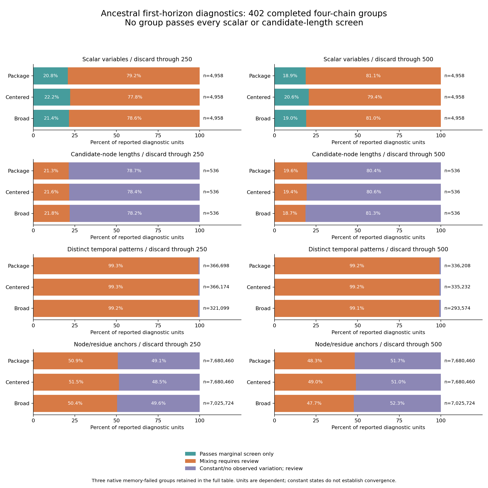

# Complete ancestral first-horizon diagnostics

The full ancestral batch completed its first **1,000-iteration** horizon.
**1,617 of 1,620 chains** passed output integrity; three native memory failures
remain unresolved. Diagnostics cover **402 of 405 four-chain input/prior groups**.
None passes every scalar or candidate-length screen at either original burn-in
cutoff. None of the distinct categorical patterns passes its observed-state
indicator screen. These samples are not qualified ancestral posteriors.

The complete [810-row table](tables/baliphy_full_first_horizon_diagnostics_20261002.tsv)
retains every original group at both cutoffs, including the three unresolved
groups with blank diagnostics. It preserves effective input identities, original
configuration aliases, family, prior, four chain IDs/seeds, integrity and allocation
notice counts, all diagnostic count partitions and original denominators.
There are 135 groups per prior, with 134 complete and one unresolved each.
Original configuration aliases and related nodes/anchors remain dependent.
The [field dictionary](../metadata/baliphy_full_first_horizon_diagnostic_data_dictionary_20261002.tsv)
defines every field and missing-value rule in both published tables.

[SVG](figures/baliphy_full_first_horizon_diagnostics_20261002.svg) and
[PDF](figures/baliphy_full_first_horizon_diagnostics_20261002.pdf) exports include
all eight panels. The figure conditions on complete groups; it does not hide
unresolved groups from the table. Percentages describe diagnostic units, not
convergence probabilities or independent biological sites. Passing an individual
marginal screen does not qualify the joint alignment/sequence posterior.

| Diagnostic | Discard through 250 | Discard through 500 |
| --- | ---: | ---: |
| Scalar variable reports | 14,874 | 14,874 |
| Scalar marginal screen passes | 3,195 | 2,901 |
| Scalar mixing review | 11,679 | 11,973 |
| Candidate-length variable reports | 1,608 | 1,608 |
| Candidate-length marginal screen passes | 0 | 0 |
| Candidate-length mixing review | 347 | 309 |
| Candidate-length constant-chain review | 1,261 | 1,299 |
| Distinct categorical patterns | 1,053,971 | 965,014 |
| Pattern indicator screen passes | 0 | 0 |
| Pattern mixing review | 1,045,872 | 956,904 |
| Pattern no-observed-variation review | 8,099 | 8,110 |
| Node/residue anchor coordinates | 22,386,644 | 22,386,644 |
| Coordinate indicator screen passes | 0 | 0 |
| Coordinate mixing review | 11,401,946 | 10,820,963 |
| Coordinate no-observed-variation review | 10,984,698 | 11,565,681 |

Scalar logs retain 750/500 iterations per chain after the cutoffs; saved
alignment-state and candidate-length diagnostics retain 75/50 draws per chain.
Constant length or unobserved categorical variation requires review. It cannot
be promoted to certainty about biological conservation. Anchor coordinates may
repeat the same ancestral state through different extant anchors; their large
counts are not independent sites. Across all 1,617 extracted chains, the source
accounting preserves 9,683,665,072 state observations and 708,466 unanchored
residue observations, with these same dependence limitations.

## Source and implementation checks

The [full native/scalar accounting](../metadata/baliphy_initial_horizon_completed_20261002.json)
closed 22,425 source/artifact hashes and both original producer/diagnostic
journals. The [state/length/category accounting](../metadata/baliphy_full_postprocessing_completed_20261002_v2.json)
closed 49,902 hashes and all three original controller journals. These
closures verify original process identity, inputs, saved artifacts, report
lineage, serialized counts and failure dispositions. They do not independently
reimplement every ArviZ metric or certify the scientific posterior.

The first postprocessing closer counted fields in a coordinate metadata
object instead of node/residue anchors. Its [failed invocation](../metadata/baliphy_full_postprocessing_failed_attempt_20261002_v1.json)
and original script/plan remain intact. A new immutable version derives the
coordinate count from four nodes times the sum of ungapped tip lengths and
compares each quartet with every contributing original chain coordinate file.
The [saved-output contract](../metadata/baliphy_full_postprocessing_coordinate_validation_20261002_v2.json)
passed all 402 quartets, 1,608 chain coordinate files and 804 cutoff summaries,
reproduced the old error in all 804 summaries and rejected nine malformed
metadata cases. The corrected full closure then completed successfully.

The [publication proof](../metadata/baliphy_full_first_horizon_diagnostic_publication_20261002.json)
reconciles every count with both complete source-accounting records, reverified
49,908 closed/pinned bindings, checks all serialized table values and embeds
exact panel counts in SVG metadata. Both the native PNG and rendered PDF were
[visually inspected](../metadata/baliphy_full_first_horizon_diagnostic_visual_review_20261002.json);
all PDF totals/visible percentage labels and the original publication completion
journal were checked. Resource estimates preceded launch: two CPU equivalents,
32 GiB memory, no swap, one numerical-library thread, 1 GiB output allowance
and 100 GiB free-space reserve. No GPU or paid infrastructure was used.

## Initialization and memory review

The [complete native scalar census](../metadata/baliphy_full_native_scalar_range_census_20261002.json)
parsed all 1,620 original logs and **69,601,090 numeric cells**, including all
three failed partial histories. The [14,580-row range table](tables/baliphy_full_native_scalar_ranges_20261002.tsv)
exports nine declared variables per chain, preserving raw first/last values,
finite extrema, nonfinite counts and exact source hashes. It does not filter
chains using arbitrary parameter cutoffs.

A [complete location audit](../metadata/baliphy_full_nonfinite_burnin_audit_20261002.json)
finds 335 nonfinite gamma-shape values in 134 integrity-passing chains. Every
one occurs in iterations 1–14; none enters either original post-burn-in window.
The installed binary reports v4.3 commit `80b0402`. Its [matching source](https://github.com/bredelings/BAli-Phy/blob/80b0402eed0157f31ecb57e0efc34c03ed83050c/src/builtins/Distribution.cc)
explicitly maps infinite gamma shape to unit rates. The [distribution transform](https://github.com/bredelings/BAli-Phy/blob/80b0402eed0157f31ecb57e0efc34c03ed83050c/haskell/Probability/Distribution/Transform.hs)
samples the underlying Laplace variable before exponentiation. A displayed
positive infinity alone is therefore insufficient evidence of a defective
substitution-rate model. Initialization and posterior-mixing review remain
separate; neither source behavior nor finite retained logs qualifies convergence.

The first same-seed recovery attempt again failed with `std::bad_alloc`, after
1,812.9 seconds under the higher 48 GiB address-space allowance. Its full
failed artifacts are preserved in the [matching-version sampler review](../metadata/baliphy_matching_version_sampler_review_20261002.json).
Only iterations 0–2 were logged; observed mean indel length exceeded 22,000
at iteration 1, and total indel length exceeded 1.29 million at iteration 2.
These transient values support further alignment/initialization/capacity
investigation, without establishing a unique failure mechanism.

The [matching triangular sampler](https://github.com/bredelings/BAli-Phy/blob/80b0402eed0157f31ecb57e0efc34c03ed83050c/src/mcmc/sample-tri.cc)
constructs a full two-dimensional alignment matrix unless an explicit bandwidth
is set. Its caught allocation error records a fallback and returns no proposal.
The default cube fraction is zero; the observed warning is not evidence that
this run used a cubic DP matrix. The terminal uncaught allocation failure needs
separate investigation. The [official guide](https://www.bali-phy.org/README.html#sequences-too-long)
explains why alignment memory grows rapidly with sequence length.

The original one-CPU/64 GiB/no-swap recovery service has finished. Its centered
chain 3 for effective input `9a841bcd…` completed all 1,000 iterations and passed
all 101 saved-alignment/node integrity checks. The package chain 2 for `8f253aff…`
and broad chain 4 for `acfc8376…` still failed with `std::bad_alloc`. The full
original and new attempt identities, hashes and failures remain preserved.

[Completed recovery accounting](../metadata/baliphy_memory_recovery_completed_20261002_v2.json)
verified 22,486 bindings and both exact original completion/resource journals.
The successful new chain's original integrity parser was replayed and its full
result matched the saved audit. This is a separate invocation of the same parser,
not an independent parser implementation or posterior convergence evidence.
The selected whole-attempt overlay retains all 1,620 original chain identities,
135 input groups, three priors and 405 quartets: 1,618 checked chains, 403 complete
quartets and two explicit unresolved failures. No samples were concatenated;
all original alignment aliases, seeds, models, priors, taxa, horizons and
scientific thresholds remain fixed. Eighteen malformed overlay/launch contracts
were rejected. The first audit failed on the older launch schema's missing
explicit `plan` field; the corrected version checks the captured `--plan`
command and any explicit field. Both failed first-version invocations and the
original code/plan/output identities remain immutable.

The [full diagnostic update](../metadata/baliphy_recovery_full_diagnostics_plan_20261002.json)
is running under two-CPU/32 GiB/no-swap limits, with readback and closure queued.
It reuses the 402 unchanged closed quartets and 1,617 original state traces,
calculates the new chain's anchored states and the complete recovered quartet's
scalar/length/category diagnostics, and retains both failed quartets. Both
250/500 cutoffs, every original state/anchor coordinate and all report count
partitions remain in scope. The original full diagnostic totals were reproduced;
a synthetic four-chain fixture passed manifest, length and complete state-array
assembly readback, rejecting six altered inputs and a foreign reused report.
Those tests are not a biological pilot or new posterior acceptance. The new
raw chain state array is 46.7 MiB and raw four-chain state assembly 187 MiB;
32 GiB memory and 32 GiB output allowance include other arrays/reports. Previous
same-input categorical reports took about 58–60 seconds, but the full hashing,
new projections and diagnostics are not a convergence or project ETA.

Corrected report acceptance still needs all queued stages, full hashes and both
actual original production/readback journals. The previously published table
and figure describe the original 402 complete quartets and are unchanged.
Adequate new sampling horizons, warning review, joint posterior convergence and
accepted ancestral structures remain open. All eight project aims remain
unfinished, and GPU structure inference remains paused.

## Reproduction

Run `publish_baliphy_full_diagnostics_20261002.py --plan` with the
[publication plan](../metadata/baliphy_full_first_horizon_diagnostic_publication_plan_20261002.json).
Use new output identities for a new run; the original launch, pinned scripts,
source plans and completed tables/figures remain immutable. Run
`inventory_baliphy_native_scalar_ranges_20261002.py` with the original completion,
producer plan, and new `--table`/`--output` paths to reproduce the full scalar
census. The nonfinite-location audit links the complete census to every flagged
raw log. Large native files, state arrays, upstream source downloads and full
hash archives remain outside Git; compact locators, scripts and published
summary tables/figures are versioned.
