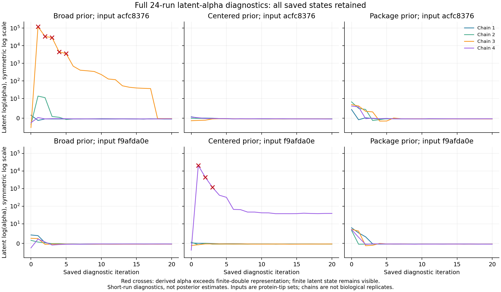

# Full-input latent-alpha logger comparison

The complete **24-role V10 comparison and full independent readback have
finished**. All 24 native runs exited zero. All **144 paired scientific files**
are byte identical to their original V7 counterparts. The separate reader
checked every one of **504 saved latent diagnostic states**, with no diagnostic
errors. Twenty-two runs pass the existing finite-output integrity checks;
two retain their special-value review classifications and excluded arrays.
Original producer session **59687** and reader session **17026** have actual
API/native zero, exact whole-wrapper/invocation closure and source bindings.
The producer took 2 hours 43 minutes 34 seconds and the reader 4 minutes
13 seconds. These are output diagnostics, not adequate posterior samples.
[Frozen plan](../metadata/baliphy_log_alpha_v10_full_grid_plan_20261005_v1.json),
[original launch](../metadata/baliphy_log_alpha_v10_full_grid_launch_20261005_v1.json)
and [historical launch observation](../metadata/baliphy_log_alpha_v10_full_grid_checkpoint_20261005_goal_launch_v1.json).
The [full independent result](../metadata/baliphy_log_alpha_v10_full_grid_readback_20261006_v1.json)
and [closed reader execution](../metadata/baliphy_log_alpha_v10_full_grid_readback_transport_20261006_v1.json)
provide the completed evidence.

This covers both original 622-protein-tip effective inputs of OG0000972,
all three priors and four chains per prior: six complete quartets. Protein
tips are not independent species. The original 24 seeds, inputs, priors,
20 iterations, 48 GiB native address-space limits, 8 MiB stack and individual
CPU/wall/file limits are preserved. Only the generated logger program and
the fresh output namespace change. Original V6 failures and V7 special-value
reviews remain retained; this does not replace or continue an old chain.

This is the complete affected native comparison matrix within the project's
full workflow. It does not establish posterior convergence or shrink the
501-fungal-entry plus 25-outgroup study to one family. All eight evolutionary
aims, accepted frameworks and adequate ancestral uncertainty remain incomplete.

## Source and software prerequisites

The [V10 logger](baliphy-latent-log-alpha-v10-20261005.md) already passes all
405 generated-source reversibility checks, three paired native prior controls,
18 byte-identical scientific-file comparisons and separate reconstruction of
120 diagnostic rows. Its successful software and original execution records
remain immutable. Earlier V8/V9 failures remain separate.

The new full job constructor checks every role against the complete closed V7
matrix and actual original V6 failed-role source records. All six generated
V10 programs reverse exactly to their original V7 source. Twenty deliberate
changes to roles, inputs, seeds, priors, source identities, native arguments,
memory reservations and limits are rejected. The original software session
3658 exits zero, with complete native/journal/source closure.
[Construction checks](../metadata/baliphy_log_alpha_v10_full_jobs_software_validation_20261005_v1.json).

Full-reader integration checks reuse all 63 already closed native V10 prior
control rows. Four deliberately changed/incomplete states remain excluded:
changed density, a 20-row partial trace, a native failure despite a complete
trace, and missing diagnostic output. Original software session 83547 exits
zero with complete native/journal/source closure. No new model run or corpus
pilot was used for these software checks.
[Reader integration checks](../metadata/baliphy_log_alpha_v10_full_reader_software_validation_20261005_v1.json).

Source preparation completes under its actual original tool session 64935.
The immutable plan binds **20,210 sources**, both software closures, all
original native pairs, the original model/input/configuration chain, the new
programs and the complete producer/reader code. Preparation is separate from
the actual native launch.

## Resources and observed baseline

The producer uses four CPU workers, 200 GiB RAM, no swap and one BLAS thread.
Four 48 GiB native leases reserve 192 GiB; 8 GiB remain for the controller.
The controller keeps an 8 GiB soft/192 GiB hard address-space limit so each
native child can retain its original 48 GiB limit. The stage wall cap is
24 hours, with individual native limits preserved and no automatic retry.
The 128 GiB output allowance and 256 GiB minimum free-disk reserve are
prelaunch estimates, not current output size or measured native memory.
[Producer resources](../metadata/baliphy_log_alpha_v10_full_grid_resources_20261005_v1.json).

The previous complete V7 matrix consumed 10.443 aggregate worker-hours;
individual native runs took 1,179–1,947 seconds. Dividing the worker total
by four gives a 2.611-hour lower bound that omits scheduling, validation and
V10 overhead. The V10 planning range is **2–12 hours**, explicitly uncalibrated
for this new version. Native limits and planning ranges are not ETAs or
posterior sampling requirements. No GPU, paid provisioning, change to another
project or installed-library edit is involved.

## Every outcome and the independent reader

The producer retains all 24 native/scalar/joint dispositions, including native
failures and explicit special values. It compares six original scientific
files per role: scalar TSV/JSON, column map, runtime tree, ancestral FASTAs
and joint site-property samples. All **144 planned file comparisons** retain
their original/current paths and hashes; missing or changed files produce
review outcomes rather than dropped roles. The new diagnostic trace is kept
separately in each native attempt.

The separate reader launched after actual original full producer API/native
zero, complete invocation-journal matching and source-binding closure. It
completed the entire matrix and independently reconstructs every
file comparison with a separate byte reader, then applies the qualified strict
JSON/90-digit Decimal diagnostic reader to every available latent row. It
checks the saved context, prior parameters/density, derived alpha, rate state,
quality tags and complete 21-row trace. Partial/native-failed/malformed traces
remain explicit. Per-row numeric errors are retained without silently dropping
the rest of the trace. Existing native/scalar/joint inspectors and job contracts
are shared dependencies and are stated as such.

The reader uses two CPUs, 32 GiB RAM, no swap, 24 GiB hard/8 GiB soft
controller address space and one BLAS thread. Its 0.1–3 hour estimate is
uncalibrated; three-hour wall/two-hour CPU safety caps are not ETAs. It does
not launch native samplers or admit old reviewed arrays.
[Reader resources](../metadata/baliphy_log_alpha_v10_full_grid_readback_resources_20261005_v1.json)
and [full reader](../scripts/readback_baliphy_log_alpha_v10_full_grid_v1.py).

Even a successful full-input logger comparison will not make the special-value
arrays suitable for posterior inference. New latent captures can establish
the mechanism for newly observed states; they cannot recover unsaved historical
values. Adequate inference still requires estimated full sampling resources,
convergence, uncertainty propagation and calibrated biological interpretation.

## Newly observed overflow states

Eight saved states in two runs have finite latent log-alpha but a derived alpha
above the finite-double representational range. Independent 90-digit Decimal
exponentiation, latent prior-density calculations, category rates and quality
tags all agree with the native trace. These newly captured states demonstrate
the overflow mechanism directly, while the historical unsaved latent values
remain unavailable. Neither run's original review disposition is changed.

| Effective input | Prior / chain | Overflow iterations | Finite log-alpha at first overflow | Category rates in every overflow state |
| --- | --- | --- | ---: | --- |
| acfc8376 | Broad / 3 | 1–5 | 119793.66206287075 | 1, 1, 1, 1 |
| f9afda0e | Centered / 4 | 1–3 | 20340.374288560004 | 1, 1, 1, 1 |

Input labels abbreviate the full effective-input hashes; both sets have 622
protein tips. The [24-row disposition table](figures/baliphy-log-alpha-v10-full-grid-20261006-v1/role_dispositions.tsv)
and [all 504 diagnostic rows](figures/baliphy-log-alpha-v10-full-grid-20261006-v1/all_latent_rows.tsv)
retain complete identities, all iterations, finite and overflow states, and
original integrity classifications. No burn-in is chosen after observing these
traces; the pooled rows are not biological replicates or posterior estimates.



[Standalone PDF](figures/baliphy-log-alpha-v10-full-grid-20261006-v1/latent_alpha_diagnostics.pdf).
The symmetric log axis retains both ordinary and very large finite latent
values. Red crosses mark derived-alpha overflow. All table rows are read back
after writing; the PNG was visually inspected. Original reporting session
70717 exited zero. Its [source-bound report](../metadata/baliphy_log_alpha_v10_full_grid_report_20261006_v1.json)
records every input and output hash. Reporting uses two CPUs, 16 GiB/no-swap
memory and a 12 GiB address-space cap, with no new native runs, GPU or charges.

## Reproduction

Large outputs remain outside Git at
`results/ancestral/baliphy-log-alpha-v10-all24-full-input-comparisons-20261005-v1/`.
Versioned artifacts include scripts, resource plans, original tool payloads,
software execution logs, launch identity and source hashes. The completed
producer and reader logs are published; unrelated live logs remain outside
the publication. Complete raw-input public release remains outstanding.

Use fresh output/receipt namespaces with the pinned native installation and
original inputs. The full constructor and reader software checks must close
before source preparation; the exact original producer completion must close
before readback. Do not reuse an incomplete attempt or silently restart a
missing process handle. The producer command for this frozen plan is:

```bash
python scripts/run_baliphy_log_alpha_v10_full_grid_v1.py \
  --plan metadata/baliphy_log_alpha_v10_full_grid_plan_20261005_v1.json \
  --receipt metadata/baliphy_log_alpha_v10_full_grid_20261005_v1.json
```

The command must run through the recorded bounded wrapper and exact cgroup
resources. A clone alone does not include the large raw sources.

The completed reader command is:

```bash
python scripts/readback_baliphy_log_alpha_v10_full_grid_v1.py \
  --plan metadata/baliphy_log_alpha_v10_full_grid_plan_20261005_v1.json \
  --producer-receipt metadata/baliphy_log_alpha_v10_full_grid_20261005_v1.json \
  --producer-transport metadata/baliphy_log_alpha_v10_full_grid_transport_20261006_v1.json \
  --receipt metadata/baliphy_log_alpha_v10_full_grid_readback_20261006_v1.json
```

Use new receipt/output namespaces when reproducing completed work. The
source-bound tables/figures are generated by
`scripts/report_baliphy_log_alpha_v10_full_grid_v1.py` after reader closure.
Full ancestral sampling resources, convergence and calibrated uncertainty are
the next requirements; all eight evolutionary aims remain incomplete.
