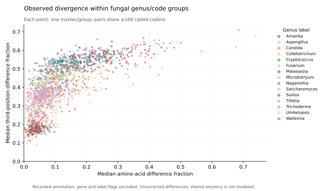
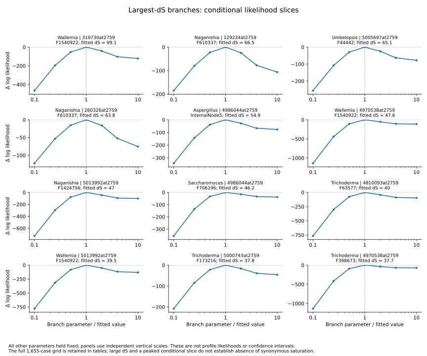

# Coding-sequence acquisition and validation

The selection analyses require coding sequences tied to the same assembly, annotation and protein identifiers as the structural and orthology inputs. Acquisition has started for all **519 NCBI-backed taxa** in the 526-taxon working manifest. Every CDS URL must have the same assembly directory and prefix as its recorded protein FASTA. The prelaunch plan permits two download/validation workers, 50 GB additional disk and approximately 0.5–8 hours on the existing host; these are planning allowances, not measured completion costs. No paid resources are used.

```bash
python scripts/download_coding_sequences.py
python scripts/extract_creolimax_cds.py --output results/cds/creolimax-extraction-v1
python scripts/inventory_external_cds.py --creolimax results/cds/creolimax-extraction-v1
python -m unittest discover -s tests -p test_cds_fasta_validation.py
```

For each NCBI assembly, the downloader archives the publisher checksum listing, requires exactly one checksum for the CDS file, checks MD5 before accepting the download and records local SHA256. It checks gzip integrity, unique FASTA record identifiers, nonempty sequences and the IUPAC DNA alphabet. Counts of sequences without a protein identifier, non-triplet lengths and ambiguous bases remain explicit. Those properties are flags for later interpretation, not automatic deletion criteria. Three tests confirm that partial/unlinked records remain flagged, repeated IDs are rejected and non-DNA input fails validation.

The downloader holds a single-writer lock and resumes validated sources only after checking their sequence and checksum-listing hashes against the cached receipt and exact taxon/assembly/URL identity. SIGTERM or SIGINT stops new submissions and drains the two active downloads. Download errors and incomplete taxa remain in the event log and final status. Changed cached sources or publisher checksum listings require review rather than overwriting previously validated evidence. A completed download does not establish translation correctness.

Files remain under `data/cds`; each taxon's result is appended to `data/raw/cds_downloads.jsonl`. The completed batch summary is `metadata/cds_download_receipts.json`: all 519 NCBI taxa validated, with no pending/error taxa and the seven external-source taxa listed separately. Files occupy 2,768,796,083 compressed bytes. Independent receipt readback checks all CDS SHA256 and publisher MD5 values, archived checksum-listing hashes and exact manifest assembly/URL coverage; evidence is in `metadata/cds_acquisition_readback.json`. Execution log: `logs/cds_downloads_v1.log`. The launch plan is `metadata/cds_acquisition_resource_plan.json`.

## External-source taxa

The external-source inventory checks actual CDS file hashes, unique sequence IDs and the DNA alphabet against the existing published/extraction receipts. It now identifies available CDS sources for all seven taxa; translation-verified subsets and boundary-aware complete-codon projections remain distinct:

| Taxon | Available CDS records | Current status |
| --- | ---: | --- |
| Amoeboradix gromovi | 7,220 | Previously extracted with exact protein translation |
| Sanchytrium tribonematis | 9,367 | Previously extracted with exact protein translation; one source protein remains out of assembly bounds |
| Corallochytrium limacisporum | 7,535 | Genome-linked complete-codon spans reproduce every protein; partial boundaries recorded |
| Chromosphaera perkinsii | 12,463 | Genome-linked complete-codon spans reproduce every protein; partial boundaries recorded |
| Pirum gemmata | 21,835 | Genome-linked complete-codon spans reproduce every protein; partial boundaries recorded |
| Abeoforma whisleri | 17,283 | Genome-linked complete-codon spans reproduce every protein; partial boundaries recorded |
| Creolimax fragrantissima | 8,558 | Extracted with exact protein translation; 136 other proteins remain explicit exceptions |

Sources and artifact hashes are in `metadata/external_cds_source_inventory.json`. The two sanchytrid CDS sets inherit the detailed coordinate, strand and translation audit described in the gene/isoform workflow; their provisional ORF status and the Sanchytrium exception remain explicit. Raw external source files are preserved. The available published CDS counts do not prove one-to-one protein mappings or complete gene annotations.

## Requirements before selection tests

Next, link CDS records to exact versioned protein identifiers and gene-representative decisions. Validate translations under the documented genetic code, with terminal-stop handling, partial CDSs, ambiguous residues, frameshifts and annotation-specific exceptions explicit. Creolimax extraction has passed the strand, phase and exact-translation checks for its verified subset; its exceptions require further source review before inclusion. Never force translation agreement by trimming unexplained residues or picking a different code solely to improve the match.

Codon alignments must preserve validated amino-acid correspondence and gene-copy identity. Test suitability at the family/clade scale, including alignment quality and synonymous divergence, before choosing selection models. Full-genome downloads or raw sequence availability do not establish suitability for deep fungal comparisons. Selection tests, multiple-testing correction and mapping supported sites to structures remain pending; structural acceleration alone is not evidence of positive selection.

## Completed Creolimax CDS extraction audit

`extract_creolimax_cds.py` checks deposited genome, GTF and protein-source hashes, as well as the normalized protein input. It uses exact transcript IDs for 8,644 proteins and explicit gene-ID links for 50 assembler products. Gene-ID fallback is accepted only when one transcript is linked. All 8,694 input proteins have an audit row; ambiguous mappings remain exceptions.

CDS blocks are ordered in transcription direction, reverse-complemented on the minus strand, checked for overlapping intervals and assembly bounds, and joined with their split-codon bases intact. Internal GTF phase describes codon continuity; those bases must not be trimmed from every exon. This audit requires initial phase zero, valid internal phases and a total length divisible by three. Translation under table 1 must match the complete normalized protein after removing at most one terminal stop from the translation. A terminal stop remains in the nucleotide output and is flagged for later codon processing.

The completed results contain **8,558 exact translations**. The other **136 proteins** comprise 71 translation mismatches, 60 nonzero/missing initial phases, four non-triplet CDS lengths and one ambiguous gene-to-transcript mapping. They are not repaired by arbitrary trimming or alternate-code selection. Two annotation transcripts lack a selected protein association under these rules and remain listed separately.

```bash
python scripts/extract_creolimax_cds.py --output results/cds/creolimax-extraction-v1
python scripts/inventory_external_cds.py --creolimax results/cds/creolimax-extraction-v1
python -m unittest discover -s tests -p test_creolimax_cds.py
```

Four focused tests cover a codon split across exons, negative-strand ordering, inconsistent phase rejection and out-of-bounds rejection. Independent output readback reproduced all 8,558 translations and verified artifact hashes and the full 8,694-protein status partition. The verified FASTA, ordered annotation segments and unused-transcript list remain in `results/cds/creolimax-extraction-v1`; the receipt and complete exception rows are versioned as `metadata/creolimax_cds_extraction_receipt.json` and `metadata/creolimax_cds_exceptions.tsv`. This makes a verified CDS subset available for the seventh external taxon; codon-alignment and selection eligibility still require family-specific assessment.

## Published outgroup CDSs: strict and boundary-aware validation

All 59,116 published CDS identifiers map exactly to normalized proteins across Corallochytrium, Chromosphaera, Pirum and Abeoforma. The unmodified-CDS baseline accepts 41,592 exact translations, flags 17,399 non-triplet lengths and records 125 translation mismatches. These immutable strict results are retained separately.

The genome/GFF audit reconstructs transcription-ordered CDS blocks, checks assembly bounds, strand, non-overlap and every internal phase. It accepts two explicitly recorded published export conventions: the full annotated genomic CDS span, or that exact span with its annotated initial phase bases already removed. It derives complete codons from the genomic span, applying the initial phase once and omitting only a terminal 1–2-base remainder. It never searches reading frames or changes genetic codes to obtain a match. Omitted bases and original genomic segments are recorded; terminal stop codons remain flagged in the DNA output.

The first projection implementation required the full genomic span to equal the published string and flagged 12,431 Pirum/Abeoforma records. Every one is explained by the second export convention: 7,097 Pirum and 5,334 Abeoforma sequences already omit the annotated initial phase bases. This is a source representation difference, not a demonstrated genome sequence error. Version 1 results remain archived; producer source is preserved in commit 0148d61.

Version 2 verifies **all 59,116 genome-linked complete-codon spans**: 7,535 Corallochytrium, 12,463 Chromosphaera, 21,835 Pirum and 17,283 Abeoforma. Partial boundaries occur in 25, 1,020, 13,565 and 9,757 records respectively. The 125 strict Chromosphaera translation mismatches are explained by annotated nonzero initial phases. All translated protein residues must match after removing at most one terminal stop from the translation.

```bash
python scripts/validate_published_outgroup_cds.py --output results/cds/published-outgroup-translation-v1
python scripts/project_published_outgroup_codons.py --strict results/cds/published-outgroup-translation-v1 --output results/cds/published-outgroup-codon-projection-v2
python -m unittest discover -s tests -p test_published_cds_translation.py
python -m unittest discover -s tests -p test_codon_projection.py
```

Use new output directories for reruns. Seven focused tests cover strict stop/partial-codon handling and genomic projection, including reverse strand and avoiding double phase removal. Independent readback checks all artifact hashes and reproduces all 59,116 translations; the 12,431 version-1 exceptions exactly equal the version-2 pretrimmed-export set. Receipts and readback evidence are versioned under `metadata/published_outgroup_*`; large per-protein audits and nucleotide FASTAs remain in the corresponding `results/cds` directories. The historical external source inventory records the acquisition state before these checks; these newer receipts supply downstream validation.

Complete-codon spans do not establish complete genes or suitability for selection inference. Partial-boundary inclusion policies, gene-representative links, codon alignments, genetic-code review for additional taxa and family-specific divergence assessment remain necessary.

## Completed full NCBI strict translation audit

`audit_ncbi_cds_translation.py` now audits all 519 NCBI-backed taxa against their exact assembly-matched GFF and normalized protein input. Every source hash is checked. It associates CDSs through exact versioned protein IDs, reports missing IDs and proteins, and excludes multiply linked CDS records from direct-match classification. GFF `transl_table` values supply the translation code; conflicts remain exceptions. Missing explicit codes use a clearly recorded table-1 assumption for this diagnostic, requiring subsequent code review before selection eligibility.

The audit translates unmodified triplet-length DNA, removes at most one terminal stop from the translated string, and requires every protein residue to match. Non-triplet lengths, different translations and GFF exception/recoding/pseudogene flags remain explicit. It does not trim phases, repair initiation residues, implement translational exceptions or search codes. Partial annotation flags remain attached to direct matches, so an exact translation is not evidence of a complete gene. Raw CDS headers, locations and annotation flags are retained in per-taxon audit tables.

```bash
python scripts/audit_ncbi_cds_translation.py --output results/cds/ncbi-strict-translation-v1
python -m unittest discover -s tests -p test_ncbi_cds_translation.py
```

Execution uses one worker on the existing host, with a 0.2–4-hour scheduling estimate, 4 GB memory and 5 GB output allowance recorded before launch in `metadata/ncbi_cds_translation_resource_plan.json`. Per-taxon completed receipts support restart only after source, configuration and output hash verification; incomplete taxa are recomputed. A single-writer lock prevents simultaneous producers. Four tests cover alternative CUG translation, missing/conflicting code provenance, no partial-codon or initiator repair, and at-most-one terminal stop removal. The run log is `logs/ncbi_strict_cds_translation_v1.log`; the full receipt is written only after all taxa finish. This stage is complete. Marker codon projection and independent readback subsequently completed as described below; full-family codon preparation and selection tests remain pending.

## Completed full marker CDS identity index

The full marker index links all 59,840 existing marker/taxon records to available CDS sources by exact protein identifier. NCBI CDS FASTAs are read unchanged; the four published outgroups use the verified genome-projected codon spans, while the other three external taxa use their verified extracted subsets. Every source CDS, normalized protein and representative-decision file is hash checked, and each marker protein sequence is rechecked against its original sequence hash.

Duplicate CDS records for a protein remain ambiguous even if their DNA strings are identical. Missing CDSs remain explicit. Unique records are exported under marker/taxon identifiers, accompanied by source record IDs, nucleotide hashes, source conventions, gene IDs and representative decisions. Alternative products are retained as flagged marker identities rather than replaced with another isoform. This is a source index, not translation qualification: NCBI records must be joined to the completed strict audit, and external partial-boundary policies must accompany codon-alignment inclusion.

```bash
python scripts/index_marker_cds_sources.py --output results/cds/marker-source-index-v1
python -m unittest discover -s tests -p test_marker_cds_index.py
```

The immutable index completed with one worker; a 2–30-minute scheduling estimate, 2 GB memory and 1 GB output allowance were recorded in `metadata/marker_cds_index_resource_plan.json`. Two tests cover missing/unique records and duplicate ambiguity. Execution is logged in `logs/marker_cds_source_index_v1.log`. Large FASTA and per-marker tables remain outside Git.

All **59,840 marker/taxon links across 526 taxa** have exactly one associated source CDS. The exported FASTA contains 100,455,973 nucleotides. Independent readback checks the complete marker identity universe, every original marker provenance field, source-record multiplicity, all exported sequence hashes/lengths/alphabet and the exact 526-taxon manifest membership.

Gene decisions remain important despite complete CDS availability: 59,523 markers are selected representatives of unique genes, four are alternative products, and 313 retain unresolved/provisional gene mappings (124 unmapped and 189 provisional ORFs). These are not silently removed or substituted. Source indexing does not yet qualify all NCBI translations or establish complete genes.

```bash
python scripts/verify_marker_cds_index.py --index results/cds/marker-source-index-v1 --output results/cds/marker-source-readback-v1
```

Receipts, full taxon coverage and the 317 marker gene/isoform exception rows are versioned as `metadata/marker_cds_source_index_receipt.json`, `metadata/marker_cds_source_readback_receipt.json`, `metadata/marker_cds_taxon_coverage.tsv` and `metadata/marker_cds_gene_exceptions.tsv`. The next codon-alignment gate joins exact CDS identities to completed translation results and external boundary flags, retaining genetic-code provenance.

## NCBI code defaults and marker boundary audit

NCBI documents table 1 as the default when a translation-table qualifier is absent; nonstandard values are supplied explicitly. Its GFF documentation also describes source-region translation codes and strand-aware partial CDS boundaries. These conventions provide source-format evidence rather than choosing a code because its translation matches. See [NCBI genetic codes](https://www.ncbi.nlm.nih.gov/datasets/docs/v2/data-processing/taxonomy-processing/genetic-codes/) and [NCBI GFF3 format](https://www.ncbi.nlm.nih.gov/datasets/docs/v2/reference-docs/file-formats/annotation-files/about-ncbi-gff3/) (accessed 2026-09-13).

The already running full-proteome audit retains its original `table_1_assumption_no_explicit_code` labels and immutable producer. The new marker-specific boundary audit records the documented default as distinct from explicit CDS and source-region codes. It checks disagreements and retains the original source attributes and ordered CDS segments. It separately records initial phase, internal phase consistency, overlaps, partial 5-prime and 3-prime ends, internal partial boundaries, pseudogene/translation-exception flags and strict unmodified-CDS translation. Direct translation matches do not override annotation issues.

```bash
python scripts/audit_ncbi_marker_boundaries.py --output results/cds/ncbi-marker-boundaries-v1
python -m unittest discover -s tests -p test_marker_cds_boundaries.py
```

This full 519-taxon audit completed with one worker and source-hash checks. Prelaunch scheduling estimate: 3–30 minutes, 2 GB memory and 1 GB output; see `metadata/marker_boundary_resource_plan.json`. Five tests cover reverse-strand partial starts, internal versus terminal boundaries, regional/default codes, code conflicts and split-codon phase continuity. The output supplements the marker source index and full-proteome translation audit. It does not reconstruct NCBI genomic sequence, repair frames or establish selection eligibility. External marker boundaries retain their separate verified extraction/projection policies. Producer log: `logs/ncbi_marker_boundaries_v1.log`.

## Codon projection onto fixed protein alignments

The codon projection implementation preserves the 125 full MAFFT marker alignments and their previously hashed 50-percent protein occupancy masks. It verifies full-protein translation before selecting columns, inserts complete triplet gaps for protein gaps, and removes at most one verified terminal stop codon. A mismatch outside the retained columns still fails projection. Output columns map explicitly to the original protein alignment.

NCBI sequences require strict translation agreement and consistent annotation metadata; nonzero initial phases, code conflicts and translational exceptions remain excluded pending coordinate review. Exact partial translations can enter these diagnostic alignments with boundary flags. External sequences inherit their verified extraction/projection policies. Gene alternatives and unresolved mappings remain flagged. Genetic codes are recorded per sequence; mixed-code marker alignments cannot be passed indiscriminately to a single-code selection model.

```bash
python scripts/build_marker_codon_alignments.py --output results/cds/marker-codon-alignments-v1
python scripts/verify_marker_codon_alignments.py --alignments results/cds/marker-codon-alignments-v1 --output results/cds/marker-codon-readback-v1
python -m unittest discover -s tests -p test_codon_alignment_projection.py
```

Five projection tests cover masked/gapped correspondence, nonstandard codes, mismatches outside retained columns, stop/partial-codon rejection and invalid masks. The independent verifier reads every output codon back against original masked protein columns and checks the complete identity/status universe. The prelaunch plan allows one worker, 3 GB memory, 1 GB output and 1–20 minutes for projection. These are diagnostic codon alignments; clade-specific saturation, copy/gene policies, alignment sensitivity and selection-model eligibility remain separate requirements. Execution/completion status is recorded in the progress log and result receipts.

The completed boundary audit covers **59,269 NCBI marker sequences**: 58,967 strict exact translations, 280 non-triplet CDS lengths and 22 translation mismatches. All have consistent ordered CDS feature metadata under the checked strand/phase/overlap rules. Partial 5-prime and 3-prime boundaries occur in 919 and 965 records respectively (overlap is possible); no internal partial boundary was found. There are 201 nonzero initial phases. These flags remain independent of strict translation status.

The code inventory comprises 58,562 table-1 defaults and 707 explicit CDS codes: 586 table-12, 120 table-26 and one table-6 marker sequences. No marker required source-region code fallback or showed a code conflict. Thus documented defaults resolve code provenance for this marker set without fitting codes to amino-acid agreement. Metadata consistency does not prove that all gene models are biologically correct.

`metadata/ncbi_marker_boundary_receipt.json` preserves source and output provenance; `metadata/ncbi_marker_boundary_readback.json` records independent artifact/identity checks and recounted totals. A compact 1,673-row review table retains translation, boundary or annotation flags in `metadata/ncbi_marker_boundary_review.tsv`; full ordered genomic segments remain outside Git. Codon projection has been launched after successful boundary completion; its final receipt and independent codon readback determine completion.

Projection completed for **all 125 markers**, accepting **59,334 marker/taxon sequences** and excluding 506 with explicit reasons. The unchanged masks retain 63,750 codon columns across markers. Each marker has 418–502 accepted taxa; 123 markers contain more than one translation code. The exclusions comprise 267 non-triplet sequences, 188 initial-phase review cases, 16 annotation-exception cases, 13 with both phase and non-triplet flags, 21 translation mismatches and one annotation-exception/mismatch case. These counts are mutually exclusive status combinations.

The producer receipt is `metadata/marker_codon_alignment_receipt.json`. Compact exclusion/boundary/gene review rows are in `metadata/marker_codon_alignment_review.tsv`. The separate verifier completed successfully: every one of 28,328,533 non-gap codons in 59,334 sequence rows translated under its recorded code to the exact original masked amino-acid column. All artifact hashes, identities, gap triplets and marker summary totals passed. Evidence is in `metadata/marker_codon_readback_receipt.json` and `metadata/marker_codon_summary.tsv`. Log: `logs/marker_codon_readback_v1.log`. No selection model has been fitted to these codon alignments.

## Coverage screen for groups sharing genus labels and codes

`assess_codon_group_coverage.py` requires the completed independent codon readback. It evaluates all 125 markers for fungal genus labels represented by at least four manifest entries, splitting each marker/group by translation code. These labels define candidate groups for assessment, not inferred clades. Entries are not assumed to be unique species or independent ecological transitions.

Two policies retain either all translation-aligned records or only records without the existing annotation, gene-representative and taxon-label flags. Both use the unchanged protein-derived column mask. Complete unambiguous codons define called data. The diagnostic coverage screen asks whether at least four entries remain with at least 100 columns called in at least 80 percent of that subset; it also reports fully called and variable covered columns. Empty groups and excluded entries remain explicit.

```bash
python scripts/assess_codon_group_coverage.py --output results/cds/genus-code-coverage-v1
python -m unittest discover -s tests -p test_codon_group_coverage.py
```

Three tests verify ambiguity/gap treatment, variable covered columns and empty subsets. The resource plan allows one worker, 1 GB memory, 0.1 GB output and 1–10 minutes. Passing this coverage screen does not establish selection eligibility: supported group phylogenies, gene/copy reconciliation, alignment sensitivity, divergence/saturation, taxon identity and model adequacy still require assessment. This screen does not estimate dN/dS or test ecological effects.

The completed screen covers **16 fungal genus labels and 113 manifest entries**, producing 4,168 marker/code/policy rows. There are 1,826 passing marker/code groups under all-aligned inclusion and 1,712 after excluding recorded flags. All 16 labels have passing groups under inclusive screening; 15 retain some under the stricter policy. The stricter passing-marker counts range from zero (Serendipita) to 125.

Serendipita illustrates a taxon-identity dependency: its five entries include three unnamed species records already flagged by the label audit. Excluding those leaves only two named entries, below the four-entry threshold; the change is not evidence of poor sequence coverage or biological absence. Candida contributes multiple code groups and remains a label-defined group requiring phylogenetic review. Coverage passing is not permission to treat these taxa as a resolved clade or replicated ecological transitions.

All output hashes, unique group identities, retained-taxon counts, stricter-policy subset membership and threshold totals passed readback checks. This readback does not independently recompute every coverage base. Summaries, exact genus membership and receipts are in `metadata/codon_group_coverage_*` and `metadata/codon_group_membership.tsv`; the full row table remains in `results/cds/genus-code-coverage-v1`.

## Completed full-proteome translation results and reconciliation

The complete audit covers **519 NCBI taxa, 5,847,336 CDS records and 5,843,347 normalized proteins**. Every normalized protein has a source CDS association, although an association does not guarantee a unique or valid translation. The mutually exclusive CDS classifications are:

| Classification | CDS records |
| --- | ---: |
| Exact translation | 5,752,457 |
| Non-triplet length after earlier gates | 85,683 |
| Translation mismatch | 2,491 |
| Annotation exception requiring review | 2,715 |
| Missing/ambiguous protein identifier | 3,988 |
| Multiple CDS records for one protein | 2 |

Classification order matters: counts above are status partitions, not independent counts of every possible overlapping flag. The acquisition audit's raw non-triplet count therefore need not equal the classified non-triplet total. All DNA and raw headers remain preserved; no frame shifts, initiator repairs or exception recoding were introduced.

The full audit records 5,793,946 default-table-1 evaluations under its original assumption label, and explicit tables 6 (13,180 records), 26 (5,666), 12 (29,979), 3 (57), 4 (493) and 5 (25). Rows rejected before code assignment are excluded from these counts. The marker-specific review verifies documented default and CDS/region-code provenance for the marker subset; source-region fallback was not implemented in this historical full-proteome producer and remains a consideration for later nonmarker qualification.

```bash
python scripts/summarize_ncbi_cds_audit.py --audit results/cds/ncbi-strict-translation-v1 --output results/cds/ncbi-strict-readback-v1
```

The completed readback verifies source-inventory, configuration and producer hashes, all per-taxon output hashes, unique CDS identities, full 519-taxon coverage and every status/code total. It reconciles all 59,269 NCBI marker protein codes with the independently executed boundary audit: 59,252 have identical strict translation statuses, while 17 differences arise because the full audit stops at an annotation-exception gate before translating. There are no unexplained disagreements. The compact 17-row table is `metadata/ncbi_marker_translation_gate_differences.tsv`.

Full receipts, the readback and taxon summaries are versioned as `metadata/ncbi_cds_translation_receipt.json`, `metadata/ncbi_cds_translation_readback.json` and `metadata/ncbi_cds_taxon_translation_summary.tsv`. Per-CDS tables remain in `results/cds/ncbi-strict-translation-v1`. This readback does not retranslate every nonmarker sequence independently or validate its genomic coordinates. Exact translation still does not establish selection eligibility, gene-model correctness or complete biological genes.

## Observed divergence within coverage-screened groups

The completed observed-difference screen evaluates 3,538 marker/genus/code/policy groups, yielding 84,796 pair/policy rows and **43,235 distinct marker/code/taxon pairs**. There are 43,194 pairs with at least 100 shared called codons under inclusive selection and 41,529 under the stricter recorded-flag policy. Low-overlap rows remain explicit. The same pair repeated under two policies has identical metrics and is not a replicate.

Every metric uses pairwise shared, unambiguous complete codons. Outputs count different codons, different amino acids, different codons encoding the same amino acid, and differences at each nucleotide position. Fractions are uncorrected observations. Same-amino-acid codon differences are not reconstructed synonymous substitutions; no dS, dN/dS, saturation test or branch rate is estimated.

```bash
python scripts/assess_codon_pair_divergence.py --output results/cds/genus-code-pair-divergence-v1
python scripts/plot_codon_group_divergence.py --input results/cds/genus-code-pair-divergence-v1 --output results/cds/genus-code-divergence-figure-v1
python -m unittest discover -s tests -p test_codon_pair_divergence.py
```

Four tests cover code-dependent translation, shared-site denominators, synonymous observed codon differences, zero shared data and stop rejection. Readback checks source/output hashes, count partitions and bounds, fraction denominators, overlap thresholds and identical repeated metrics. It does not independently recompute all pairs from DNA. Source receipts and group summaries are versioned under `metadata/codon_pair_divergence_*` and `metadata/codon_group_pair_summary.tsv`; large pair tables remain outside Git.



The figure shows 1,712 stricter-policy marker/group medians across 15 fungal genus labels. It is descriptive: pairs/points share taxa, sites and ancestry, and genus labels are not verified clades. The SVG and PNG were rendered and visually inspected; figure provenance is `metadata/codon_group_divergence_figure_receipt.json`.

The 20 largest marker/group median amino-acid differences are retained for **alignment/orthology review**, not designated accelerated evolution (`metadata/codon_divergence_alignment_review.tsv`). The largest is marker 4986044at2759 in Aspergillus: ten entries, at least 232 shared called codons per pair, median amino-acid difference 0.7371 and median third-position difference 0.6767. Group-specific realignment, existing profile-alignment sensitivity and protein/domain correspondence need review before biological interpretation. Other leading candidates include marker 776280at2759 in Naganishia and Tilletia. Coverage and translation alone do not resolve these concerns.

## Targeted alignment and domain review

All 20 leading divergence cases were realigned within their recorded genus/code subsets using the exact original full protein sequences and MAFFT auto with one thread. Residue identity preservation passed for every output. The original masked pairwise divergences were independently reproduced from amino-acid alignments while restricting comparisons to residues with canonical source codons. Three focused tests cover residue versus column coordinates, source-codon ambiguity and mask offsets.

```bash
python scripts/realign_codon_review_groups.py --output results/cds/outlier-realignment-v1
python scripts/audit_aspergillus_tfiib_marker.py --output results/cds/aspergillus-domain-hit-review-v1
python -m unittest discover -s tests -p test_residue_pair_correspondence.py
```

The control covers 20 selected cases and 163 taxon pairs; it is targeted diagnosis of observed outliers, not a representative calibration or separate pilot. Within-group MAFFT can choose a different algorithm from full-dataset MAFFT, and its 80-percent occupancy mask differs from the original 50-percent global mask. Changes therefore combine alignment, taxon context and selected sites. Across these cases, the local-minus-global median amino-acid difference ranges from −0.0371 to +0.0522. None of the high differences simply disappears. Exact residue-pair retention and Jaccard statistics make correspondence sensitivity explicit.

For Aspergillus marker **4986044at2759**, the group median changes from 0.7371 to 0.7605; median retention of original residue pairs is 0.6932 and median correspondence Jaccard is 0.4926. Hash-verified Pfam evidence separates six 713–752-residue proteins with BRF1-family hits from four 350–351-residue proteins without those hits. Both subsets have TFIIB hits; the shorter subset also has Zn_Ribbon_TF hits. These are observed HMM annotations, not validated functions or resolved architectures.

The 45 pairs divide into 24 between-subset comparisons, 15 within the BRF1-hit subset and six within the other subset. Global masked median amino-acid differences are **0.7500 between subsets**, **0.1336 within BRF1-hit proteins**, and **0.0460 within proteins without BRF1 hits**. Local-alignment values are 0.7645, 0.0581 and 0.0808 respectively. This exploratory partition explains why between-type contrasts dominate the pooled median, while leaving the origin of those types unresolved.

Mixed homologous protein types or hidden paralogy is now a concrete competing explanation. Gene-family phylogeny, broader homolog sampling and reconciliation are required before this group can support within-ortholog acceleration or selection claims. Original BUSCO markers and guide-tree inputs remain preserved for sensitivity comparisons; no domain gain/loss or validated function is inferred. Case artifacts, sequence/identifier correspondence and all realignment outputs passed hash readback. Versioned receipts/summaries are `metadata/codon_outlier_realignment_*`, `metadata/aspergillus_marker_*` and `metadata/codon_outlier_case_readback.json`; detailed alignments, pair correspondences and HMM hit records retain source provenance.

## Broad homolog recovery for the mixed-domain case

The protected completed OrthoFinder core table was checked against the checksum recorded before full assignment. Only one of the ten focal Aspergillus taxa is in that 64-taxon core: F746128, whose selected protein XP_754348.1 belongs to OG0001567 (62 core taxa). The other nine are outside the core, not demonstrated homolog absences. This reference association cannot resolve the observed contrast. Exact membership and source hashes are in `metadata/aspergillus_marker_core_trace.json`.

A focused full-representative search has completed for Pfam profiles PF00382.25 (TFIIB), PF07741.19 (BRF1) and PF08271.18 (Zn_Ribbon_TF). It searches all 5,654,720 additional unique proteins from the 526-taxon design; existing marker hits are available for subsequent combination using the full representative-protein mappings. This recovers alternative homolog candidates beyond the single BUSCO-selected protein without waiting for every full-Pfam profile to finish.

```bash
python scripts/search_tfiib_family_domains.py --output results/domains/tfiib-family-search-v1
```

The controller verifies the complete Pfam HMM library, all full search-input artifacts, reusable marker hits and source compatibility; extracts the exact three accession-version profiles; and runs the same pinned HMMER 3.4 binary with sequence/domain gathering thresholds, two workers within one search process, a coordinator and seed 42. It records profile, binary, input and command hashes and requires a completed report containing all three queries before issuing a final receipt. No full-family result is claimed while the search is active. The prelaunch plan allows 2–120 minutes, 8 GB memory and 1 GB output on the existing host. Profiles/configuration are under `results/domains/tfiib-family-search-v1`; versioned config and plan are `metadata/tfiib_family_search_config.json` and `metadata/tfiib_family_search_resource_plan.json`.

HMM hits nominate homolog/domain candidates; they do not resolve orthogroups, validate functions, demonstrate loss or reconstruct duplication history. Combining sequence hits with all gene-representative identities, assessing domain correspondence and constructing/reconciling family trees remain necessary. E-values from marker and additional-protein searches have different target database sizes; common gathering thresholds are the inclusion criterion.

The focused search completed in **64.54 seconds**, returning **2,109 domain-hit rows** among the 5,654,720 additional sequences. All three query profiles completed, and output/producer hashes and row/profile counts passed readback. `metadata/tfiib_family_search_receipt.json` and `metadata/tfiib_family_search_readback.json` record the measured result. These are additional-sequence hits; combination with existing marker hits and mapping back to all representative genes remain the next steps before family alignment or reconciliation.

## Full candidate identity collection completed

Combined all 2,109 focused additional-protein hits with 1,649 reusable marker hits from the same three Pfam profiles. Mapping through the full representative-protein input restores **1,485 protein/gene entries (1,434 unique sequences) across 524 of 526 taxa**. Every hit-bearing sequence has a representative association. Candidate gene annotations comprise 1,477 unique-gene mappings, six provisional ORFs and two unmapped entries. No sequence-similarity deduplication removes gene/taxon identity from the exported family inputs.

```bash
python scripts/collect_tfiib_family_candidates.py --output results/domains/tfiib-candidates-v1
```

The collector verifies both search partitions and their compatible input/annotation provenance, streams full sequence/protein mappings, checks every selected sequence hash and domain coordinate bound, and restores gene-representative decisions. A separate readback verified every exported sequence/hash/length and all unique protein identities. All source hits remain available, with their search partition explicit.

Scedosporium apiospermum (F563466) and Abeoforma whisleri (OFS5426458) have no passing candidate in this three-profile screen. This is not evidence of biological absence or gene loss; divergence, annotation quality and profile sensitivity remain alternatives. Candidate proteins are a union of domain matches, not one established homologous full-length family. There are 1,099 proteins with two TFIIB hits, 340 with one, 44 with none and two with three/four hits. Domain-copy correspondence and coverage must be considered before alignment.

All ten focal Aspergillus genomes contain **two candidates on distinct uniquely annotated genes**, one with a BRF1 hit and one without. In each genome exactly one of those candidates is the original marker 4986044at2759. The marker chooses the BRF1-hit type in six taxa and the other type in four, while both types are recovered in every focal genome. This makes inconsistent copy sampling a concrete competing explanation for the pooled marker divergence. It does not establish duplication timing, ortholog relationships or a domain gain/loss event; those require family trees and reconciliation.

Versioned outputs include `metadata/tfiib_candidates_receipt.json`, `metadata/tfiib_candidate_protein_mapping.tsv`, `metadata/tfiib_candidate_taxon_coverage.tsv`, `metadata/tfiib_candidates_readback.json` and the 20 focal copies in `metadata/aspergillus_family_candidate_copies.tsv`. Full candidate FASTA and domain coordinates remain under `results/domains/tfiib-candidates-v1`.

## Ordered domain-pair alignment and supported tree run

The completed candidate screen selected proteins with exactly two nonoverlapping TFIIB GA hits, each covering at least 70 percent of PF00382.25. Domain count, overlap and coverage exceptions remain explicit; it does not choose the best two hits from a protein with additional copies. Of 1,485 candidates, **1,040 proteins from 512 taxa** enter the paired alignment; 386 have a different hit count, 58 fail the per-domain coverage threshold and one has overlapping hits.

```bash
python scripts/align_tfiib_repeat_pairs.py --output results/phylogeny/tfiib-domain-pairs-v1
python -m unittest discover -s tests -p test_tfiib_pair_selection.py
python scripts/run_tfiib_family_tree.py --output results/phylogeny/tfiib-domain-tree-v1
```

The two domain segments are ordered N-to-C, separately aligned against the same pinned HMM with HMMER 3.4, and concatenated as two 92-match-state blocks (**184 columns**). Full Stockholm alignments preserve every input domain residue. Every retained match-state residue maps explicitly to its original full-protein coordinate. Independent readback verified all 191,360 mapping cells and all 175,699 non-gap residues. Three focused tests cover positional ordering, refusal to choose two of three hits, overlap and insufficient coverage.

This positional repeat correspondence is a working hypothesis; repeat-specific phylogenies, domain order and possible gene conversion require later sensitivity checks. It does not establish full-length orthology or a rooted duplication history. All excluded proteins remain in the candidate inventory.

A supported unrooted gene-tree search is now running on the full 1,040-protein paired-domain alignment. IQ-TREE 3 uses restricted model selection among LG/WAG/JTT with empirical frequencies and gamma rates, 1,000 SH-aLRT replicates and 1,000 ultrafast-bootstrap replicates with NNI refinement; bootstrap trees are retained. Four threads and 8 GB memory are allocated with a prelaunch 0.25–8-hour scheduling allowance. Configuration, binary/input hashes and seed 20260913 are recorded. The controller accepts completed output only after checking all original tip identities, finite nonnegative branches and 1,000 bootstrap trees. Identical inputs or zero-length branches must not be interpreted as resolved duplication events. Checkpoint resume requires unchanged configuration and source hashes.

Versioned evidence: `metadata/tfiib_domain_alignment_receipt.json`, `metadata/tfiib_domain_alignment_readback.json`, `metadata/tfiib_domain_pair_candidate_audit.tsv`, `metadata/tfiib_family_tree_run_config.json` and resource plans. Tree execution log: `results/phylogeny/tfiib-domain-tree-v1/stdout.log`. Tree completion, branch-support interpretation and species-tree reconciliation are not yet claimed.

## Repeat-specific phylogenetic sensitivity

The verified paired-domain matrix was split into its original two 92-column blocks with the same 1,040 gene identities and no additional filtering. The first repeat has 862 distinct aligned sequences, 91 variable/parsimony-informative columns and one constant column. The second has 894 distinct sequences, 90 variable/parsimony-informative columns, one constant and one all-gap/ambiguous column. These descriptive counts do not establish sufficient phylogenetic information or independence.

```bash
python scripts/prepare_tfiib_repeat_sensitivity.py --output results/phylogeny/tfiib-repeat-sensitivity-inputs-v1
python scripts/run_tfiib_repeat_trees.py --output results/phylogeny/tfiib-repeat-trees-v1
```

Independent readback confirms that all repeat identities match the original matrix and that recombining every pair exactly reproduces the original 184-column sequence. Input receipt, per-gene coverage and readback are versioned under `metadata/tfiib_repeat_input_*` and `metadata/tfiib_repeat_coverage.tsv`.

Both repeat-specific IQ-TREE searches are running, each with the same restricted LG/WAG/JTT + empirical-frequency/gamma model set, 1,000 SH-aLRT replicates and 1,000 NNI-refined ultrafast-bootstrap replicates. They use two threads and a 4 GB memory limit per job, with distinct recorded seeds. The combined-domain search continues separately. Source/configuration hashes and exact input identities are checked; the controllers require valid completed trees and all 1,000 bootstrap outputs before claiming success. Metadata records both run configurations and the resource allowance.

The comparison holds gene sampling fixed while changing which repeat supplies the sites. Discordance could reflect limited information, model/alignment issues, repeat history or other biological processes; it will not by itself prove gene conversion. Domain-pair and repeat-specific tree completion, support-aware concordance and reconciliation remain pending.

## Genus-label checks against completed gene trees

A frozen, explicitly incomplete snapshot contains 17 of 125 marker trees,
with 8,031 audited internal edges. `assess_genus_tree_splits.py` evaluates the
16 genus labels used in the codon coverage screen against this exact snapshot.
For each marker it records missing genus members and requires at least four
observed members and two other taxa. It checks whether the observed group is
one side of an unrooted internal edge. An incompatible edge must have all four
intersections of the two bipartitions nonempty; the result is independent of
which side is represented first.

Of 272 marker/genus rows, 250 are assessable and 20 contain an incompatible
edge with SH-aLRT support at least 80. Naganishia has such conflicts in five of
ten assessable markers (129234at2759, 260326at2759, 340246at2759,
345792at2759 and 4747214at2759). The remaining five have a separating edge.
These are descriptions of gene-tree splits, not a rooted species-monophyly test,
independent ecological transitions, orthology confirmation or a selection
result. SH-aLRT is not a posterior/ bootstrap probability; early-finishing genes
may not represent the full set. Alternative causes include paralogy, alignment
or inference error and biological discordance. No genus or marker is removed
from the source data by this screen.

```bash
python scripts/audit_marker_tree_support.py \
  --trees results/phylogeny/marker-gene-trees-v2 \
  --output results/phylogeny/marker-tree-support-v3 --allow-incomplete
python scripts/assess_genus_tree_splits.py \
  --audit results/phylogeny/marker-tree-support-v3 \
  --trees results/phylogeny/marker-gene-trees-v2 \
  --output results/phylogeny/genus-tree-splits-v1
```

Use new outputs for reruns. Two split-compatibility tests pass; output hashes
and the full 17-by-16 row universe were checked. Per-marker/group rows and
summary/source receipts are versioned. Review these conflicts with the full
marker set, family assignments and the species framework before interpreting
genus-based codon-model results.


## Within-genus diagnostic inputs

Prepared all 2,084 previously strict genus/code groups with current curated-hybrid
exclusions. The full ledger retains 372 insufficient-coverage cases and 1,712
groups ready for tree/divergence diagnostics. Ready groups have 4–10 taxa and
100–2,342 codons, with 5,728,643 observed taxon–codon cells. Of these groups,
1,613 use NCBI code 1 and 99 use code 12. Fourteen ready groups retain the TFIIB
copy-reconciliation caveat; none is declared suitable for selection testing.

Within each group, retain source codon columns called in at least 80% of retained
taxa, including invariant columns. Missing/noncanonical codons become whole
`???` triplets with matching `?` protein states. Export exact mappings to the
original codon and MAFFT protein columns. This preserves existing homology
assumptions; it does not independently validate the alignment. Current hybrid
exclusions affected membership in 14 cases without changing the total passing
coverage count.

`scripts/prepare_genus_codon_diagnostics.py` creates immutable paired DNA/protein
inputs in `results/cds/genus-codon-diagnostic-inputs-v1`.
`scripts/readback_genus_codon_diagnostics.py` independently passed every case,
updated membership, occupancy mask, exported codon, translation and source
column. Receipts and full case summary are versioned under
`metadata/genus_codon_diagnostic_*`.

Next stages are group-specific phylogenies and codon-model divergence diagnostics,
with alignment, gene-copy, recombination and genetic-code review. A genus label
does not establish monophyly; tree availability or a coverage pass does not prove
absence of synonymous saturation or validate a selection claim.


## Supported within-genus nucleotide trees

The reproducible information screen retains 1,655 of the 1,712 prepared groups
for supported tree searches: at least four distinct aligned nucleotide strings
and one parsimony-informative nucleotide column (at least two canonical states
observed twice each). Missing states are ignored when counting informative
columns, but retained in aligned strings. This is a workflow screen, not proof
of phylogenetic adequacy. The other 57 cases remain recorded for possible
analyses with externally justified topologies.

All 1,655 searches are running with IQ-TREE 3.0.1, unpartitioned GTR+F+G4 DNA,
1,000 SH-aLRT and 1,000 ultrafast bootstrap replicates with bootstrap NNI;
bootstrap trees are retained. Four concurrent workers use one CPU and a 2 GB
memory allowance each. Resource planning reserves 10 GB output and 1–96 hours
on the existing host; this range is not a measured completion bound. Case seeds,
alignments, executable, scripts and configuration are checksum-pinned. The
runner preserves genetic-code and gene-copy caveats for later codon models.
Execution checks exact tip sets and finite nonnegative edges; independent full
report/model/support audit and codon divergence diagnostics remain pending.

The information table was regenerated and matched byte for byte across all
1,712 cases. At the timestamp recorded in
`metadata/genus_codon_tree_execution_observation.json`, 287 cases had execution
receipts; this is a running observation, not full completion.

```bash
python scripts/screen_genus_codon_tree_information.py \
  --inputs results/cds/genus-codon-diagnostic-inputs-v1 \
  --output /tmp/genus_codon_tree_information.tsv
# Compare the regenerated screen to metadata/genus_codon_tree_information.tsv.
OPENBLAS_NUM_THREADS=1 OMP_NUM_THREADS=1 python scripts/run_genus_codon_trees.py \
  --inputs results/cds/genus-codon-diagnostic-inputs-v1 \
  --readback metadata/genus_codon_diagnostic_readback.json \
  --information metadata/genus_codon_tree_information.tsv \
  --resources metadata/genus_codon_tree_resource_plan.json \
  --output results/phylogeny/genus-codon-trees-v1
```

Do not start a second instance while this queue is active. Completed cases can
be reused only with matching configuration and artifact hashes. These unrooted,
within-genus/code trees do not establish genus monophyly, orthology, species-tree
relationships, absence of synonymous saturation, or selection eligibility.


`scripts/audit_genus_codon_trees.py` independently parses every completed ML
and bootstrap tree with Bio.Phylo. It checks the exact taxon grid, finite
nonnegative branches, resolved unrooted splits, input/configuration/artifact
hashes, recorded model/support settings, finite likelihood and gamma shape,
and the reported total tree length. It recounts each ML split across all 1,000
saved bootstrap trees; reported integer UFB support must agree within rounding
(0.5 percentage points). SH-aLRT ranges are checked but its statistics are not
independently recomputed. Warnings and near-zero/very long edges are retained.

Use `--allow-incomplete` only for a new immutable snapshot of completed cases;
the receipt lists all pending cases. Without that option, the full batch receipt
and exact case-receipt grid are required. Neither mode proves model adequacy,
optimization convergence or selection eligibility. Tests verify root-independent
split identities and reject duplicate/missing/extra tips, negative or absent
edge lengths, and unresolved trees.

```bash
python scripts/audit_genus_codon_trees.py \
  --trees results/phylogeny/genus-codon-trees-v1 \
  --inputs results/cds/genus-codon-diagnostic-inputs-v1 \
  --output results/phylogeny/genus-codon-tree-audit-full-v1
```


The first completed-case snapshot passed all implemented audit checks for
415 cases (391 code 1, 24 code 12), 415,000 bootstrap trees and 1,686 internal
edges. Recounted UFB values agree within 0.5 percentage points. Of these edges,
806 have UFB below 95 and 468 have SH-aLRT below 80; 109 cases contain an edge
at or below 1e-5 substitutions/site. These thresholds describe uncertainty;
they are not automatic inclusion rules or calibrated biological error rates.

Warning review identifies seven cases with saturated pairwise-distance warnings,
18 with parameter-boundary warnings and 16 with unusually long NNI convergence
warnings (categories can overlap). These require review before codon-model
interpretation. Saturated nucleotide-distance warnings do not establish
synonymous saturation. Another 127 cases have repeated IQ-TREE memory-adjustment
warnings, often reporting tiny MB values; these are retained separately and
require investigation of their cause. The raw 127,301 warning lines remain in
the archived audit, outside Git. All case-level flags and summary receipts are
versioned as `metadata/genus_codon_tree_*snapshot*`.

Reproduce the categorization using `scripts/summarize_genus_tree_audit.py`
with `--audit results/phylogeny/genus-codon-tree-audit-snapshot-v1` and a new
`--output` directory. Early-finishing cases can be biased; the full audit must
be rerun after the complete queue finishes. No case, including those without
warnings, is designated selection-ready by this summary.


### Four-taxon memory-warning investigation

The previously unresolved memory-warning pattern has a source-based explanation
in IQ-TREE 3.0.1, pinned commit `d89ce077a639f5c812a10a52c022456b4e10b23a`.
In `tree/phylotree.cpp`, `LH_MIN_CONST` is 1 (line 42). In memory-saving mode,
lines 1024–1045 cap the likelihood-slot count at `leafNum - 2`, then require
at least `int(log2(leafNum) + 1)` slots. With four taxa these limits are two
and three: the warning is emitted and allocation raised to three even with
ample requested memory. `utils/tools.cpp` lines 4554–4575 confirm that `--mem 2G`
is parsed as 2 × 1,073,741,824 bytes, not two bytes or two MB.

All 127 four-taxon cases in the 415-case audit have the warning, and none of the
288 other cases does. Across 127,127 warning lines, reported adjusted allocation
is 0.011–0.894 MB. This matches the source explanation and does not indicate
exhaustion of the requested 2 GB. The inference is based on matching source and
logs; compiled-binary tracing and paired numerical reruns were not performed.
No production setting or executable was changed. Parameter-boundary, saturation
and NNI-convergence warnings still require separate review.

Source: [pinned IQ-TREE allocation implementation](https://github.com/iqtree/iqtree3/blob/d89ce077a639f5c812a10a52c022456b4e10b23a/tree/phylotree.cpp#L1024)
and [memory-option parser](https://github.com/iqtree/iqtree3/blob/d89ce077a639f5c812a10a52c022456b4e10b23a/utils/tools.cpp#L4554).
Full source files and receipt are archived in
`results/environments/iqtree-3.0.1-memory-warning-review-v1`; checksums and the
case-set comparison are versioned in `metadata/iqtree_quartet_memory_warning_review.json`.
The earlier snapshot receipt remains unchanged as a historical record.

The case-set comparison can be reproduced from the archived audit:

```python
import csv
from pathlib import Path
root = Path('results/phylogeny/genus-codon-tree-audit-snapshot-v1')
with (root / 'case_audit.tsv').open() as handle:
    quartets = {r['case_id'] for r in csv.DictReader(handle, delimiter='\t')
                if int(r['taxa']) == 4}
with (root / 'warnings.tsv').open() as handle:
    flagged = {r['case_id'] for r in csv.DictReader(handle, delimiter='\t')
               if 'Too low -mem' in r['warning']}
assert flagged == quartets and len(flagged) == 127
```


## Full MG94 diagnostic execution

The full 1,655-case information-screened queue completed in
`results/cds/genus-mg94-diagnostics-v3`. Four one-CPU workers consume completed
nucleotide-tree receipts as they become available. All 457 installed HyPhy files
are checksum-verified at startup. The producer pins the executable, upstream
`tests/hbltests/libv3/support/FitMG94.bf`, inputs, tree configuration and scripts.
The full tree/support audit remains required before interpreting codon results;
execution can proceed while that audit and the tree queue finish.

Each case uses a fixed topology with internal support labels replaced by unique
node names; root-independent splits are checked before and after export. HyPhy
2.5.101 fits a global MG94xREV model with CF3x4 frequencies, one shared omega,
and the upstream profile confidence interval. LRT is explicitly disabled.
NCBI codes 1 and 12 map to `Universal` and `Alt-Yeast-Nuclear`. The executable
passed all 128 codon-table assertions and both exact option-name assertions
against Biopython's tables; the reusable test is
`tests/hyphy_fungal_genetic_codes.bf`. This tests genetic-code interpretation,
not model adequacy.

The source exports synonymous and nonsynonymous substitution components per
site. These must not be labeled conventional dS/dN per synonymous/nonsynonymous
site without verifying the normalization. A shared-omega fit does not estimate
branch-specific omega. Complete JSON, saved likelihood-function files and logs
are retained for independent checks of tree identities, branch components,
parameter estimates and profile-interval behavior. Gene-copy and genetic-code
metadata are carried into each case configuration. Recombination, saturation,
alignment sensitivity, topology uncertainty and selection eligibility remain
unresolved by execution alone.

Planning allowances are four workers, 2 GB memory per job, 20 GB output and
2–168 hours on the existing host, with no new charges. Memory/runtime are
planning estimates rather than enforced or measured bounds. A timestamped
observation records 73 completed cases while the queue remains active. See
`metadata/genus_mg94_{resource_plan,execution_config,execution_observation}.json`.

The initial `v1` launch failed before loading the model because generic HBL
assignments require the `ENV=` argument. Its logs are preserved. The initially corrected
`v2` passed a deterministic per-case seed through `ENV=RANDOM_SEED=...;` and produced
completed fits before the later topology correction described below. No failed attempt is counted as a biological result.
The launch command is the argument interface of
`scripts/run_genus_mg94_diagnostics.py`; exact per-case commands are preserved
in each case's `config.json`. Do not launch a duplicate while active.


For a fresh run on this host, use an unused output directory. A complete tree
source is checked through its full receipt and all case hashes, without a live
producer requirement. Only an incomplete source requires --tree-producer-pid;
the original run used PID 2749871 and recorded its process start ticks.

```bash
HYPHY_SOFTWARE_ROOT=/mnt/ca1e2e99-718e-417c-9ba6-62421455971a/SOFTWARE
OPENBLAS_NUM_THREADS=1 OMP_NUM_THREADS=1 python scripts/run_genus_mg94_diagnostics.py \
  --inputs results/cds/genus-codon-diagnostic-inputs-v1 \
  --trees results/phylogeny/genus-codon-trees-v1 \
  --information metadata/genus_codon_tree_information.tsv \
  --resources metadata/genus_mg94_preserved_topology_resource_plan.json \
  --code-check metadata/hyphy_fungal_genetic_code_check.json \
  --hyphy-install "$HYPHY_SOFTWARE_ROOT/hyphy-2.5.101-install" \
  --hyphy-source "$HYPHY_SOFTWARE_ROOT/hyphy-2.5.101" \
  --installed-manifest results/environments/hyphy-2.5.101-v1/installed_files.json \
  --output results/cds/genus-mg94-diagnostics-v3
```


### Topology-preservation correction and saved-fit readback

The v2 queue was retired cleanly after 433 completed fits. Independent readback
found that HyPhy's default `--kill-zero-lengths Yes` removed internal branches
estimated as zero during its preliminary nucleotide GTR fit: 48 of the 433
cases had fewer internal branches than their inputs. This violated the intended
fixed branch grid. All v2 outputs and the failed audit are preserved, with
case counts in `metadata/genus_mg94_v2_retirement_receipt.json`; none is mixed
into the corrected queue. Earlier execution observations are historical.

The full v3 queue explicitly passes `--kill-zero-lengths No`. Its producer now
checks both exported topology splits and the exact named branch grid before
recording case completion. The upstream option is defined in
`SelectionAnalyses/modules/shared-load-file.bf` lines 496–534 of pinned HyPhy
2.5.101. No HyPhy library or executable was changed. New resource/configuration
receipts use the `genus_mg94_preserved_topology_` prefix. The queue remains
1,655 cases; this is a full correction, not a reduced experiment.

`scripts/audit_genus_mg94_fits.py` independently reloads every saved likelihood
function in a fresh one-CPU HyPhy process and evaluates it without optimization.
It verifies case/configuration/artifact hashes, model/code options, codon
coverage, taxa, topology, named branch components, saved omega and profile
interval containment. Numerical discrepancies are retained as review flags.
The first v3 snapshot passed for 41 cases and 389 branches: maximum absolute
likelihood discrepancy 5.46e-12 and component additivity error 2e-10; no numerical
review flags were triggered. This verifies output consistency, not optimization
convergence, profile-interval calibration or biological eligibility. A full
readback remains necessary after the complete queue finishes.

```bash
python scripts/audit_genus_mg94_fits.py \
  --fits results/cds/genus-mg94-diagnostics-v3 \
  --install /mnt/ca1e2e99-718e-417c-9ba6-62421455971a/SOFTWARE/hyphy-2.5.101-install \
  --output results/cds/genus-mg94-audit-full-v3
```


## Complete tree and MG94 execution/readback

All 1,655 nucleotide searches and all corrected v3 MG94 fits are complete.
The full nucleotide audit read 1,655,000 bootstrap trees and checked 6,721 ML
internal edges, exact taxon grids, finite branch lengths, report settings and
support frequencies. All implemented checks passed. The complete group set
contains 1,556 code-1 and 99 code-12 cases; the 57 information-screen exclusions
remain recorded separately. The full review is
`results/phylogeny/genus-codon-tree-review-full-v2`.

Tree warnings remain material review inputs: 33 cases have saturated nucleotide
pairwise-distance warnings, 53 parameter-boundary warnings, 83 NNI-convergence
warnings, and two warn that a sequence has over 50% gaps/ambiguity (Amanita and
Trichoderma, both marker 5005697at2759). Categories overlap. Memory adjustments
occur in exactly the 505 four-taxon cases, consistent with the documented
IQ-TREE slot-allocation explanation. Of 6,721 internal edges, 3,066 have UFB
below 95 and 1,723 have SH-aLRT below 80; 388 cases contain near-zero edges.
These are diagnostic summaries, not automatic biological exclusion rules.

The full MG94 readback reloaded and evaluated every saved likelihood without
optimization. All 1,655 cases and 18,407 branch records passed the implemented
input-grid, topology, parameter/interval and additive-component checks, with
zero numerical review flags. Maximum absolute likelihood discrepancy was
9.10e-12; maximum branch-component additivity error was 2e-10. This verifies
saved/reported consistency, not an optimum or calibrated uncertainty.

A separate full binding check verifies that every information-screened case
appears exactly once in both the MG94 completion grid and the independent tree
audit, and that every MG94 input retains the corresponding audited topology.
The script is `scripts/verify_genus_mg94_tree_bindings.py`; its receipt is
`metadata/genus_mg94_full_tree_binding.json`. Full audit receipts, case-level
review tables and execution summaries are versioned under the respective
`genus_codon_tree_full_*` and `genus_mg94_full_*` prefixes. Compact receipts
point to and hash their complete source receipts outside Git.

Codon-specific saturation, recombination, alignment/gene-copy sensitivity,
component normalization, optimization sensitivity and propagation of topology
uncertainty still precede selection inference. Completion of these execution
and readback stages does not establish selection eligibility.


### Pinned site-normalization definition

The upstream standalone FitMG94 analysis includes a normalization absent from
the older test-support fitter used for our completed diagnostics. It computes
synonymous and nonsynonymous expected-site opportunities S and NS, weighted by
the fitted equilibrium codon frequencies, then reports:

- dS = synonymous branch component × (S + NS) / S.
- dN = nonsynonymous branch component × (S + NS) / NS.

The [pinned upstream implementation](https://github.com/veg/hyphy-analyses/blob/42a3fd041399a17b9bc9ccb64f31f2a2fb764972/FitMG94/FitMG94.bf#L455)
uses `ComputePairwiseDifferencesAndExpectedSites(code, {})`. In the installed
HyPhy 2.5.101 helper, those defaults weight alternative nucleotide changes
equally; stop outcomes do not contribute to the S/NS numerators, while the
alternative-nucleotide denominator is retained. These are explicit upstream
counting conventions, not a claim that all possible dS definitions coincide.

Source files and hashes are archived in
`results/environments/hyphy-mg94-normalization-source-v1` and
`metadata/hyphy_mg94_normalization_source.json`. The downloaded branch tip was
verified against pinned commit 42a3fd041399a17b9bc9ccb64f31f2a2fb764972. No fitted
outputs or installed libraries were changed. The next step is to compute this
normalization from the saved fits, independently verify opportunities and
scaling under both genetic codes, then perform codon-divergence/saturation
reviews. Raw synonymous components should not yet be labeled conventional dS.


### Independent correction of stop-codon opportunity compaction

The first normalization attempt stopped before producing branch distances:
independent opportunity assertions detected a defect in the pinned HyPhy
2.5.101 `ComputePairwiseDifferencesAndExpectedSites` helper. During conversion
from 64-codon arrays to sense-codon arrays, the stop-codon branch increments the
offset but still assigns the stop's zero counts. That overwrites the preceding
sense-codon entry. In both codes 1 and 12, GTT, TAC and TCT lose their S and NS
values: 12 mismatched scalar entries across the two codes. The full comparison
is `metadata/hyphy_original_opportunity_comparison.tsv`.

The isolated correction inserts `continue` after incrementing the offset, before
assigning the S/NS values. The installed library and all saved fits remain
unchanged. Patch application with zero fuzz reproduces the isolated helper's
checksum. Every corrected opportunity entry passed independent Biopython
enumeration: 61 sense codons × two opportunity types × two codes = 244 runtime
assertions. Three regression tests cover codons preceding stops, stop-neighbor
normalization and the code-12 CTG reassignment.

The patch is `patches/hyphy-2.5.101-opportunity-compaction.patch`; the original
source hash, defect comparison and corrected runtime verification are recorded
in `metadata/hyphy_opportunity_compaction_{defect,verification}.json`. The first
attempt remains archived as `genus-mg94-normalized-branches-v1` with a failure
receipt. It is not a completed normalization or a new fitted model.

The full corrected workflow, `scripts/normalize_genus_mg94_branches.py`, reads
every saved equilibrium-codon-frequency vector, checks finite nonnegative
entries and normalization, and computes frequency-weighted S and NS using the
independent enumeration. A fresh HyPhy process for every fit loads the saved
model and calculates the same quantities with the corrected helper. Agreement
is required within 1e-12 before deriving dS and dN for that fit's branches.
The output columns explicitly name the equal-alternative counting convention.
The derived distance ratio need not equal the fitted global omega, since the
opportunity convention does not use fitted nucleotide mutation-rate weights.
It is not a separately estimated branch-specific omega.

```bash
# Apply only to a new output file; do not patch the installed library.
patch --batch --fuzz=0 \
  -o /tmp/genetic_code_corrected.bf \
  /mnt/ca1e2e99-718e-417c-9ba6-62421455971a/SOFTWARE/hyphy-2.5.101-install/share/hyphy/TemplateBatchFiles/libv3/tasks/genetic_code.bf \
  patches/hyphy-2.5.101-opportunity-compaction.patch
OPENBLAS_NUM_THREADS=1 OMP_NUM_THREADS=1 python scripts/normalize_genus_mg94_branches.py \
  --fits results/cds/genus-mg94-diagnostics-v3 \
  --audit results/cds/genus-mg94-audit-full-v3 \
  --binding metadata/genus_mg94_full_tree_binding.json \
  --source metadata/hyphy_mg94_normalization_source.json \
  --plan metadata/genus_mg94_corrected_normalization_resource_plan.json \
  --install /mnt/ca1e2e99-718e-417c-9ba6-62421455971a/SOFTWARE/hyphy-2.5.101-install \
  --opportunity-helper /tmp/genetic_code_corrected.bf \
  --output results/cds/genus-mg94-normalized-branches-v2
```

Use new output paths for reruns. The resource plan reserves two one-CPU workers,
4 GB memory and 1 GB output, with .1–4 hours planning time on the existing host.
Normalization does not establish synonymous-saturation limits, optimization
adequacy, time calibration, topology uncertainty or selection eligibility.


Corrected normalization is now complete for all 1,655 cases and 18,407 branches
in `results/cds/genus-mg94-normalized-branches-v2`. All 1,655 independent HyPhy
frequency-weighted opportunity checks passed; maximum disagreement with the
Python calculation was 2.23e-15. Full inverse readback verified that every
exported dS/dN component returns to its source component under inverse scaling,
and the installed original helper's checksum is unchanged. Complete provenance
and case summaries are in `metadata/genus_mg94_normalization_*` and
`metadata/genus_mg94_case_normalization.tsv`.

The median per-case maximum branch dS is 0.925 under this explicit convention,
but the largest branch estimate is 99.09. Such very large estimates require
alignment, branch-length identifiability and saturation review before biological
interpretation. These descriptive values are not calibrated eligibility
thresholds. No selection test was run, and no case is certified selection-ready
by successful normalization.


### Conditional longest-branch likelihood diagnostics

Completed seven branch-length evaluations for every case's largest normalized-dS
branch (11,585 evaluations across all 1,655 cases). Multipliers are 0.1, 0.25,
0.5, 1, 2, 4 and 10 relative to the fitted branch parameter. All other parameters
remain fixed. The script verifies actual assigned parameter values, recomputes
the baseline at multiplier 1 and restores/rechecks the original likelihood
at the end of every case. Target-node ties are resolved by node name.

The full review table records the targeted branch's terminal/internal status,
root-independent smaller-side taxon split, codon coverage, prior tree warnings
and gene-copy caveat. This connects the largest distances to their input data;
it does not label the branches as evolutionary accelerations.

No sampled point improves the saved likelihood beyond numerical precision
(maximum improvement 9.10e-12). The largest estimates are not automatically flat
along this conditional slice. For example, the Wallemia hederae terminal branch
F1540922 in marker 319730at2759 has fitted dS 99.09 and complete retained-codon
coverage. Halving, doubling and multiplying its branch parameter tenfold change
log likelihood by −53.03, −42.13 and −122.43, respectively. This does **not**
certify absence of synonymous saturation: nuisance parameters were not
reoptimized, and the global-omega model constrains synonymous and nonsynonymous
components together. Alignment/gene-copy problems can also remain despite
complete coverage and a peaked conditional curve.



The figure shows the 12 largest estimates; every case and evaluation is retained
in `results/cds/genus-mg94-longest-branch-slices-v1`. Case reviews and compact
receipts are versioned under `metadata/genus_mg94_longest_branch_*`. These are
fixed-parameter slices, **not profile likelihoods, confidence intervals or
selection tests**. Nuisance-reoptimized profiles, alignment review and other
model sensitivities are still needed before biological eligibility decisions.

```bash
OPENBLAS_NUM_THREADS=1 OMP_NUM_THREADS=1 python scripts/slice_genus_mg94_longest_branches.py \
  --fits results/cds/genus-mg94-diagnostics-v3 \
  --normalized results/cds/genus-mg94-normalized-branches-v2 \
  --tree-review metadata/genus_codon_tree_full_case_review.tsv \
  --plan metadata/genus_mg94_longest_branch_slice_plan.json \
  --install /mnt/ca1e2e99-718e-417c-9ba6-62421455971a/SOFTWARE/hyphy-2.5.101-install \
  --output results/cds/genus-mg94-longest-branch-slices-v1
python scripts/plot_genus_branch_likelihood_slices.py \
  --slices results/cds/genus-mg94-longest-branch-slices-v1 \
  --output docs/figures/genus_longest_branch_likelihood_slices.svg
```

Use new output paths for reruns. The plan reserves two one-CPU workers, 4 GB
memory, 1 GB output and .1–4 hours on the existing host.

Independent readback of all 1,655 raw HyPhy logs and 11,585 table points passed.
It verifies source hashes, deterministic target selection, multiplier grids,
branch-parameter and dS scaling, restored baselines, and summary likelihood
differences. This is a log/table audit, not a second likelihood implementation.

```bash
python scripts/readback_genus_branch_slices.py \
  --slices results/cds/genus-mg94-longest-branch-slices-v1 \
  --fits results/cds/genus-mg94-diagnostics-v3 \
  --normalized results/cds/genus-mg94-normalized-branches-v2 \
  --output metadata/genus_mg94_longest_branch_slice_readback.json
```

Choose a new readback receipt path for reruns.

## Longest-branch parameter profiles: full queue running

The next numerical diagnostic reoptimizes all remaining free MG94 parameters
while fixing the previously selected longest-dS branch's underlying `t` parameter
at 0.1, 0.25, 0.5, 1, 2, 4 and 10 times its original value. Each of the 1,655
cases also receives an unconstrained reoptimization: 13,240 fits in total.
Every point starts independently from its original saved model, uses HyPhy
`USE_LAST_RESULTS=1` and optimization precision 1e-6, and retains the same
alignment, topology, genetic code and empirical CF3x4 frequencies. Five free
exchangeabilities, global omega and the other branch parameters can change.

These are finite-grid, single-start profiles of **branch parameter t**, not dS
confidence intervals. Reoptimizing exchangeabilities changes the relationship
between t and normalized synonymous distance. Original dS remains only a review
label identifying the case and target. Optimized points may still fall below a
global profile maximum; no confidence cutoff or saturation certificate is applied.
The unconstrained fit and best evaluated point both remain explicit, so numerical
improvements over the original fit cannot be hidden by a single baseline choice.

Every optimized point is checked against its fixed-nuisance starting likelihood.
The target must stay fixed where constrained. All branch and global free values
are exported to a complete model, then a fresh HyPhy process reloads it and
recalculates the likelihood without optimization (tolerance 1e-6). The full branch
identity grid is checked against the original fit JSON before optimization.
Detailed parameters, likelihoods, elapsed times, scripts, logs and hashes are
retained outside Git; the final full-table audit remains pending.

The first launch was retired after fresh readback exposed an exporter defect:
the assignment parser omitted a last branch when a `SetParameter` command followed
its semicolon on the same line. No complete case passed that launch. The original
producer and failed artifacts remain in `genus-mg94-branch-parameter-profiles-v1`,
with a retirement receipt. The corrected producer preserves trailing commands and
checks the full branch grid. Its first completed cases pass fresh likelihood
readback; it runs in the separate immutable v2 directory. Original MG94 fits,
installed HyPhy libraries and the earlier fixed-nuisance slices are unchanged.

```bash
OPENBLAS_NUM_THREADS=1 OMP_NUM_THREADS=1 python scripts/profile_genus_longest_branch_parameter.py \
  --fits results/cds/genus-mg94-diagnostics-v3 \
  --slices results/cds/genus-mg94-longest-branch-slices-v1 \
  --plan metadata/genus_mg94_branch_parameter_profile_plan.json \
  --install /mnt/ca1e2e99-718e-417c-9ba6-62421455971a/SOFTWARE/hyphy-2.5.101-install \
  --output results/cds/genus-mg94-branch-parameter-profiles-v2
```

The queue has completed; use a new output path for any later rerun. The plan
reserves four one-CPU workers, 8 GB memory, 20 GB disk and 1–24 hours on the
existing host. The original fits consumed 1.042 summed worker-hours; repeated
tighter fits and fresh readbacks justify the larger allowance. The launch receipt
is only an initial completed-case/process observation, not full-run completion.

### Source-quality caveat identified after the numerical diagnostics

The audited FCS/CDS overlap mapping identifies 29 completed genus-codon cases
containing N. cerealis (F610337) marker proteins whose coding regions overlap
publisher EXCLUDE intervals. These cases are listed in
`metadata/fcs_codon_case_exposure.tsv`. Several high-distance examples involve
this taxon, so a peaked branch likelihood does not establish a biological
acceleration signal. Source/organism identity review and explicit exclusion
sensitivities are required before biological interpretation. Existing numerical
fits and profiles remain preserved as baseline diagnostics; their likelihood
readback checks do not resolve this source-quality concern.

### FCS-omission eligibility accounted for across all 1,655 codon cases

The full-case source and taxon-grid check finds 1,626 cases unchanged by the
specified EXCLUDE/FIX/TRIM omission rule. All 29 affected Naganishia cases would
drop from four taxa to three after omitting F610337. They are therefore below the
existing four-taxon project threshold and are not refitted under that policy.
This is a design/eligibility limit, not evidence for a null effect or a general
claim that three-taxon likelihood models are impossible. Source review, better
sampling or a separately justified design would be needed for these cases.

```bash
python scripts/assess_fcs_codon_omission_eligibility.py --fits results/cds/genus-mg94-diagnostics-v3 --exposure results/qc/fcs-marker-analysis-exposure-v1 --output results/cds/fcs-omission-eligibility-v1
```

All case dispositions are versioned in `metadata/fcs_codon_omission_disposition.tsv`.
Being unchanged by this one omission rule does not establish broader selection
eligibility for the other cases.

### Completed profile audit and remaining optimization concerns

All 1,655 cases completed seven fixed-t grid points and one unconstrained
reoptimization, totaling 13,240 optimized fits and fresh saved-fit readbacks.
The full audit checked 66,200 point-artifact hashes and 226,696 fitted parameter
values. It also verified that the entire saved model text outside the profiled
parameter declarations remained unchanged, including the fixed reference
exchangeability. Maximum fresh likelihood readback discrepancy was 8.64e-11.
An additional aggregate-table check verified all 26,480 target-t and omega
values against the saved optimizer logs, with exact agreement.

Four cases retain a substantive optimization concern: a constrained grid fit
has higher likelihood than the unconstrained reoptimization by more than 1e-5.
All four are Malassezia cases (730114at2759, 4940884at2759, 541070at2759 and
4976279at2759), with excess log likelihoods approximately 1.995, 0.836, 0.538 and
0.105. These need restarts from the better solutions before using the
unconstrained optimum as a reference. They are not among the 29 FCS-exposed
cases. The numerical audit passes because it verifies what was computed;
it does not establish global optimization or selection eligibility.

Across cases, the median unconstrained likelihood improvement over the original
fit is 0.00266, with maximum 2.518. Allowing nuisance reoptimization substantially
changes some fixed-t likelihoods, reinforcing that fixed-nuisance slices are
not profile likelihoods. Neither analysis supplies a calibrated dS confidence
interval: t is the profiled parameter and exchangeabilities can change.
No saturation threshold or biological acceleration conclusion is derived here.
All 29 FCS-exposed cases are explicitly marked in the new case summary.

```bash
python scripts/audit_genus_branch_parameter_profiles.py \
  --profiles results/cds/genus-mg94-branch-parameter-profiles-v2 \
  --fits results/cds/genus-mg94-diagnostics-v3 \
  --slices results/cds/genus-mg94-longest-branch-slices-v1 \
  --plan metadata/genus_mg94_branch_parameter_profile_plan.json \
  --output results/cds/genus-mg94-branch-parameter-profile-audit-v1
```

The completed audit requires a fresh output directory on rerun. Case summaries,
receipt and target/omega table check are in
metadata/genus_mg94_branch_parameter_profile_audit_* and
metadata/genus_mg94_profile_table_field_readback.json. The full completion
receipt is metadata/genus_mg94_branch_parameter_profile_completion_receipt.json.
