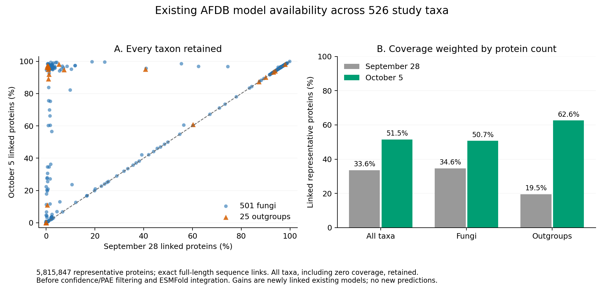

# Completed retrieval snapshot and full catalog refresh

The original retrieval queue reports completion of all 1,589,879 queued
accession attempts on October 5. Individual attempts can fail or return no
exact full-length model. Queue completion does not establish complete
structural coverage of the study.

The full log was frozen under the original exclusive retrieval lock after
checking that the exact original wrapper was absent and no retrieval script
was running. All 3,538,619,125 bytes were copied with no incomplete tail;
source and snapshot hashes agree. Streaming checks cover all 3,020,697
records: 3,010,575 verified records, 9,844 errors and 278 no-exact-model
records. These are append-record counts, not distinct current accessions,
proteins, taxa or scientific coverage.

[Snapshot validation](../metadata/completed_afdb_inventory_freeze_20261005_v2.json)
and [original snapshot execution closure](../metadata/completed_afdb_inventory_freeze_transport_20261005_v2.json)
retain the native/wrapper identities, actual original tool terminal,
complete invocation journal, source hashes and declared resources.

The first snapshot adapter failed before creating its output root because
it required retained systemd metadata for the completed retrieval service.
That transient service was already missing. Its default inactive/success
fields are not proof of an exit status. The failed V1 code, logs, tool result
and [failure audit](../metadata/completed_afdb_inventory_freeze_failure_audit_20261005_v1.json)
remain immutable. The new V2 snapshot uses process absence, the completed
queue receipt/log, matching manager invocation and exclusive locking.
The original retrieval native exit status is unavailable; the snapshot
does not invent one or restart retrieval.

## Full catalog and independent comparison completed

The new [full catalog plan](../metadata/completed_afdb_catalog_plan_20261005_v1.json)
retains **all 526 entries: 501 fungi and 25 outgroups**, and every one of the
**5,815,847 representative proteins**. The qualified catalog implementation
is unchanged. It uses the latest record for each accession, excludes latest
failed/no-match accessions, selects GDM/AlphaFold Monomer v2.0 pipeline
models by exact sequence hash and length, and ranks candidates by mean
C-alpha pLDDT, version and model identifier. All selected coordinate files
are rehashed against their verification records.

The new adapter binds the immutable raw producer receipt and output hashes.
The independent reader completed behind the exact original producer. Its
separate FASTA parser, sorted ranking, every protein link, selected-model
provenance and per-taxon counts are preserved exactly from the qualified
reader. Its replacement execution gate checks the actual original
invocation, full wrapper header/terminal payloads, native exit and receipt
hash. It does not rely on systemd success defaults. The reader does not
repeat coordinate byte hashing or add a CIF-content/confidence audit.
[Source equivalence review](../metadata/completed_afdb_catalog_source_equivalence_20261005_v1.json).

The producer has original tool session **20607** and the reader has
session **32067**. Both actual original waits returned zero. Their immutable launch records are
[producer](../metadata/completed_afdb_catalog_launch_20261005_v1.json) and
[reader](../metadata/completed_afdb_catalog_readback_launch_20261005_v1.json).
The producer hashed **1,098,056,403,371 coordinate bytes** across all
**2,935,733 selected models**. The independent reader reconstructed every
sequence link and selected-model ranking. The complete catalog links
**2,994,868 proteins**; **2,820,979 proteins** have no model in this source
snapshot. Models are linked in **502 of 526 taxa**. All zero-coverage taxa
remain explicit. This is availability before confidence/PAE filtering or
integration of ESMFold; it does not establish that every required structure
has been inferred. [Full original catalog closure](../metadata/completed_afdb_catalog_completed_20261005_v1.json).

| Group | Taxa with links / total | Representative proteins | Linked proteins | Coverage |
| --- | ---: | ---: | ---: | ---: |
| Fungi | 478 / 501 | 5,431,687 | 2,754,249 | 50.7% |
| Outgroups | 24 / 25 | 384,160 | 240,619 | 62.6% |
| All taxa | 502 / 526 | 5,815,847 | 2,994,868 | 51.5% |

Coverage divides linked proteins by the group's total representative proteins;
it is not a mean of taxon percentages. [Complete 526-row coverage table](../metadata/completed_afdb_catalog_taxon_coverage_20261005_v1.tsv).

The unchanged catalog comparator and a separate CSV reader replayed both
full link tables against the September 28 catalog. There are **1,039,174
new links**, **zero lost links**, **16,470 changed selected models** and
**1,939,224 unchanged selections**. Gains comprise 873,585 fungal and
165,589 outgroup protein links; replacements comprise 16,074 fungal and
396 outgroup selections. A change in the selected model is a catalog
selection/provenance change, not evolutionary structural change. Neither
new links nor replacements imply new predictions. The reader checks all
old/new sequence hashes and model identities, sorted unique union, every
disposition and all 526 taxon totals. Both actual original tool terminals,
full wrapper journals and 88 bindings close.
[Full comparison closure](../metadata/completed_afdb_catalog_comparison_completed_20261005_v1.json)
and [complete taxon change table](../metadata/completed_afdb_catalog_taxon_change_20261005_v1.tsv).



[PDF figure](figures/completed_afdb_catalog_coverage_20261005_v2.pdf).
All 526 taxa, including zeros, are plotted. The pooled bars use protein
denominators; the points use each taxon's own denominator. This descriptive
figure contains no confidence interval or evolutionary effect estimate.

Each catalog stage had two CPU equivalents, a 96 GiB/no-swap cgroup,
88 GiB address-space cap and one BLAS thread. The producer has a 16 GiB
output allowance and a 0.5–36 hour uncalibrated planning range. The previous
producer took 2,229.93 seconds for 723,178,056,701 coordinate bytes; this
larger snapshot and disk contention make that an uncertain comparison.
The reader has a 1 GiB output allowance and a separate 0.1–12 hour
uncalibrated stage range. Its historical elapsed time includes waiting and
is not a standalone reader benchmark. Stage CPU and wall limits are caps,
not ETAs. Actual producer service runtime was 52 minutes 36.612 seconds;
the reader's native stage took 173.475 seconds, with its outer service
including waiting. The comparator and CSV reader separately used two CPUs,
64/16 GiB memory and no swap; their services took 61.511 and 70.655 seconds.
The figure uses two CPUs, 8 GiB/no swap and a 600-second wall cap, with a
2–30 second planning range. There are no new downloads, predictions, GPUs
or charges.

## Reproduction and outstanding work

Raw inventory and catalog tables remain outside Git:

- `results/structures/afdb-completed-inventory-20261005-v2/`
- `results/structures/whole-proteome-afdb-catalog-20261005-v1/`
- `results/structures/whole-proteome-catalog-change-20261005-v1/`

The snapshot SHA-256 is
`aa3b3e770e1ae46b6ea3630d08722f8e0ad3a7b845effe71e94ce3a9381c4eb1`.
The plan pins representative FASTAs through their existing inventory,
the complete sampling manifest, prediction source, original scripts and
snapshot receipts. Raw model JSONL retains accession, version, file path,
sequence and coordinate hashes, software/provider and confidence metrics.
Public release of the large inputs remains outstanding; cloning the
repository alone does not supply them. The existing acquisition workflow
is `scripts/retrieve_matched_models.py` with source-specific provenance
preserved in its raw log.

Reproduction requires those immutable inputs and fresh output paths in new
pinned plans. The original producer command is:

```bash
python scripts/run_completed_afdb_catalog_v1.py \
  --plan metadata/completed_afdb_catalog_plan_20261005_v1.json \
  --receipt metadata/completed_afdb_catalog_20261005_v1.json
```

For a new run, first replace the output/receipt paths and rebuild input
pins; do not rerun this command over an existing namespace. The independent
reader requires a launch record matching the new original producer and
its completed execution receipt. Observe the current original jobs without
restarting them using:

```bash
python scripts/record_completed_afdb_catalog_checkpoint_v1.py \
  --output metadata/completed_afdb_catalog_checkpoint_NEW.json
```

The full comparison and independent source replay are complete. Reproduce
them with `run_completed_afdb_catalog_comparison_v1.py` and
`readback_whole_proteome_catalog_comparison_v2.py` using a new pinned plan;
the reader requires the actual new comparison execution transport.
`close_completed_afdb_catalog_comparison_v1.py` binds the completed executions
and releases byte-identical small taxon tables. The figure script is
`plot_completed_afdb_catalog_coverage_v2.py`. Its second version moves the
scatter legend out of the occupied upper-left region; the first version
and its execution remain preserved. Source rows and arithmetic are unchanged.

The [full AFDB/ESMFold availability union](full-prediction-atlas-union-20261005.md)
has now independently reconstructed every representative and source record.
The [updated AFDB annotation registry](completed-retrieval-domain-registry-20261005.md)
has full interval/policy/protein readback. Next refresh confidence/PAE accounting,
extend domain comparisons to both sources,
and build domain/structural-family analyses with orthology and sequence
controls. Snapshot availability is not confidence-qualified atlas
completion, homology, an accepted phylogeny or an evolutionary result.
All eight scientific aims remain required and incomplete.
