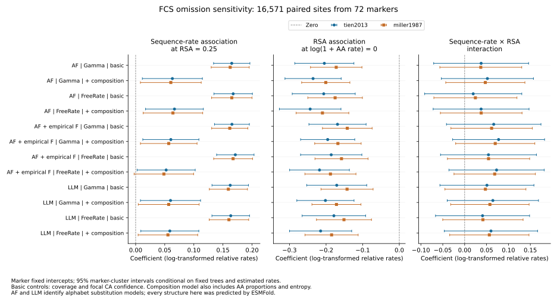
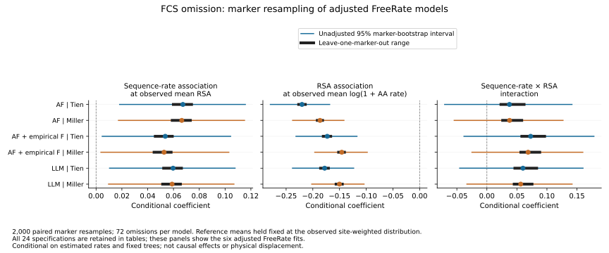

# Conditional sequence–structure associations

All 24 planned regressions completed for the frozen ESMFold snapshot: 16,571
paired sites across 72 markers. This advances the site-level coupling analysis;
it does not complete the lineage-wide branch analysis or establish a biological
mechanism. The source data cover the earlier completed structure cohort, with
uneven taxon and protein coverage.

Each response is log(1 + structural-alphabet relative site rate). Predictors are
log(1 + amino-acid relative site rate), median extant RSA centered at 0.25,
their interaction, observed taxon fraction and the site's lower-quartile focal
CA pLDDT divided by 100. Every marker has its own intercept. The adjusted
sensitivity also includes amino-acid entropy and 19 amino-acid proportions,
with alanine as the reference. All confidence and RSA joins were verified
against all 714,936 source taxon-site records. No marker in this frame carries
the recorded copy-review flag; that does not independently prove orthology.

The complete grid crosses three alphabet substitution models, Gamma versus
optimized FreeRate rates, Tien versus Miller accessibility normalization, and
the two control sets. AF and LLM label substitution matrices here; all structures
were produced with ESMFold. These rates are model-relative quantities, not
physical displacement and not rates per year.

Uncertainty uses finite-sample-corrected marker-cluster covariance and a t
reference with 71 degrees of freedom. BH correction spans all 72 focal
coefficient tests. The implementation follows the [statsmodels clustered
covariance interface](https://www.statsmodels.org/stable/generated/statsmodels.stats.sandwich_covariance.cov_cluster.html).
All 24 coefficient vectors were independently reproduced with NumPy least
squares; clustered covariance matrices were separately reconstructed from
marker-level score sums. Full-rank designs and source hashes were checked.
These are numerical checks, not validation of the statistical assumptions.

## Observations

The amino-acid-rate coefficient at RSA = 0.25 is positive in all 24 models
(range 0.0537–0.1718); 23 have conditional BH q < 0.05. After composition
adjustment with FreeRate, the coefficients span 0.0537–0.0721, and the AF model
with empirical frequencies under Miller normalization has q = 0.0565. Thus the
association's statistical support is sensitive to reasonable specifications.
The full models explain only 5.42–6.90% of within-marker response variation.
This R-squared includes all controls, not sequence rate alone.

All interaction confidence intervals span zero (no interaction q < 0.05).
The plotted RSA coefficient is evaluated at log(1 + amino-acid rate) = 0;
it is negative in all models, but that reference value can be outside the
observed range. It should not be presented as an average surface/core effect.
Marginal contrasts over observed covariates and further biological controls
are needed before such an interpretation.


## Limits and next analyses

The site rates incorporate phylogenetic likelihood fits on fixed sequence
trees, but the regression does not propagate uncertainty in those trees or
in the rate estimates. Clustered errors permit dependence within a marker;
they do not prove markers are independent or fully account for shared taxa
across markers. RSA and confidence summaries are extant, unweighted summaries,
not ancestral or phylogenetically adjusted exposures. The alphabet's nonlocal
structural features and masked sampling still need sensitivity analysis.

Prediction circularity remains because structures are inferred from sequences.
Composition adjustment is a sensitivity analysis, not a causal identification
strategy. Experimental/alternative-predictor checks, broader completed cohorts,
family reconciliation and uncertainty propagation remain necessary. These
conditional results do not identify selection, structural acceleration on
particular branches or independently replicated ecological transitions.

## Reproduction

```bash
OPENBLAS_NUM_THREADS=1 OMP_NUM_THREADS=1 python scripts/fit_conditional_site_coupling.py \
  --frame results/phylogeny/site-rate-exposure-frame-esmfold-v1 \
  --accessibility results/structural_annotations/paired-accessibility-normalized-esmfold-v1 \
  --plan metadata/site_coupling_conditional_resource_plan.json \
  --output results/phylogeny/conditional-site-coupling-esmfold-v1
python scripts/plot_conditional_site_coupling.py \
  --fits results/phylogeny/conditional-site-coupling-esmfold-v1 \
  --output docs/figures/conditional_site_coupling_esmfold.svg
```

Use new output paths for reruns. Receipts, focal coefficients and fit summaries
are versioned under `metadata/conditional_site_coupling_*`; the full joined
covariates and all coefficients remain outside Git in the results directory.
The pre-fit resource plan records the full grid, uncertainty convention,
source hashes and existing-host allowances.


## Marker influence and observed-mean contrasts

Completed 2,000 paired marker-bootstrap draws for every one of the 24 models
(48,000 fits) and omitted each of the 72 markers once per model (1,728 fits).
The same multinomial marker counts are used across specifications. Each marker
retains all of its sites; marker intercepts are absorbed by within-marker
centering. All original point coefficients match the full-intercept fits to
6.53e-15. A deterministic omission and bootstrap sample for each model also
match independent expanded-row least squares to 4.22e-15. All 48,000 bootstrap
fits are full rank; counts, coefficients and omission results are archived.

In addition to the original reference-point coefficients, the analysis computes
two contrasts at the full observed, site-weighted covariate means:

- Sequence-rate association: beta_AA + beta_interaction × (mean RSA − 0.25).
- RSA association: beta_RSA + beta_interaction × mean log(1 + AA rate).

Those reference means remain fixed across resamples and omissions. This avoids
interpreting the RSA coefficient only at an amino-acid rate of zero. These are
model derivatives within observed covariate distributions, not causal effects.

All 24 observed-mean sequence-rate contrasts are positive (0.0578–0.1727), and
all observed-mean RSA contrasts are negative (−0.2204 to −0.1049). Neither changes
sign when any single marker is omitted. Their unadjusted 95% marker-bootstrap
percentile intervals exclude zero in all models. These intervals are **not**
multiplicity-adjusted and do not replace the earlier 72-test BH analysis; the
different inferential conventions should not be conflated. Every interaction
interval includes zero; one omission reverses an already uncertain interaction's
point-estimate sign.


The figure shows the six composition-adjusted FreeRate specifications; tables
retain the complete 24-model grid and all five contrasts. The negative RSA
association describes lower model-relative structural-alphabet rates at larger
extant accessibility conditional on sequence rate and other predictors. It does
not demonstrate lower physical structural change at exposed sites: alphabet
representation, confidence filtering and prediction circularity remain possible
explanations. The resampling also assumes markers are exchangeable independent
units; it does not propagate uncertainty in trees/rates or remove shared-taxon
dependence across markers.

```bash
OPENBLAS_NUM_THREADS=1 OMP_NUM_THREADS=1 python scripts/resample_conditional_site_coupling.py \
  --fits results/phylogeny/conditional-site-coupling-esmfold-v1 \
  --plan metadata/site_coupling_marker_resampling_plan.json \
  --output results/phylogeny/conditional-site-coupling-marker-resampling-v1
python scripts/plot_coupling_marker_resampling.py \
  --results results/phylogeny/conditional-site-coupling-marker-resampling-v1 \
  --output docs/figures/conditional_site_coupling_marker_resampling.svg
```

Use new output paths. Versioned summaries and verification receipts are under
`metadata/site_coupling_marker_resampling_*`. Per-marker influence rows, all
bootstrap coefficients and paired marker multiplicities remain in the results
directory outside Git.

## FCS-overlap omission sensitivity

The earlier 72-marker ESMFold snapshot contains 16 marker–taxon observations
whose CDS segments overlap publisher FCS EXCLUDE regions, all from N. cerealis.
The baseline results above retain those observations. Whole marker/taxon
omission, with every other character and site coordinate preserved, is now
complete through paired fits, site rates, exposure summaries and coupling
regression. FCS overlap remains a review signal rather than independent proof
of contamination.

All 64 affected paired fits and 256 FreeRate optimization refits passed their
full audits. The eleven-stage rate/exposure workflow completed its full numeric
readback. Its 16 changed markers were merged with the 56 unchanged baseline
markers, retaining all 16,571 site identities and 132,568 rate values. The full
exposure input contains 712,769 observations after 2,167 observed-residue
omissions. Source markers and receipt hashes are explicit in the merged frame.
The separate combined-cohort exposure input is complete, but its rate and
coupling analyses remain pending; the cohorts overlap and are not independent.

All 24 original regression specifications were rerun with the same controls and
72-test BH family. Every coefficient and cluster covariance passed independent
NumPy checks (maximum discrepancies 1.03e-14 and 4.03e-16). All sequence-rate
coefficients remain positive, ranging from 0.0485 to 0.1713; 20/24 have BH q<0.05,
compared with 23/24 at baseline. No coefficient changes sign among the 72 matched
focal terms. The largest sequence-rate coefficient change is 0.00679. All 24
interaction intervals still contain zero. RSA coefficients remain negative and
all have q<0.05, but they describe the model at log(1 + AA rate)=0 and must not
be generalized to all sequence rates. Threshold crossing is not a test of a
coefficient difference, and the model specifications are dependent.

The earlier matched-pair path comparison also retained exactly 105,834 accepted
pairs. Median baseline/refit path-ranking agreement is 0.988 for AA and
0.968–0.982 for structural models, with some marker/model agreement as low as
0.638. All 448 before/after rank correlations passed independent SciPy readback.
The authoritative comparison is paired-path-fcs-comparison-esmfold-v2.



These results support directional stability of these conditional coefficients
under the specified omission. They do not establish robust lineage-wide
coupling: topology/rate uncertainty, shared ancestry, prediction circularity and
source quality remain unresolved. Exposure is extant and not phylogenetically
weighted or ancestral. The full structural/evolutionary objective is incomplete.

Reproduction uses merge_fcs_site_rate_frame.py, fit_conditional_site_coupling.py,
compare_fcs_coupling_fits.py and plot_conditional_site_coupling.py in scripts/.
Completed stage receipts: metadata/esmfold_fcs_rate_*.json. Full frame and marker
provenance: metadata/esmfold_full_fcs_site_frame_*. Regression results and matched
comparison: metadata/esmfold_fcs_conditional_coupling_* and
metadata/esmfold_fcs_coupling_comparison_*. Resource/specification plan:
metadata/site_coupling_fcs_conditional_resource_plan.json.

The revised marker-resampling and influence checks are complete: 48,000
bootstrap fits (2,000 per specification) and 1,728 leave-one-marker-out fits,
with no singular bootstrap fits. Marker order and all multiplicity vectors
exactly match the baseline resampling, and all 120 saved percentile intervals
were independently read back. Full point coefficients and predetermined
expanded-row resamples/omissions agree within 5.08e-15. These checks verify the
numerics, not independence of markers or the validity of the bootstrap model.

At observed mean RSA, all 24 sequence-rate contrasts remain positive under every
single-marker omission, and all unadjusted 95% marker-bootstrap intervals exclude
zero. At observed mean AA rate, all RSA contrasts remain negative under every
omission, and their unadjusted intervals exclude zero. At RSA=0.25, one sequence-
rate percentile interval includes zero. All 24 interaction intervals include
zero; the basic AF/FreeRate/Tien interaction has one leave-one-marker-out sign
reversal (range -0.000176 to 0.04688). The interaction is not established.
These unadjusted percentile intervals do not replace or expand the original
BH-significance claims, and reference means are held at the FCS observed values.



Plan, full-fit receipt, numerical checks, interval/multiplicity readback and
contrast summary are in metadata/site_coupling_fcs_marker_resampling_*.

### Expanded coupling handoffs

Two transient user services now wait for the existing rate-comparison controllers: `fungal-esmfold-coupling-handoff-20260916.service` and `fungal-gdm-coupling-handoff-20260916.service`. No rate producer or fitting configuration was modified. They bind the producer PID, process creation time, command and controller configuration hash, then require its completed frame handoff and artifact checksums. Expected frame sizes are 89 markers/22,205 sites for revised ESMFold and 124 markers/44,719 sites for expanded AlphaFold.

After validation, each service creates source-hashed plans and runs the existing 24-specification conditional model grid (three structural alphabets × two rate models × two RSA scales × two covariate specifications). It then runs 2,000 paired whole-marker bootstrap draws per specification (48,000 fits per cohort) and every leave-one-marker-out fit (2,136 ESMFold; 2,976 AlphaFold). The fit script independently checks NumPy coefficients and manually assembled CR1 covariance; the resampling script checks absorbed point estimates and selected expanded-row solves. Resampling completion requires the full expected model, marker, bootstrap and omission counts.

These are queued analyses, not completed results. One CPU core and a 16 GiB memory allowance per active stage are planned, with a 32 GiB service limit and 32 GiB available-memory/20 GiB disk gates. Planning ranges are 0.25–12 hours for fitting and 0.25–12/24 hours for ESMFold/AlphaFold resampling; they are not guarantees. Sources and scripts are pinned in `metadata/{esmfold_combined_revised,gdm_expanded}_coupling_controller_config.json`; launch identities are recorded in `metadata/expanded_coupling_handoff_launch.json`. Dynamic plans and stage logs remain under the corresponding `results/phylogeny/coupling-controller-*-v1` directories. Services do not survive reboot; partial or failed state requires review before resuming.

The models remain exploratory conditional associations. Marker effects and cluster covariance do not resolve cross-marker phylogenetic dependence, uncertainty in estimated rates/topology, nonlocal alphabet features, extant-covariate interpretation, prediction circularity or missingness. Source-specific conclusions, FCS and corrected-marker omission sensitivities, and broader branch/domain/duplication analyses remain pending.

### Expanded AlphaFold FreeRate export and initial comparison

The expanded AlphaFold FreeRate export completed all 124 markers, 496 fits and 178,876 site-rate rows. Its full output audit passed, retaining 486 fits with recorded warnings rather than treating warnings as automatic exclusions or successful auditing as proof of model adequacy. The earlier Gamma export was already audited.

The initial matched Gamma/FreeRate comparison was independently read back against raw rate files, likelihood reports and separately collected tree edges: all 496 fits, 178,876 site comparisons and 107,032 branch comparisons passed. Median site-rate rank correlations are 0.9971 for AA and 0.9889–0.9909 for the structural alphabets; minimum structural correlations reach 0.8435. These descriptive within-model comparisons are not shared physical rate scales, significance tests or an adequacy assessment.

Five original FreeRate fits have log likelihood more than 0.1 below their paired Gamma fit (two AA and one under each structural model). Their identities remain in `metadata/gdm_initial_freerate_lower_likelihood_flags.tsv`. The all-fit optimization procedure has started with four IQ-TREE workers and 1,984 planned diagnostic fits, including these five cases. The initial comparison is preserved separately from the pending optimized comparison; no final coupling result is implied.

Receipts are versioned as `metadata/gdm_expanded_freerate_site_rate_audit_receipt.json` and `metadata/gdm_initial_rate_comparison*`. The independent readback output is `results/phylogeny/paired-rate-heterogeneity-initial-readback-gdm-expanded-v1`. Summary medians/minima are grouped by alphabet from the audited initial `fit_summary.tsv` and saved in `metadata/gdm_initial_rate_model_summary.tsv`. Readback used one CPU with a 4 GiB planning allowance, 1 GiB output allowance and 0.02–2 hour estimate on the existing host.


## Expanded ESMFold optimization and explicit copy-review sensitivity

The revised 89-marker/22,205-site ESMFold rate handoff completed all six stages. The optimization audit checked 1,424 diagnostics across 356 source fits, including 355,280 diagnostic site-rate rows; every source fit has a diagnostic likelihood at least as high as Gamma. This is best-among-tested optimization, not proof of a global optimum or model adequacy. Full comparison readback and the matched analysis frame completed.

The initial coupling handoff stopped before creating a fit output because the original 72-marker fitting script rejects any copy-review flag. The expanded frame contains marker `4986044at2759` with 301 sites labeled `requires_gene_copy_reconciliation_before_confirmatory_single_ortholog_analysis`. The reviewed variant preserves the same model equations, matrix checks, confidence/RSA joins, NumPy coefficient and CR1 covariance verification; its only analysis change is an explicit pinned copy-review policy and matching source/analysis counts. It rejects unexpected markers, status labels or flagged-site counts.

Two fresh analyses completed: `site-coupling-esmfold-combined-reviewed-v1` retains all 89 markers for exploratory inference, and `site-coupling-esmfold-combined-copy-omission-v1` excludes exactly the flagged marker, leaving 88 markers and 21,904 sites. Both completed 24 specifications and 48,000 whole-marker bootstrap fits; leave-one-marker-out totals are 2,136 and 2,112. Independent comparison confirmed that every retained covariate row is identical and all 72 focal coefficients in the separate omission analysis agree with the full analysis's corresponding absorbed leave-one-out fit (maximum difference 5.01e-15).

In both analyses all 24 sequence-rate coefficients are positive and all 24 RSA main-effect coefficients are negative, with BH q < 0.05 in their respective 72-test families. The RSA main effect is evaluated at log1p amino-acid rate zero; average-reference contrasts are recorded separately. Unadjusted marker-bootstrap intervals remain above zero for the sequence contrasts and below zero for the RSA contrasts in all specifications at both reference choices. All 24 interaction intervals include zero and no interaction passes the respective BH threshold. No between-analysis significance test is implied by comparing these summaries. The fitted models explain approximately 6.7–8.5% of within-marker response variation in both analyses, so substantial variation remains unexplained.

The source frame and its copy-review labels remain intact. Neither retaining the flag exploratorily nor omitting it establishes confirmatory single-ortholog validity. Rates and gene topologies remain fixed; marker clusters do not fully capture cross-marker phylogenetic dependence; extant RSA and sequence-derived predictions do not establish causality or physical branch displacement. Expanded FCS omission and prediction-source comparisons remain required.

The AlphaFold source exposure grid contains the same flagged marker with 309 sites. Its original waiting coupling handoff was deliberately stopped before execution and replaced with reviewed full124/44,719-site and omission123/44,410-site controllers. The rate producer was untouched. Each reviewed controller uses one CPU with a 16 GiB planning allowance, a 32 GiB service limit and the previously estimated fit/resampling windows. Both require the completed rate frame and exact pinned review flags before fitting. Original scripts/configs and failed or superseded states are retained for provenance. The new reviewed controller and fitter are pinned while these services are active.

Reproducibility: `fit_reviewed_conditional_site_coupling.py`, `advance_reviewed_expanded_site_coupling.py`, and `compare_copy_review_coupling.py`; versioned configs, execution records, fit/resampling receipts, coefficients and comparison summaries use `reviewed`, `copy-omission`, and `esmfold_expanded_copy_review_comparison` names in `metadata/`.


The [expanded copy-review comparison figure](figures/expanded_copy_review_coupling.svg) shows every one of the 24 specifications for both the full89 and omission88 cohorts. Panels retain explicit fixed reference values for sequence-rate and RSA effects, with the interaction in a separate panel. Lines are unadjusted 95% whole-marker bootstrap intervals; symbols are point estimates. The plotted table retains all 144 rows, and 432 numerical values were checked against source summaries. The SVG was visually inspected for row readability, interval visibility and unclipped annotations. `plot_expanded_copy_review_coupling.py` and `metadata/expanded_copy_review_coupling_figure_{receipt,review}.json` record reproduction and source hashes. The structural-alphabet model labels in the rows do not denote different prediction sources: this figure uses the expanded ESMFold cohort throughout.
