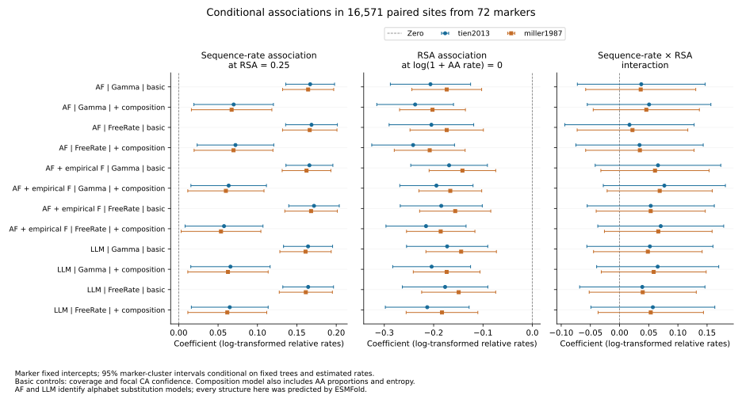

# Conditional sequence–structure associations

All 24 planned regressions completed for the frozen ESMFold snapshot: 16,571
paired sites across 72 markers. This advances the site-level coupling analysis;
it does not complete the lineage-wide branch analysis or establish a biological
mechanism. The source data cover the earlier completed structure cohort, with
uneven taxon and protein coverage.

Each response is log(1 + structural-alphabet relative site rate). Predictors are
log(1 + amino-acid relative site rate), median extant RSA centered at 0.25,
their interaction, observed taxon fraction and the site's lower-quartile focal
CA pLDDT divided by 100. Every marker has its own intercept. The adjusted
sensitivity also includes amino-acid entropy and 19 amino-acid proportions,
with alanine as the reference. All confidence and RSA joins were verified
against all 714,936 source taxon-site records. No marker in this frame carries
the recorded copy-review flag; that does not independently prove orthology.

The complete grid crosses three alphabet substitution models, Gamma versus
optimized FreeRate rates, Tien versus Miller accessibility normalization, and
the two control sets. AF and LLM label substitution matrices here; all structures
were produced with ESMFold. These rates are model-relative quantities, not
physical displacement and not rates per year.

Uncertainty uses finite-sample-corrected marker-cluster covariance and a t
reference with 71 degrees of freedom. BH correction spans all 72 focal
coefficient tests. The implementation follows the [statsmodels clustered
covariance interface](https://www.statsmodels.org/stable/generated/statsmodels.stats.sandwich_covariance.cov_cluster.html).
All 24 coefficient vectors were independently reproduced with NumPy least
squares; clustered covariance matrices were separately reconstructed from
marker-level score sums. Full-rank designs and source hashes were checked.
These are numerical checks, not validation of the statistical assumptions.

## Observations

The amino-acid-rate coefficient at RSA = 0.25 is positive in all 24 models
(range 0.0537–0.1718); 23 have conditional BH q < 0.05. After composition
adjustment with FreeRate, the coefficients span 0.0537–0.0721, and the AF model
with empirical frequencies under Miller normalization has q = 0.0565. Thus the
association's statistical support is sensitive to reasonable specifications.
The full models explain only 5.42–6.90% of within-marker response variation.
This R-squared includes all controls, not sequence rate alone.

All interaction confidence intervals span zero (no interaction q < 0.05).
The plotted RSA coefficient is evaluated at log(1 + amino-acid rate) = 0;
it is negative in all models, but that reference value can be outside the
observed range. It should not be presented as an average surface/core effect.
Marginal contrasts over observed covariates and further biological controls
are needed before such an interpretation.



## Limits and next analyses

The site rates incorporate phylogenetic likelihood fits on fixed sequence
trees, but the regression does not propagate uncertainty in those trees or
in the rate estimates. Clustered errors permit dependence within a marker;
they do not prove markers are independent or fully account for shared taxa
across markers. RSA and confidence summaries are extant, unweighted summaries,
not ancestral or phylogenetically adjusted exposures. The alphabet's nonlocal
structural features and masked sampling still need sensitivity analysis.

Prediction circularity remains because structures are inferred from sequences.
Composition adjustment is a sensitivity analysis, not a causal identification
strategy. Experimental/alternative-predictor checks, broader completed cohorts,
family reconciliation and uncertainty propagation remain necessary. These
conditional results do not identify selection, structural acceleration on
particular branches or independently replicated ecological transitions.

## Reproduction

```bash
OPENBLAS_NUM_THREADS=1 OMP_NUM_THREADS=1 python scripts/fit_conditional_site_coupling.py \
  --frame results/phylogeny/site-rate-exposure-frame-esmfold-v1 \
  --accessibility results/structural_annotations/paired-accessibility-normalized-esmfold-v1 \
  --plan metadata/site_coupling_conditional_resource_plan.json \
  --output results/phylogeny/conditional-site-coupling-esmfold-v1
python scripts/plot_conditional_site_coupling.py \
  --fits results/phylogeny/conditional-site-coupling-esmfold-v1 \
  --output docs/figures/conditional_site_coupling_esmfold.svg
```

Use new output paths for reruns. Receipts, focal coefficients and fit summaries
are versioned under `metadata/conditional_site_coupling_*`; the full joined
covariates and all coefficients remain outside Git in the results directory.
The pre-fit resource plan records the full grid, uncertainty convention,
source hashes and existing-host allowances.
