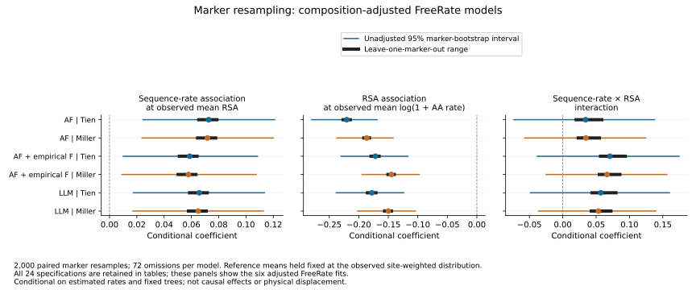

# Conditional sequence–structure associations

All 24 planned regressions completed for the frozen ESMFold snapshot: 16,571
paired sites across 72 markers. This advances the site-level coupling analysis;
it does not complete the lineage-wide branch analysis or establish a biological
mechanism. The source data cover the earlier completed structure cohort, with
uneven taxon and protein coverage.

Each response is log(1 + structural-alphabet relative site rate). Predictors are
log(1 + amino-acid relative site rate), median extant RSA centered at 0.25,
their interaction, observed taxon fraction and the site's lower-quartile focal
CA pLDDT divided by 100. Every marker has its own intercept. The adjusted
sensitivity also includes amino-acid entropy and 19 amino-acid proportions,
with alanine as the reference. All confidence and RSA joins were verified
against all 714,936 source taxon-site records. No marker in this frame carries
the recorded copy-review flag; that does not independently prove orthology.

The complete grid crosses three alphabet substitution models, Gamma versus
optimized FreeRate rates, Tien versus Miller accessibility normalization, and
the two control sets. AF and LLM label substitution matrices here; all structures
were produced with ESMFold. These rates are model-relative quantities, not
physical displacement and not rates per year.

Uncertainty uses finite-sample-corrected marker-cluster covariance and a t
reference with 71 degrees of freedom. BH correction spans all 72 focal
coefficient tests. The implementation follows the [statsmodels clustered
covariance interface](https://www.statsmodels.org/stable/generated/statsmodels.stats.sandwich_covariance.cov_cluster.html).
All 24 coefficient vectors were independently reproduced with NumPy least
squares; clustered covariance matrices were separately reconstructed from
marker-level score sums. Full-rank designs and source hashes were checked.
These are numerical checks, not validation of the statistical assumptions.

## Observations

The amino-acid-rate coefficient at RSA = 0.25 is positive in all 24 models
(range 0.0537–0.1718); 23 have conditional BH q < 0.05. After composition
adjustment with FreeRate, the coefficients span 0.0537–0.0721, and the AF model
with empirical frequencies under Miller normalization has q = 0.0565. Thus the
association's statistical support is sensitive to reasonable specifications.
The full models explain only 5.42–6.90% of within-marker response variation.
This R-squared includes all controls, not sequence rate alone.

All interaction confidence intervals span zero (no interaction q < 0.05).
The plotted RSA coefficient is evaluated at log(1 + amino-acid rate) = 0;
it is negative in all models, but that reference value can be outside the
observed range. It should not be presented as an average surface/core effect.
Marginal contrasts over observed covariates and further biological controls
are needed before such an interpretation.


## Limits and next analyses

The site rates incorporate phylogenetic likelihood fits on fixed sequence
trees, but the regression does not propagate uncertainty in those trees or
in the rate estimates. Clustered errors permit dependence within a marker;
they do not prove markers are independent or fully account for shared taxa
across markers. RSA and confidence summaries are extant, unweighted summaries,
not ancestral or phylogenetically adjusted exposures. The alphabet's nonlocal
structural features and masked sampling still need sensitivity analysis.

Prediction circularity remains because structures are inferred from sequences.
Composition adjustment is a sensitivity analysis, not a causal identification
strategy. Experimental/alternative-predictor checks, broader completed cohorts,
family reconciliation and uncertainty propagation remain necessary. These
conditional results do not identify selection, structural acceleration on
particular branches or independently replicated ecological transitions.

## Reproduction

```bash
OPENBLAS_NUM_THREADS=1 OMP_NUM_THREADS=1 python scripts/fit_conditional_site_coupling.py \
  --frame results/phylogeny/site-rate-exposure-frame-esmfold-v1 \
  --accessibility results/structural_annotations/paired-accessibility-normalized-esmfold-v1 \
  --plan metadata/site_coupling_conditional_resource_plan.json \
  --output results/phylogeny/conditional-site-coupling-esmfold-v1
python scripts/plot_conditional_site_coupling.py \
  --fits results/phylogeny/conditional-site-coupling-esmfold-v1 \
  --output docs/figures/conditional_site_coupling_esmfold.svg
```

Use new output paths for reruns. Receipts, focal coefficients and fit summaries
are versioned under `metadata/conditional_site_coupling_*`; the full joined
covariates and all coefficients remain outside Git in the results directory.
The pre-fit resource plan records the full grid, uncertainty convention,
source hashes and existing-host allowances.


## Marker influence and observed-mean contrasts

Completed 2,000 paired marker-bootstrap draws for every one of the 24 models
(48,000 fits) and omitted each of the 72 markers once per model (1,728 fits).
The same multinomial marker counts are used across specifications. Each marker
retains all of its sites; marker intercepts are absorbed by within-marker
centering. All original point coefficients match the full-intercept fits to
6.53e-15. A deterministic omission and bootstrap sample for each model also
match independent expanded-row least squares to 4.22e-15. All 48,000 bootstrap
fits are full rank; counts, coefficients and omission results are archived.

In addition to the original reference-point coefficients, the analysis computes
two contrasts at the full observed, site-weighted covariate means:

- Sequence-rate association: beta_AA + beta_interaction × (mean RSA − 0.25).
- RSA association: beta_RSA + beta_interaction × mean log(1 + AA rate).

Those reference means remain fixed across resamples and omissions. This avoids
interpreting the RSA coefficient only at an amino-acid rate of zero. These are
model derivatives within observed covariate distributions, not causal effects.

All 24 observed-mean sequence-rate contrasts are positive (0.0578–0.1727), and
all observed-mean RSA contrasts are negative (−0.2204 to −0.1049). Neither changes
sign when any single marker is omitted. Their unadjusted 95% marker-bootstrap
percentile intervals exclude zero in all models. These intervals are **not**
multiplicity-adjusted and do not replace the earlier 72-test BH analysis; the
different inferential conventions should not be conflated. Every interaction
interval includes zero; one omission reverses an already uncertain interaction's
point-estimate sign.



The figure shows the six composition-adjusted FreeRate specifications; tables
retain the complete 24-model grid and all five contrasts. The negative RSA
association describes lower model-relative structural-alphabet rates at larger
extant accessibility conditional on sequence rate and other predictors. It does
not demonstrate lower physical structural change at exposed sites: alphabet
representation, confidence filtering and prediction circularity remain possible
explanations. The resampling also assumes markers are exchangeable independent
units; it does not propagate uncertainty in trees/rates or remove shared-taxon
dependence across markers.

```bash
OPENBLAS_NUM_THREADS=1 OMP_NUM_THREADS=1 python scripts/resample_conditional_site_coupling.py \
  --fits results/phylogeny/conditional-site-coupling-esmfold-v1 \
  --plan metadata/site_coupling_marker_resampling_plan.json \
  --output results/phylogeny/conditional-site-coupling-marker-resampling-v1
python scripts/plot_coupling_marker_resampling.py \
  --results results/phylogeny/conditional-site-coupling-marker-resampling-v1 \
  --output docs/figures/conditional_site_coupling_marker_resampling.svg
```

Use new output paths. Versioned summaries and verification receipts are under
`metadata/site_coupling_marker_resampling_*`. Per-marker influence rows, all
bootstrap coefficients and paired marker multiplicities remain in the results
directory outside Git.

## FCS-overlap sensitivity pending

Subsequent source-quality review found 16 marker–taxon observations in the earlier
72-marker ESMFold inputs whose CDS segments overlap publisher FCS EXCLUDE
regions, all from N. cerealis. The baseline regressions and marker-resampling
results above retain those observations. Their numerical validation and
leave-one-marker-out stability do not resolve this source-quality concern.
All 16 affected paired alignments have been rebuilt without those observations;
every remaining character and column is unchanged. New supported sequence trees
and structural branch fits are running, and the retained-pair geometric benchmark
has passed its pair-grid and sampled-numerical audit. Site-rate refits, updated
site/exposure summaries and re-estimation of the conditional coupling models
remain necessary before claiming robustness to this omission. FCS overlap itself
is a review signal, not independent confirmation of contamination.

Full-cohort normalized exposure datasets are now assembled for the eventual
coupling refits. The earlier cohort combines 56 unchanged markers with 16 changed
markers: 712,769 retained observations after 2,167 observed-residue omissions.
The combined cohort contains 71 unchanged and 18 changed markers: 1,696,368
retained observations after 2,667 omissions. Every affected row matches the
audited changed-marker normalization; the full retained amino-acid observation
grid is checked against the respective alignments. Independent readback checked
all 16 fields of every retained row against the filtered baseline (11,404,304
and 27,141,888 field values). These cohorts overlap and are not independent
replicates. This completes the full exposure input, not the rate-frame merge or
coupling refit. Source receipts and readbacks are recorded in
`metadata/{esmfold,esmfold_combined}_full_fcs_accessibility_*.json`; reproducible
scripts are `merge_fcs_normalized_accessibility.py` and
`readback_full_fcs_accessibility.py` in `scripts/`.

The earlier FCS paired-fit batch has now completed all 64 fits and its full
audit, followed by a 105,834-pair direct-geometry benchmark. On identical retained
pairs, median baseline/refit path-ranking agreement is 0.988 for AA and
0.968–0.982 for structural models, while some marker/model combinations change
substantially (minimum 0.638). The 448 before/after rank correlations passed an
independent SciPy readback. These checks compare point estimates and do not
resolve rate uncertainty or establish coupling robustness. G4 site rates have
passed their audit; R4, optimization, full frame merging and regression refits
remain pending. The authoritative matched-pair comparison is
`results/phylogeny/paired-path-fcs-comparison-esmfold-v2`.
