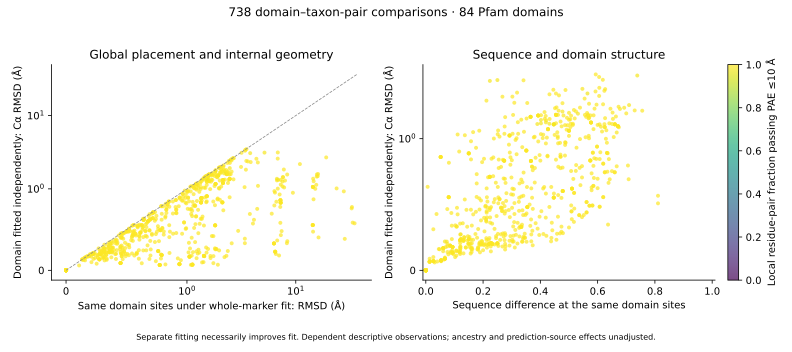

# Domain-conditioned structural comparisons

This analysis connects the completed Pfam annotations to the existing immutable
AFDB marker snapshot. It asks whether a large whole-marker superposition
mismatch also occurs within corresponding conserved domains. It does not yet
estimate branch-specific change, adaptation, or domain gains/losses.

`compare_marker_domains.py` validates source receipts and exact protein/sequence
identities, then reproduces each of the 858 existing pLDDT ≥70 marker-pair
comparisons. Eligible annotations have Pfam type Domain, a single instance of
the accession in each protein, no overlap with any other retained GA hit, and
at least 50% HMM coverage. Repeats, Family-type annotations and overlapping
assignments are retained in the eligibility audit, not silently resolved.

Domain correspondence uses the original BUSCO-profile alignment and retained
species-matrix columns. Both residues must fall within the corresponding Pfam
alignment spans, be canonical amino acids, and have pLDDT ≥70. Comparisons need
at least 30 qualified residues and at least half the shared domain positions.
These filters do not establish accurate alignment or complete domain coverage;
regions outside the marker matrix remain unassessed. Domain-specific alignment
and boundary sensitivities are still required for leading evolutionary results.

For identical domain residue sets, the script reports RMSD under the original
whole-marker fit and under an independent proper rigid domain fit. The latter
necessarily cannot be worse; improvement alone is not evidence of biological
motion. Three mechanical tests check rigid-transform invariance, independently
translated domains, and rejection of reflections. Every real whole-marker
baseline and local residue-pair count is reproduced before domain results are
accepted. Within-domain distance changes are also measured with the existing
15 Å local-neighbor definition and both-direction, both-model PAE ≤10 Å filter.
This distance metric is not standard lDDT.

The snapshot contains 738 domain comparisons across 463 marker–taxon pairs and
84 distinct Pfam domain accessions. Among 1,220 mapped annotation-hit links,
452 satisfy annotation eligibility. There are 381 marker pairs with no shared
eligible domain and 95 candidate domain comparisons failing residue coverage.
These are exclusions, not evidence of biological domain absence.



Median RMSD on the domain sites is 0.935 Å under the whole-marker fit and
0.509 Å under the independent domain fit. These dependent, selected pairwise
observations are descriptive. The median fraction of local residue pairs
passing the PAE ≤10 Å filter is 1.0; this is conditional on the confidence and
annotation filters, not confidence in all proteins or in interdomain placement.
Sequence differences are uncorrected fractions at the same sites, not branch
lengths. The plotted relationship has not been adjusted for ancestry, family,
prediction source, missingness or saturation.

`assess_domain_placement.py` then examines every pair of eligible compared
domains in the same protein pair. It reproduces the domain residue sets and
compares cross-domain CA distances for nonadjacent residues (separation ≥3
positions in both proteins), with directional PAE thresholds of 5, 10 and
15 Å in both models. All distances are considered, without the within-domain
15 Å neighbor cutoff. Results contain 375 domain-pair/taxon-pair combinations
across 188 marker–taxon pairs, or 1,125 threshold rows. At PAE ≤10 Å the median
retained cross-domain fraction is 0.3513; 33 combinations have none passing.
Missing filtered distances remain empty, never zero. This differs from the
within-domain statistic in both the residue-pair population and sampling scope.

## Artifact-control example for further review

For marker `4975094at2759`, Pseudovirgaria hyperparasitica (`F470096`) and
Pachysolen tannophilus (`F4918`) have whole-marker RMSD 25.064 Å. On 104 matched
PH_SPT16 residues (`PF24824.2`), RMSD is 34.718 Å under that whole-marker fit
and 0.577 Å when fitted independently; sequence difference is 0.2981.
All eligible local pairs within that domain pass directional PAE ≤10 Å.

| Region paired with PH_SPT16 | Cross-domain pairs | PAE ≤10 Å retained | Mean absolute cross-domain distance change |
|---|---:|---:|---:|
| Rttp106-like_middle (`PF08512.19`) | 8,632 | 88.24% | 0.459 Å |
| Peptidase_M24 (`PF00557.30`) | 19,240 | 0% | 12.730 Å |
| FACT-Spt16_Nlob (`PF14826.13`) | 11,440 | 0% | 10.666 Å |

Thus, internal domain similarity coexists with uncertain relative placement
of distant regions. This prioritizes the pair as a prediction/placement control,
not a discovered acceleration event. The Pfam names are domain annotations,
not experimental evidence of enzymatic activity. Alternative prediction,
interacting-partner context, domain-specific alignments, sequence annotation
review and experimental structural evidence remain necessary to distinguish
biological rearrangement from prediction uncertainty. Other regions have
larger internal differences and still require their own review.

## Reproduction

```bash
OPENBLAS_NUM_THREADS=1 python scripts/compare_marker_domains.py \
  --snapshot results/structural_markers/snapshot-v2 \
  --comparisons results/structural_comparisons/snapshot-v1 \
  --annotations results/domains/marker-annotations-v1 \
  --pae results/structural_pae/snapshot-v1 \
  --output results/structural_domains/comparisons-v1
python scripts/plot_domain_comparisons.py \
  --comparisons results/structural_domains/comparisons-v1 \
  --output results/structural_domains/figures-v1
OPENBLAS_NUM_THREADS=1 python scripts/assess_domain_placement.py \
  --comparisons results/structural_domains/comparisons-v1 \
  --output results/structural_domains/placement-v1
python -m unittest discover -s tests -p test_domain_geometry.py
```

Use fresh output paths for reruns. Source/figure receipts, a complete manual
review ordering and the cross-domain confidence table are tracked in metadata.
Large coordinates, PAE matrices and raw annotations remain outside Git.

## Expansion across the full frozen ESMFold dataset

Started the same conserved-domain comparison protocol across all 266,788
accepted pLDDT70 protein pairs in the frozen 5,121-model ESMFold collection.
This source-specific extension uses the completed local PAE export and existing
Pfam marker annotations. It retains single-instance, nonoverlapping Domain-type
hits covering at least half the profile, and requires at least 30 qualified
shared residues and half the shared domain sites. Multiple or overlapping
instances remain excluded rather than assigned arbitrary correspondences.

Every baseline whole-protein fit is reproduced before domain fits are accepted.
Outputs compare the same domain sites under a whole-protein fit and a separate
domain fit, plus local distance changes with and without directional PAE10
filtering. A lower RMSD after separate fitting is an optimization consequence;
it does not alone establish biological domain motion or a branch-specific rate.

The prelaunch estimate allocates one CPU thread, 32 GB memory and 10 GB disk,
with a 1–24 hour planning range on the existing host. The three existing geometry
tests passed before launch. Source receipts and the producer hash are pinned in
`metadata/esmfold_domain_comparison_resource_plan.json`. The producer now reports
progress every 1,000 baseline pairs and uses source-neutral receipt wording;
its numeric protocol is unchanged. No local-domain result is claimed yet.

```bash
OPENBLAS_NUM_THREADS=1 OMP_NUM_THREADS=1 python scripts/compare_marker_domains.py --snapshot results/structural_markers/esmfold-partial-v1 --comparisons results/structural_comparisons/esmfold-partial-v1 --annotations results/domains/marker-annotations-v1 --pae results/structural_pae/esmfold-partial-v1 --output results/structural_domains/esmfold-full-frozen-v1
```

The input paths retain their historical “partial” names: this run covers the
entire frozen local-model collection, not all proteins in the fungal project.
Results will require complete correspondence/exclusion readback and geometry
checks before evolutionary interpretation. Interdomain-placement analysis can
follow the completed domain fits.
