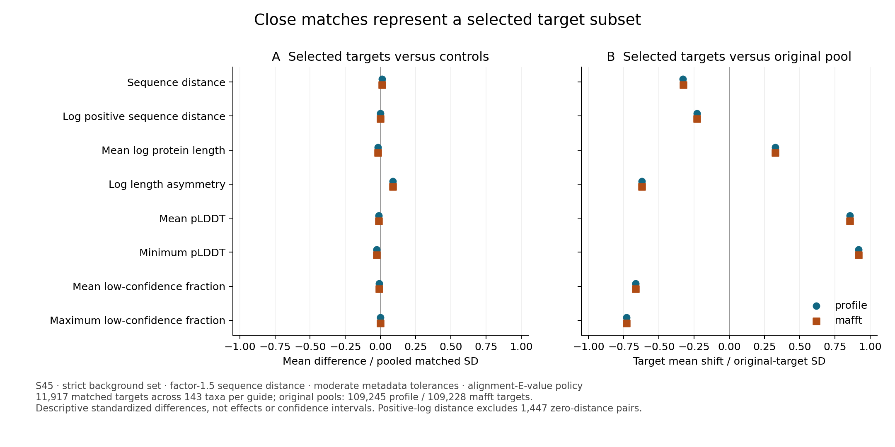
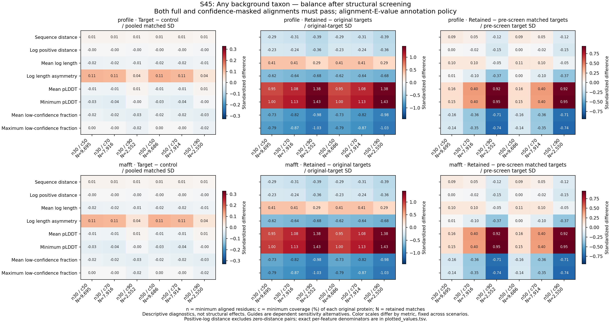
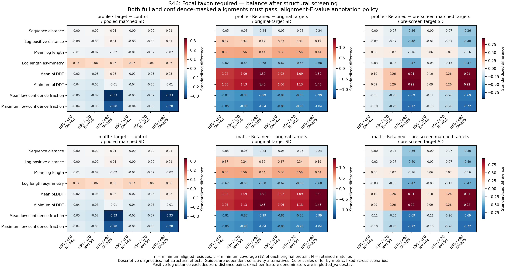

# Verified duplication-control selection and balance

The full metadata-based matching stage is complete and independently verified.
It produced 2,786,912 selected records across 54 sensitivity scenarios, with
873,892 target/policy records and all unmatched scenario IDs retained. Independent
enumeration checked all 47,190,168 target/policy/scenario decisions, including
eligibility, selected identities, endpoint orders, scores, ties and reuse.
Independent balance reconstruction then checked all 432 guide/policy/scenario
coverage summaries and 3,456 feature summaries.

These are completed matching diagnostics. Structural outcome qualification,
matched evolutionary effects, taxon/family weighting and phylogenetic dependence
remain unresolved; the overall project is not complete.

## Illustrative strict-background scenarios

Both examples require conservative shared architecture, native ortholog
assignments and unreported parent duplications in both guide alternatives,
sequence distance within a factor of 1.5, and moderate metadata tolerances
(endpoint length ratio ≤1.25, mean-pLDDT difference ≤10, low-confidence-fraction
difference ≤0.1 under one consistent endpoint correspondence). Counts below use
the alignment-E-value annotation policy. Equal counts across guides do not make
the guide alternatives independent replicates.

| Quantity | Any background taxon (S45) | Focal taxon required (S46) |
|---|---:|---:|
| Matched target records, each guide | 11,917 | 792 |
| Matched target taxa | 143 | 69 |
| Matched families | 2,038 | 180 |
| Distinct background nodes | 7,414 | 522 |
| Maximum reuse of a background | 22 | 22 |
| Top five backgrounds' share of matches | 0.79% | 8.59% |

The profile guide contains 109,245 original modeled targets; the mafft guide has
109,228. S45 leaves 97,328 and 97,311 unmatched, respectively. Requiring the focal
taxon further reduces coverage. These figures describe the observed modeled
terminal-duplicate universe, not all genes or all 526 sampled taxa.

## Good aggregate balance does not imply representative coverage

For profile/S45/alignment-E-value, absolute standardized target/control mean
differences range from approximately 0.00005 to 0.0885 across the eight reported
features. For example, mean pLDDT is 85.42 in selected targets and 85.52 in their
controls, and mean sequence distance is 0.298 versus 0.294. This is descriptive
balance, without an automatic pass threshold or an independent-sample test.

Selection substantially changes the target population. Mean target pLDDT is
72.25 before selection and 85.42 after selection, a shift of 0.855 original-target
SDs. Mean sequence distance falls from 0.569 to 0.298 (−0.329 SDs); length
asymmetry also decreases. Consequently, later effects in this stratum apply to
the selected, more confidently modeled conserved-architecture subset. They
cannot be generalized to all duplicates using covariate balance alone.

S45 retains 1,415 identical-model target pairs, 1,425 identical-model control
pairs and 1,447 zero-distance target/control matches. Positive-log-distance
balance uses 10,470 pairs and excludes zeros explicitly, with no epsilon.
Structural outcome processing must preserve these categories and avoid treating
identical predictions as independent evidence of biological invariance.

## Balance and selection figure

Panel A shows selected-target minus control means divided by pooled matched SD;
panel B shows selected-target minus original-target means divided by the original
target SD. The axes share a range but use different denominators. Both guides
are sensitivity alternatives, not independent replicates. S45 is illustrative,
not a designated confirmatory primary analysis. Positive-log distance excludes
zero-distance matches. These are descriptive diagnostics, not structural effects.

Download [PDF](figures/background_control_balance_20260927.pdf),
[SVG](figures/background_control_balance_20260927.svg), or
[plotted values](figures/background_control_balance_20260927.tsv). All 32 values
and sample counts were checked against the fully audited source table; pooled
matched SD differences were additionally reconstructed from moments. Export
hashes, reproduction commands and visual review are recorded in
`metadata/background_control_balance_figure_*_20260927.json`.

## Taxon and family concentration

Full independent reconstruction passed all 2,786,912 selected records, 513,240
represented-group rows and 864 summaries (432 configurations × two grouping
levels). Group tables include represented groups, their original target counts
and selection fractions. Summaries explicitly count original groups with no
matches; the original population is all modeled terminal targets per guide.

For profile/alignment-E-value:

| Diagnostic | S45: any background taxon | S46: focal taxon required |
|---|---:|---:|
| Top five taxa, share of selected targets | 35.62% | 36.87% |
| Top five families, share of selected targets | 12.16% | 33.84% |
| Largest taxon contribution | 1,595 | 83 |
| Largest family contribution | 593 | 142 |
| Original taxa with no selected targets (of 153) | 10 | 84 |
| Original families with no selected targets (of 20,492) | 18,454 | 20,312 |

S45's 143 represented taxa have an inverse concentration of 25.05, calculated as
N² / sum(group count²). This describes the equivalent number of equally
represented groups; it is **not** an independent sample size or a phylogenetic
correction. Its 2,038 families have an analogous value of 170.33. These results
motivate taxon/family weighting and sensitivity checks alongside explicit
phylogenetic modeling; confidence balance alone does not address dependence.
Weighting changes the population-average contrast and must be stated when
reporting effects. No structural outcomes were used in these diagnostics.

Full outputs: `results/orthology/selected-control-concentration-20260927-v1`.
Plans, script hashes, reproduction commands and independent proof are archived
in `metadata/selected_control_concentration_*_20260927.json`.

## Reproducibility and remaining work

Design and stage history are in [the background report](terminal-sister-backgrounds-20260927.md).
The full outputs are under:

- `results/orthology/background-control-selection-20260927-v1`
- `results/orthology/background-control-balance-20260927-v1`

Artifact hashes and full independent proofs are archived in
`metadata/background_control_selection_completed_20260927.json` and
`metadata/background_control_balance_completed_20260927.json`, with their
corresponding `_completed_readback_` files. Versioned plans and scripts reproduce
all scenarios, sparse selected rows, explicit unmatched states and diagnostics.

Next, qualify structural outcomes using verified full/domain comparisons,
coverage and confidence, retaining failures and additional selection losses.
Report contrasts with control-reuse, taxon and family dependence accounted for;
assess guide, annotation, caliper and focal-background sensitivity. Comparisons
within conserved architectures do not replace the separate domain gain/loss,
fusion/rearrangement and family-turnover analyses in the full project.

## Structural coverage for the original matching targets

All 218,473 modeled target nodes (109,245 profile-guide and 109,228 MAFFT-guide)
now have the same six original-protein coverage screens applied to their audited
structural measurements as the background candidates. All 436,946 target/mask
rows and 2,621,676 decisions were independently replayed with decimal ceiling
cutoffs. Both native orders must pass; confidence-mask coverage uses the original
protein length. The 6,354 identical-model targets per guide remain explicitly
unmeasured rather than being assigned zero structural divergence.

Requiring 50 residues and both masks retains 43,515/43,517 profile/MAFFT targets
at 50% coverage, 26,192/26,196 at 70%, and 7,771/7,772 at 90%. These counts refer
to all original modeled targets, not only the selected matches; guides are
sensitivity alternatives rather than independent replicates. The original
control choices remain unchanged. The next step is to measure joint target/control
attrition within every fixed guide/policy/scenario before estimating effects.

Reproduce with `scripts/screen_matched_duplication_target_coverage.py` then
`scripts/readback_matched_duplication_target_coverage.py`. Output:
`results/structural_comparisons/matched-target-coverage-20260928-v1`.
Evidence: `metadata/matched_target_coverage_completed_20260928.json`.

## Full fixed-match structural attrition running

`fungal-fixed-match-structural-attrition-20260928.service` applies the completed
target and background coverage results to all 2,786,912 frozen selections.
Original selections are preserved verbatim with added target/background pass
bitsets; bit positions are bound to the six recorded screen definitions.
Full, confidence-masked, and both-mask intersection results are retained.
All 432 guide/policy/scenario strata will have 18 cells (7,776 total), recording
original targets, metadata matched/unmatched counts, and both-pass,
target-only-pass, background-only-pass and neither-pass counts. Empty strata
remain explicit. Background matching-node identities are joined to the exact
original gene pair and verified against structural pair identities.

No controls are reselected after seeing structural quality. Attrition can change
the target population; these remain dependent, descriptively matched records.
Full output and independent readback are still pending. Resource estimate:
one CPU, 16 GiB RAM, no swap/GPU or charges, up to 2 GiB output, 0.1–2 hours.
Script: `scripts/assess_fixed_match_structural_attrition.py`; execution plan and
exact process identity are in `metadata/fixed_match_structural_attrition_plan_20260928.json`
and `metadata/fixed_match_structural_attrition_launch_20260928.json`.

The fixed-match attrition producer completed successfully. A full independent
readback is now running as `fungal-fixed-match-structural-attrition-readback-20260928.service`.
It compares every original selection field, reconstructs all six target/control
bitsets from the original coverage sources and exact matching-node identities,
and independently accumulates 18 × 4 outcome-category arrays per matching
stratum. All 7,776 summary cells, including empty strata and metadata-unmatched
denominators, must agree. The checker imports no producer selection/aggregation
helpers. Production completion is not yet accepted as a validated attrition result.
Resources: one CPU, 16 GiB RAM, no swap/GPU/charges, 0.1–2 hours and negligible
proof output. Script and launch provenance are recorded under
`readback_fixed_match_structural_attrition.py` and the matching September 28
readback plan/launch metadata.

## Fixed-match structural attrition independently verified

The producer and full readback both exited successfully. All 2,786,912 original
selection records, 16,721,472 eligibility bitsets, and 7,776 summary cells passed.
Completion evidence is in `metadata/fixed_match_structural_attrition_completed_20260928.json`
and `metadata/fixed_match_structural_attrition_completed_readback_20260928.json`.

For the illustrative alignment-E-value strict-background scenarios above,
requiring both masks and both orders to align at least 50 residues covering 70%
of both original proteins gives identical descriptive counts in the two guide
alternatives (which are not independent replicates):

| Structural eligibility | S45: any background taxon | S46: focal taxon required |
|---|---:|---:|
| Original metadata-matched records | 11,917 | 792 |
| Target and control both pass | 7,914 | 656 |
| Only target passes | 387 | 21 |
| Only control passes | 588 | 37 |
| Neither passes | 3,028 | 78 |

Thus 66.4% of S45 matches and 82.8% of S46 matches survive this particular
screen. The original modeled-target denominators remain 109,245/109,228 by
guide; metadata-unmatched records remain explicit. No replacement control was
selected after screening. Surviving matches need fresh balance/representation
assessment and phylogenetic/family-aware effect estimation; these counts alone
do not establish a duplication effect or represent all sampled taxa.

## Balance after structural screening running

A full assessment now covers all 7,776 retained scenario/mask/screen cells,
including empty cells, with 62,208 rows across the same eight covariates.
Besides target/control balance and shifts from the original modeled-target
pool, it records the additional shift relative to the pre-screen metadata-matched
target pool. Retained taxa/families, distinct controls, maximum reuse, top-five
reuse share and zero sequence distances are retained. No control is reselected.

The established balance helper passed known moments/SMD/selection-shift fixtures,
empty/single/zero-variance cases, positive-log exclusions and endpoint swaps.
Full production and independent output readback remain pending. Resources: one
CPU, 24 GiB RAM, no swap/GPU/charges, up to 1 GiB output and a broad 0.1–8-hour
estimate. The executable stage is `scripts/assess_screened_match_balance.py`;
plan and exact live identity are in `metadata/screened_match_balance_plan_20260928.json`
and `metadata/screened_match_balance_launch_20260928.json`.

### Producer complete; independent reconstruction running

The producer finished successfully September 28 at 22:34 EDT, with all
2,786,912 original selections represented in 7,776 coverage cells and 62,208
feature summaries. Source and output hashes were verified after terminal exit
zero; the receipt is recorded in
`metadata/screened_match_balance_producer_completed_20260928.json`.

`scripts/readback_screened_match_balance.py` now independently reconstructs every
cell from the audited fixed-match membership and original graph nodes. It uses
separate feature/statistics implementations, decodes each endpoint's eligibility
before intersection, and checks both target baselines, moments, quantiles,
nonestimable statuses, retained taxa/families, and control reuse. All 253
independent statistics fixtures passed before launch. The checker requires the
producer's exact process identity to finish and its service to report success;
source/script/plan hashes are pinned and rechecked. Its plan and launch record
are `metadata/screened_match_balance_readback_plan_20260928.json` and
`metadata/screened_match_balance_readback_launch_20260928.json`.

Audit resources: one CPU, 24 GiB memory, no swap/GPU/paid resources; estimated
0.1–8 hours and under 0.01 GiB new output. Full output validation remains pending.
These are descriptive balance diagnostics, not calibrated duplication effects.

### Screen sensitivity figures queued behind full validation

The figure stage `scripts/plot_screened_match_balance.py` waits for the exact
independent-audit process to finish successfully and verifies its source receipt
before using the results. It will export PNG, PDF, SVG and a source-value TSV for
S45 and S46, both guides, the alignment-E-value policy and all six screens,
requiring both full and confidence-masked alignments to pass. Three panels per
guide distinguish matched balance, shifts from the original target pool, and
additional shifts from the pre-screen matched pool. Each metric has its own
symmetric color range, fixed across scenarios; cell values and per-screen retained
counts are shown. The TSV preserves feature-specific denominators, including
positive-log-distance exclusions. The scenarios remain illustrative sensitivity
analyses, not designated primary tests.

The stage checks all exported rows against source-derived values and the plotted
arrays against the same matrices. Visual review remains required after generation.
Resources: one CPU, 4 GiB memory, no swap/GPU/charges, 1–10 minutes after the audit,
under 0.1 GiB output. Plan and launch identity are recorded in
`metadata/screened_match_balance_figure_plan_20260928.json` and
`metadata/screened_match_balance_figure_launch_20260928.json`.

## Post-screen balance fully verified

Independent reconstruction passed all 432 matching groups, 7,776 coverage rows
and 62,208 feature rows. Both production and audit exited successfully. Evidence:
`metadata/screened_match_balance_completed_20260928.json` and the source-bound
full readback. The figure stage subsequently passed all 576 exported-value
checks against source rows, followed by inspection of both rendered PNGs.

[Source values](figures/screened_balance_plotted_values_20260928.tsv),
[S45 PDF](figures/screened_balance_S45_20260928.pdf),
[S46 PDF](figures/screened_balance_S46_20260928.pdf).

For the profile guide, the 50-residue/90%-coverage screen retains 2,550 S45
matches and 205 S46 matches. In S45, retained mean pLDDT is 1.381 original-target
SDs above the original modeled pool, and 0.923 pre-screen matched-target SDs
above the metadata-matched pool. These denominators differ: the values must not
be added. Target/control mean-pLDDT balance remains close (SMD 0.0094), showing
that covariate balance within matches can coexist with substantial selection
of the analyzed target population.

In S46 under that screen, the mean low-confidence-fraction SMD is −0.328.
Tightening structural coverage therefore does not guarantee better balance on
every measured covariate. This is a descriptive standardized difference with
205 retained pairs, not an independent-sample significance test. Guide and screen
alternatives remain dependent; their agreement is not replication. No outcome
or screen has been selected as a confirmatory primary analysis from these plots.

## Target structural-measurement join running

`scripts/link_matching_target_measurements.py` joins every original matching
target to the audited primary pair/mask/order summaries. The output keeps all
218,473 graph nodes under both masks (436,946 rows), preserving guide, family,
gene-tree node, gene and model identities, sequence distances, coordinate/source
checksums and confidence covariates. Fit columns explicitly retain canonical
model endpoints and both input orders; target endpoint orientation is recorded.
Same-model targets receive blank measurements, while excluded or unavailable
fits retain their source dispositions. No zero outcome is imputed.

This table complements the completed background-candidate measurement join and
will support outcome/design assembly against the already frozen fixed matches
and species-contrast kernels. It does not refit models or estimate duplication
effects. All original fields and structural-summary fields will be compared
again after serialization; a separate independent readback remains required.
The output retains the older matching atlas, not the newly expanded targets.

Plan and exact launch identity:
`metadata/matching_target_measurements_plan_20260928.json` and
`metadata/matching_target_measurements_launch_20260928.json`.
Resources: one CPU, 8 GiB memory, no swap/GPU/paid resources; estimated 1–30 minutes
and under 2 GiB output. Output root:
`results/structural_comparisons/matching-target-measurements-20260928-v1`.

### Target join produced; complete source reconstruction running

The target join finished successfully at 22:47 EDT with all 436,946 rows and
103,200 distinct measured model pairs represented. Identical-model targets remain
explicit: 6,354 per guide under each mask. Production checked every original-node
and fit field after serialization. Full native-order usability is retained for
102,891 profile and 102,874 MAFFT target records; under pLDDT70 masking, the
corresponding counts are 90,300 and 90,290. These are overlapping guide records,
not independent samples or counts after the six coverage screens.

`scripts/readback_matching_target_measurements.py` now reconstructs all rows
against source nodes, the original native model-pair queue and source summaries.
It checks model versions, coordinate and sequence hashes, lengths, confidence
covariates, gene-to-canonical orientation, all original and fit fields, blank
same-model fits, complete mask membership and counters. Native receipt and queue
bindings connect endpoint order to the actual alignment run. The checker waits
for the exact producer identity and requires successful terminal exit before use.
Resources: one CPU, 8 GiB memory, no swap/GPU/charges, estimated 1–30 minutes.
Plan/launch: `metadata/matching_target_measurement_readback_plan_20260928.json`
and `metadata/matching_target_measurement_readback_launch_20260928.json`.
Independent validation remains pending; no effects have been estimated here.

## Target join verified; matched measurement assembly running

The full independent target readback passed all 436,946 rows and 16,167,002
structural fields. It checked original alignment-queue endpoint identities,
source model metadata and all explicit exclusions. Producer and checker both
exited successfully; completion evidence is
`metadata/matching_target_measurements_completed_20260928.json`.

`scripts/assemble_matched_structural_measurements.py` now assembles all 52,675
unique selected target/background pairs under both masks (105,350 rows), linking
unaltered structural fields to the existing species-contrast pattern IDs. It
also preserves family, gene-tree node, taxa, sequence distances and all six
endpoint/mask eligibility bitsets. Every pair's original selection multiplicity
is checked against the 2,786,912 fixed selections. Multiplicity records repeated
use across scenarios; it is not a statistical weight or independent replication.
The original selection table continues to identify each policy/scenario.

All input-order and endpoint-specific structural fields remain separate: no
outcome average or effect model is chosen at this stage. The five existing
species kernels remain prospective nuisance covariance alternatives, not fitted
structural processes. Source receipts and tables are checked before and after
assembly. Independent row reconstruction is required before modeling.
Resources: one CPU, 8 GiB memory, no swap/GPU/charges, estimated 1–30 minutes and
under 2 GiB output. Plan and exact launch identity:
`metadata/matched_structural_measurements_plan_20260928.json` and
`metadata/matched_structural_measurements_launch_20260928.json`.

### Matched measurement assembly complete; full readback running

Assembly finished successfully at 22:51 EDT with 105,350 rows representing all
52,675 unique fixed pairs and both masks. Per mask, 48,909 pairs have measured
models on both sides; 3,606 have identical-model dispositions on both sides,
96 only on the control side, and 64 only on the target side. Measured here means
an alignment disposition is available, not that a coverage screen is passed.
Blank outcomes remain explicit. The 2,786,912 original scenario-specific uses
are preserved through the original selection table and checked multiplicities.

The independent stage `scripts/readback_matched_structural_measurements.py`
checks every source outcome field, matching-node identity, screen bitset and
selection multiplicity, plus exact full pair/mask membership. It reconstructs
all species index assignments and contrast hashes directly from focal and
background taxa, including shared-taxon cancellation. All source checksums are
rechecked after reconstruction. Full completion remains pending.
Plan/launch: `metadata/matched_structural_measurement_readback_plan_20260928.json`
and `metadata/matched_structural_measurement_readback_launch_20260928.json`.
Resources: one CPU, 8 GiB memory, no swap/GPU/charges, estimated 1–30 minutes.

## Matched assembly verified; whole-protein contrasts running

The independent matched-assembly readback passed all 105,350 rows, 8,849,400
source measurement fields and all species contrast assignments, with exact
membership and original selection-use counts. Evidence is recorded in
`metadata/matched_structural_measurements_completed_20260928.json`.

`scripts/prepare_matched_whole_protein_contrasts.py` now prepares 421,400 rows:
every unique pair, both masks and all four target/control alignment-order
combinations. It retains original statuses, endpoint TM scores, RMSDs, identities,
aligned lengths and joint confidence fractions; recomputes coverage against
original full-protein lengths in canonical endpoint order; and exports descriptive
RMSD, identity, coverage, aligned-length and confidence contrasts. A symmetric
mean-endpoint TM divergence contrast remains a score difference, not physical
displacement. RMSD contrasts compare separately aligned cores, not common
four-protein residue sets.

Gene-tree sequence-distance differences and positive-log differences are
retained separately, with explicit zero-distance status and no pseudocount.
All six existing same-mask and both-mask screening flags remain unchanged.
No alignment order, screen or outcome is chosen as a preferred analysis, and
no effect fit is launched at this stage. These outputs support subsequent
rank/overlap checks and phylogenetic/family/reuse-aware modeling. Independent
contrast reconstruction remains required before model fitting.

Helper checks covered original-length denominators, input-order choice,
zero-distance handling and excluded/blank outcomes. Resources: one CPU, 4 GiB
memory, no swap/GPU/charges, estimated 1–30 minutes, under 2 GiB output.
Plan/launch: `metadata/matched_whole_protein_contrasts_plan_20260928.json` and
`metadata/matched_whole_protein_contrasts_launch_20260928.json`.

### Whole-protein contrast production completed; independent check running

Production completed all 421,400 unique-pair/mask/order rows. There are 195,636
numerically computable full-mask rows and 195,060 pLDDT70 rows; 15,064 and 15,640,
respectively, retain excluded/unmeasured dispositions. These counts include four
order combinations per pair and are not independent sample sizes or final
coverage-qualified counts.

`scripts/readback_matched_whole_protein_contrasts.py` independently reconstructs
every row from the untransformed measurement table. Original protein lengths
are looked up by canonical model/version directly, independently of the producer's
gene-to-canonical orientation logic. The checker verifies all source identities,
statuses, metrics, coverage fractions, descriptive differences, log differences,
zero-distance exclusions, screen flags and the complete four-order membership.
It computes log differences by subtracting logs and TM divergence differences
from separate 1-minus-score values, checking arithmetic within explicit tolerance.
No producer contrast helper is imported. Source hashes are checked before and
after the full reconstruction. Independent completion is pending.

Resources: one CPU, 8 GiB memory, no swap/GPU/charges, estimated 1–30 minutes.
Plan and launch identity:
`metadata/matched_whole_protein_contrast_readback_plan_20260928.json` and
`metadata/matched_whole_protein_contrast_readback_launch_20260928.json`.

## Whole-protein contrasts verified; complete record grid running

Independent contrast reconstruction passed all 421,400 rows and 10,987,856
numeric values, including canonical endpoint coverage and all explicit blank
outcomes. Evidence: `metadata/matched_whole_protein_contrasts_completed_readback_20260928.json`;
the audit exited successfully at 22:58 EDT.

`scripts/summarize_matched_whole_protein_records.py` now exports all 96 structural
settings (two masks × two same/both-mask cohorts × six screens × four alignment
order combinations), each with all 432 guide/policy/scenario groups, including
empty groups: 41,472 summary rows. Every retained-record count is checked against
the fully audited fixed-match attrition table. Per-setting Parquet files retain
unique pair identities, family/taxon, species-pattern IDs, outcomes and sequence
covariates for design checks and later fitting.

Record-equal, family-equal and focal-taxon-equal descriptive means are reported
separately for twelve metrics. Positive-log sequence contrasts exclude zero
cases explicitly and report contributing record, family and taxon counts;
other metrics retain those cases. SQL fixtures covered unequal family sizes,
record weighting, positive-log missingness and empty means. The full output
requires independent reconstruction. These are descriptive summaries, not
phylogenetically corrected effects, significance tests or independent replicates.

Resources: one CPU, 16 GiB memory cap (12 GiB database limit), no swap/GPU/charges,
estimated 0.1–4 hours and up to 30 GiB including database/scratch. Plan and launch:
`metadata/matched_whole_protein_records_plan_20260928.json` and
`metadata/matched_whole_protein_records_launch_20260928.json`.

### Full whole-protein record reconstruction queued

`scripts/readback_matched_whole_protein_records.py` waits for the exact producer
process and successful terminal state, then independently rebuilds every one of
the 96 Parquet partitions by filtering the original contrast rows. It compares
all pair identities, model-input values and membership before rejoining the
original selection records. Pandas aggregation, separate from the producer's
DuckDB SQL, reconstructs all 41,472 summaries: retained/metadata counts, family,
taxon and background diversity, positive-log denominators, all twelve metrics
under three weighting schemes, and blank means in empty groups. Source and
partition hashes are checked again at the end.

Checks for unequal family sizes, missing positive-log observations and empty
hierarchical groups passed before launch. Resources: one CPU, 24 GiB RAM,
no swap/GPU/paid resources; estimated 0.1–8 hours after production and under
0.01 GiB new output. Plan and exact live identity are recorded in
`metadata/matched_whole_protein_record_readback_plan_20260928.json` and
`metadata/matched_whole_protein_record_readback_launch_20260928.json`.

## Whole-protein record production complete; design assessment queued

All 96 settings and 41,472 summaries have been produced successfully; all
aggregate and partition hashes were verified after terminal exit zero.
Independent reconstruction is running. Producer completion evidence:
`metadata/matched_whole_protein_records_producer_completed_20260928.json`.

After the full record audit succeeds, `scripts/assess_whole_protein_model_designs.py`
will assess all 207,360 stratum/design combinations. Five working designs were
specified before fitting: linear, quadratic and cubic differences in gene-tree
sequence distance; positive-log sequence-distance difference; and linear
alignment-identity difference. Polynomial predictors are differences of powers
of the two distances, not powers of their difference. Each design also includes
original-coverage difference, log aligned-length ratio and joint-confidence
fraction difference. Log-distance designs retain only both-positive pairs,
explicitly recording the changed population; no cross-population likelihood
comparison is justified by this preparation.

Every group, including empty groups, retains constant and nonzero-constant
columns, numerical rank, singular values, residual degrees of freedom, marginal
zero overlap, family/taxon/pattern counts and control reuse. Pivoted QR provides
a second check on SVD rank. Marginal zero overlap is not joint overlap; numerical
rank is not adequacy or calibration. Nonzero constants flag a changed intercept
interpretation instead of being silently removed. Gene-tree distances remain
relative divergence, not time-calibrated rates. No effect estimates are produced
by this assessment, and independent output reconstruction remains required.

Fixtures passed for empty, collinear and constant designs, zero-distance
exclusions and polynomial differences. Resources: one CPU, 24 GiB memory,
no swap/GPU/charges, estimated 0.1–12 hours after the audit and under 2 GiB output.
Plan and exact launch identity: `metadata/whole_protein_model_design_plan_20260928.json`
and `metadata/whole_protein_model_design_launch_20260928.json`.
