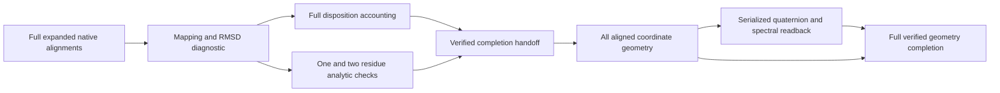

# Structural coverage of terminal duplication candidates

`scripts/summarize_duplication_sampling_coverage.py` independently reconstructs
all reported Terminal events with exactly one gene on each side from both
complete native duplication tables. It joins both genes to the same frozen
AlphaFold structural bridge used by the structural-comparison queues and
compares event identity, singleton status and model-presence counts against
the original coverage exports. This includes events with no models or only one
model, which do not enter the current structural pair queue.

The output contains an event-disposition table and summaries by taxon and
family. Every candidate-manifest taxon is retained, including zero qualifying events.
Zero denominators produce blank fractions, not zero structural coverage.
Counts distinguish neither/one/both genes modeled and identical-model cases.
Species names, study roles and lineage strings come from the pinned sampling
manifest. Profiles and MAFFT are kept separate, not treated as independent
replicates. Reported terminal singleton-side events are a restricted candidate
class, not the full biological duplication history.

The immediate purpose is to quantify ascertainment of the modeled candidate
set before downstream divergence/asymmetry interpretation. Missing models are
not biological absences. Counts do not establish missing-at-random sampling,
correct ascertainment bias or account for phylogenetic dependence. The frozen
bridge excludes later retrievals and ESMFold structures; the table does not
claim current total structure availability. It also does not independently
validate every missing-model candidate's gene-tree node.

Plan: `metadata/duplication_sampling_coverage_plan_20260926.json`.
Launch: `metadata/duplication_sampling_coverage_launch_20260926.json`.
Output: `results/orthology/duplication-sampling-coverage-20260926-v1/`.
Run with:

```bash
python scripts/summarize_duplication_sampling_coverage.py \
  --plan metadata/duplication_sampling_coverage_plan_20260926.json
```

The job completed. Resources were one CPU, 8 GiB RAM, no swap and an estimated
1 GiB output. The 0.1–4 hour planning range is uncalibrated. No GPU or paid
resources are used. Independent aggregate readback passed. Verified results:

| Guide | Terminal singleton-side events | Neither model | One model | Both models | Taxa with both models |
|---|---:|---:|---:|---:|---:|
| Profile | 467,663 | 345,890 | 12,528 | 109,245 | 153 |
| MAFFT | 467,690 | 345,933 | 12,529 | 109,228 | 153 |

All 526 reconciled taxa have reported events in this restricted class, but only 153
contribute two-model events. Two-model coverage is approximately 23.4% in
each guide. Both include 6,354 same-model events. Profile and MAFFT respectively
have 48,661 and 48,711 families with events; only 20,492 and 20,474 have
two-model events. This substantial ascertainment limits generalization across
lineages and families. Counts are archived in
`metadata/duplication_sampling_coverage_completed_20260926.json`; all source
and output hashes were rechecked after completion.


## Aggregate readback and manifest-versus-analysis membership

The independent grouped-event readback passed all 935,353 event records,
1,054 taxon/guide rows and 97,372 family/guide rows. Every model-presence class,
same-model flag, group count, fraction and taxon metadata field matched.
It uses exported event data rather than the producer's streaming counters;
it does not repeat the producer's native-event/bridge joins.

The raw candidate manifest contains **527 entries**, while both audited
reconciliation species lists contain **526 taxa**. The extra entry is
*Saccharomyces jurei* (F1987369), explicitly excluded because no usable annotated
proteome was acquired. It remains in the candidate manifest for possible
recovery. Thus the original coverage table has one blank-denominator row per
guide that means outside the analysis, not a reconciled species with biological
absence of duplications. The producer receipt's `sampled_taxa=527` refers to
candidate-manifest rows, not the analyzed reconciliation cohort.

A separate immutable table now adds `in_reconciliation`, `denominator_status`
and `exclusion_reason`, preserving every original field:
`results/orthology/duplication-coverage-membership-20260926-v1/taxon_coverage_with_membership.tsv`.
Both guides have 526 `events_observed` rows and one `not_in_reconciliation`
row. Membership was checked against each audited native SpeciesIDs file and
`metadata/sampling_exclusions.json`. Use this explicit membership table for
future plots and downstream ascertainment summaries.

Reproduce with:

```bash
python scripts/readback_duplication_sampling_coverage.py --source-plan metadata/duplication_sampling_coverage_plan_20260926.json --output <fresh-readback.json>
python scripts/annotate_duplication_coverage_membership.py --coverage results/orthology/duplication-sampling-coverage-20260926-v1 --aggregate-readback <fresh-readback.json> --exclusions metadata/sampling_exclusions.json --profile-tree-audit metadata/expanded_resolved_tree_profile_completed_readback_20260923.json --mafft-tree-audit metadata/expanded_resolved_tree_mafft_completed_readback_20260923.json --output <fresh-membership-directory>
```

Completed readback and membership receipts are archived in
`metadata/duplication_sampling_coverage_readback_completed_20260926.json`.


## Lineage coverage figure

[Coverage figure](figures/duplication_lineage_coverage_20260926.png)
([PDF](figures/duplication_lineage_coverage_20260926.pdf),
[SVG](figures/duplication_lineage_coverage_20260926.svg)) summarizes 27 broad
manifest lineage groups separately for both guides. The left panel uses events
as the denominator; the right uses reconciled taxa. The excluded candidate
*S. jurei* is omitted. All 54 rows and 108 percentages were independently
reconstructed from the membership table and output hashes checked; the final
render was visually inspected. Verification is recorded in
`metadata/duplication_lineage_coverage_figure_completed_20260926.json`.

The different denominators matter: Blastocladiomycota has approximately 57%
event coverage but only two of nine taxa contribute modeled pairs. Coverage
within large lineages is also uneven: only 56 of 234 Ascomycota contribute
pairs. Four ingroup lineages have no two-model events in this frozen candidate
set. These observations describe structural ascertainment of a restricted
event class, not biological absence or current total model availability.

Reproduce in fresh output locations:

```bash
python scripts/plot_duplication_sampling_coverage.py \
  --membership results/orthology/duplication-coverage-membership-20260926-v1 \
  --output <fresh-output-directory> \
  --figure-prefix <fresh-figure-prefix>
```

The figure script produces a numeric `lineage_coverage.tsv`, provenance receipt,
and PNG/PDF/SVG figures. No new prediction or phylogenetic correction is performed.

## September 28 expanded-catalog join

The fixed 935,353 terminal singleton-side event records have now been joined
to the September 28 catalog of 1,955,694 protein/model links. This separate
output preserves the original event identities and old model assignments:
`results/orthology/duplication-expanded-coverage-20260928-v1/`.
The producer and independent SQL readback both finished successfully. Every
original event field, new model assignment, coverage class and aggregate count
was checked across all 935,353 rows.

Verified counts are 141,724 two-model events for the profile guide
and 141,685 for MAFFT, versus 109,245 and 109,228 previously. Both guides now
have two-model candidates in 210 taxa, versus 153 previously. No previously
two-model event lost that coverage. These are source-availability counts, not
confidence-qualified comparisons or evidence of structural divergence.
The old figures and comparison queues retain their original frozen scope.

Reproduce in a fresh output directory using
`scripts/refresh_duplication_model_coverage.py --plan
metadata/duplication_expanded_coverage_plan_20260928.json`.
The plan pins source tables, receipts and script; the launch record is
`metadata/duplication_expanded_coverage_launch_20260928.json`. The bounded job
used one CPU, 4 GiB RAM, no swap, no GPU and no paid resources, with a 1 GiB
output allowance and an uncalibrated 0.02–1 hour planning range.

The independent verifier is `scripts/readback_expanded_duplication_coverage.py`;
run it with the same `--plan` and a fresh `--output` JSON path. It reconstructs
both protein/model joins in SQLite instead of using the producer's lookup and
recomputes every summary with SQL. Completion evidence and source hashes are
in `metadata/duplication_expanded_coverage_completed_20260928.json`.
Two-model coverage is 30.30% for profile and 30.29% for MAFFT. Both contain
7,294 events whose two proteins map to the same model; model availability
does not imply two independent structural predictions. Readback relies on
the earlier audited native-event selection and sequence catalog and does not
repeat coordinate or biological-event validation.

All 1,054 taxon/guide membership rows have also been updated in
`results/orthology/duplication-expanded-membership-20260928-v1/`.
Every original event denominator and cohort label is preserved; the excluded
*S. jurei* row retains its blank coverage fraction. Streaming event counts were
checked against SQL aggregation, and every serialized output row was read back.
Both guides gain 57 taxa with at least one two-model event: 32 Ascomycota,
12 Basidiomycota, five Mortierellomycota, five Glomeromycota, one Olpidiomycota,
one Mucoromycota and one Amoebozoa outgroup. These counts describe newly
available candidates, not independent ecological transitions or qualified
structural-divergence evidence.

Reproduce with `scripts/summarize_expanded_duplication_taxa.py --readback
results/orthology/duplication-expanded-coverage-readback-20260928-v1.json
--membership results/orthology/duplication-coverage-membership-20260926-v1
--output <fresh-directory>`. The bounded job used one CPU, 2 GiB RAM and no
swap or GPU, finishing successfully in about 10 CPU seconds. Source/output
checksums are recorded in `metadata/duplication_expanded_taxa_completed_20260928.json`.

The updated [lineage figure](figures/duplication_lineage_coverage_20260928.png)
([PDF](figures/duplication_lineage_coverage_20260928.pdf),
[SVG](figures/duplication_lineage_coverage_20260928.svg)) uses this expanded
membership table. All 54 guide/lineage rows and 108 percentages were checked
with a separate counter-based aggregation, and the PNG was visually inspected.
Evidence is in `metadata/duplication_expanded_lineage_figure_completed_20260928.json`.
Reproduce with the existing `scripts/plot_duplication_sampling_coverage.py`,
passing the expanded membership directory and fresh output/figure paths.

The two denominators remain different: about 42.1% of Ascomycota candidate
events have both models, but only 88 of its 234 taxa contribute covered pairs.
Olpidiomycota now has nearly complete event coverage, but represents one taxon.
Aphelidiomycota, Sanchytriomycota and Calcarisporiellomycota still have no
two-model candidates in this frozen event class; that is not evidence of
biological absence or a survey of every available structure.

### Expanded comparison resource inventory

The September 28 inventory contains 134,812 distinct model/version pairs
across 268,821 event links, plus 14,588 same-model event links retained in
the source table. Of these distinct pairs, 103,199 also occur in the old
103,200-pair queue and 31,613 are new. Comparing all new pairs in both input
orders would require 63,226 alignments per mask, or 126,452 with two masks,
before eligibility filtering. These are counts, not a measured runtime ETA.

The one old pair absent from the expanded set involves F13290 proteins
CAD7067269.1 and CAD7067533.1 in both guides. The latter's selected model
changed from AF-A0A177T084-F1 to AF-A0A9N8M122-F1; two-model event coverage
was retained. Matching model IDs and versions alone does not justify reusing
old alignment results: coordinate bytes, masking and settings must also match.

Reproduce with `scripts/estimate_expanded_duplication_pairs.py --readback
results/orthology/duplication-expanded-coverage-readback-20260928-v1.json
--old-queue-evidence metadata/duplication_model_pair_queue_completed_20260926.json
--output <fresh-directory>`. All 935,353 event rows were scanned; every
distinct-pair multiplicity was checked against SQL aggregation and every
serialized pair row was checked. Source hashes were verified before and
after execution. The one-CPU, 4-GiB, zero-swap job finished successfully in
18 CPU seconds, with a 566-MB peak. Its planning allowance was 100 MiB output
and 0.01–1 hour; no GPU, paid resource or new alignment job was used.
Evidence is in `metadata/duplication_expanded_pair_estimate_completed_20260928.json`;
the pair table and receipt are in
`results/orthology/duplication-expanded-pair-estimate-20260928-v1/`.

This inventory is not an executable comparison queue. Expanded candidate
tree-node correspondence, coordinate/confidence checks and masking eligibility
remain prerequisites. Source event associations remain intact, and deduplicating
model pairs for computation does not create independent biological observations.

### Expanded native-event inventory and tree review

The unchanged `inventory_duplication_structure_coverage.py` has completed a
new full native-event inventory using the audited September 28 family bridge.
The output at `results/orthology/duplication-structure-coverage-20260928-v1/`
retains all 1,204,638 profile and 1,204,919 MAFFT events, including complex and
uncovered events. Its terminal two-model exports contain 141,724 and 141,685
candidates, respectively, each spanning 210 taxa. Source-plan binding, artifact
hashes and successful service termination are archived in
`metadata/duplication_structure_coverage_completed_20260928.json`.

Every candidate identity, taxon, gene/model assignment and same-model flag was
compared against the independent expanded catalog join, scanning all 935,353
terminal singleton-side records. The initial comparison exposed a formatting
difference: native gene order versus sorted gene order. The corrected checker
sorts paired gene/model assignments together, preserving the mapping. Fixtures
verify order invariance and rejection of changed assignments, genes, taxa and
flags. All 283,409 candidates passed. This does not check every noncandidate
coverage field or establish structural eligibility.

Reproduce the inventory with `scripts/inventory_duplication_structure_coverage.py
--plan metadata/duplication_structure_coverage_plan_20260928.json` in a fresh
output location. The plan allows one CPU, 8 GiB RAM, zero swap, 2 GiB output and
0.1–4 hours; the run completed in 86 CPU seconds with an 804-MB peak. Reproduce
the candidate comparison with `scripts/check_expanded_duplication_candidate_export.py
--coverage results/orthology/duplication-structure-coverage-20260928-v1
--expanded-readback results/orthology/duplication-expanded-coverage-readback-20260928-v1.json
--output <fresh-json-path>`; run its focused identity fixtures with
`scripts/check_duplication_candidate_export_identity.py`.

The full tree review completed successfully as
`fungal-duplication-candidate-tree-review-20260928.service`, using unchanged
`validate_duplication_structure_candidates.py` with
`metadata/duplication_candidate_tree_review_plan_20260928.json`.
It independently rebuilds eligibility from native events and the frozen model
bridge, then checks reported nodes in 50,063 guide-specific candidate-bearing
family trees. Both descendant identity and direct-tip-child status are retained;
missing or mismatching nodes remain explicit. The plan caps one CPU and 8 GiB
RAM with zero swap, allows 1 GiB output and an uncalibrated 0.1–6-hour runtime.
Launch identity is in `metadata/duplication_candidate_tree_review_launch_20260928.json`.
All 141,724 profile and 141,685 MAFFT candidates match their exact reported
nodes and have the expected two direct tip children. Both guides share 141,302
protein pairs, with 422 profile-only and 383 MAFFT-only pairs. Every exported
source candidate field was checked, and all summary counts and guide-pair
membership rows were recomputed after successful termination. Evidence is in
`metadata/duplication_candidate_tree_review_completed_20260928.json`.
No GPU work or structural alignment was launched; rooting, support, duplication
biology and structural effects remain separate requirements.

The unchanged `prepare_duplication_structure_pairs.py` completed the
expanded model/version queue at
`results/structural_comparisons/duplication-model-pair-queue-20260928-v1/`.
Its complete command, source pins and resource allowance are recorded in
`metadata/duplication_model_pair_queue_plan_20260928.json`; launch identity is
in `metadata/duplication_model_pair_queue_launch_20260928.json`.
This CPU-only job retains every reviewed event association and explicitly
flags same-model rows. It is limited to one CPU, 8 GiB RAM, zero swap, with
1 GiB output and an uncalibrated 0.02–2-hour planning allowance. It finished in
54 CPU seconds. The queue contains 283,409 event links, 14,588 same-model links,
276,682 total models and 134,812 distinct model/version pairs. The 269,393
models used in distinct pairs occupy 94,489,735,215 coordinate bytes by file
size. This is a storage measurement, not raw-content validation.

The separate `readback_duplication_model_pair_queue.py` completed successfully
in 47 CPU seconds with a 1.4-GiB peak. It checked every original reviewed
event field, pair key/status and membership, every complete frozen catalog
record and all corresponding counts. Sources were hashed before and after;
all output rows were checked. It does not independently repeat the original
protein-to-model join or raw coordinate parsing. Reproduce with `--queue`,
`--review`, `--catalog` pointing to the above September 28 outputs and a fresh
`--output` JSON path. Completion evidence is in
`metadata/duplication_model_pair_queue_completed_20260928.json`.

Raw-coordinate validation is now running for all 276,682 models, including
same-model cases, through unchanged `validate_duplication_coordinates.py` and
`metadata/duplication_coordinate_validation_plan_20260928.json`. The source
files total 96,596,573,260 bytes; maximum sequence length is 1,567 residues.
The job checks raw byte hashes, sequence/atom identity, C-alpha coordinates and
per-residue confidence, retaining content rejections explicitly. It uses four
CPU workers, 16 GiB RAM and zero swap, with 1,000-model checkpoints, 32 GiB
output allowance and a 100-GiB free-disk reserve. The 0.5–24-hour planning range
is uncalibrated. Launch identity is in
`metadata/duplication_coordinate_validation_launch_20260928.json`; output is
`results/structural_comparisons/duplication-coordinate-validation-20260928-v1/`.
Coordinate validation, independent numeric readback and structural comparisons
remain pending. No GPUs or paid resources are used. Matching model IDs/versions
alone still does not justify reuse of previous coordinate-derived results.

The independent coordinate readback is queued as
`fungal-duplication-coordinate-readback-20260928.service`, using unchanged
`readback_duplication_coordinates.py` and
`metadata/duplication_coordinate_readback_plan_20260928.json`. It waits for
the exact producer process to exit and requires a complete, hash-bound
producer receipt before reconstructing every accepted exported C-alpha
sequence, coordinate and confidence value from raw CIF atom rows. It shares
the CIF lexical parser, but not the producer's extraction function. Rejected
records retain their identities and reasons; the readback does not independently
adjudicate rejection causes. Its allowance is two CPUs, 8 GiB RAM, zero swap,
0.1 GiB output and an uncalibrated 0.5–24 hours. Launch identity is recorded in
`metadata/duplication_coordinate_readback_launch_20260928.json`. Final completion
still requires successful service terminal states and validated artifacts;
the queued process is not a completed audit.

Full and pLDDT>=70 C-alpha input preparation is also queued, using unchanged
`materialize_duplication_alignment_inputs.py` with
`metadata/duplication_alignment_input_plan_20260928.json`. The controller waits
for the identified independent readback process and requires its complete
receipt, matching source receipt and every shard proof before writing inputs.
The source models contain 100,073,779 residues. Up to 553,364 input dispositions
will preserve model identity, original residue positions, masked sequence,
rejections and masks with fewer than three retained residues. PDB coordinates
are rounded to 0.001 Angstrom; full and masked scores will have different
normalization lengths and must remain distinguishable.

The service `fungal-duplication-alignment-inputs-20260928.service` is limited to
one CPU, 8 GiB RAM and zero swap, with a 64-GiB output allowance, 100-GiB free-disk
reserve and uncalibrated 0.1–12-hour planning range. Launch identity is in
`metadata/duplication_alignment_input_launch_20260928.json`; output will be
`results/structural_comparisons/duplication-alignment-inputs-20260928-v1/`.
It is currently waiting. No new alignments or reuse of earlier alignment results
has been launched. Exact input bytes and settings must be compared before
reusing completed comparisons from the original queue.

### Catalog source comparison for alignment reuse (September 28)

A complete source screen of all 134,812 expanded model pairs found 103,199
shared pairs with identical catalog coordinate checksum, sequence checksum,
and length at both endpoints. No shared pair had changed source identities;
31,613 pairs are new and require alignment. The full serialized screen was
independently compared to both frozen catalogs and pair tables. Changed
coordinate checksum, sequence checksum, and length fixtures correctly prevent
classification as a matching source candidate.

This is not permission to reuse results: actual materialized PDB bytes,
residue mapping, confidence mask, executable/options, order, and audited prior
checkpoint results still must match. No alignment outputs have been copied.
Coordinate validation and input materialization remain prerequisite work.
Original provenance and numeric discrepancy flags must survive any future reuse.

Reproduce with `scripts/screen_duplication_alignment_reuse.py --old
results/structural_comparisons/duplication-model-pair-queue-20260926-v1 --new
results/structural_comparisons/duplication-model-pair-queue-20260928-v1 --output
<fresh-output-directory>`. The completed screen is at
`results/structural_comparisons/duplication-alignment-reuse-screen-20260928-v1`;
its complete-row verification is recorded in
`metadata/duplication_alignment_reuse_screen_completed_20260928.json`.

### Expanded coordinate producer complete; independent audit active

The September 28 producer completed all 276,682 frozen models with no content
rejections and exited successfully at 22:23 EDT. All 277 compressed output
checksums, individual receipts, exact frozen model partitions, model counts and
plan pins were verified. The independent raw-CIF coordinate/sequence/confidence
readback started automatically and remains active. Alignment input materialization
continues to wait for full audit success; no expanded alignments have been launched.
Producer-only evidence is saved in
`metadata/duplication_coordinate_validation_producer_completed_20260928.json`.
These checks do not establish prediction accuracy, PAE qualification, or biological
structural divergence.

## Full alignment-input readback queued (September 29)

`scripts/readback_duplication_alignment_inputs.py` waits for the exact input
materialization process and requires successful termination. It then checks all
276,682 models and 553,364 full/plDDT70 input dispositions against the already
audited coordinate shards. Every retained sequence and original residue position
is reconstructed. Each ready PDB is parsed independently for atom identity,
serial, residue number, chain, occupancy, coordinates and confidence. Coordinate
and confidence rounding tolerances remain 0.000501 Angstrom and 0.005001,
respectively. Short masks and rejected source records stay explicit.

Fixtures covered full and noncontiguous masks, the exact 70 cutoff versus
69.9999, rounding, empty masks and source rejection. Deliberately altered residue
positions, coordinates and confidence were rejected even after recomputing the
file hash. This validates the checker implementation; full output validation
remains pending.

Plan and process identity:
`metadata/duplication_alignment_input_readback_{plan,launch}_20260929.json`.
Resources: one CPU, 4 GiB memory, no swap, 0.5–12 hours planning allowance,
small JSON proof, no GPU or paid resources. The checker streams the 277 source
shards and generated PDBs. Expanded alignment runs and any reuse of historical
alignments still require validated inputs and exact settings checks.

## Exact old/new alignment-input comparison queued (September 29)

`scripts/compare_duplication_alignment_inputs.py` waits for the full expanded
input readback, then checks both old and expanded manifests against their
respective model queues and rehashes every ready PDB. Compact input signatures
retain model/version, source checksum, mask, disposition, sequence, original
positions, lengths and PDB checksum. Paths and source-shard boundaries may change
without altering the signature. All 269,624 expanded pair/mask entries are
classified, including new pairs, changed inputs, matching ready inputs and
matching unavailable-input dispositions.

Fixtures verified relocation invariance and detection of changes to each of ten
identity/content fields. Plan/process identity:
`metadata/duplication_exact_input_comparison_{plan,launch}_20260929.json`.
Resources: one CPU, 4 GiB, no swap, 0.5–12 hours planning allowance, 0.2 GiB
output, no GPU or paid resources. The output is
`results/structural_comparisons/duplication-exact-input-comparison-20260929-v1`.
Full screen readback remains required. Even exact ready inputs do not authorize
reuse by themselves: native executable/options, input order, checkpoint results
and retained numerical discrepancy flags still need checking. No alignment
results have been copied or admitted by this stage.


### Recorded alignment costs (September 29)

The timing census of all 412,800 existing directed alignment dispositions
completed successfully before resource allocation for the expanded pair set. It verifies every
checkpoint hash, input binding, pair/mask/order identity and disposition, then
summarizes recorded elapsed times by confidence mask, status and longer-input
length bin. Summed task wall time is not measured CPU time or total pipeline time;
these results alone do not provide an ETA for newly added pairs. Numerical
alignment checks and exact-input reuse requirements remain separate.

The [census script](../scripts/census_duplication_alignment_costs.py),
[resource estimate](../metadata/duplication_alignment_cost_census_resources_20260929.json)
and [launch identity](../metadata/duplication_alignment_cost_census_launch_20260929.json)
are versioned. The job uses one CPU, at most 2 GiB RAM and no swap or GPUs.
Complete-pair timing aggregation, the inclusive length-bin boundary and rejection
of a modified checkpoint passed local fixtures. Output will be written to
`results/structural_comparisons/duplication-alignment-cost-census-20260929-v1`.

The [completion record](../metadata/duplication_alignment_cost_census_completed_20260929.json)
binds the successful terminal state and source hashes. The 103,200 old pairs
accounted for 45.401 summed task wall hours and 1.998 GiB
of checkpoints. Longer-input bins show substantial runtime differences: full-mask
median durations range from 0.030 seconds for inputs up to 250 residues to 5.960
seconds for the 1,001–2,000-residue bin. The expanded masked-input length
distribution is still needed before estimating its workload; simple pair-count
scaling would ignore this difference.


### Expanded alignment workload scenarios queued (September 29)

The [workload estimator](../scripts/estimate_expanded_duplication_alignment_workload.py)
waits for successful completion of the full expanded PDB input audit, then counts
all 134,812 pairs in both orders and both masks. Its fresh-alignment scenarios use
historical mean task wall times within confidence-mask and longer-input length
bins. Missing historical bins remain uncovered and excluded from estimated hours;
unavailable masked inputs require no native alignment. Six scenarios combine
4/8/16 workers with historical costs multiplied by 1 or 4. These are planning
scenarios, not calibrated ETAs, and do not include queue or I/O overhead. Sequence
divergence and both input lengths may affect runtime within a bin.

The [plan](../metadata/expanded_duplication_alignment_workload_plan_20260929.json)
and [launch](../metadata/expanded_duplication_alignment_workload_launch_20260929.json)
bind source hashes and resources: one CPU, 4 GiB memory, no swap/GPU/paid resources.
Length boundaries, covered/uncovered/unavailable counts, worker arithmetic and
zero-coverage fixtures passed. The estimator assumes no result reuse and does not
launch alignments. Full result review and resource allocation remain pending.


### Expanded coordinate audit completed (September 29, 03:02 EDT)

All 277 coordinate batches passed the independent source-CIF audit: 276,682
models and 100,073,779 residues, with no rejected model dispositions. The audit
reconstructed each accepted C-alpha sequence, coordinate and confidence value.
The [completion record](../metadata/duplication_coordinate_readback_completed_20260929.json)
binds successful terminal status, all 277 per-shard proof hashes, their source
shard bindings, and aggregate model/residue counts. The lexical CIF parser is
shared with the producer; the extraction logic is separate.

The already queued expanded alignment-input materializer started automatically
and wrote its first batch at 03:02:32 EDT. It is generating full and pLDDT70 C-alpha
inputs; the PDB readback, exact old/new input comparison and workload scenarios
remain downstream. No expanded alignments or biological effects are claimed
complete by this coordinate audit.


Expanded alignment-input production completed all 277 batches at September 29,
03:26 EDT. Its 553,364 dispositions comprise 276,682 ready full-model inputs,
249,733 ready pLDDT70 inputs and 26,949 masks with too few retained residues.
The PDB files total 13,045,403,371 bytes. The
[producer completion record](../metadata/duplication_alignment_input_producer_completed_20260929.json)
binds its terminal success, receipt dependencies and manifest hash. The separate
full PDB readback subsequently passed all 277 batches on September 29, around
03:44 EDT. It checked all 553,364 dispositions against audited source records,
including sequences, original residue positions, confidence-mask membership,
and every written C-alpha coordinate and confidence value at PDB rounding
tolerances. The 26,949 short confidence masks remain explicit unavailable
inputs. The [audit completion record](../metadata/duplication_alignment_input_audited_20260929.json)
binds the successful terminal state, proof, pinned checker and plan, producer
receipt, and aggregate counts.

The already queued exact old/new input comparison and expanded workload
estimator are now live after this validation gate. Expanded native alignments
and input/result reuse remain pending; input validation establishes neither
biological effects nor suitability of old numerical results for reuse.

### Expanded structural alignments launched (September 29)

The workload estimator completed with 134,812 pairs and 539,248 directed
dispositions: 501,324 native alignment calls and 37,924 unavailable confidence-mask
dispositions. All ready inputs fall within historical timing bins. Source hashes,
terminal success and reported-stratum arithmetic were checked in the
[workload completion record](../metadata/expanded_duplication_alignment_workload_completed_20260929.json).
Historical mean costs imply 7.04 hours at eight workers; multiplying those costs
by four gives 28.14 hours. These are scenarios, not calibrated ETAs or bounds,
and omit IO and subsequent validation.

The [full expanded run](../metadata/expanded_duplication_alignment_plan_20260929.json)
is launched with eight CPU workers, a 32 GiB memory cap, zero swap, a 64 GiB
output allowance and a 100 GiB free-disk reserve. Each native call has a
600-second timeout; unavailable inputs, native errors, parse failures and
timeouts remain explicit dispositions. Both input orders and both masks are
included, with fresh alignments for every ready pair. The native binary,
scripts, source manifest, queue, input audit and workload evidence are pinned.
Native/checkpoint fixtures and the complete small handoff fixture passed before
launch. The [launch record](../metadata/expanded_duplication_alignment_launch_20260929.json)
preserves the exact process identity and plan hash. Full result readback,
degenerate-geometry review, alignment-order sensitivity and biological
duplication tests remain pending. GPU prediction remains paused.

The [expanded numerical diagnostic](../metadata/expanded_duplication_rmsd_diagnostic_plan_20260929.json)
is queued behind the exact alignment process and its successful terminal state.
It uses the existing primary diagnostic implementation to check the entire
pair/order/mask universe, checkpoint provenance, residue mappings, sequence
identity and independently reconstructed least-squares RMSDs. Discrepancies
remain explicit and quarantined; completion of this diagnostic does not grant
scientific eligibility. It has one CPU, 32 GiB memory, zero swap and a 3 GiB
output allowance, with an uncalibrated 1–16 hour planning window. Geometry,
analytic checks of short mappings and serialized numeric verification remain
required after this stage. The
[launch record](../metadata/expanded_duplication_rmsd_diagnostic_launch_20260929.json)
binds its process identity and plan hash.

The old/new input comparison subsequently completed all 269,624 pair/mask
combinations and rehashed 933,679 ready PDB files across the two inventories.
It reports 63,226 new combinations, 193,821 combinations with exactly matching
ready inputs and 12,577 with exactly matching unavailable inputs. The
[completion record](../metadata/duplication_exact_input_comparison_completed_20260929.json)
checks successful terminal status, source pins, output hashes, complete
pair/mask membership and aggregate counts. It does not independently repeat
all signature comparisons or authorize native-result reuse. The expanded
alignment run continues to compute fresh results for every ready input pair.


The expanded diagnostic now has two queued follow-up checks: a
[complete disposition/RMSD accounting check](../metadata/expanded_duplication_accounting_check_plan_20260929.json)
and [analytic short-mapping check](../metadata/expanded_duplication_short_check_plan_20260929.json).
Both require the exact diagnostic process to finish successfully. Versioned
parameterized copies preserve the earlier numerical logic and leave pinned
original scripts unchanged. Regression runs exactly reproduced all earlier
completion fields and all 327 one/two-residue analytic rows, apart from the
script hash; [regression evidence](../metadata/expanded_duplication_diagnostic_checker_regressions_20260929.json)
binds both versions. Each queued service has one CPU, an 8 GiB memory cap and no
swap, with an uncalibrated 0.05–2 active-hour allowance. Expanded results remain
pending. Coordinate rank/rotation-curvature assessment and its serialized
readback must follow these checks; no discrepancy is silently accepted.

The remaining geometry stages are now queued for the complete expanded dataset.
The [live pipeline record](../metadata/expanded_duplication_geometry_pipeline_queued_20260929.json)
verified all three new service PIDs, creation times, commands and pinned plans.
At that check, each service was waiting for its predecessor, with no child
computation or completion artifact yet. Active service status is not evidence
that the analysis has finished.



The [completion plan](../metadata/expanded_duplication_diagnostic_completion_plan_20260929.json)
binds successful terminal states for all three predecessor services, their
receipt identities, artifact hashes, full counts and every short-mapping
discrepancy. Its parameterized implementation reproduces all earlier
completion fields on the entire historical 412,800-disposition dataset;
[regression evidence](../metadata/expanded_geometry_completion_regression_completed_20260929.json)
records 387,646 numeric alignments, 327 short mappings and 27 retained RMSD
discrepancies. This verifies compatibility with that completed dataset; expanded
results have not yet been produced.

The [geometry plan](../metadata/expanded_duplication_geometry_plan_20260929.json)
covers every successful alignment among the full 539,248 dispositions, up to
501,324 rows. It rechecks hashed native mappings and PDB coordinates, records
coordinate and cross-covariance singular spectra, and measures curvature at
the best proper rotation. The existing numerical implementation is unchanged.
The [serialized readback plan](../metadata/expanded_duplication_geometry_readback_plan_20260929.json)
reconstructs every saved row with a separate quaternion eigensystem and LAPACK
gesvd spectral checks. Parsing and source-coordinate libraries are shared.
Degenerate and discrepant comparisons stay explicit; a numerically unique
rotation does not establish prediction accuracy or stability to coordinate
uncertainty. Confidence, coverage, input-order sensitivity and downstream
duplication tests remain required.

The dependency runner checks exact process identity, requires successful
terminal unit states, and verifies pinned inputs before running a child command.
It preserves its own PID and command while the child runs, so the subsequent
checker can track one stable identity. Five
[gate tests](../scripts/test_verified_dependency_gate.py) passed: successful
handoff, failed-job rejection, process-exit/unit-state transition polling,
changed-plan rejection and live-command mismatch rejection. A failure does not
start a downstream analysis or restart its predecessor.

The completion service has one CPU and 8 GiB memory; geometry and readback each
have one CPU and 32 GiB memory. All have zero swap and use no GPU or paid
infrastructure. Completion has a 0.01–1 hour active-time planning allowance;
each full geometry stage has an uncalibrated 0.5–16 hour allowance and a 2 GiB
output allowance. These exclude prerequisite waiting and are not ETAs or
timeouts. Before launch, available memory was about 657 GiB and disk space
about 10,755 GiB. Full source records and launch identities are versioned;
geometry completion, independent serialized validation and scientific
qualification remain pending.

The final [geometry completion plan](../metadata/expanded_duplication_geometry_completion_plan_20260929.json)
is now queued behind both full geometry stages. Its
[launch](../metadata/expanded_duplication_geometry_completion_launch_20260929.json)
and [queue check](../metadata/expanded_duplication_geometry_completion_queued_20260929.json)
bind the exact live controller and predecessor identities. No completion result
exists yet. After successful terminal states, it will compare every geometry
identity, alignment length and RMSD classification with the complete diagnostic
table and independent readback. Every one/two-residue mapping must match the
analytic short census; longer numerical degeneracies are recorded explicitly.
Original RMSD discrepancies remain excluded from scientific acceptance.

The new collector reproduced all historical 387,646 rows, 387,319 numerically
unique rotations, 327 short degeneracies and 27 RMSD discrepancies. Nine
[reconciliation tests](../scripts/test_geometry_completion_reconciliation.py)
passed, covering legitimate longer degeneracy, missing and duplicate mappings,
altered RMSD exclusions, inconsistent short or independent-audit censuses, and
older launch records whose plan is bound through recorded arguments. The
[validation record](../metadata/geometry_completion_reconciliation_validation_20260929.json)
distinguishes this completed regression from the pending expanded cohort.

The final controller has one CPU, 8 GiB memory, zero swap, and a 0.01 GiB output
allowance. Its 0.01–1 hour planning allowance applies after dependencies finish;
it does not repeat coordinate fitting or predictions. No GPU or paid resources
are used. Full geometry verification remains a prerequisite for input-order,
confidence and coverage sensitivity, and biologically interpretable duplication
tests.
