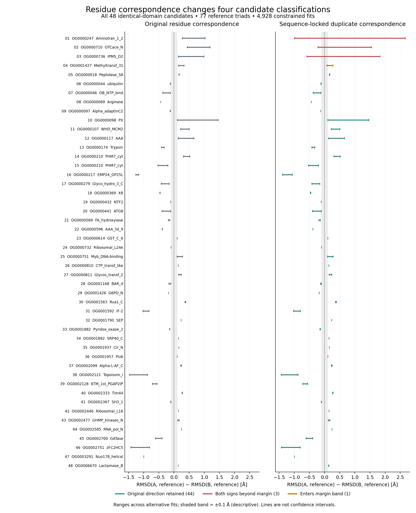

# Sequence-locked shared-reference controls — September 27, 2026

Completed the shared-reference correspondence control for all 48 candidates with
identical complete duplicate-domain intervals. Each original shared reference
core was retained, with the duplicate correspondence constrained to equal sequence
offsets. Both choices of reference anchor were evaluated: retain A-to-reference
mapping and place B by A's sequence offset, or retain B-to-reference mapping and
place A by B's offset. Thus neither duplicate's reference alignment is preferred.

Every tied-reference/annotation interval triad remains represented. Both common-
core definitions, eight original input orders, two masks and two anchors yield
64 alternatives per triad: **77 triads and 4,928 fits**. In the pLDDT70 mask,
new triples are retained only when all three corresponding residues pass the
confidence threshold; all three distances use the same triples. All fits pass
30-residue/70%-original-interval coverage and numerical rotation uniqueness.

## Results and revised interpretation

**44 of 48 candidates retain the original structural direction beyond 0.1 Å
throughout all alternatives.** Three span both directions beyond that margin,
and one touches or enters the margin band. No candidate has a consistently
opposite direction across all alternatives. These are descriptive sensitivity
labels; 0.1 Å is not a calibrated uncertainty or biological significance cutoff.

| Family | Pfam | Previous sequence relationship | Constrained contrast range (Å) | Result |
| --- | --- | --- | ---: | --- |
| OG0000247 | PF00155.28 / Aminotran_1_2 | Unresolved | −0.990 to 2.665 | Both directions |
| OG0000710 | PF02729.27 / OTCace_N | Concordant | −0.215 to 1.545 | Both directions |
| OG0000736 | PF22615.2 / IPMS_D2 | Concordant | −0.577 to 1.823 | Both directions |
| OG0001427 | PF13847.13 / Methyltransf_31 | Discordant | 0.076 to 0.271 | Enters margin band |

All four are among the eight cases whose identical domain strings nevertheless
had some nonidentical letters paired in original common-core mappings. They
should be described as correspondence-sensitive, not as robust directional
candidates under the expanded controls. The other four flagged cases retain
their original direction under this particular control. Exact gene IDs and all
source candidate fields are retained in the output summary.

The earlier 947-candidate count describes stability under the original tested
alternatives. This additional control applies to 48 eligible candidates; it
does not establish equivalent robustness for the other 899. In particular, one
of the previously discordant candidates enters the margin band. Do not silently
turn the remaining 201 discordant cases into a fully validated control set.
Matched backgrounds, phylogenetic dependence, model uncertainty and biological
interpretation remain unresolved.

## Reproduction and verification

Run `scripts/fit_sequence_locked_reference_cores.py --plan
metadata/duplication_sequence_locked_reference_plan_20260927.json`, followed by
`scripts/check_sequence_locked_reference_cores.py --plan
metadata/duplication_sequence_locked_reference_plan_20260927.json --output
<new-readback-path.json>`.

Output directory
`results/structural_comparisons/duplication-sequence-locked-reference-cores-20260927-v1`
contains `sequence_locked_fits.tsv`, `candidate_control_summary.tsv` and the
hash-bound receipt. The fit table records every original reference mapping
choice, exact constrained residue triple, confidence exclusion, coordinate
metric and screen decision. Candidate rows preserve the original annotations
and add explicit new-control status rather than overwriting previous results.

The independent checker reconstructed all constrained mappings with array-based
relative positions and recalculated every distance through quaternion rotations,
independent of the producer's SVD fit. It verified the full alternative grid,
all confidence/identity/geometry metrics, coverage and candidate extrema/statuses.
Maximum RMSD/contrast disagreement was 3.11 × 10⁻¹⁴ Å. See
[completion evidence](../metadata/duplication_sequence_locked_reference_completed_20260927.json).
One CPU, 4 GiB memory and 2 GiB output were budgeted; no new predictions or
native alignment searches were required. The ongoing AlphaFold optimization and
accessibility workers were revalidated live without restarting them. GPU prediction
remains paused.

## Figure and underlying data

The two panels use the same horizontal scale and include every eligible
candidate. The four changed classifications appear first; remaining rows are
ordered by family, gene identifiers and Pfam accession. Each segment spans
the minimum and maximum signed RMSD contrast across the applicable alternative
fits. The shaded ±0.1 Å band is a descriptive threshold, not a calibrated
biological effect threshold. These segments are not confidence intervals.
Positive values place duplicate A farther from the reference; negative values
place duplicate B farther away. Neither direction establishes ancestral change.

Download the [PDF](figures/sequence_locked_reference_controls_20260927.pdf),
[SVG](figures/sequence_locked_reference_controls_20260927.svg), or
[complete plot table](figures/sequence_locked_reference_controls_20260927.tsv).
The table retains full gene identifiers and versioned Pfam accessions for every
numbered row; repeated domain labels do not indicate duplicate records.

The producer is `scripts/plot_sequence_locked_reference_controls.py`, invoked
with `--plan metadata/sequence_locked_reference_figure_plan_20260927.json`.
Use a new output prefix and receipt path when regenerating existing artifacts;
the producer refuses to overwrite them. The independent checker
`scripts/check_sequence_locked_reference_figure.py` takes the same `--plan`
and a new `--output` JSON path. It verified every candidate identity, copied
field, all 192 endpoints, the classification thresholds, and artifact hashes.
See [readback evidence](../metadata/sequence_locked_reference_figure_readback_20260927.json).
Visual inspection of the exported PNG on September 27 confirmed readable labels,
shared scales, all 48 rows, and unclipped legends and caption. The underlying
4,928 fits retain their separate independent numerical verification above.
