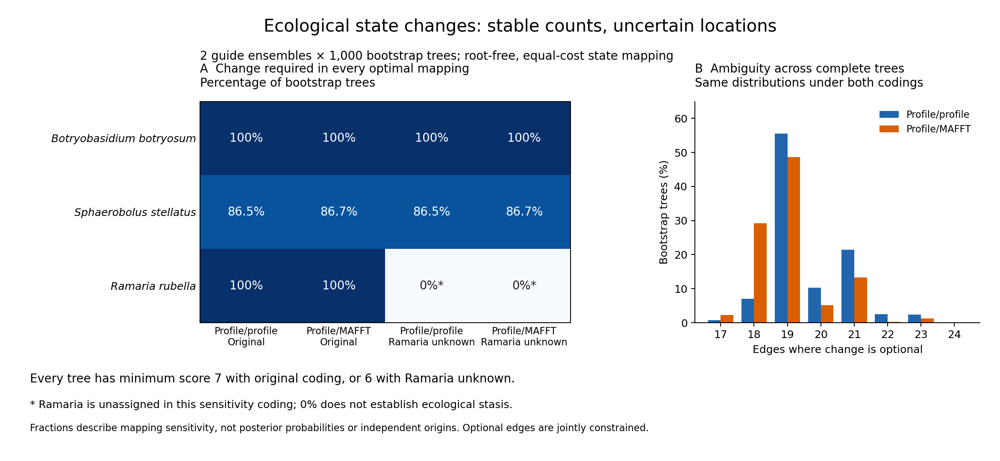

# Locations allowed by minimum-change ecological reconstructions

Mapped every edge on both completed profile-alignment PMSF trees under the
previously frozen 32-species binary classification. The 24 ectomycorrhizal and
seven asymbiotic/saprotrophic classifications retain their earlier conditional
coding; orchid symbiosis and the other 495 tips are unconstrained. The thirteen
newly curated species are not newly coded as ECM absence. A second scenario
leaves Ramaria rubella unknown because of its documented source uncertainty.

For each edge, an inside/outside dynamic program calculates the global minimum
score under each of its four endpoint-state combinations. It identifies edges
that change in every optimum, in some optima, or in none. This evaluates all
optimal assignments without choosing one arbitrary ancestral reconstruction.

| Conditional coding | Minimum total changes | Required-change edges | Optional-change edges | Edges unchanged in every optimum |
|---|---:|---:|---:|---:|
| Original 32-species coding | 7 | 3 | 19 | 1,027 |
| Ramaria unknown | 6 | 2 | 19 | 1,028 |

Both tree alternatives give these same counts. Required-change edges in the
first scenario are terminal edges for Botryobasidium botryosum (F264124),
Sphaerobolus stellatus (F68786) and Ramaria rubella (F113071). Leaving Ramaria
unknown removes its required change. These are **conditional constraints on
an undirected equal-cost reconstruction**, not experimentally established
transitions, three independent origins, or inferred biological gain/loss
polarities. The stored parent/child direction follows Newick traversal and
must not be interpreted as a biologically justified ancestral direction.

Optional edges are not independent choices: assignments across edges must
jointly attain the global minimum. In particular, the 19 optional edges do not
represent 19 events. Sparse and uncertain trait observations can constrain a
minimum change while leaving its location or direction unresolved. Identical
counts on the two trees do not establish support across bootstrap trees,
alignment alternatives, trait-coding schemes or evolutionary models.

## Full verification and reproducibility

Exhaustive enumeration passed 243 small-tree state patterns, including unknown
tips, alternative resolutions and a four-way polytomy. An independent integer
network-flow algorithm then checked all 16,784 endpoint-constrained costs
across 4,196 production edge rows, plus split identities, optimal assignment
sets, unknown-tip counts and every summary. No dynamic-programming helper was
imported by the production readback. Infeasible endpoint assignments have blank
costs, rather than interpreting the implementation's finite penalty as a cost.

```bash
python scripts/check_ecology_optimal_edge_states.py
python scripts/map_ecology_optimal_edges.py --plan metadata/ecology_optimal_edges_plan_20260927.json
python scripts/readback_ecology_optimal_edges.py --plan metadata/ecology_optimal_edges_plan_20260927.json --output metadata/ecology_optimal_edges_readback_20260927.json
```

Use fresh output paths for reruns. Full results are outside Git under
`results/ecology/optimal-edge-states-20260927-v1`. The plan, producer receipt,
full network-flow proof, script hashes, versions and reproduction commands are
in `metadata/ecology_optimal_edges_*_20260927.json`. The computation uses local
CPU only. The original tree files and their independent proofs are pinned.

Further work must evaluate edge-location uncertainty across the relevant tree
ensemble, review biological rooting and explicit trait models, and establish
usable replicated transitions with matched structural coverage. This diagnostic
advances phylogenetic integration but does not complete ecological testing.

## Full bootstrap edge mapping running

Started the same optimal-edge calculation across all 2,000 saved ultrafast
bootstrap trees (1,000 per guide) under both frozen coding scenarios. All 526
tip identities are checked per tree. Compressed per-tree checkpoints retain
every split, endpoint identity, status and four conditional costs. Summaries
separate the number of trees containing a split from counts of required,
optional and excluded changes, so an absent split is not treated as an observed
unchanged edge. The canonical split side is root-independent; state ordering
remains a traversal convention.

The pre-run allowance is one CPU, 4 GiB RAM, no swap, 2 GiB output and 2–30
minutes. The launched systemd unit enforces the CPU and memory allowances.
PID, creation time, exact command and plan hash are recorded in
`metadata/ecology_bootstrap_edges_launch_20260927.json`; the frozen plan is
`metadata/ecology_bootstrap_edges_plan_20260927.json`. Outputs are under
`results/ecology/bootstrap-optimal-edge-states-20260927-v1`. Resume reuses only
shards with matching plan/source hashes and verified compressed artifact hashes.

```bash
python scripts/map_ecology_bootstrap_edges.py --plan metadata/ecology_bootstrap_edges_plan_20260927.json
```

The validated recurrence is unchanged. Production completion and independent
bootstrap verification remain pending. These frequencies assess sampled tree
topology sensitivity conditional on one sequence alignment and fixed trait
coding; they are not posterior transition probabilities or independent origins.

## Full bootstrap network-flow verification queued

Queued independent reconstruction of all four conditional endpoint costs for
every edge, every tree and both coding scenarios. The verifier uses integer
network maximum flow rather than the producer's inside/outside recurrence.
It also reconstructs every split identity, tree score, status, per-tree count
and split-frequency denominator directly from source trees and classifications.
No producer edge-mapping helper is imported. The final proof requires all 2,000
trees; per-tree checkpoints alone do not establish completion.

A complete real bootstrap shard passed 8,392 constrained-cost checks in 6.92
seconds. Deliberately altered cost and duplicate-edge records were rejected
even with updated artifact hashes. The full run has a pre-launch 1–6-hour
allowance, four CPU workers, 8 GiB RAM, no swap and 0.1 GiB proof output. The
rough timing extrapolation is about one hour before workload variability and
summary checks. No GPU or paid service is used.

The verifier checks the producer PID plus creation time and command while
waiting, then requires its final source-bound receipt. It is recorded in
`metadata/ecology_bootstrap_edges_readback_{plan,launch}_20260927.json`;
fixture evidence is `metadata/ecology_bootstrap_flow_fixture_20260927.json`.
Full readback output is
`results/ecology/bootstrap-optimal-edge-readback-20260927-v1`.

```bash
python scripts/check_ecology_bootstrap_flow_readback.py
python scripts/readback_ecology_bootstrap_edges.py --plan metadata/ecology_bootstrap_edges_readback_plan_20260927.json
```

Production and the full independent audit remain pending. A verification rerun
recomputes the network flows; partial proof files are not silently accepted as
completed verification.

## Bootstrap production complete; full audit running

The producer exited successfully after all 2,000 trees and 4,000 coding/tree
combinations. It emitted 4,196,000 edge records and 5,006 source/coding/split
summary rows. All 2,000 compressed tree-shard hashes, their checkpoint receipts
and both summary hashes were checked against the final source-bound receipt.
Completion evidence is archived in
`metadata/ecology_bootstrap_edges_production_completed_20260927.json`.

The independent verifier automatically advanced from its dependency wait and
was observed computing with four live workers (PIDs 2167140–2167143 under the
recorded controller). Its first ten completed trees cover 83,920 constrained
cost checks. The full audit is still pending; these partial checks do not
validate the entire ensemble, and no final bootstrap transition interpretation
is yet claimed. No restart or change to pinned live code was needed.
## Full bootstrap uncertainty summary queued

The independent bootstrap audit was verified live and had reached 1,910 of
2,000 trees at the latest checkpoint. Its final receipt was not yet present.
`scripts/summarize_ecology_bootstrap_uncertainty.py` now waits for that exact
process and requires a successful full network-flow audit of all 16,784,000
endpoint-constrained costs before summarizing results.

The summary joins every bootstrap split to the audited maximum-likelihood
mapping, retaining splits present in either source. It reports absence
separately from no change, and reports required/optional/no-change frequencies
both across all 1,000 trees per guide and conditional on split presence.
Minimum-change and edge-status count distributions are retained for all four
guide/coding conditions, with exact bootstrap-index coverage checks.

This is conditional root-free, equal-cost mapping uncertainty. Fractions are
not posterior probabilities, inferred biological origin counts or independent
ecological contrasts; gains and losses cannot be assigned from these unrooted
results. Optional edges are jointly constrained by complete optimal mappings.
Source ecology labels and the Ramaria coding alternative remain explicit.

The plan and verified live identity are
`metadata/ecology_bootstrap_uncertainty_summary_plan_20260927.json` and
`metadata/ecology_bootstrap_uncertainty_summary_launch_20260927.json`.
Expected output is `results/ecology/bootstrap-uncertainty-summary-20260927-v1`.
Resources are one CPU/4 GiB RAM, no swap, 0.1 GB output and 1–10 minutes after
the audit, on the existing host. The summary and its independent aggregation
readback remain pending.
## Full bootstrap audit and uncertainty summary completed

All 2,000 saved bootstrap trees passed independent network-flow reconstruction:
4,000 tree/coding combinations, 4,196,000 edge rows and 16,784,000 constrained
endpoint costs. Rechecked all 2,000 proof and compressed-shard hashes, the source
summary artifacts, exact tree-index grid and successful terminal process state.
The completion record is
`metadata/ecology_bootstrap_edges_readback_completed_20260927.json`.

The full uncertainty summary then completed and passed independent pandas
outer-join and distribution reconstruction: all 5,006 split/condition rows,
68 distribution rows, ML annotations, counts, conditional fractions and absence
denominators were checked. Receipts are
`metadata/ecology_bootstrap_uncertainty_summary_completed_20260927.json` and
`metadata/ecology_bootstrap_uncertainty_summary_readback_20260927.json`.

Across every bootstrap tree in both guide ensembles, the original coding
requires a minimum of seven state changes; treating Ramaria F113071 as unknown
reduces that minimum to six in every tree. These are root-free parsimony scores,
not counts of independent biological origins or directed gains/losses.

| Guide ensemble | Coding | Required-change edge count | Optional-change edge count |
|---|---|---|---|
| Profile/profile | Original | 3 in 865 trees; 2 in 135 | 17–24 |
| Profile/MAFFT | Original | 3 in 867 trees; 2 in 133 | 17–23 |
| Profile/profile | Ramaria unknown | 2 in 865 trees; 1 in 135 | 17–24 |
| Profile/MAFFT | Ramaria unknown | 2 in 867 trees; 1 in 133 | 17–23 |

The Botryobasidium F264124 terminal edge is required in every optimal mapping
on every bootstrap tree under both codings. The Ramaria F113071 terminal edge
is always required only under the original coding. The Sphaerobolus F68786
terminal edge is required in 86.5% and 86.7% of the two ensembles, respectively,
and optional in the remaining trees; its split is present throughout. No other
split is required in any bootstrap tree. There are 32 profile/profile and 31
profile/MAFFT splits that are optional in at least one tree, under either coding.
These optional edges are jointly constrained, not independent candidate events.

The full distributions are archived in
`metadata/ecology_bootstrap_tree_metric_distributions_20260927.tsv`, with all
ever-required edge/condition rows in
`metadata/ecology_bootstrap_required_edge_sensitivity_20260927.tsv`. Stable
minimum scores therefore coexist with uncertain transition placement. Rooting,
broader ecological coding and evidence for replicated independent transitions
remain necessary before an ecological structural-effect test. This stage does
not establish that seven contrasts are available.
## Reproducible bootstrap uncertainty figure



The [PDF](figures/ecology_bootstrap_uncertainty_20260927.pdf) and
[SVG](figures/ecology_bootstrap_uncertainty_20260927.svg) provide vector exports;
the [TSV](figures/ecology_bootstrap_uncertainty_20260927.tsv) records every plotted
value. Reproduce with `scripts/plot_ecology_bootstrap_uncertainty.py --prefix`
followed by a fresh output prefix. The script requires the completed full
summary readback and verifies input hashes.

Panel A shows every terminal edge that is required in any bootstrap mapping,
across all four conditions. Percentages refer to bootstrap trees in which an
edge must change under every optimal mapping. All these terminal splits occur
in every tree, so conditional and ensemble denominators coincide here. The
Ramaria-unknown zero is explicitly not evidence for ecological stasis.
Panel B shows the entire optional-edge count distribution, including zero
bins. The two codings are shown together only after exact distribution-equality
checks. The minimum scores of seven and six are annotations, not biological
origin or independent-contrast counts.

All 48 plotted records were independently reconstructed from the original
audited bootstrap tables, with exact condition/taxon/bin coverage; all output
hashes were checked and the PNG visually reviewed. Evidence is archived in
`metadata/ecology_bootstrap_figure_readback_20260927.json`. The figure remains a
conditional mapping diagnostic, not a test of ecological structural effects.
