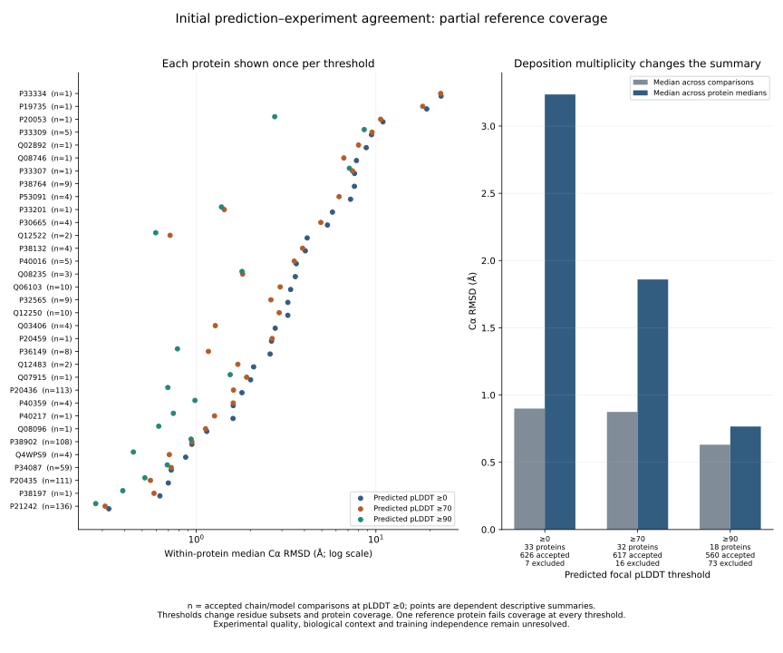
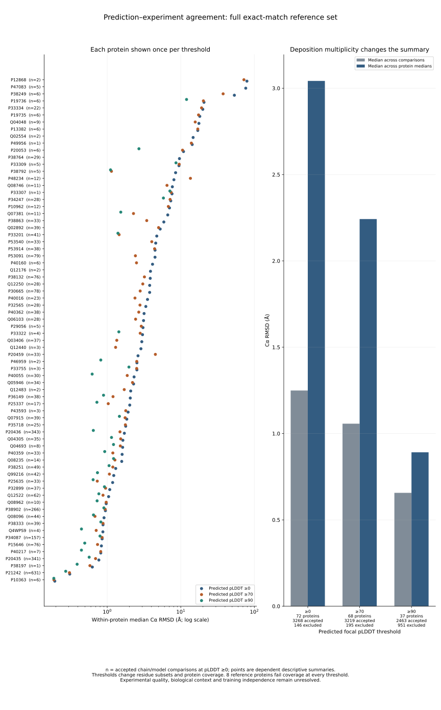
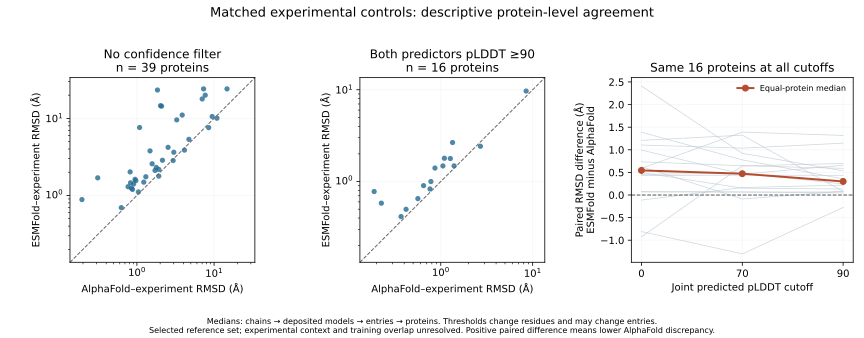

# Experimental structure benchmarking

Cross-predictor agreement cannot establish accuracy or remove shared
sequence-derived/training effects. Experimental references are therefore a
separate required benchmark, alongside predictor controls, confidence masking,
phylogenetic uncertainty and domain-orientation checks.

## Accession-linked candidate inventory

The first executable inventory queries all UniProt accessions associated with
the frozen 13,153 AlphaFold models, using the [RCSB Search API](https://search.rcsb.org/)
attribute `rcsb_polymer_entity_container_identifiers.reference_sequence_identifiers.database_accession`.
It requests `polymer_entity` identifiers, all hits and experimental content only,
in deterministic batches of 100. This scope includes the full frozen marker-model
inventory rather than only the 266 predictor controls. Response bodies, queries,
HTTP statuses, retrieval times and checksums are preserved. HTTP 204 is recorded
as a completed no-result query; failures remain failures and are retried at most
four times. Result counts and uniqueness are checked before accepting a batch.

```bash
python scripts/inventory_experimental_accession_matches.py \
  --mapping results/structural_markers/gdm-expanded-v1 \
  --output data/experimental_structures/accession-inventory-v1
```

Existing batch responses are reusable only with matching configuration, queries
and checksums. A single worker uses a quarter-second pause after successful new
requests; the resource plan allows 2 GB RAM, 2 GB output and 0.1–3 hours on the
existing host. This stage does not download atomic structures.

Initial sequence-service connectivity checks returned a server error for an
obsolete parameter and timed out with the current documented sequence parameter.
The accession search and an atomic mmCIF endpoint responded successfully, so the
inventory proceeds through accession links. The documented sequence API remains
a possible later route for homologs lacking these links; no sequence-search
coverage is claimed from those connectivity checks.

## Candidate-to-benchmark gates

Accession association is candidate nomination only. Each returned entity needs
its deposited sequence, source organism, construct boundaries, mutations,
experimental method/quality and observed-residue mapping checked against our
exact protein. Missing/unobserved residues and engineered fragments must remain
explicit. Atomic coordinates need immutable source receipts and chain/entity
identity checks; experimental B factors are not predicted pLDDT scores.

Comparisons must distinguish monomeric predictions from complexes, bound ligands,
interfaces and alternative conformations. Deposit/release dates and predictor
training/template overlap require explicit review: agreement with a training-era
structure is not an independent generalization benchmark. Absence of an accession
hit does not establish absence of experimental homologs. None of these gates is
satisfied solely by completion of the inventory.


## Completed inventory

All 13,153 distinct model-associated accessions were queried in 132 batches,
yielding 3,592 distinct experimental polymer-entity candidates. Every saved batch
receipt/response hash, hit count and the complete deduplicated ID union passed
readback. Receipts and the candidate identifier list are versioned; full API
responses remain outside Git. This is a candidate count, not the number of
matched proteins, independent experiments or validated benchmark structures.
RCSB entity metadata was verified accessible for the next sequence/construct
screen; that screen has not yet been executed across these candidates.


## Candidate metadata retrieval executing

The complete inventory resolves to 3,592 polymer entities across 1,635 PDB
entries. `retrieve_experimental_metadata.py` retrieves full entity and parent
entry records through the [RCSB Data API](https://data.rcsb.org/), preserving
sequences, construct/organism annotations, accession mappings and entry-level
experimental/date metadata for subsequent screening. Two workers make 5,227
requests before retries, with a quarter-second pause after each new successful
request. The resource plan allows 2 GB RAM/output and 0.2–4 hours.

Each HTTP 200 response must parse and report the exact requested `rcsb_id`.
Atomic response/receipt writes record URL, retrieval time, configuration and
SHA256. Restarted retrieval checks cached bytes and identities; a whole-stage
completion receipt is written only after every requested record succeeds. Raw
metadata remain outside Git under `data/experimental_structures/metadata-v1`.
The initial entity responses were verified; the full retrieval is still running.

```bash
python scripts/retrieve_experimental_metadata.py \
  --inventory data/experimental_structures/accession-inventory-v1 \
  --output data/experimental_structures/metadata-v1
```

This is acquisition, not a sequence-matching or experimental-quality result.
Deposited polymer sequences and observed atomic residues will be assessed
separately; a complete deposited sequence may still have missing coordinates.


## Frozen initial deposited-sequence screen

The first explicit partial screen freezes 666 verified entity responses while
retrieval continues (2,926 candidates pending). Its 666 accession-linked model
comparisons comprise 541 exact full canonical sequences, 66 exact uniquely
placed fragments, 45 requiring alignment/variant review, 12 containing the target
inside a longer construct, and two with noncanonical sequences. These counts
follow retrieval order; they do not estimate benchmark coverage across all taxa.
Repeated experimental entities for one protein are not independent protein
observations. Exact-full rows passed sequence-hash and length equality readback.

`screen_experimental_sequences.py` retains unique fragment offsets and detects
repeated-fragment ambiguity without arbitrary alignment selection. It preserves
reported mutation, artifact and nonstandard-monomer counts, including unknowns.
Longer constructs are not automatically called affinity tags. Four tests cover
full matches, unique/repeated fragments, constructs, substitutions and missing
or noncanonical sequences. All benchmark-eligibility fields remain pending.

```bash
python scripts/screen_experimental_sequences.py \
  --metadata data/experimental_structures/metadata-v1 \
  --output results/experimental_structures/sequence-screen-partial-v1 \
  --allow-partial
```

The receipt pins every included entity response receipt. New runs against the
expanding download require new output directories and may include more entities.
Without `--allow-partial`, complete metadata retrieval is required. Even an exact
canonical sequence may include chemically modified monomers or missing atomic
coordinates; sequence equality alone does not establish benchmark eligibility.


## Atomic-coordinate acquisition for exact-sequence candidates

The frozen partial sequence screen nominates 215 distinct PDB entries containing
541 exact full canonical-sequence entity/model matches (34 distinct model
proteins). Every nominated entry is included in coordinate acquisition, without
selecting entries by observed agreement with predictions. `retrieve_experimental_coordinates.py`
streams the compressed mmCIF files from the RCSB coordinate service, checks full
gzip readability/CRC and the leading mmCIF data-block identity, then records
URL, time, sizes and SHA256. Two tests verify identity checking, complete-stream
reading and rejection of a truncated archive. These checks do not validate
atomic records or residue correspondence.

```bash
python scripts/retrieve_experimental_coordinates.py \
  --screen results/experimental_structures/sequence-screen-partial-v1 \
  --output data/experimental_structures/coordinates-exact-partial-v1
```

The single-worker resource plan allows 2 GB RAM, 20 GB disk headroom and 0.5–8
hours, retaining complete complexes. All 215 archives completed integrity and data-block checks. The expected entry
universe, per-entry receipts and every compressed-file hash passed readback. Subsequent screens must account for
multiple models, chains, alternate locations, occupancy, unresolved residues,
chemical modifications and complex context. Exact canonical sequence is not
permission to treat every atom or entity as an eligible benchmark. The full
metadata inventory continues independently; these downloads reflect a frozen
partial candidate set, not complete experimental coverage of the project.


## Observed experimental CA correspondence executing

`map_experimental_ca_residues.py` parses all 215 downloaded entries and checks
each nominated entity's coordinate-file canonical sequence against the exact
model sequence hash. CA mapping uses mmCIF entity, model, label-chain and
[label sequence IDs](https://mmcif.wwpdb.org/dictionaries/mmcif_pdbx_v50.dic/Items/_atom_site.label_seq_id.html),
not author numbering. Every full-sequence position is emitted for each selected
chain and deposited model. Missing observations, multiple CA records,
nonstandard/mismatching monomers, invalid coordinates/occupancy and alternate or
partial-occupancy observations remain distinct. No arbitrary alternate-location
choice is made. Raw atom records retain author identifiers, insertions and B
factors; B factors are not pLDDT.

Two tests cover absent, duplicated, alternate/partial, modified, nonfinite and
zero-occupancy observations. Initial entries are producing both unambiguous and
missing-coordinate rows; the complete mapping is still running. Per-entry output
hashes and configuration checks support restartable processing without changing
already completed results. The resource plan allows one CPU, 8 GB RAM, 5 GB
output and 0.2–4 hours for 1.30 GB uncompressed input.

```bash
python scripts/map_experimental_ca_residues.py \
  --screen results/experimental_structures/sequence-screen-partial-v1 \
  --coordinates data/experimental_structures/coordinates-exact-partial-v1 \
  --output results/experimental_structures/ca-mapping-partial-v1
```

Unambiguous full-occupancy CA correspondence is not a complete experimental
quality criterion. Non-CA atoms, experimental method/resolution, refinement
validation, biological assemblies, ligands, alternate conformations and
prediction-training overlap still require assessment. This calculation does
not yet compare experimental and predicted coordinates.


## Full metadata and sequence screen completed

All 5,227 entity/entry metadata responses completed. Independent readback verified
every response/receipt hash, declared identity and the exact expected entity and
parent-entry universes. The complete sequence screen covers all 3,592 candidates:
2,850 exact full canonical sequences, 187 exact unique fragments, 485 requiring
alignment/variant review, 52 longer constructs and 18 noncanonical sequences.
The full matches represent 80 distinct predicted proteins across 1,036 PDB
entries. These repeated-entity counts do not imply independent protein controls.
The earlier 215-entry coordinate snapshot remains a subset; expansion and
quality screening of the full set are still required.

## Initial coordinate mapping completed and audited

All 215 entries completed CA correspondence mapping: 157,670 model/chain/position
rows, including 129,095 unambiguous full-occupancy CA positions, 28,405 without
CA observations, 78 with multiple CA records, 25 with nonstandard/mismatching
monomers and 67 with alternate or partial occupancy. Counts are repeated
observations across structures/chains/models, not distinct sequence positions.

The audit verified every exported position grid, reconstructed sequence hash,
embedded atom identity and count partition. It independently read original
mmCIF atom fields for 2,823 positions across five deterministically selected
entries. Raw atom fields for other entries were not independently reparsed.
This establishes the stated correspondence checks, not an experimental-quality
pass or a completed structural-accuracy comparison.

```bash
python scripts/audit_experimental_ca_mapping.py \
  --mapping results/experimental_structures/ca-mapping-partial-v1 \
  --screen results/experimental_structures/sequence-screen-partial-v1 \
  --coordinates data/experimental_structures/coordinates-exact-partial-v1 \
  --output results/experimental_structures/ca-audit-partial-v1
```


## Full reference metadata and coordinate expansion

The frozen `reference-metadata-v2` inventory joins all 2,850 exact sequence rows
(80 predicted proteins) to 1,036 verified entry responses. Every entry's method,
methodology and resolution fields passed an independent source-field readback.
The initial v1 inventory is retained outside Git; v2 explicitly adds methodology.

The search's experimental-content filter also returned four entries whose entry
metadata classify them as **integrative**: 8ZZ2, 9A15, 9A16 and 9A17. These remain
in the accession/sequence inventory but are deferred from the experimental
coordinate benchmark. RCSB describes [8ZZ2](https://www.rcsb.org/structure/8ZZ2)
as an integrative structure; experimental restraints do not make all coordinates
independent experimental observations. This correction applies to the full
inventory interpretation, not to sequence correspondence.

The 1,032 remaining entries comprise 583 electron-microscopy, 448 X-ray and one
solution-NMR structure. Full source method-specific geometry, map, refinement,
starting-model and date fields are preserved in a hash-tracked JSON artifact.
Missing fields remain unknown. Entry metrics cannot establish target-chain
quality; release dates alone cannot prove training independence. All 1,036
entries are classified as heteromeric protein (477), protein/NA (555), or
homomeric protein (4), so complex and conformational context require review.

Coordinate expansion is running with one streaming worker, 2 GB memory planning
and 20 GB disk headroom, with a broad 0.5–8 hour forecast on the existing host.
It reuses 215 prior archives after checking collection/configuration/entry
receipts, checksums, gzip integrity and entry identity; 817 downloads remain in
the full requested universe. No new paid services are involved. The new output
is `data/experimental_structures/coordinates-exact-full-v1`.

Reproduce the metadata stage with:

```bash
python scripts/summarize_experimental_reference_metadata.py --screen results/experimental_structures/sequence-screen-full-v1 --metadata data/experimental_structures/metadata-v1 --output results/experimental_structures/reference-metadata-v2
python scripts/retrieve_experimental_coordinates.py --screen results/experimental_structures/sequence-screen-full-v1 --reference-metadata results/experimental_structures/reference-metadata-v2 --reuse data/experimental_structures/coordinates-exact-partial-v1 --output data/experimental_structures/coordinates-exact-full-v1
```

Use new output paths to regenerate immutable metadata. The downloader resumes
only with identical pinned configuration. Tests cover archive identity and
truncation, verified reuse without network access, integrative deferral, and
rejection of a tampered source archive. Three tests passed. Quality review,
expanded residue mapping and direct prediction comparisons remain pending.


## Initial direct prediction–experiment agreement

`compare_experimental_predictions.py` completed comparisons against all 215
entries in the original audited CA snapshot: 633 unique target/chain/deposited
model combinations, each evaluated at predicted focal pLDDT 0, 70 and 90.
Experimental CA must be unambiguous and full occupancy; at least 50 matched
positions and half the complete canonical sequence are required. All deposited
models and chains are retained, with no choice based on prediction agreement.
Experimental B factors are never interpreted as prediction confidence. This
stage does not apply a six-residue context or PAE filter.

There are 1,803 accepted and 96 excluded threshold rows. All 1,803 accepted
comparisons passed a second geometry calculation using SciPy rotation and
condensed distances, independent of the production geometry helper, at 1e-8
relative/absolute tolerance. Predicted CA sequence hashes and coordinate files,
experimental complete sequence grids and mapping receipts were verified.

| Predicted pLDDT | Accepted comparisons | Proteins | Entries | Comparison-weighted median RMSD (Å) | Median of protein medians (Å) |
| --- | ---: | ---: | ---: | ---: | ---: |
| 0 | 626 | 33 | 214 | 0.900 | 3.235 |
| 70 | 617 | 32 | 214 | 0.874 | 1.860 |
| 90 | 560 | 18 | 206 | 0.631 | 0.766 |

The difference between weighting schemes is substantial. Per-protein summaries
limit the influence of proteins with many deposited structures; neither summary
makes the retrieval-order partial reference subset representative of fungi.
Within each protein, its chain/model observations still receive equal weight.

Matched-cohort summaries retain identical target/chain/model combinations at
baseline and the higher threshold. For the 617 comparisons accepted at pLDDT 70,
median RMSD is 0.892 Å before filtering and 0.874 Å after. For the 560 accepted at
90, the corresponding values are 0.827 and 0.631 Å. These compare different
residue subsets of the same chains and do not establish a causal improvement.
The full 1,899-row threshold grid and coverage eligibility passed readback.

```bash
OPENBLAS_NUM_THREADS=1 OMP_NUM_THREADS=1 python scripts/compare_experimental_predictions.py --mapping results/experimental_structures/ca-mapping-partial-v1 --screen results/experimental_structures/sequence-screen-partial-v1 --predictions results/structural_markers/gdm-expanded-v1 --references results/experimental_structures/reference-metadata-v2 --output results/experimental_structures/prediction-agreement-partial-v1
python scripts/summarize_experimental_agreement.py --comparisons results/experimental_structures/prediction-agreement-partial-v1 --output results/experimental_structures/prediction-agreement-summary-partial-v1
```

Resource planning reserved one CPU thread, 8 GB memory and 1 GB output with a
0.05–2 hour estimate. No new services were used. Experimental quality, local
reliability, complex/conformational context, refinement starting models and
training/template overlap remain unresolved. These are descriptive agreement
measurements, not an unbiased accuracy benchmark or evolutionary distances.

The idle CA mapper now honors explicit excluded entries pinned in the coordinate
retrieval configuration, permitting the full experimental-only expansion while
retaining its four integrative deferrals. Unknown deferrals and mismatched entry
universes are rejected. The two existing CA classification tests still pass.


## Full coordinate retrieval completed and taxon coverage assessed

All 1,032 experimental coordinate archives are complete: 215 verified reused
archives and 817 new downloads, totaling 1,952,380,079 compressed bytes and
8,484,682,674 bytes after decompression. Independent readback checked every
archive checksum, entry receipt, configured entry universe and reuse count.
The producer also streamed full gzip validation. Full CA mapping is now running
in `results/experimental_structures/ca-mapping-full-v1`, retaining all deposited
models, chains, missing positions and ambiguous observations. Planning reserves
one CPU worker, 8 GB memory and 10 GB output with a broad 0.5–8 hour forecast.

```bash
python scripts/map_experimental_ca_residues.py --screen results/experimental_structures/sequence-screen-full-v1 --coordinates data/experimental_structures/coordinates-exact-full-v1 --output results/experimental_structures/ca-mapping-full-v1
```

Reference coverage is concentrated. The 80 exact-sequence candidate proteins
project to 98 marker/taxon links among **nine project taxa, all Ascomycota**.
The remaining 517 analysis taxa have no exact-sequence link in this snapshot.
Saccharomyces cerevisiae accounts for 78 proteins and 1,021 candidate entries;
Aspergillus fumigatus and Schizosaccharomyces pombe each account for one protein.
The six other covered taxa are Saccharomyces entries, including the two curated
hybrids, linked through identical protein sequences. These nine taxa are not
nine independent experimental sources or nine verified unique species.

The coverage table preserves all 526 analysis taxa and their zero-coverage rows.
Taxon, protein and marker counts were independently read back against the 98
exact-sequence links. Deposited organism identity is not inferred from target
sequence identity. No absence of experimental homologs is implied by absence
from this accession-based exact-match inventory. Experimental benchmarks cannot
currently support broad fungal-lineage generalization without further coverage.

```bash
python scripts/summarize_experimental_taxon_coverage.py --references results/experimental_structures/reference-metadata-v2 --snapshot results/structural_markers/gdm-expanded-v1 --output results/experimental_structures/taxon-coverage-v2
```

An unpublished initial coverage calculation used the draft manifest and mutated
a zero-coverage dictionary while rendering, inflating its covered-taxon total.
It is explicitly marked `INVALIDATED.json` in its local output. The published v2
uses the frozen 526-entry analysis manifest and checks coverage against nonzero
rows and distinct links; no v1 numbers are used downstream.


## Starting-model dependencies and prediction chronology

Reviewed all 1,032 experimental entries against their frozen method-specific
metadata. Two entries explicitly list AlphaFold starting models (8RAM, 8RAP),
five list other computational models (4L9P, 4MBG: PHYRE; 9E2W, 9E2X, 9E2Y:
unspecified Other), 548 report only experimental starting models, and 477 lack
starting-model annotations. The raw lists are preserved alongside review flags.
These are entry-level annotations and cannot yet be attributed to the exact
matched target chains. Missing annotations are not evidence that no prediction
was used, and experimental starting models can have their own dependencies.
The authoritative source fields are the frozen RCSB entry responses and
`pdbx_initial_refinement_model` records, including the entry response for
[8RAM](https://data.rcsb.org/rest/v1/core/entry/8RAM).

The experimental-only exact sequence inventory contains 2,843 entity/model rows
(the full inventory also includes seven rows in four integrative entries).
Of these, 2,315 entries were initially released before the linked prediction's
recorded creation date and 528 after it. Dates are stored for each link.
Prediction creation dates are not training or template cutoffs. Later releases
do not establish absence of earlier homologs, sequences, alternate structures,
or related templates. Every reference retains unresolved training independence.

All 1,032 source starting-model lists and the ordering of all 2,843 date pairs
passed readback, along with exact identities of the seven flagged entries.
This review adds concrete dependency evidence; it does not complete chain-level
methods review or establish an independent accuracy test. The current partial
geometry results remain descriptive and should consume these flags during
subsequent benchmark selection and sensitivity analyses.

```bash
python scripts/review_experimental_model_provenance.py --references results/experimental_structures/reference-metadata-v2 --predictions results/structural_markers/gdm-expanded-v1 --output results/experimental_structures/model-provenance-review-v1
```


## ESMFold controls for the experimental reference set

Prepared all 80 experimental-reference sequences for comparison against the
existing local ESMFold configuration. Forty-five canonical full proteins are
at most 512 residues and absent from all four prior immutable queues; the other
35 exceed the current length limit and are explicitly deferred without
truncation. No candidate was chosen by prediction agreement, resolution or
phenotype. All emitted sequence hashes, length/alphabet bounds and disjointness
from original, follow-on, predictor-control and ecology queues passed readback.

Observed timings from 6,666 completed original-run prediction receipts yield
0.078 GPU hours at within-length-bin medians, 0.056–0.106 hours using observed
10th–90th percentile timings, and a planning allowance of 0.158 hours (about
9.5 minutes) after 50% overhead on the upper projection. These are planning
scenarios, not statistical uncertainty intervals. Reserve 24 GB VRAM and 20 GB
disk headroom on the existing host; no new paid services are used.

The experimental-control controller is now waiting for original GPU1 process
691140 with its pinned process start time to finish. It requires that run's
matching configuration and clean completion receipt, zero remaining eligible
sequences, no interruption or OOM, and an idle GPU before launching the 45-control
queue. Inputs, checkpoint, producer and resource receipt are pinned. A launch
receipt prevents duplicate scheduling; failures require explicit review. This
uses a separate copy of the currently live ecology controller with purpose
labels changed; its control logic is identical and the two existing completion/
process-identity tests pass. The live ecology controller remains unchanged.

```bash
python scripts/prepare_experimental_prediction_controls.py --output data/prediction_inputs/experimental-controls-v1
python scripts/advance_experimental_control_predictions.py --config metadata/experimental_control_prediction_controller_config.json
```

The controller completed all 45 predictions without interruption, OOM or
remaining eligible sequences. Output is
`results/predictions/esmfold-experimental-controls-v1`. The independent artifact
audit now passes for every PDB/NPZ pair, sequence, numbering, confidence and PAE
array. Its reference-specific summary preserves 2,165 PDB entity links across
970 entries rather than assigning invented marker/taxon identifiers. These
links are not independent biological replicates. A separate audit entry point
retains the same model checks as the marker auditor, which remains pinned by
live prediction controllers and was not modified.

All 45 models were converted to sequence-explicit mmCIF without relaxation or
coordinate fitting. Atom fields and canonical sequence passed the converter's
roundtrip checks. Snapshot: results/structures/esmfold-experimental-controls-v1.
Audit and conversion receipts are metadata/experimental_control_prediction_audit_receipt.json
and metadata/experimental_control_conversion_receipt.json. Commands:

```bash
python scripts/audit_reference_control_predictions.py --predictions results/predictions/esmfold-experimental-controls-v1 --inputs data/prediction_inputs/experimental-controls-v1 --links data/prediction_inputs/experimental-controls-v1/experimental_reference_links.tsv --output results/predictions/experimental-controls-audit-v1
python scripts/convert_esmfold_snapshot.py --predictions results/predictions/esmfold-experimental-controls-v1 --audit results/predictions/experimental-controls-audit-v1 --output results/structures/esmfold-experimental-controls-v1
```

Matched AlphaFold/ESMFold/experimental comparisons remain pending; these new
ESMFold identifiers require explicit sequence-based correspondence to the
existing experimental mapping. The 35 longer input sequences remain deferred.

The explicit predictor crosswalk has now completed. All 45 audited ESMFold
sequences match 45 AlphaFold models exactly, with canonical sequences reread
from all 90 coordinate files. Their 2,165 original reference links span 970
entries, and every link has an existing experimental CA mapping. The join checks
the original exact-sequence screen, reference metadata, model hashes, entity
identity and complete control coverage; no prediction-agreement filtering is
applied. Table and source provenance:
results/experimental_structures/predictor-controls-crosswalk-v1, with archived
receipt metadata/experimental_predictor_crosswalk_receipt.json.

```bash
python scripts/prepare_experimental_predictor_crosswalk.py --controls results/structures/esmfold-experimental-controls-v1 --control-audit results/predictions/experimental-controls-audit-v1 --predictions results/structural_markers/gdm-expanded-v1 --screen results/experimental_structures/sequence-screen-full-v1 --references results/experimental_structures/reference-metadata-v2 --mapping results/experimental_structures/ca-mapping-full-v1 --output results/experimental_structures/predictor-controls-crosswalk-v1
```

Three-way coordinate comparisons still require common residue masks and
protein-level summaries that retain repeated experimental chains/models without
treating them as independent proteins. The crosswalk establishes sequence
identity, not unbiased accuracy or experimental/training independence.

The three-way matched geometry calculation is now running over that complete
45-sequence crosswalk. Each experimental chain and deposited model is retained.
For confidence thresholds 0, 70 and 90, a residue is eligible only when its
experimental CA is unambiguous/full-occupancy and both predictors meet the
threshold. All three geometry comparisons use exactly these same residues;
coverage requires at least 50 residues and half the canonical sequence.
Local-distance comparisons also share a single pair set: sequence separation
at least three and distance at most 15 Angstrom in any of AF, ESMFold or the
experimental structure. This differs from using a separate neighborhood set
for each predictor. Selected residue positions and exclusions are retained.

Each of the three CA superpositions is recomputed using a separate SciPy
rotation calculation. Full independent residue-mask/local-distance readback
and protein-level summaries remain pending. Missing chain grids are recorded
explicitly, rather than treating entry-level mapping availability as proof of
usable coordinates for every entity. Planning allowance: one core, 4 GiB memory,
2 GiB disk, 0.1–4 hours; no GPU inference or new charges.

```bash
OPENBLAS_NUM_THREADS=1 OMP_NUM_THREADS=1 MKL_NUM_THREADS=1 taskset -c 28 python scripts/compare_experimental_predictor_controls.py --crosswalk results/experimental_structures/predictor-controls-crosswalk-v1 --mapping results/experimental_structures/ca-mapping-full-v1 --references results/experimental_structures/reference-metadata-v2 --output results/experimental_structures/predictor-controls-geometry-v1
```

Resource/source pins and live identity are
metadata/experimental_predictor_control_geometry_{plan,launch}.json. Results
remain conditional descriptive agreement, not independent accuracy or inherited
structural change; repeated experimental structures are not independent proteins.

Three-way geometry execution completed: all 2,165 reference links have usable
chain grids, giving 2,601 chain/deposited-model grids and 7,803 threshold rows.
There are 6,017 accepted rows and 1,786 explicit coverage exclusions. All 18,051
superpositions were recalculated during execution. Completion receipt:
metadata/experimental_predictor_control_geometry_receipt.json.

A complete independent readback is now running over accepted and excluded rows.
It reconstructs the entire source grid, joint-confidence residue masks and
coverage decisions, then checks all common pair counts, RMSDs and local-distance
statistics using full SciPy cdist matrices and Bio.SVDSuperimposer. Prediction
sequence/numbering is checked through a separate structure parser; decimal
coordinates are retained in float64 to avoid float32 rounding at the 15-A cutoff.
The audit also checks reference metadata and missing-link accounting. No
protein-level predictor comparison is interpreted before this audit completes.
Runner: scripts/audit_experimental_predictor_controls.py. Plan/live identity:
metadata/experimental_predictor_control_geometry_readback_{plan,launch}.json.

The complete readback subsequently passed all 7,803 residue masks, 6,017 common
distance-pair masks and 18,051 superpositions, including every local-distance
summary and exclusion decision. No reference link lacked a chain grid. Receipt:
metadata/experimental_predictor_control_geometry_readback.json. Protein-level
aggregation and experimental/context qualification remain outstanding.
Alternate prediction does not establish experimental or training independence,
and this reference set remains taxonomically narrow.


## Diagnostic figure: per-protein agreement and reference attrition



The figure shows every protein with accepted baseline coverage, sorted by its
median CA RMSD, with its baseline number of chain/model comparisons. Missing
higher-threshold points indicate failed coverage, not zero deviation. The
right panel compares the median across all observations with the median across
within-protein medians. Coverage declines from 33 proteins at baseline to 32 at
pLDDT 70 and 18 at pLDDT 90. One of the 34 reference proteins has no eligible
chain/model comparison even at baseline. All threshold row counts and plotted
protein medians were recomputed directly from comparison tables.

These are dependent, partial-snapshot descriptive measurements. Different
thresholds change residues and sometimes the available chain/model and protein
cohorts; fixed-cohort summaries are separately provided above. No visual trend
establishes prediction accuracy or inherited structural change. Experimental
quality, complex context and training independence still require review.

```bash
python scripts/plot_experimental_agreement.py --comparisons results/experimental_structures/prediction-agreement-partial-v1 --summary results/experimental_structures/prediction-agreement-summary-partial-v1 --output results/experimental_structures/prediction-agreement-figure-partial-v1
```

SVG, PNG and PDF exports and a hash receipt are retained in the immutable figure
output. The SVG is published in the repository; the rendered PNG was visually
inspected for readable labels, unclipped axes/legend and correct missing-point
representation.

## Full experimental CA mapping completed and audited

All 1,032 experimental entries completed mapping, retaining 1,306,701 complete
sequence-position records across deposited models and selected chains:

| CA correspondence class | Position records |
| --- | ---: |
| Unambiguous, full occupancy | 1,008,964 |
| No CA observation | 297,499 |
| Multiple CA records | 107 |
| Nonstandard or mismatching monomer | 57 |
| Alternate location or partial occupancy | 73 |
| Invalid coordinates or occupancy | 1 |

Every exported sequence grid, sequence hash, embedded atom identity and count
partition passed full readback. The 1,009,309 embedded atom records include
multiple/alternate observations; their count is not the accepted-residue count.
Independent raw mmCIF field readback covered 2,842 position rows in five
identity-hash-selected entries (7KEE, 3NZX, 7E8S, 5N5Y, 7E93), not every raw
source file. The one invalid-occupancy record was additionally checked directly
in 5LQW: entity 14, model 1, label chain N, residue 640 has occupancy 0.00.
Its coordinates are finite, but it is excluded as an observed CA by policy;
this is not a claim of corrupted deposition.

```bash
python scripts/audit_experimental_ca_mapping.py --mapping results/experimental_structures/ca-mapping-full-v1 --screen results/experimental_structures/sequence-screen-full-v1 --coordinates data/experimental_structures/coordinates-exact-full-v1 --output results/experimental_structures/ca-audit-full-v1
```

The full prediction–experiment comparison completed against this audited
mapping, using the same fixed protocol as the original partial comparison:
retain all chains/models; predicted focal pLDDT 0/70/90; at least 50 matched CA
and half the full canonical sequence; independently recompute every accepted
geometry with the second rotation/distance implementation. Resource planning
reserves one CPU thread, 8 GB memory and 5 GB output with a 0.1–4 hour forecast
on the existing host. Experimental quality, target-chain context and training
independence remain unresolved; source coverage is still concentrated in the
same nine Ascomycota project taxa.

```bash
OPENBLAS_NUM_THREADS=1 OMP_NUM_THREADS=1 python scripts/compare_experimental_predictions.py --mapping results/experimental_structures/ca-mapping-full-v1 --screen results/experimental_structures/sequence-screen-full-v1 --predictions results/structural_markers/gdm-expanded-v1 --references results/experimental_structures/reference-metadata-v2 --output results/experimental_structures/prediction-agreement-full-v1
```


### Full reference agreement completed

All 8,950 accepted calculations passed independent numerical recalculation;
1,292 threshold-specific comparisons were excluded. The complete grid contains
3,414 chain/model/target combinations at three thresholds (10,242 rows).

| Predicted focal pLDDT | Accepted / excluded | Proteins | Comparison median RMSD Å | Median of protein medians Å |
| --- | ---: | ---: | ---: | ---: |
| 0 | 3,268 / 146 | 72 | 1.2493 | 3.0423 |
| 70 | 3,219 / 195 | 68 | 1.0571 | 2.2422 |
| 90 | 2,463 / 951 | 37 | 0.6566 | 0.8914 |

Eight of the 80 reference proteins never pass coverage. Keeping the chain/model
cohort fixed gives baseline→filtered medians of 1.2212→1.0571 Å for threshold
70 and 0.9221→0.6566 Å for threshold 90. Residue subsets still change. Neither
comparison weighting nor equal-protein weighting establishes representative,
independent accuracy estimates. Taxonomic coverage, experimental context and
training/template independence remain limitations.

The full comparison receipt retains the original generic “partial reference
sampling” wording: retrieval of the selected exact-match set is complete, while
coverage of the broader fungal project is limited. Summary v1 also inherited
partial-snapshot wording; v2 corrects that description and reproduces identical
numeric tables. Original results remain immutable.

```bash
python scripts/summarize_experimental_agreement.py --comparisons results/experimental_structures/prediction-agreement-full-v1 --output results/experimental_structures/prediction-agreement-summary-full-v2
python scripts/plot_experimental_agreement.py --comparisons results/experimental_structures/prediction-agreement-full-v1 --summary results/experimental_structures/prediction-agreement-summary-full-v2 --output results/experimental_structures/prediction-agreement-figure-full-v1 --title 'Prediction–experiment agreement: full exact-match reference set'
```



Every plotted protein median/count was recalculated from comparison rows; the
rendered PNG was visually inspected. Figure dimensions and exclusion counts now
adapt to the actual input dataset. The partial figure remains available.


## Protein-balanced matched predictor controls

The 45 predicted control sequences now have completed hierarchical summaries.
Each metric uses the median across chains within a deposited model, then across
models within an entry, then across entries for the same canonical protein.
Cohort summaries weight proteins equally. Paired differences are calculated
within each original chain comparison before aggregation; they are not the
difference between two independently aggregated medians.

| Joint focal pLDDT cutoff | Eligible proteins / 45 | Median paired RMSD difference, ESMFold minus AlphaFold (Å) | Proteins with positive difference |
| --- | ---: | ---: | ---: |
| 0 | 39 | 0.6154 | 34 |
| 70 | 36 | 0.4688 | 34 |
| 90 | 16 | 0.2995 | 15 |

Positive differences mean lower AlphaFold discrepancy from experiment in this
selected set. Six proteins never meet coverage eligibility. Among the same 16
proteins eligible at every cutoff, median paired differences are 0.5435,
0.4711 and 0.2995 Å, respectively. Their residues and sometimes contributing
entries still change across cutoffs. These descriptive results do not establish
an unbiased accuracy ranking or a causal effect of confidence filtering.
Taxonomic representation, training/template overlap and experimental context
remain unresolved; the 35 longer reference sequences remain unpredicted in
this control cohort.

An independent pandas aggregation checked all 125,515 hierarchical metric
values, 216 cohort quantiles and the paired-difference sign counts. This check
does not independently validate every contributing-unit or disposition count.
The figure was visually reviewed for readable labels and clipping, and every
summary and figure artifact checksum was reverified. Small protein, disposition
and cohort tables, summary/figure receipts and the numerical readback are
archived under metadata/experimental_predictor_control_*. Larger model- and
entry-level tables remain in results/experimental_structures/predictor-controls-summary-v1.

```bash
OPENBLAS_NUM_THREADS=1 python scripts/summarize_experimental_predictor_controls.py --comparisons results/experimental_structures/predictor-controls-geometry-v1 --audit metadata/experimental_predictor_control_geometry_readback.json --crosswalk results/experimental_structures/predictor-controls-crosswalk-v1 --output results/experimental_structures/predictor-controls-summary-v1
OPENBLAS_NUM_THREADS=1 python scripts/plot_experimental_predictor_controls.py --summary results/experimental_structures/predictor-controls-summary-v1 --audit metadata/experimental_predictor_control_summary_readback.json --output results/experimental_structures/predictor-controls-figure-v1
```

Commands require fresh output directories; retain existing immutable results.




## Longer experimental-control tier on GPU1

On September 16, the idle second RTX 6000 Ada was assigned 12 previously
length-deferred experimental controls, 513–741 residues (7,097 total residues,
251 experimental entity links). Independent FASTA readback confirmed exact
sequence hashes, full lengths and disjointness from every other current
candidate queue, including the live GPU0 5,510-sequence queue. All remaining
23 reference sequences are retained as deferred in the disposition table;
lengths above 768 require further memory planning. This is the next production
tier, with unchanged ESMFold settings and no sequence truncation.

The plan reserves four physical CPU cores (80,82,84,86), enforces a 64-GiB
host-memory cgroup limit, requires 64 GiB available memory and 5 GiB free disk,
and estimates 0.1–2 hours including startup, audit and conversion. The estimate
uses observed 22–50-second predictions at similar lengths on GPU0; it is not a
completion guarantee. GPU1 runs continuously at its existing 300-W default/max
power limit; GPU0's temporary 90/10-second schedule remains active. No paid
infrastructure or DGX Spark resources are used.

The user systemd service fungal-experimental-controls-long-20260916.service
runs the pinned plan. It requires all 12 predictions to finish without OOM or
interruption before the independent PDB/NPZ/PAE audit and exact mmCIF conversion.
Any failure preserves outputs for review, without automatic restart or partial
completion claims. Source scripts remain unchanged while the service is live.
The transient service does not survive a host reboot; saved predictions require
review before resuming with the existing prediction runner.

```bash
python scripts/prepare_long_experimental_controls.py --output data/prediction_inputs/experimental-controls-513-768-v1 --max-length 768
python scripts/run_experimental_control_tier.py --plan metadata/experimental_control_long_tier_plan.json
```

Preparation and staged execution require fresh output directories. Input
receipt, disposition, resource plan and verified live launch identities are
versioned as metadata/experimental_control_long_tier_*. The execution status is
results/experimental_control_long_tier_execution.json; logs are available with
`journalctl --user -u fungal-experimental-controls-long-20260916.service`.
These predictions are not yet added to the reviewed 45-control comparison;
that integration requires the completion audit and a new immutable crosswalk.


### Next control tier scheduled

The same GPU has a pinned handoff for another 20 controls, 788–1,063 residues
(18,673 total residues, 388 reference entity links). An independent FASTA
readback checked all full sequence identities and confirmed disjointness from
every other current candidate queue. The immutable queue ceiling is 1,152;
no selected protein exceeds 1,063. Three original controls remain above it:
1,361, 1,468 and 2,413 residues. They are not omitted from the project target.

The memory estimate uses the largest observed allocated-memory measurement at
768 residues (11.736 GiB) from 2,579 completed longer-marker receipts. Scaling
the entire peak by the squared length ratio gives 22.484 GiB at 1,063 residues;
adding 30 percent plus 4 GiB gives a 33.230-GiB planning allowance within the
48-GiB GPU. This extrapolation is not a measured peak or a guarantee: reserved
memory, workspace and kernel behavior may differ. The existing runner records
and stops on the first OOM. Host memory remains capped at 64 GiB, with four
physical CPU cores, 5 GiB free-disk gate and a 0.25–4-hour planning range.

The new user service fungal-experimental-controls-next-20260916.service waits
for the exact predecessor PID/create-time identity to terminate, then requires
its successful prediction/audit/conversion receipt and matching plan hash.
Only then does it invoke the next tier's pinned plan, which independently
requires an idle GPU and fresh output directories. Changed sources or failed
predecessor execution stop the handoff for review. The controller is live and
waiting; these 20 predictions are not yet claimed complete. Like the first
service, this transient handoff does not survive a reboot.

```bash
python scripts/prepare_long_experimental_controls.py --output data/prediction_inputs/experimental-controls-769-1152-v1 --max-length 1152
python scripts/advance_experimental_control_tier.py --config metadata/experimental_control_next_tier_handoff_config.json
```

Memory anchor provenance, resource plan, input receipt, all-35 disposition,
handoff configuration and live controller identity are versioned under
metadata/experimental_control_next_tier_*. Live state is recorded in
results/experimental_control_next_tier_handoff.json and, once started,
results/experimental_control_next_tier_execution.json. Existing 12-control
prediction scripts and configuration were not changed.


The 12-control length tier subsequently completed all predictions, independent
artifact readback and mmCIF conversion without OOM or interruption. It covers
130 experimental entries and 251 entity links; median inference time was
27.94 seconds, maximum 52.90 seconds. All receipt artifact checksums were
reverified before archiving the audit and conversion receipts as
metadata/experimental_control_long_tier_{audit,conversion}_receipt.json.
The next 20-control tier started automatically and has produced its first
prediction. Integration with the existing three-way comparison is still pending.


## Matched geometry for the 12 longer controls

The next length tier now has a completed exact-sequence crosswalk (12 ESMFold
and 12 AlphaFold coordinate sequences re-read, 251 entity links, 130 entries).
All 253 deposited chain/model grids were evaluated at the same three joint
confidence cutoffs. Of 759 rows, 387 meet the minimum 50-residue/half-sequence
coverage criteria and 372 are explicitly excluded. The independent audit
reconstructed every residue mask, every accepted common pair mask and all
1,161 superpositions, with no missing chain grids.

Protein-balanced summaries use the same nested chain/model/entry medians as the
45 shorter controls. Independent pandas aggregation checked 10,296 metric
values, 216 quantiles, cohort sizes and paired-difference sign counts; disposition
counts were not independently recomputed in that summary check.

| Joint pLDDT cutoff | Eligible proteins / 12 | Median paired ESMFold-minus-AlphaFold experimental RMSD (Å) | Positive differences |
| --- | ---: | ---: | ---: |
| 0 | 12 | 5.5277 | 10 |
| 70 | 9 | 4.1645 | 7 |
| 90 | 1 | 20.8987 | 1 |

The very small high-confidence cohort must not be presented as a representative
accuracy estimate. Only one protein qualifies at every threshold; neither its
large RMSD nor the larger median in this length tier establishes a length
effect or biological novelty. Domain orientation, experimental conformation,
construct context and local geometry need targeted review. Focal pLDDT does
not resolve relative domain orientation, and these controls still do not prove
training independence. Both predictors always use identical residue and local
pair masks within each comparison.

Commands and pins for crosswalk→geometry→independent audit→summary are recorded
in metadata/experimental_control_long_geometry_plan.json (one CPU, 4-GiB
memory allowance, 2-GiB output and 0.02–2-hour planning range). Results are in
results/experimental_structures/predictor-controls-{crosswalk,geometry,summary}-513-768-v1.
Receipts, small protein/cohort/disposition tables and readbacks are versioned
under metadata/experimental_control_long_*. This length tier is kept explicit;
a combined summary and remaining longer controls are still pending.
