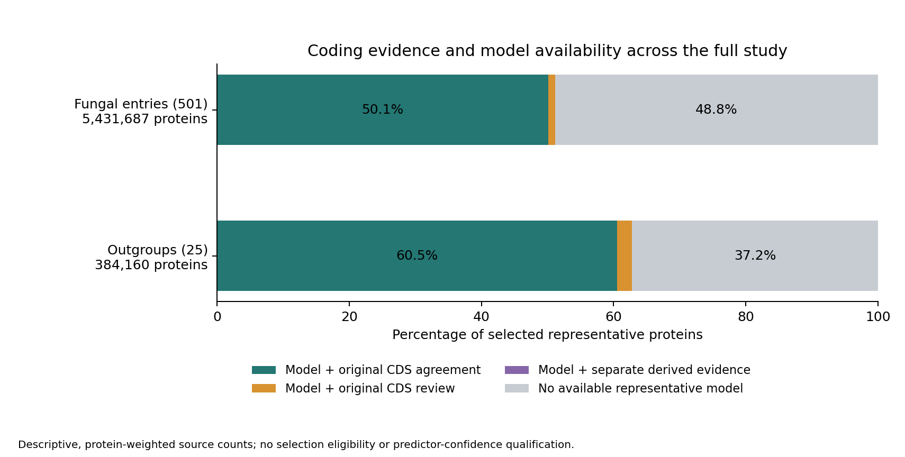

# Full coding-sequence and structure source linkage

The full source join connects the completed genome-to-CDS comparison to
inherited translation audits and the refreshed AFDB/ESMFold availability atlas.
It covers all **501 fungal entries and 25 outgroups**, all **5,927,745 original
protein products**, **5,815,847 selected representatives** and **5,923,039
original CDS targets**. The 111,898 alternative products remain in scope.
This supplies the source-level input needed for family codon alignments and
mapping selection tests to structures; selection inference remains pending.

## Status and resources

The producer started at **October 6, 00:19 UTC** under four CPU workers,
64 GiB RAM, no swap, a 56 GiB per-process address-space limit and one BLAS
thread. The source plan was frozen before launch with 2,151 bindings and
7,209,842,758 input bytes. The 0.5–12 hour runtime and 0.5–16 GiB output
allowances are uncalibrated planning estimates; seven-day safety caps are
not an ETA. No GPU prediction, paid infrastructure or new translation runs.

The producer completed at **00:23 UTC**, covering every entry and product.
Its actual original API session 21137 exited zero; native completion, whole
wrapper payloads, invocation start/end and 3,213 source/output bindings close.
The full independent reader launched only after this closure, using the same
four-CPU/64 GiB/no-swap bounds and a separate output namespace. Actual original
session 40401 exited zero after replaying all 526 entries, every original
target/product and the complete availability TSV. Its whole wrapper payloads,
invocation start/end and all source/output bindings close. The final handoff,
completed at **00:29 UTC**, merges **3,227 bindings** and publishes all 526
taxon disposition rows. Producer runtime was 4 minutes 6 seconds; reader
runtime was 3 minutes 3 seconds. These measured durations apply to this source
join and replay, not subsequent codon or evolutionary analyses.

Both paths verify **2,952,711 representatives with both an available model
and a single original CDS target showing genomic and inherited strict-translation
agreement**. Another 66,837 modeled representatives retain original-target
review, and 121 have only separate derived translation evidence. These are
source classifications, not admitted codon-selection datasets. Full source
availability remains 3,019,669 modeled representatives; no new model is inferred.

## Evidence kept separate

For the 519 NCBI-backed entries, original publisher CDS targets join through
exact versioned protein identifiers to the earlier strict-translation audit.
Original CDS headers, genetic-code values and their provenance, annotation
flags, terminal-stop outcomes and source-record ordinals remain attached.
The earlier audit has 5,752,457 exact translations, 2,491 mismatches, 85,683
non-triplet targets, 2,715 annotation exceptions, 3,988 missing or ambiguous
protein identifiers and two multiply linked CDS records. Missing explicit
codes carry the original table-1 assumption; exact translation does not
resolve that assumption or establish a complete gene. The earlier readback
checked all identities and classifications, but did not independently
retranslate every nonmarker CDS. This join also does not retranslate them.

For four publisher outgroups, the 59,116 original CDS translations and the
59,116 annotation-boundary codon projections are distinct evidence sources.
The strict audit has 41,592 exact translations, 17,399 non-triplet records
and 125 mismatches. Exact complete-codon projections retain recorded initial
phase and terminal-remainder handling; they never replace original targets
or erase their strict classifications. Both share the source-genome dependency.

Creolimax has no qualified original publisher CDS target in the full genomic
comparison. Its separate annotation-derived extraction retains 8,558 exact
translations and 136 exceptions across 8,694 products. It does not turn
missing original CDS evidence into an original-target agreement.

The two sanchytrid sets retain their dependent genome-derived ORF targets and
the earlier table-1 translation audit. These are not an independent publisher
validation or a resolved gene/isoform model; the excluded out-of-bounds ORF
product remains explicit.

## Classification and model availability

Each original target records its genomic comparison, inherited translation,
matching candidate indices, sequence hash and source length. Each product
retains every linked target, original gene mapping, representative decision,
candidate count and missing-target reason. Four product classifications are
reported without granting biological eligibility:

| Source classification | Meaning |
| --- | --- |
| Original exact agreement | Exactly one original target has a single unmodified genomic match and inherited strict exact translation. |
| Original target review | Original target evidence exists but the exact agreement conditions fail, including multiple targets. |
| Separate derived agreement | No original target; separate annotation-derived evidence has an exact translation. |
| Missing exact evidence | No original target or exact separate derived translation. |

The producer joins selected representatives to the closed atlas SQLite
database and requires exact taxon/protein identity, protein length and sequence
hash. All four source states are retained: AFDB only, ESMFold only, both and
neither. There is no confidence-based predictor selection. Alternative products
carry `alternative_product_not_assigned_by_this_baseline`; this does not claim
that they have no model. The previously recorded ESMFold alternative-product
exception remains outside the selected-representative baseline.

## Independent reader and controls

Seventeen producer controls cover identifiers, original headers, DNA and
protein hashes, model lengths, missing and multiple CDS targets, separate
derived evidence, code assumptions, alternative products and no-admission
fields. The actual original software result exited zero, and exact wrapper
payloads and source bindings close. The separate reader imports neither the
producer nor its joining helper. It reconstructs the source-model states
from the complete 5,815,847-row TSV instead of producer SQLite, verifies the
full taxon byte index and replays every original target and product field.
CSV, JSON, gzip, hashing libraries and original translation/genomic evidence
are shared dependencies; this is not independent translation or annotation
adjudication.

Its synthetic integration retains two targets, an unlinked target, two
products, an alternative and both predictors. Three semantic corruption
controls pass. Two historical control labels mention self-consistent hashes,
but these controls call semantic replay directly; no hash-rebinding exercise
was performed. No real taxon pilot is used. Both fast software calls returned
actual zero without creating an API session; optional manager resource-completion
records were absent and are not invented. Complete original wrapper terminal
messages and manager starts were checked.

## Reproduction and evidence

The scripts and compact metadata are versioned; large per-entry gzip records,
source audits and the SQLite/TSV atlas remain outside Git history. Commands
require fresh output namespaces and qualified closed dependencies.

```bash
python scripts/prepare_full_coding_structure_source_coupling_v1.py
python scripts/build_full_coding_structure_source_coupling_v1.py \
  --plan metadata/full_coding_structure_source_coupling_plan_20261005_v1.json \
  --receipt metadata/full_coding_structure_source_coupling_20261005_v1.json
```

These commands record the original preparation and producer invocation. They
refuse existing outputs and receipts. Reproduction in an existing checkout
requires new source-bound plan/output/receipt namespaces while preserving
published receipts; the preparation script records fixed original names and
is not a turnkey rerun command in that checkout. The original run uses the
recorded bounded controller.
The full reader, final source/output checks and compact handoff are complete.
To reproduce those later stages in new namespaces after producer closure:

```bash
python scripts/readback_full_coding_structure_source_coupling_v1.py \
  --plan metadata/full_coding_structure_source_coupling_plan_20261005_v1.json \
  --producer-receipt metadata/full_coding_structure_source_coupling_20261005_v1.json \
  --producer-transport metadata/full_coding_structure_source_coupling_transport_20261005_v1.json \
  --output results/cds/full-coding-structure-source-readback-20261005-v1 \
  --receipt metadata/full_coding_structure_source_coupling_readback_20261005_v1.json
python scripts/assemble_full_coding_structure_source_completed_v1.py \
  --output metadata/full_coding_structure_source_completed_20261005_v1.json \
  --taxon-table metadata/full_coding_structure_source_taxon_dispositions_20261005_v1.tsv
```

The [completed handoff](../metadata/full_coding_structure_source_completed_20261005_v1.json)
and [all 526 taxon rows](../metadata/full_coding_structure_source_taxon_dispositions_20261005_v1.tsv)
retain all status/model cross-counts. Across all original products, 5,757,913
have original exact agreement, 161,137 retain original-target review, 8,558
have only separate derived agreement and 137 lack either exact source.
All 111,898 alternatives remain unassigned to this representative model baseline.



The [PDF figure](figures/full_coding_structure_source_coverage_20261005_v1.pdf)
is descriptive and protein-weighted. All taxon rows and every cross-count
are recounted from the published table, with totals checked against the
closed handoff. It is not a taxon-balanced estimate or a phylogenetic effect.
The plotting script and [figure receipt](../metadata/full_coding_structure_source_coverage_figure_20261005_v1.json)
bind its sources and both exported images. Original agreement plus a model
covers 50.1% of fungal representatives and 60.5% of outgroup representatives;
48.8% and 37.2%, respectively, lack a model from either source.

The [frozen full plan](../metadata/full_coding_structure_source_coupling_plan_20261005_v1.json),
[producer resource plan](../metadata/full_coding_structure_source_coupling_resources_20261005_v1.json),
[reader resource plan](../metadata/full_coding_structure_source_coupling_readback_resources_20261005_v1.json),
[actual original launch](../metadata/full_coding_structure_source_coupling_launch_20261005_v1.json)
and [initial runtime checkpoint](../metadata/full_coding_structure_source_coupling_checkpoint_20261006_goal_launch_v1.json)
record current evidence. [Genomic comparison](full-genome-annotation-cds-20261005.md)
and [full predictor union](full-prediction-atlas-union-20261005.md) are its closed
dependencies.

Taxonomy, genetic-code assumptions, contamination and haplotigs, gene-copy
identity, orthology, codon alignment and divergence, residue confidence,
predictor accuracy and adequate ancestral uncertainty remain subsequent
requirements. No source count establishes selection or structural acceleration.
All eight evolutionary aims remain incomplete; GPU prediction remains paused.
