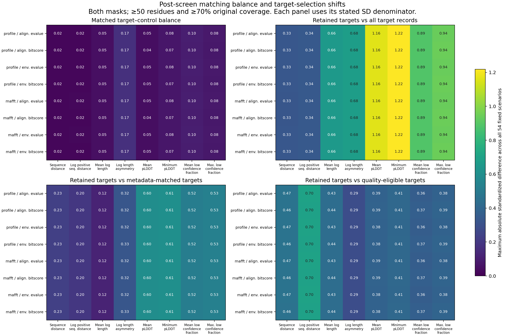

# Expanded background measurements and screened matching — October 2, 2026

All expanded background native measurements, numerical geometry, independent
readback, measurement union, original-length screening, fixed matched attrition
and post-screen balance/reuse stages have completed. This advances the measured
background and sampling controls for duplication and sequence–structure models.
It does not complete calibrated biological inference or any of the eight aims.

## Complete measured background scope

The new partition contains **74,712 pairs and 298,848 mask/order dispositions**:
294,288 alignments were numerically checked; 4,560 input-unavailable states are
retained. The [new native/numeric/geometry closure](../metadata/new_background_measurements_completed_20261001.json)
binds 1,262,901 hashes and three original completion/resource journals. The
old actual-input/checkpoint/geometry reuse partition remains separately closed.
The 264 MB full numerical readback retains 1,262,892 source bindings at its
original immutable local output path, excluded from Git. Its [compact retrieval
locator](../metadata/expanded_background_measurement_readback_locator_20261002.json)
records exact path, size, checksum, summary and closure/archive linkage.

The full [measurement union](../metadata/full_background_measurement_union_completed_20261001.json)
contains **146,172 physical background pairs and 584,688 directed states**, with
fixed old/new source ownership, errors, short/nonunique/RMSD exclusions and
original model/version identities retained. Its 1,830,246 bindings and both
original journals passed closure. The [original-length coverage stage](../metadata/full_background_coverage_completed_20261001.json)
passed all 292,344 pair/mask rows and 1,754,064 fixed screening decisions,
binding 1,830,368 hashes and two journals.

At ≥50 aligned residues and ≥70% of each original full protein:

| Physical comparison collection | Full mask | pLDDT ≥70 mask | Both masks |
|---|---:|---:|---:|
| Duplication targets (134,812 distinct pairs) | 53,962 | 31,274 | 31,271 |
| Expanded backgrounds (146,172 distinct pairs) | 93,185 | 59,845 | 59,844 |

These counts do not pair targets and controls or estimate a duplication effect.
The collections differ, and gene events/guides reuse physical proteins and
pairs. Masked retained length never replaces the original-protein denominator.

## Fixed matching, balance and selection shifts

The [full fixed-matching coverage closure](../metadata/full_matched_coverage_completed_20261001.json)
passed **4,250,692 selected records, 56,965,652 unmatched scenario decisions,
76,512,456 selected screening cells and 7,776 attrition rows**. Controls were
not reselected after screening. Its 1,830,469 bindings and both original journals
passed. Full scenario decisions and screening cells are overlapping descriptions,
not biological replicates or hypothesis tests.

The [post-screen balance/reuse closure](../metadata/full_screened_balance_completed_20261001.json)
passed **62,208 feature-balance rows, 7,776 coverage rows, 32,682,096 reuse rows
and 46,158,656 retained selection/screen cells**; 1,830,489 hashes and both
original journals were bound. The complete large balance/reuse exports remain
outside Git, referenced by the completion/archive locator. The [complete coverage
summary](tables/full_screened_matching_coverage_20261002_v5.tsv) is versioned.

The [4,608-row scenario summary](tables/full_screened_balance_scenario_summary_20261002_v5.tsv)
retains every guide/policy/mask/screen/feature/metric group across all 54 fixed
scenarios: signed minimum/maximum, median/maximum absolute value, and estimable
and unavailable counts. It was independently recomputed from all 62,208 source
rows using separate sorted extrema and median calculations. No favorable
scenario is selected.

[PDF](figures/full_screened_balance_20261002_v5.pdf) ·
[SVG](figures/full_screened_balance_20261002_v5.svg)

The figure shows all 256 both-mask/50-residue/70%-coverage guide/policy/feature/
metric cells, using the maximum absolute difference over all 54 scenarios. The
largest matched target–control standardized mean difference is **0.1676**.
The largest standardized retained-target shift is **1.2182** relative to all
target records, **0.6060** relative to metadata-matched target records, and
**0.7008** relative to all quality-eligible target records. Each metric uses
its own source SD denominator; these quantities cannot be pooled as one effect.
The small target–control differences coexist with substantial target-selection
shifts, especially for prediction confidence. Matching within the retained
collection does not establish representative coverage of all duplication events.
No universal balance threshold or inferential acceptance is applied.

The [final publication receipt](../metadata/full_screened_balance_published_20261002_v5.json)
binds all table/PNG/SVG/PDF values to the complete source. All 256 displayed
numbers were checked in SVG metadata/text and the one-page PDF. Actual PNG and
rendered PDF were inspected and label spacing passed; [review evidence](../metadata/full_screened_balance_figure_review_20261002_v5.json).
The original v2 figure remains preserved because the final two feature labels
touched. An initial publication archive-status assumption and subsequent
existing-output refusals are preserved in attempt records; v5 uses the original
frozen archive contract, shorter labels and fully new paths. No scientific
source, job or original output was changed or restarted.

## Reproducibility, remaining analysis and runtime

`scripts/publish_full_screened_balance_v5.py` reproduces the all-scenario
summary and figure from the complete source locator. Published paths are
immutable; use a newly versioned destination for a new publication. Complete
measurements and 29 MiB/large reuse exports remain outside Git.

The [fresh runtime collection](../metadata/project_runtime_checkpoint_20261002_v20.json)
rechecked **2,301,852 distinct closed source/artifact hashes**, 70 original
terminal successes and ten preserved historical failures. Sixteen pipeline and
six original scientific/retrieval handles remain live; the [broader inventory](../metadata/project_live_launch_inventory_20261002_v3.json)
includes nine legacy wrappers, giving 31 exact original live handles. Thirty-five
previously live pipeline handles have now verified terminal success; their
absence was established by original process identity and invocation-linked
journals, not inferred from state files. Whole-protein fitting, phylogenetic/
ancestral jobs and catalog retrieval continue; GPU prediction remains paused.

Expanded measured working-model inputs and calibrated effects still require
integration. Common-residue/sequence-correspondence, domain/orientation/PAE and
predictor controls must also reach matched backgrounds; the completed triad
correspondence controls are not the same measurement cohort. Accepted species/
reconciled gene framework, branch/root/time uncertainty, family/taxon dependence,
missingness/sampling, uncertainty propagation and multiple testing remain
required. Reciprocal reuse weights and Kish concentration describe repeated
controls; they are not phylogenetic effective sample sizes. All eight aims remain
incomplete and the project goal remains active.
