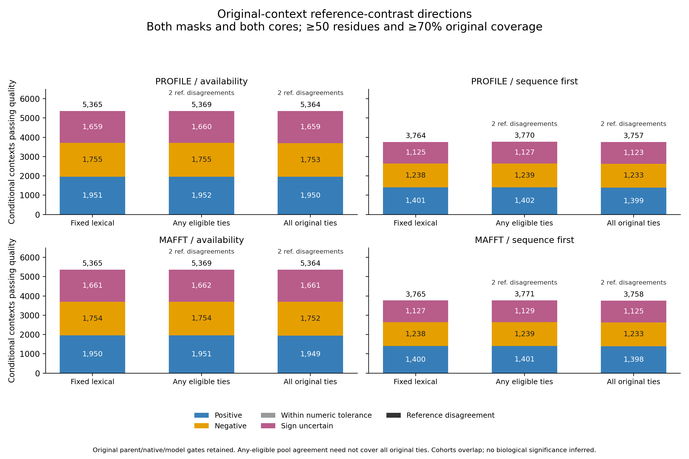

# Full original-context reference-contrast directions

The full direction-linkage producer finished across **283,409 unchanged original
gene-tree contexts, 566,818 design records, 214,461 tied references and 428,922
logical sides**. It uses all **27,056 measured ordered physical triples and
243,504 closed contrast-sensitivity groups**. All 153,040,860 policy decisions
and 10,800 count rows passed independent full readback. Final closure verifies
465,222 source/artifact bindings and both original process completion/resource
journals. The complete table and revised PNG/SVG/PDF figure are published below.

This stage addresses reference-choice uncertainty in the structural comparisons.
It does not establish a duplication effect, evolutionary polarity or statistical
significance. All eight biological aims remain incomplete.

## Original identities and gates

Every output embeds the unchanged source work design: original guide, gene
family, taxon, gene-tree node, duplicate genes/models/versions, reference genes,
reference order and lexical identity. Both native guide variants and both
availability/sequence-first designs remain intact.

Each reference retains its three original source eligibility flags:
correspondence readiness, native membership in the current guide, and native
membership in both guides. Readiness still requires the eligible parent,
distinct model IDs and versions, all three required measurement-design pairs,
and the original duplicate-comparison disposition. Measured physical overlap
cannot promote a rejected parent or a same-ID/different-version context.

Measured references link to all nine normalized mask/core sensitivity keys.
Missing measurements keep null keys. Per-reference qualified directions are
null when a source gate or geometric screen fails, rather than being treated
as zero contrasts. The original physical ranges/statuses remain accessible
through the normalized keys even when contextual source gates reject their use.
Measured zero/near-zero directions remain a distinct numerical category.

## Direction and reference-pool semantics

All full/pLDDT70/both-mask by reference-common/cycle-consistent/both-core
scenarios retain the complete selected structural order grid. The signed
measurement remains RMSD(A, reference) minus RMSD(B, reference), under the
closed physical analysis's 1e-9 Å numerical boundary. That boundary does not
define biological effect size or uncertainty intervals.

For each of the six existing screens, the context records five fixed policies:

- Original lexical reference under correspondence readiness.
- Original lexical reference plus current-guide native membership.
- Original lexical reference plus both-guide native membership.
- All quality-eligible tied references under both-guide membership.
- All original tied references, requiring every one to be eligible under both
  guides and requiring a nonempty tie set.

The fourth policy retains the existing “any eligible tie” quality flag, but
direction is summarized across **every eligible tied reference**. A uniformly
positive or negative eligible subset is not represented as complete agreement
of all original ties. Counts of eligible references under each gate, and the
four native-both direction counts, preserve missing/ineligible ties. The fifth
policy reports `not_all_ties_eligible` when any original tie fails; an empty
pool reports `no_tied_reference`. Missing lexical models are not replaced by a
later modeled reference.

Within a policy's eligible pool, identical direction categories remain positive,
negative, within numerical tolerance or sign uncertain. Different reference
categories yield `reference_direction_disagreement`. This includes category
differences such as one sign-uncertain reference and one positive reference;
it does not necessarily mean strictly opposite signs. Source-gate exclusions,
geometric exclusions, no eligible reference and incomplete all-tie pools remain
separate states.

**Quality eligibility and direction consistency are separate outputs.** A
context can pass all geometric screens while its references disagree. No model,
reference, mask, core or alignment order is reselected to obtain a desired sign.

| Independently verified output unit | Count |
| --- | ---: |
| Original contexts | 283,409 |
| Reference × scenario × screen cells | 11,580,894 |
| Context × design × scenario × screen cells | 30,608,172 |
| Repeated five-policy direction decisions | 153,040,860 |
| Disjoint direction-count summary rows | 10,800 |

Summary partitions cover all ten direction/exclusion states and preserve source
context, parent-eligible, lexical-gene and lexical-model denominators. These are
dependent descriptions of overlapping cohorts; they are not independent
evolutionary events or multiple-testing hypotheses.

## Verified context results

At ≥50 common residues and ≥70% original protein coverage, requiring both
confidence masks, both core definitions and native membership in both guides,
the direction counts are:

| Guide | Design | Reference policy | Positive | Negative | Sign uncertain | Reference disagreement | Quality-qualified total |
| --- | --- | --- | ---: | ---: | ---: | ---: | ---: |
| Profile | Availability | Fixed lexical | 1,951 | 1,755 | 1,659 | 0 | 5,365 |
| Profile | Availability | Any eligible ties | 1,952 | 1,755 | 1,660 | 2 | 5,369 |
| Profile | Availability | All original ties | 1,950 | 1,753 | 1,659 | 2 | 5,364 |
| Profile | Sequence first | Fixed lexical | 1,401 | 1,238 | 1,125 | 0 | 3,764 |
| Profile | Sequence first | Any eligible ties | 1,402 | 1,239 | 1,127 | 2 | 3,770 |
| Profile | Sequence first | All original ties | 1,399 | 1,233 | 1,123 | 2 | 3,757 |
| MAFFT | Availability | Fixed lexical | 1,950 | 1,754 | 1,661 | 0 | 5,365 |
| MAFFT | Availability | Any eligible ties | 1,951 | 1,754 | 1,662 | 2 | 5,369 |
| MAFFT | Availability | All original ties | 1,949 | 1,752 | 1,661 | 2 | 5,364 |
| MAFFT | Sequence first | Fixed lexical | 1,400 | 1,238 | 1,127 | 0 | 3,765 |
| MAFFT | Sequence first | Any eligible ties | 1,401 | 1,239 | 1,129 | 2 | 3,771 |
| MAFFT | Sequence first | All original ties | 1,398 | 1,233 | 1,125 | 2 | 3,758 |

The within-numerical-tolerance count is zero in these twelve cohorts. Positive
means A is farther from the reference than B under every selected geometry
setting; negative means the reverse. Sign uncertainty retains variation across
the selected orders, masks and cores. A reference disagreement can include a
positive reference and a sign-uncertain reference; it need not imply opposite
signs. The overlapping guide/design/policy cohorts must not be summed as
independent biological events. Sequence-first availability and gate attrition
also change the eligible cohort, so differences between totals do not estimate
the effect of reference choice on a fixed population.

- [Complete 10,800-row table](tables/full_triad_context_contrast_counts_20261002_v2.tsv)
- [SVG](figures/full_triad_context_contrasts_20261002_v2.svg) and [PDF](figures/full_triad_context_contrasts_20261002_v2.pdf)
- [Final completion evidence](../metadata/full_triad_context_contrasts_completed_20261002.json)
- [Count/publication checks](../metadata/full_triad_context_contrasts_published_20261002_v2.json)
- [Actual PNG and rendered PDF review](../metadata/full_triad_context_contrasts_figure_review_20261002_v2.json)

The first figure's total and disagreement labels overlapped during visual
review. Its files and publication record are retained. The v2 publisher uses
separate annotation offsets; all counts are unchanged and the revised PNG and
rendered one-page PDF were visually inspected.

## Verification, restart and resources

The independent reader reconstructs original ordered model SHA identifiers,
parent/distinct-model/three-pair/native gates and every physical key from raw
source contexts. SQL separately reconstructs lexical directions, eligible-pool
counts/minima/maxima, all-tie completeness, four-category reference support,
quality flags and all summary denominators. Complete original records, scalar
types, exported reference order, source-row sequences and every deterministic
checkpoint must agree. Full source/artifact hashes and both original process
completion/resource journals gate closure.

Software contracts passed 24 contexts, 52 ties, 45 physical groups, all nine
scenarios and 2,160 policy decisions. Cases include measured excluded parents,
missing lexical models followed by valid ties, empty pools, same-ID/different
versions, native guide disagreement, mask/core direction uncertainty, conflicting
qualified references, inherited quality failure and near-zero contrasts.
Checkpoint recovery rechecked one committed four-context chunk. All 20 rehashed
false exports were rejected, including favorable reference selection, incomplete
pools reported as complete, altered reference-direction support and scalar-type
substitution. Production source-closure I/O is stubbed only in these software
contracts; production requires the complete closed source lineage.

An exclusive lock is held through atomic receipt creation. Atomic configuration
and deterministic checkpoints commit 1,000 contexts per chunk, with 284 planned
chunks. Restart regenerates and exactly checks committed chunks, rebuilding
exports. Completed receipts refuse restart. Reproduction requires new plan/
output/unit identities, or checked restart after the original process is
authoritatively stopped; do not launch duplicate live jobs.

Prelaunch estimates specify two CPU cores, 32 GiB RAM, no swap, one BLAS thread,
64 GiB output allowance and 100 GiB free-disk reserve. The 1–48-hour range per
producer/reader is an uncalibrated planning bound, not a completion ETA. No GPU,
new paid resources or changes to existing jobs.

- [Frozen plan](../metadata/full_triad_context_contrasts_plan_20261002.json)
- [Prelaunch resources](../metadata/full_triad_context_contrasts_resources_20261002.json)
- [Software-check evidence](../metadata/full_triad_context_contrasts_fixture_validation_20261002.json)
- [Original launch identities](../metadata/full_triad_context_contrasts_launches_20261002.json)
- [Producer](../scripts/project_full_triad_context_contrasts.py)
- [Independent original-gate/SQL reader](../scripts/readback_full_triad_context_contrasts.py)
- [Software contracts](../scripts/check_full_triad_context_contrasts.py)
- [Launcher](../scripts/launch_full_triad_context_contrasts.py)
- [Revised table/figure publisher](../scripts/publish_full_triad_context_contrasts_v2.py)

Large outputs remain outside Git in
`results/structural_comparisons/full-triad-context-contrasts-20261002-v1/`.
The completion locator is
`metadata/full_triad_context_contrasts_completed_20261002.json`.

Full sequence-derived production and corresponding contextual directions,
actual matched backgrounds, prediction/domain/PAE controls, accepted species
and reconciled gene framework, family/taxon dependence, missingness, sampling
and calibrated inference remain required. GPU protein prediction remains paused.
The [joint sequence/structural direction workflow](full-triad-joint-directions-20261002.md)
is implemented and queued; it has not yet produced full production results.
The [full joint contextual direction integration](full-triad-context-joint-directions-20261002.md)
is also implemented and queued after physical joint-direction closure.
