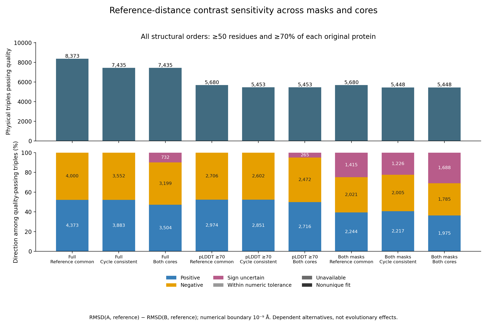

# Full structural contrast sensitivity across masks, cores and orders

The complete analysis of signed reference-distance sensitivity has passed on
all **27,056 source-ready ordered physical triples**, using the already closed
**865,792 fit dispositions and 108,224 eight-order summaries**. Full production,
independent raw-fit readback and two-original-journal closure passed, binding
**464,919 source/artifact hashes**. This is a descriptive prerequisite
for duplication/reference comparisons, not a calibrated duplication effect.

The signed measurement is RMSD(A, reference) minus RMSD(B, reference), in Å.
A positive value means A is farther from the reference in that particular
same-residue fit. It does not establish which duplicate evolved faster, a
branch-specific rate, causal direction, ancestral state or positive selection.
Original A/B/reference model versions and roles remain fixed.

## Complete scope

All full/pLDDT70/both-mask choices are crossed with reference-common/
cycle-consistent/both-core choices. Every selected leaf includes **all eight
structural alignment orders**. Single-leaf scenarios have eight dispositions;
joint scenarios contain 16 or 32. No favorable mask, core or order is selected.

| Full output | Count |
| --- | ---: |
| Ordered physical triples | 27,056 |
| Mask/core scenarios per triple | 9 |
| Contrast sensitivity groups | 243,504 |
| Six-screen decisions | 1,461,024 |
| Descriptive count rows | 378 |

Each group keeps its source keys, available/expected order counts, unique-fit
status, minimum, maximum and span of the signed contrast. Missing numeric
dispositions remain unavailable; a partial set cannot establish a stable sign.
Nonunique fits remain a separate direction category.

Direction is retained both with a strict zero boundary and with a **1e-9 Å
numerical boundary** matching the existing numerical verification scale.
The categories are positive, negative, within numerical tolerance, sign
uncertain, unavailable and nonunique fit. At a zero boundary, “within numerical
tolerance” means exactly zero. Values touching a boundary without the entire
range lying inside it remain sign uncertain. This boundary is not a biological
effect-size cutoff. Sensitivity extrema are not confidence intervals and do
not measure sampling, prediction, ancestral or phylogenetic uncertainty.

For each of the six existing residue-count/original-protein-coverage screens,
every selected leaf must pass all eight orders. The original combined core and
inherited three-pair exclusions remain mandatory. Failed qualification keeps
the numeric range but reports `excluded_by_quality`; no weak result becomes an
eligible effect because its sign is consistent. The seven qualified-direction
categories form a complete, disjoint partition of all 27,056 physical triples
within each scenario/screen. Scenarios are dependent alternatives.

These are physical measurements. The complete 283,409 logical contexts retain
their own parents, native guides, reference ties and eligibility conditions in
the existing closed source design. Those gates must still govern later use of
these measurements. Shared physical triples and tied references do not supply
independent evolutionary observations.

## Executed results

At the 50-residue/70%-coverage screen, **5,448 triples** pass every selected
order under both masks and both cores. Among them, 1,975 have a positive
contrast throughout, 1,785 have a negative contrast throughout, and **1,688
(30.98%) are sign uncertain across the included alternatives**. These counts
do not establish duplication asymmetry or its statistical significance. They
show why a favorable individual mask/core result is insufficient for further
interpretation. The complete [378-row table](tables/full_triad_contrast_sensitivity_counts_20261002.tsv)
includes excluded states and all six screens, preserving the 27,056-triple
denominator in every scenario.

Standalone [PDF](figures/full_triad_contrast_sensitivity_20261002.pdf) and
[SVG](figures/full_triad_contrast_sensitivity_20261002.svg) versions are available.
All plotted counts were checked against the full independently verified table;
SVG text/metadata and PDF text were checked, and the actual PNG and rendered
one-page PDF were visually inspected.

## Verification and restart

The producer combines extrema and order bitmaps from the complete closed
all-order summaries. The independent reader uses the original **865,792 raw
fit rows** in SQLite, checks every original role and full mask/core/order grid,
reconstructs extrema, available/unique counts, direction categories and screen
bitmaps, then checks every exported field, summary, denominator and checkpoint.
Both original process completion/resource journals and complete source/artifact
hashes are required before the completion locator can be written.

Software contracts passed 384 raw fits, 48 source groups, all 108 scenario
groups and 216 decisions across 12 synthetic triples. Cases include reversed
raw input order, swapped duplicate roles, contradictory masks/cores/orders,
missing dispositions, nonunique fits, exact zero, near-zero and numerical
boundary values, and an inherited quality exclusion. Recovery rechecked one
committed two-triple chunk. The reader rejected all 16 rehashed false exports,
including favorable alternative selection, invented qualification, wrong
roles/types/source keys, missing/duplicate groups and incorrect aggregate
counts. Production source-closure I/O is stubbed only in software contracts;
the actual production stage requires the full closed source lineage.

Deterministic checkpoints commit 100 triples (900 scenario groups) per chunk,
with 271 planned chunks. Restart under an exclusive lock regenerates and
exactly verifies committed chunks and rebuilds exports. The lock remains held
through final receipt creation. Completed receipts refuse restart. Do not
start duplicate live jobs or overwrite completed outputs; reproduction uses
new plan/output/unit identities.

## Resources and reproducibility

Resource estimates preceded launch: two CPU cores, 32 GiB RAM, no swap, one
BLAS thread, 8 GiB output allowance and 100 GiB free-disk reserve per stage.
The 1–12-hour planning range for each producer/reader is uncalibrated and is
not an ETA. No GPU or paid resources are used.

- [Frozen analysis plan](../metadata/full_triad_contrast_sensitivity_plan_20261002.json)
- [Prelaunch resource estimate](../metadata/full_triad_contrast_sensitivity_resources_20261002.json)
- [Software-check locator](../metadata/full_triad_contrast_sensitivity_fixture_validation_20261002.json)
- [Original process identities](../metadata/full_triad_contrast_sensitivity_launches_20261002.json)
- [Full source/artifact/journal closure](../metadata/full_triad_contrast_sensitivity_completed_20261002.json)
- [Published table and figure evidence](../metadata/full_triad_contrast_sensitivity_published_20261002.json)
- [Figure value and visual review](../metadata/full_triad_contrast_sensitivity_figure_review_20261002.json)
- [Producer](../scripts/summarize_full_triad_contrast_sensitivity.py)
- [Independent raw-fit reader](../scripts/readback_full_triad_contrast_sensitivity.py)
- [Software contracts](../scripts/check_full_triad_contrast_sensitivity.py)
- [Launcher](../scripts/launch_full_triad_contrast_sensitivity.py)

Large outputs remain outside Git under
`results/structural_comparisons/full-triad-contrast-sensitivity-20261002-v1/`.
The completion locator records the complete raw-fit readback and both original
producer/reader completion/resource journals.

Full context/tie direction integration, actual sequence-derived correspondence
controls, matched backgrounds, domain/PAE/predictor controls, accepted species
and reconciled gene framework, shared ancestry, missingness and statistical
calibration remain required. All eight scientific aims remain incomplete;
GPU protein prediction remains paused.
