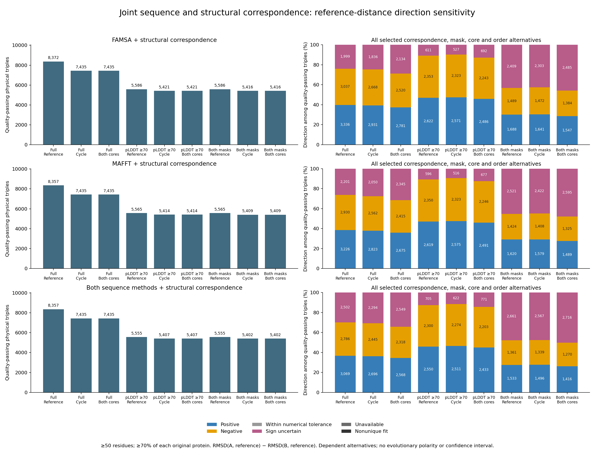

# Joint sequence-derived and structure-derived contrast directions

This complete control stage is implemented and queued for **27,056 original
source-ready ordered protein triples**. It tests whether the direction of
RMSD(A, reference) minus RMSD(B, reference) survives changing the residue
correspondence, sequence aligner, input order, confidence mask and structural
core definition. Full production results are pending. It complements the
[completed structural/context direction analysis](full-triad-context-contrasts-20261002.md)
and [queued correspondence comparison](full-triad-sequence-correspondence-20261002.md#full-correspondence-comparison-queued-october-2-utc).

## Complete scope and identities

The unchanged source catalog retains all 31,235 original physical triples,
including 4,179 unscheduled triples, together with 283,409 original gene-tree
contexts, 214,461 reference ties and 428,922 logical sides. Geometry uses the
27,056 source-ready triples, preserving original A/B/reference model IDs,
versions and role order.

| Full production unit | Count |
| --- | ---: |
| Sequence-derived raw fit dispositions | 649,344 |
| Structure-derived raw fit dispositions | 865,792 |
| Original raw fits independently reconstructed | 1,515,136 |
| Sequence-order groups | 108,224 |
| Structural-order groups | 108,224 |
| Closed six-by-eight comparison groups | 216,448 |
| Original order-pair comparisons | 10,389,504 |
| Joint direction groups | 730,512 |
| Six-screen direction decisions | 4,383,072 |
| Disjoint qualified-direction count rows | 1,134 |

The 27 scenarios combine full/pLDDT70/both masks,
FAMSA/MAFFT/both sequence methods, and
reference-common/cycle-consistent/both structural cores. Each sequence leaf
retains all six original input orders; each structural leaf retains all eight
original AB/AR/BR pair-order combinations.

The producer deduplicates selected geometry keys. The most inclusive envelope
contains **24 sequence-derived plus 32 structure-derived fits, or 56 actual
states**. Repeating a structural fit for each sequence method or treating the
384 corresponding Cartesian comparisons as independent measurements would
inflate the envelope's denominator; neither is allowed.

## Signed envelopes and qualification

Each group preserves separate sequence, structural and joint envelopes with
expected/available order counts, numerical uniqueness, minimum and maximum
signed contrast, span, exact-zero direction and direction at 1e-9 Å numerical
tolerance. The six direction states are positive, negative, within numerical
tolerance, sign uncertain, unavailable and nonunique fit. An incomplete or
nonunique grid cannot become a stable sign. The numerical tolerance classifies
floating-point values; it is not a biological effect-size threshold or a
confidence interval.

The source-category relation records matching categories, different categories,
or unavailable/nonunique sources. Matching two sign-uncertain categories does
not establish stable sign, agreement of effect estimates or biological
concordance. Both source envelopes remain available for that interpretation.

For each of the six inherited screens, qualification intersects the original
48-bit pair-pass map across **every selected mask, method and core leaf**. All
48 bits must remain set. This retains original protein-length denominators
and the three required pair exclusions. Complementary failing orders across
methods, a favorable mask/method diagonal, or selection of one favorable
correspondence/core cannot promote qualification. Quality exclusion is separate
from the unconditional numerical direction class.

## Independent reconstruction and recovery

The reader loads all 1,515,136 original raw fit dispositions into SQLite,
checking complete grids, original model roles/versions, statuses, finite
contrasts and their AR-minus-BR values. Independent SQL reconstructs source
and joint extrema, available/expected/unique states and direction classes.
Separately reconstructed raw six-order and eight-order screen flags generate
the full Cartesian maps; complement-union arithmetic checks qualification
without trusting producer bitmaps. Every exported field and scalar type,
checkpoint, summary count and denominator must agree.

Full source/artifact hashes, original process identity and both original
invocation-linked completion/resource journals are required for closure.
An exclusive lock lasts through atomic receipt creation. Deterministic
100-triple chunks produce 271 full-design checkpoints. Interrupted recovery
regenerates and byte-checks committed chunks; completed production refuses
restart. Reproduction requires new plan/output/unit identities, or checked
restart after an original process is authoritatively terminal. Do not duplicate
live jobs.

Software checks passed all 14 synthetic triples, 784 raw fits, 378 joint
groups, 756 two-screen decisions and 378 summary rows. The fixture retains
all 27 scenarios and reverses raw fit input order. It covers swapped roles,
opposite correspondence-source directions, mask/method/core/order flips,
missing and nonunique fits, numerical-boundary values, complementary order
failures and a favorable mask/method diagonal. One committed two-triple chunk
was recovered and rechecked; completed restart was refused. All 20 rehashed
false exports were rejected. Source-closure I/O is stubbed only in the software
fixture; these checks are not production results or biological evidence.

## Resources, queue and reproduction

Resources were estimated before launch: two CPU cores, 32 GiB RAM, no swap,
one BLAS thread, 16 GiB output allowance and 100 GiB free-disk reserve. The
1–24-hour producer/reader planning ranges are uncalibrated and exclude
dependency wait; they are not completion ETAs. No GPU or paid infrastructure
is used, and existing scientific jobs remain unchanged.

The original producer (PID 1447574), reader (1447590) and closure (1447609)
are queued after the original complete correspondence-comparison closure
(PID 221211). Launch records pin process creation times and full commands;
a reused PID is not sufficient evidence of the original job.

- [Frozen 115-pin plan](../metadata/full_triad_joint_directions_plan_20261002.json)
- [Prelaunch resources](../metadata/full_triad_joint_directions_resources_20261002.json)
- [Passed software contracts](../metadata/full_triad_joint_directions_fixture_validation_20261002.json)
- [Original launch inventory](../metadata/full_triad_joint_directions_launches_20261002.json)
- [Closed-source loader](../scripts/full_triad_joint_direction_sources.py)
- [Producer](../scripts/summarize_full_triad_joint_directions.py)
- [Independent raw-fit reader](../scripts/readback_full_triad_joint_directions.py)
- [Software checks](../scripts/check_full_triad_joint_directions.py)
- [Launcher](../scripts/launch_full_triad_joint_directions.py)

Large outputs remain outside Git in
`results/structural_comparisons/full-triad-joint-directions-20261002-v1/`.
The future completion locator is
`metadata/full_triad_joint_directions_completed_20261002.json`.

Software checks can be reproduced with a new output path:

```bash
python scripts/check_full_triad_joint_directions.py --output results/software-checks/joint-directions-new-run/receipt.json
```

For a fresh production run, copy the plan to a new identity, set a new output
directory, regenerate affected pins and completion/launch identities, and
require the closed dependencies. The producer and reader entry points are:

```bash
python scripts/summarize_full_triad_joint_directions.py --plan metadata/new_joint_direction_plan.json
python scripts/readback_full_triad_joint_directions.py --plan metadata/new_joint_direction_plan.json --output results/structural_comparisons/new-joint-directions/readback.json
```

The second command runs after the producer succeeds. The existing original
launch/completion plans record the actual commands and dependency identities;
they must not be reused to create duplicate jobs or overwrite completed work.

## Scientific limits and next integration

The sequence-derived mappings use the same predicted coordinates. They test
correspondence sensitivity and do not remove sequence-to-prediction circularity
or establish independent predictor validation. Joint physical directions must
still be linked to the original parent, model, native-guide, fixed-reference
and complete-tie gates; full contextual joint directions are not implemented
by this physical stage or by the separate eligibility-only context stage.
The [complete joint contextual direction integration](full-triad-context-joint-directions-20261002.md)
is now implemented and queued behind this stage's original closure. Its full
production and independent readback remain pending.

Actual matched backgrounds, domain/orientation/PAE and predictor controls,
accepted species/reconciled gene framework, family/taxon dependence,
missingness/sampling and calibrated statistical tests remain required.
Positive/negative physical contrasts do not establish evolutionary polarity,
structural acceleration, selection or a duplication effect. All eight
scientific aims remain incomplete; GPU protein prediction remains paused.

## Complete production and published results — October 2 UTC

Full production, independent raw-fit/SQL readback and both-original-journal
closure passed all **27,056 physical triples, 649,344 sequence fits, 865,792
structural fits, 730,512 joint groups, 4,383,072 screening decisions and 1,134
count rows**. The [completion locator](../metadata/full_triad_joint_directions_completed_20261002.json)
binds 493,605 source/artifact hashes and both original completion/resource
journals. The [fresh runtime collection](../metadata/project_runtime_checkpoint_20261002_v20.json)
rechecked complete sources together with ten other newly closed background and
correspondence stages, totaling 2,301,852 distinct bindings. This is the current
status; earlier queued statements describe the initial launch.

The [complete count table](tables/full_triad_joint_direction_counts_20261002.tsv)
preserves every mask, sequence-method, core and screen combination. The figure
shows all 27 scenarios at ≥50 residues and ≥70% of both original proteins:



[PDF](figures/full_triad_joint_directions_20261002.pdf) ·
[SVG](figures/full_triad_joint_directions_20261002.svg)

Under both masks, both sequence methods and both core definitions, **5,402**
triples pass quality: **1,416 positive, 1,270 negative and 2,716 sign uncertain
(50.28%)**. There are no within-tolerance, unavailable or nonunique outcomes in
this quality-passing cohort; 21,654 of the original 27,056 triples are excluded
by this quality screen. Sign uncertainty describes the envelope over retained
correspondence/mask/core/order alternatives, not a confidence interval.
The corresponding structural-only cohort had 5,448 triples, so changes in
aggregate counts are not paired reference effects or counts of sign reversals.
Physical triples, scenarios and original gene contexts remain dependent.

The [publication receipt](../metadata/full_triad_joint_directions_published_20261002.json)
binds the complete table and PNG/SVG/PDF to the closed source. All plotted
counts were checked against the full table and SVG metadata; every nonzero
numeric label was checked in the one-page PDF. Actual PNG and rendered PDF
were inspected, with [review evidence](../metadata/full_triad_joint_directions_figure_review_20261002.json).
Reproduce the publication using `scripts/publish_full_triad_joint_directions.py`
against a new output location; preserve published outputs.

Full joint directions across original contexts and complete tied-reference
pools have finished their producer and await independent readback and closure.
Expanded matched background measurements/balance are now closed, but joint
sequence-correspondence/domain/orientation/PAE/predictor controls, accepted
species/reconciled gene framework, sampling/dependence and calibrated biological
inference remain required. All eight aims incomplete; GPU prediction paused.
