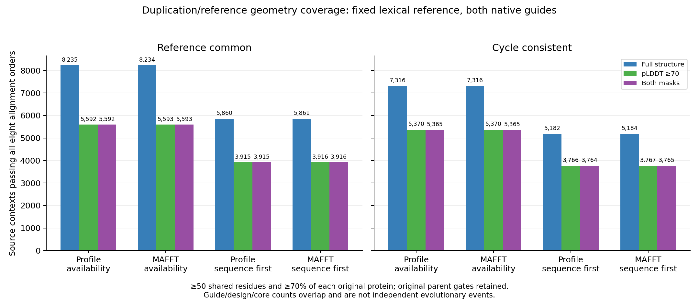

# Full alignment-order robustness and duplication-context linkage

The complete structural atlas comparison now retains each physical result in
its original duplication/gene-tree context. No favorable alignment order,
reference model, confidence mask or core definition is selected after seeing
the distances. This stage defines auditable comparative cohorts; it does not
establish a duplication effect, evolutionary acceleration or selection.

## Complete physical comparison grid

All 865,792 closed fit dispositions were summarized into **108,224 groups**:
27,056 ordered physical model triples × two confidence masks × two common-core
definitions. Every group retains all eight AB/AR/BR alignment orders, fit
statuses, original-residue-set hashes, source/screen exclusions and separate
combined/core/inherited pass bitmaps. Eighteen numeric fields retain their
available-order count, minimum, maximum, span and mean. Missing distances stay
null. The signed AR-minus-BR range keeps the original A/B roles; its sign is
descriptive and has no calibrated biological interpretation.

An independent SQLite implementation indexed every source row by model triple,
mask, core definition and order, reconstructed all ranges/bitmaps/statuses and
checked every exported group and summary. Maximum numeric disagreement was
2.842e-14. Closure bound **464,618 hashes and both original process journals**.
Synthetic software fixtures independently rejected 12 rehashed false exports;
the real production gate exhausted actual closed sources.

At 50 common residues and 70% coverage of **each original protein**, the counts
of physical triples passing all eight orders are:

| Common-core definition | Full structures | pLDDT ≥70 |
|---|---:|---:|
| Reference-common | 8,373 | 5,680 |
| Cycle-consistent | 7,435 | 5,453 |

All-order and any-order counts agree at this threshold. They differ by one
full-mask cycle-consistent triple at each of the 30/50-residue, 50%-coverage
screens: 11,375 versus 11,376 and 11,327 versus 11,328, respectively. The full
[24-row screen table](tables/full_triad_all_order_screen_counts_20261001.tsv)
retains those differences. Across the entire grid, the largest within-group
AR-minus-BR span is 3.777 Å; this includes weak/excluded comparisons and is not
an estimated evolutionary effect.

## Original contextual design

The full linkage preserves **283,409 contexts, 566,818 context/design records,
214,461 tied references and 428,922 logical sides**. It embeds the unchanged
source work design, including gene family, taxon, gene-tree node, sequence-tree
distances, source reference choices, parent exclusions and native guide flags.
Each measured reference links to four normalized physical result keys; metrics
are not copied or averaged across different masks or cores. Unmeasured keys and
physical bitmaps remain null, rather than zero-valued observations.

Full and pLDDT70 bitmaps remain separate. The both-mask bitmap is their
intersection for the same alignment orders. Three source gates—correspondence,
native membership in the current guide, and native membership in both guides—
are combined with strict all-eight-order geometry. A measured physical overlap
never overrides an excluded source parent. Two versions of one model ID do
not establish independent proteins.

Five contextual policies retain the original lexical reference, lexical plus
current-guide membership, lexical plus both-guide membership, any tied reference
plus both-guide membership, and all tied references plus both-guide membership.
A missing lexical model is not replaced by a more favorable tie. Empty tie
sets fail the all-ties policy. Both availability and sequence-first designs
are preserved without reselection.

The complete design contains **7,720,596 reference/screen decisions,
20,405,448 context/screen states and 102,027,240 contextual policy decisions**.
These are repeated quality checks, not independent evolutionary events or
statistical tests. Every original context, model role, source gate, nullable
bitmap, policy and summary denominator passed independent reconstruction.
Closure bound **464,637 hashes and both original process journals**. Twelve
rehashed synthetic false exports were rejected, including promoted parents,
missing values replaced by zero, favorable reference reselection, native-guide
promotion and empty all-tie sets marked as passing.

At the same 50-residue/70%-coverage screen, with the fixed lexical reference
and native membership in both guides, reference-common context counts are:

| Guide/design | Full structures | pLDDT ≥70 | Both masks |
|---|---:|---:|---:|
| Profile, availability | 8,235 | 5,592 | 5,592 |
| MAFFT, availability | 8,234 | 5,593 | 5,593 |
| Profile, sequence first | 5,860 | 3,915 | 3,915 |
| MAFFT, sequence first | 5,861 | 3,916 | 3,916 |

The underlying parent-eligible totals are 69,855 profile and 69,825 MAFFT
contexts. Availability designs have 29,155/29,130 modeled lexical references;
sequence-first designs have 21,581/21,549, while retaining all missing choices.
These differences illustrate availability/quality attrition. They do not
establish unbiased sampling or an effect of duplication, and guide/design
counts are overlapping. The complete [720-row contextual table](tables/full_triad_context_geometry_counts_20261001.tsv)
retains every mask/core/screen/policy and its source denominators.

Standalone [PDF](figures/full_triad_context_geometry_coverage_20261001.pdf) and
[SVG](figures/full_triad_context_geometry_coverage_20261001.svg) versions are
also available. Every plotted value and all 24 bar heights were checked
against the complete independently verified table.

## Reproducibility and remaining analyses

- [Immutable physical robustness plan](../metadata/full_triad_order_robustness_plan_20261001.json)
- [Physical robustness completion](../metadata/full_triad_order_robustness_completed_20261001.json)
- [Physical software checks](../metadata/full_triad_order_robustness_fixture_validation_20261001.json)
- [Immutable full context plan](../metadata/full_triad_context_geometry_plan_20261001.json)
- [Full contextual completion](../metadata/full_triad_context_geometry_completed_20261001.json)
- [Context software checks](../metadata/full_triad_context_geometry_fixture_validation_20261001.json)
- [Complete table and figure publication evidence](../metadata/full_triad_geometry_context_counts_published_20261001.json)
- [Independent SVG value and rendered PNG review](../metadata/full_triad_context_figure_review_20261001.json)

Large normalized results and complete hash/journal archives remain outside Git
in `results/structural_comparisons/full-triad-all-order-robustness-20261001-v1/`
and `results/structural_comparisons/full-triad-context-geometry-20261001-v1/`.
Each serial stage uses two CPU cores, 32 GiB memory, no swap and one BLAS thread,
with resource estimates recorded before launch. No GPU or paid resources are
used. Synthetic software checks are not a pilot study.

Next comparative work must preserve these source cohorts while incorporating
the actual expanded-background measurements, sequence-locked correspondences,
domain architecture/orientation and PAE controls, prediction-source calibration,
supported phylogenetic sensitivity and family/taxon dependence. Source readiness
and numerical geometric qualification do not establish biological orthology.
Final inferential calibration, multiple testing and uncertainty propagation
remain open. None of the eight scientific aims is complete; GPU inference
remains paused.

October 2 UTC: [full signed contrast sensitivity](full-triad-contrast-sensitivity-20261002.md)
has passed across all 27,056 triples, nine mask/core scenarios and every selected
structural order. It retains missing/nonunique fits, original roles and inherited
quality exclusions; independent reconstruction uses the complete original
865,792 raw fits. Full production/readback/two-journal closure binds 464,919 hashes.
At 50 residues/70% coverage, 1,688 of 5,448 quality-passing joint-mask/joint-core
triples have sign-uncertain contrasts. Sensitivity
envelopes and numerical-boundary signs are descriptive prerequisites, not
confidence intervals or calibrated biological effects.
