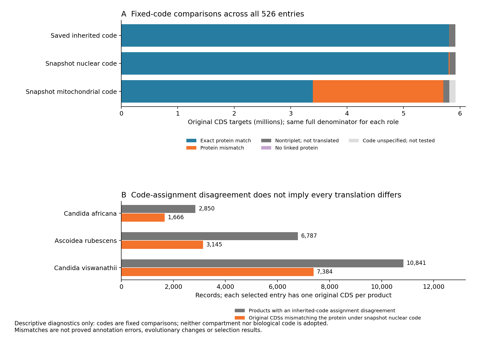

# Full unmodified CDS translation and code-choice diagnostics

The original-DNA translation audit and its independent full readback have
completed across all **501 fungal entries
and 25 outgroups**, **5,923,039 original CDS targets**, **5,927,745 original
protein products** and **5,815,847 selected representatives**. It prepares
annotation and genetic-code controls for sequence–structure comparisons and
family codon analyses. All 111,898 alternative products remain in scope.
The completed source-context join did not retranslate DNA; this stage does.

## Original sources and fixed comparisons

The frozen plan binds each original target FASTA, normalized protein FASTA and
closed CDS/product evidence file. Their identifiers, source order, lengths,
sequence hashes and complete record counts must agree. The 519 NCBI target
sets, four publisher target sets and two genome-dependent ORF target sets
retain their different provenance. Creolimax has no independently qualified
original target; all 8,694 products and their separate derived evidence remain
explicit. No derived target replaces an original target.

Each target is tested under its saved inherited code, the frozen taxonomy's
nuclear code and its mitochondrial code. Identical choices share a computation
without losing their role labels. Only positive codes **1, 3, 4, 5, 6, 12, 16,
26** occur in these fixed inputs; code 0 remains unspecified. These are
predeclared comparisons, not a search for a code that matches a protein.
Neither a match nor a mismatch establishes biological code or compartment.

DNA is never edited. Nontriplet sequences are retained without translation,
and at most one terminal stop is removed from the protein comparison. Internal
stops, ambiguous codons, source case, unlinked targets and annotation exceptions
remain explicit. No frame shift, phase adjustment, start-codon repair,
recoding or boundary correction is introduced. The observed target protein
is always the original normalized protein, not a new preferred translation.

Outputs retain every original source target and product. Fixed-code results
include the translated sequence hash/length, exact-match disposition and stop
counts. Every codon whose amino-acid translation differs from the inherited
code is recorded with its original DNA coordinate, codon and two amino acids.
Terminal differences outside protein bounds cannot acquire a protein-residue
mapping. These are code-comparison diagnostics, **not evolutionary changes**.
Product summaries retain model availability, alternatives and separate derived
evidence, supporting later source-error sensitivity analyses.

## Qualified software and independent replay

Installed Biopython 1.86 supplies the producer translation. A separate lookup
expands the pinned NCBI codebook over all 3,375 IUPAC codons for each of eight
codes. All **27,000** translations agree with the installed library, including
ambiguous amino-acid and stop cases. Nine literal helper controls pass.
The library, codebook and source files remain shared dependencies; agreement
does not independently prove a biological code assignment.

The full writer and independent reader pass integration over **11 original
targets, 11 products, ten representatives and three changed codon rows** in
three synthetic fixtures. All ten semantic corruptions are rejected: altered
code choice, translation/DNA hash, nontriplet translation, codon coordinate,
biological admission, removed alternative, derived-target substitution and
aggregate disagreement. The fixtures include ambiguous and lowercase DNA,
multiple targets, missing codes, unlinked/no-target products, internal stops,
start-codon disagreement and unspecified mitochondrial assignments. This is
software qualification, not a real-taxon pilot.

Actual original software sessions **83625** and **6776** both exited zero.
Whole wrapper messages, invocation start/end, source hashes and output hashes
are closed. The independent full reader imports neither Biopython nor the
producer translation helpers. It has its own FASTA parser and reconstructs
every translated hash/disposition, every changed codon, every original product
and every taxon/global aggregate. It launched only after actual original
producer zero and full source/output/wrapper/invocation closure, and completed
the entire corpus with actual original zero and matching aggregate results.

## Full execution and resources

Complete source preparation under original session **80286** exited zero and
binds **2,169 files / 7,569,318,023 input bytes**. Its separate closure under
original session **73628** exited zero. The full producer completed under original session **43153**, invocation
`ab722831bf4b45589350c040e65cf483`, with actual original API/native zero and
whole source/wrapper/invocation closure. Its measured runtime was 16 minutes
24 seconds. The full reader then completed under original session **54277**,
invocation `b3387d079fb5433291a344dad930bb9e`, with actual original API/native
zero and whole source/wrapper/invocation closure. Its measured runtime was
14 minutes 44 seconds. The final merger checks the independent result and
publishes every taxon row with **3,769 source/output bindings**.

Both paths reconstruct **8,023,872,320 original DNA bases** and **7,950,194
fixed-code codon-difference rows**: 36,681 nuclear-comparison rows and 7,913,513
mitochondrial-comparison rows. These count predeclared alternatives, not
observed genetic changes or mitochondrial/nuclear compartment assignments.

| Fixed role | Exact protein match | Protein mismatch | Nontriplet, not translated | No linked protein | Code unspecified, not tested |
| --- | ---: | ---: | ---: | ---: | ---: |
| Inherited | 5,812,354 | 3,506 | 103,189 | 0 | 3,990 |
| Snapshot nuclear | 5,799,937 | 15,925 | 104,797 | 2,380 | 0 |
| Snapshot mitochondrial | 3,393,807 | 2,313,667 | 103,210 | 2,380 | 109,975 |

Each role has the same 5,923,039-target denominator. Missing inherited codes
are not tested even when the original DNA could be translated. Unlinked
nontriplet targets retain the nontriplet disposition rather than acquiring an
invented protein comparison. The independent retranslation confirms all
5,810,636 targets with an inherited `exact_translation` status. Another 1,718
original annotation-exception targets translate exactly, but their exceptions
and original review classifications remain unchanged.

The 20,478 products flagged by code-assignment disagreement do not all have
changed translations: their CDSs mismatch under the snapshot nuclear choice
in **1,666 Candida africana, 3,145 Ascoidea rubescens and 7,384 Candida
viswanathii records**, or 12,195 targets in total. Each of these entries has one
original target per product; partial targets remain untested. These are
conditional source comparisons, not proved annotation errors.

The full producer and reader each used four CPU workers, a 64 GiB
aggregate memory limit, no swap, a 56 GiB per-process address-space bound and
one BLAS thread. The uncalibrated planning envelope is **0.5–24 hours per
stage**, with 0.5–32 GiB expected output. The 128 GiB output allowance is a
planning reserve, not enforced aggregate byte accounting; 16 GiB per-file
limits are enforced. Seven-day CPU/wall bounds are safety caps, not an ETA.
The disk-headroom requirement is 256 GiB. No GPU or paid resources are used.
Source preparation used two CPUs and 16 GiB memory.

## Descriptive figure



The [standalone PDF](figures/full-unmodified-cds-translation-20261006-v1/fixed_code_diagnostics.pdf)
and [source counts](figures/full-unmodified-cds-translation-20261006-v1/diagnostic_counts.tsv)
retain all five target dispositions and compare code-assignment flags with
actual fixed-code mismatches for the three flagged entries. The counts are
reconstructed from closed full results; these comparisons do not establish
an error or compartment. All figure/source hashes and original resource-bound
execution are recorded in the
[figure receipt](../metadata/full_unmodified_cds_translation_figure_20261006_v1.json).

## Literature-informed review

Primary phylogenomics and proteomics support independent CUG reassignments in
budding yeasts, including serine decoding in Ascoidea rubescens.
[Krassowski et al. 2018](https://www.nature.com/articles/s41467-018-04374-7).

The experimental A. rubescens strain DSM 1968 appears in every one of the
selected deposition's 63 contig descriptions. The study uses LYBR accessions,
whereas the selected GCF_001661345.1 deposition has NW accessions and a later
annotation. This is a strain-label match, not proved genome/annotation identity.
The distinct stochastic decoding result concerns A. asiatica and must not be
transferred to A. rubescens.
[Mühlhausen et al. 2018, author paper and methods](https://pure.mpg.de/pubman/item/item_2604505_6/component/file_2619780/2604505_Suppl_4.pdf).

Retained tRNA genes need not be active in translation under the measured
conditions. A sequence of tRNA genes alone is insufficient code adjudication.
[Ó Cinnéide et al. 2024](https://pubmed.ncbi.nlm.nih.gov/39081261/).
These are project review implications, not adopted biological assignments.
Direct selected-strain evidence for the flagged Candida africana and
Candida viswanathii entries remains to be qualified.

## Reproduction and evidence

The [frozen full plan](../metadata/full_unmodified_cds_translation_plan_20261006_v1.json),
[source-preparation transport](../metadata/full_unmodified_cds_translation_preparation_transport_20261006_v1.json),
[original producer launch](../metadata/full_unmodified_cds_translation_launch_20261006_v1.json),
[original reader launch](../metadata/full_unmodified_cds_translation_readback_launch_20261006_v1.json),
[completed handoff](../metadata/full_unmodified_cds_translation_completed_20261006_v1.json),
[all 526 taxon rows](../metadata/full_unmodified_cds_translation_taxon_dispositions_20261006_v1.tsv),
[latest source checkpoint](../metadata/full_unmodified_cds_translation_checkpoint_20261006_goal_sources_v1.json),
[exhaustive software validation](../metadata/unmodified_cds_translation_software_validation_20261006_v1.json),
[writer/reader integration](../metadata/full_unmodified_cds_integration_validation_20261006_v1.json)
[publication checkpoint](../metadata/full_unmodified_cds_translation_checkpoint_20261006_goal_publication_v1.json)
and [literature/strain-label review](../metadata/fungal_genetic_code_literature_review_20261006_v1.json)
record the evidence. Large diagnostic gzip files and synthetic fixtures stay
outside Git history. Preserve these immutable artifacts when reproducing;
use fresh plan/output/receipt namespaces with the same source checksums.

```bash
python scripts/build_full_unmodified_cds_translation_v1.py \
  --plan metadata/full_unmodified_cds_translation_plan_20261006_v1.json \
  --receipt metadata/full_unmodified_cds_translation_20261006_v1.json
```

The closure merger and complete taxon-table writer completed after both
original full stages and their transport closures. The independent reader
command below records the completed run; preserve these existing artifacts
and choose fresh source-bound destinations for reproduction.

```bash
python scripts/readback_full_unmodified_cds_translation_v1.py \
  --plan metadata/full_unmodified_cds_translation_plan_20261006_v1.json \
  --producer metadata/full_unmodified_cds_translation_20261006_v1.json \
  --producer-transport metadata/full_unmodified_cds_translation_transport_20261006_v1.json \
  --receipt metadata/full_unmodified_cds_translation_readback_20261006_v1.json
```

Code/compartment/annotation adjudication, codon alignment and divergence checks,
copy/homology and predictor-confidence qualification, and accepted phylogenetic
uncertainty remain required. All eight evolutionary aims are incomplete.
GPU prediction remains paused; this stage adds no structures.
