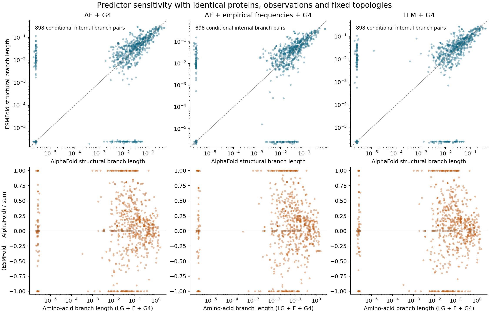

# Matched predictor controls for sequence and structural branch estimates

All **931 native fixed-topology fits** completed and passed independent
tree/report readback and full provenance closure. This adds a fitted predictor
sensitivity control to the fungal project. It does not establish significant
structural acceleration or complete any of the eight biological aims.

## Matching and complete scope

The input workflow retains all **125 marker slots and 70 working tree views**,
the original 526-entry sampling manifest and all five tree cohorts. All 8,750
marker/view cases remain: 4,970 have enough matched observations and 3,780
are explicitly insufficient. All 4,523,750 original internal marker/branch
slots are accounted for, including missing, terminal and shared projections.

The predictor overlap has 673 taxon/marker cells with identical complete
encoded protein sequences. Sequence/length/model identities, coordinate and
encoding checksums, and qualified original alignment coordinates were freshly
verified. Each taxon needs at least 50 jointly observed positions and 30% of
the original marker columns. The amino-acid and both structural alphabets
share exactly the same taxa, columns and unknown masks.

The ready control includes **71 markers and 21 fungal taxa**, with 4–16 taxa
per input. It contains no outgroups and is concentrated in a small number of
genera, especially *Suillus*. It is a selected predictor control within the
full study, not a replacement for broad fungal sampling. The primary project
panel still includes approximately 25 outgroups.

Exact input/topology reuse across views leaves 133 unique inputs supporting
all 4,970 ready comparisons, each with its original mapping. Multiple original
branches can collapse into one internal path; that path is never assigned to
one original branch as an acceleration. There are 898 distinct conditional
internal split estimates across the 133 inputs.

DendroPy reconstructed producer topologies from compatible unrooted splits.
The independent reader used Bio.Phylo to prune original raw trees and checked
every represented ready-case split, alignment, original position, membership,
input identity and mapping. All 125 marker slots and 70 views remain public.
[Input closure](../metadata/matched_predictor_branch_inputs_completed_20261003_v1.json)
binds 5,834 sources/artifacts and both original execution journals.

## Native fits and independent readback

Each input receives seven fits: one amino-acid LG+F+G4 fit and AlphaFold/ESMFold
structural-alphabet fits under AF+G4, AF+F+G4 and LLM+G4. All use the same fixed
unrooted topology, retain identical taxa, begin with branch lengths 0.1, and
use one native thread. Predictor counterparts share a deterministic
model-specific seed. IQTree 3.0.1 and the published matrices are checksum
pinned; [model provenance](../metadata/3di_substitution_model_receipt.json)
remains unchanged. No topology search or structural prediction occurred.

All 931 fits have valid outputs and zero unresolved inputs. Independent
DendroPy graph traversal checked all **15,365 branch values**, fixed splits,
taxon identities, finite nonnegative lengths, report/tree agreement and input
dimensions/likelihood. [Native closure](../metadata/matched_predictor_branch_fits_completed_20261003_v1.json)
binds **17,029 sources/artifacts and two original journals**. This proves
execution/output integrity, not a global ML optimum or model adequacy.

The software gate checked seven actual synthetic native fits, all 931 real
role configurations, full mocked serialization with two explicit failures,
and eight altered exports. The input gate passed the complete 8,750-case
synthetic grid and seventeen malformed mask/mapping/file cases. These are
software fixtures in the full design, not a biological pilot. An initial
fitting software invocation failed because the systemd user PATH lacked
IQTree, before any native fit. Its evidence remains preserved. A separate
namespace with explicit PATH passed with unchanged scripts; production uses
an absolute executable path.
[Input gate](../metadata/matched_predictor_branch_inputs_software_validation_20261003_v1.json),
[native gate](../metadata/matched_predictor_branch_fits_software_validation_20261003_v2.json)
and [original transports](../metadata/matched_predictor_branch_fit_original_transports_20261003_v1.json).

## Descriptive results and small-branch sensitivity

All **6,585 matched branch/model pairs** are exported, including 2,694
conditional internal comparisons: 898 per structural model. The internal
median absolute symmetric source difference, `abs(ESM − AF)/(ESM + AF)`, is
0.208–0.232 across models. This is a dimensionless descriptive comparison of
selected, correlated points, not percentage physical change or a calibrated
evolutionary effect.

Many large relative differences involve one very small fitted branch. At the
explicit descriptive threshold `1e-5`, 270–273 of 898 internal pairs per model
have at least one structural estimate at or below the threshold. Among the
remaining 625–628 pairs, median absolute symmetric difference is still
0.202–0.223. The 90th percentile is 0.589–0.604, compared with approximately
0.9995 before restriction; the `1e-4` table shows similar medians. Thresholds
are analyst review definitions, not asserted IQTree defaults, experimental
error boundaries or automatic exclusions. No native value was replaced.

The first `1e-6` report remains preserved. A separate V2 report adds the
`1e-6`, `1e-5`, `1e-4` sensitivity grid after inspecting the first figure.
This is exploratory description, not prespecified hypothesis testing.
Alternative views reuse proteins/observations and are not independent
biological replicates.



Top panels compare AlphaFold and ESMFold internal structural-alphabet branch
lengths. Bottom panels show signed symmetric source difference against the
common amino-acid branch estimate. Lengths are expected state substitutions
per site, not physical displacement, calibrated time rates or selection.
Log axes retain positive points without adding pseudocounts.
[PDF](figures/matched-predictor-branch-sensitivity-20261003.pdf),
[model summaries](tables/matched-predictor-source-sensitivity-20261003.tsv),
[threshold sensitivity](tables/matched-predictor-small-branch-sensitivity-20261003.tsv),
[all 70 views](tables/matched-predictor-all-view-coverage-20261003.tsv)
and [all 125 slots](tables/matched-predictor-all-marker-coverage-20261003.tsv).

The full table stays outside Git at
`results/phylogeny/matched-predictor-branch-summary-20261003-v2/all_matched_branch_points.tsv`.
The [summary receipt](../metadata/matched_predictor_branch_summary_20261003_v2.json)
and [public artifact hashes](../metadata/matched_predictor_branch_published_artifacts_20261003_v1.json)
bind it and all public copies. Every serialized TSV row was read back
exactly, and the figure was visually inspected.

## Resources and reproduction

Input producer/reader/closure each used two CPUs, 8 GiB and no swap. Fitting
used four single-thread workers under four CPUs/12 GiB/no swap. Each native
process had 2 GiB address space, 300 CPU seconds, 600 wall seconds and an
8 MiB per-file cap. A 128 GiB disk guard and conservative 96 GiB output
allowance were recorded before launch. Caps/planning are not measured memory
requirements or an ETA. Every attempt retains original PID/create-time/command
identity and outcome, with no automatic retries or orphan adoption. Actual
native worker wall times sum to 408.15 seconds, not batch elapsed or CPU time.

Software input/fit checks used 31.02/15.95 child CPU seconds and peak child
RSS 371,478,528/141,168,640 bytes. Read-only summaries retain their own original
resource records. No GPU prediction or new cost occurred.
[Original controller checks](../metadata/matched_predictor_branch_execution_checkpoint_20261003_v1.json).

```bash
/home/bizon/anaconda3/bin/python scripts/prepare_matched_predictor_branch_inputs.py --plan metadata/matched_predictor_branch_inputs_plan_20261003_v1.json
/home/bizon/anaconda3/bin/python scripts/readback_matched_predictor_branch_inputs.py --plan metadata/matched_predictor_branch_inputs_plan_20261003_v1.json
/home/bizon/anaconda3/bin/python scripts/run_matched_predictor_branch_fits.py --plan metadata/matched_predictor_branch_fits_plan_20261003_v1.json
/home/bizon/anaconda3/bin/python scripts/readback_matched_predictor_branch_fits.py --plan metadata/matched_predictor_branch_fits_plan_20261003_v1.json
```

Completed outputs refuse duplicate execution. Reproduction requires new
explicit output/plan identities and corresponding pins, with complete upstream
retrieval/qualification; never overwrite archived plans or failed evidence.
Large models, native outputs and full hash archives remain outside Git. The
environment records numerical/parser packages; the native binary is separately
pinned in the production plan.

## Remaining scientific work

Prediction source and near-zero branch behavior require uncertainty/model
controls before interpreting acceleration. Joint alignment/site resampling,
boundary-aware calibration, direct coordinate/experimental benchmarks and
accepted species/gene-family framework remain required. This selected
comparison does not isolate all confidence selection, training, model-context
or annotation effects, establish orthology, or reconstruct ancestral changes.

Broad-lineage sequence–structure models, acceleration tests, domain events,
duplication/ecology/functional-site/selection analyses, adequate ancestral
uncertainty and the remaining structural atlas are unfinished. The full
corrected ancestral startup and covariance qualification continue separately.
All eight biological aims remain incomplete.
