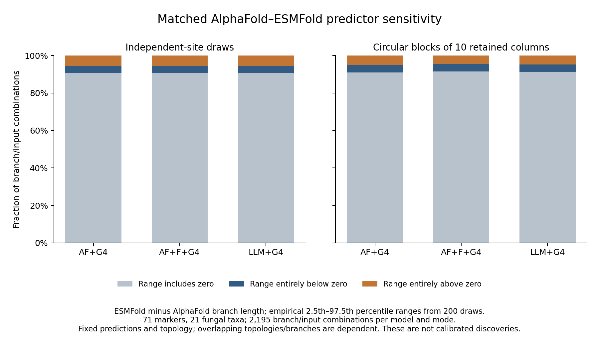

# Complete paired predictor distributions

All **53,200 paired draws** now have independent native-output readback and
complete provenance closure. A fresh check verifies all 176,656 source/output
bindings and original native summaries/journals. The complete descriptive
summary covers **13,170 rows**: 2,195 branch/input combinations under each of
three structural models and two resampling modes. Every original draw remains
included; none is excluded for an inconvenient outcome.



[Exportable PDF](figures/matched_predictor_paired_ranges_20261004.pdf).

Each row compares ESMFold minus AlphaFold expected structural-state
substitutions per site under the same model, fixed topology and sampled
alignment columns. Two hundred draws give empirical 2.5th, median and 97.5th
percentiles, sample mean/SD, positive/negative/exact-zero counts, predictor/AA
quantiles and point-fit counterparts. Separate binomial Monte Carlo bounds
describe precision of the conditional positive-draw fraction; they do not
quantify biological effect coverage. Even zero positives among 200 draws
does not imply a precisely zero conditional probability.

Most empirical central ranges include zero. For AF+G4, the site draws give
1,989 ranges including zero, 120 entirely positive and 86 entirely negative;
block draws give 1,998, 110 and 87, respectively. These are descriptive counts
of dependent branch/input combinations, not significant discoveries. The
other two models and every original branch/input remain in the full table.

The dataset conditions on fixed predictions and model/topology eligibility.
It represents **71 markers and 21 selected fungal taxa**, often Suillus, with
no outgroups. Shared resampling groups preserve pairing across alternative
topologies. Overlapping taxa, branches, models and topologies do not become
independent biological replications. Neither these counts nor the plotted
ranges establish predictor equivalence, full-lineage structural acceleration,
positive selection or calibrated confidence intervals. Direct-coordinate and
experimental controls, model/boundary/coverage assessment, full phylogenetic
uncertainty and broad fungal replication remain required.

The independent summary reader checks every row against all 53,200 original
arrays/6,146,000 branch values. It uses sorted linear order statistics,
`math.fsum` moments and binomial-tail equations to check Monte Carlo bounds.
Metadata, branch splits, roles, mode/model/input identities and all source
digests are rechecked. Both original bounded summary waits, entire wrapper
payloads and invocation-bound manager records close with exit zero.

- [Complete resampling archive verification](../metadata/matched_predictor_resampling_full_closure_verified_20261004_v1.json).
- [Full summary receipt and file inventory](../metadata/matched_predictor_distribution_summary_20261004_v1.json).
- [Independent summary readback](../metadata/matched_predictor_distribution_readback_20261004_v1.json).
- [Original reader wait/journal closure](../metadata/matched_predictor_distribution_readback_transport_20261004_v1.json).
- [Figure counts and checksums](../metadata/matched_predictor_distribution_figure_20261004_v1.json).

The table is stored outside Git at
`results/phylogeny/matched-predictor-distribution-summary-20261004-v1/paired_branch_distributions.tsv`;
SHA256 `dce7722c72ffec9861d9d928084471382a421360ebc084868bfd8c98deb887ba`.
Original draw arrays, archived native outputs and large journals remain local,
with paths/checksums in the published inventories. Reproduction requires the
completed original source stages, immutable plans and their recorded models
and executable, followed by a fresh explicit output namespace:

```bash
python scripts/summarize_matched_predictor_resampling_v1.py \
  --output NEW_RESULTS_DIRECTORY --receipt NEW_SUMMARY_RECEIPT.json
```

The full reader takes `--source`, `--transport` and a fresh `--receipt`.
Recorded production filenames in the figure script refer to this verified
version; use a fresh version/namespace when repeating the production workflow.
The two summary stages use two CPUs/16 GiB/no swap, one BLAS thread and
12 GiB address space; no native fitting or GPU prediction is added. Summary
wall time was 47.0 seconds and independent replay 34.2 seconds. Actual peak
child RSS and original resource journals are retained; collected manager
memory is not a whole-job peak. All eight scientific aims remain incomplete.
