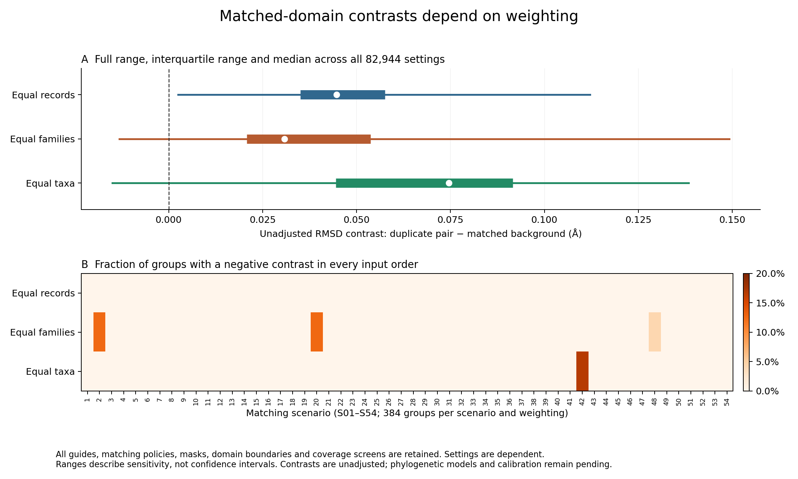

# Complete alignment-order and weighting sensitivity

The sensitivity report waits for successful full independent verification of
all 82,944 record-summary rows. It then groups the four target/background input
orders within each fixed guide, annotation policy, matching scenario, boundary,
mask, cohort and screen. All 20,736 groups and all three weighting choices are
retained, producing 62,208 rows; no preferred order or setting is selected.

For RMSD difference, sequence-identity difference, original-coverage difference,
log aligned-length ratio and confidence-fraction difference, report minimum,
maximum and range across the four input-order combinations. Each range endpoint
is also checked against independently sorted scalar source values. Counts must
be identical across the four orders, and their exact identity grid must be
complete. Empty groups retain zero record counts and blank numeric ranges.

RMSD signs use a stated absolute numerical tolerance of 1e-10. Categories retain
positive in all orders, negative in all orders, all within numerical zero,
mixed sign/zero, and no matched records. Also flag groups where changing record,
family-equal or taxon-equal weighting changes the sign within at least one fixed
input order. This separates a weighting reversal from merely comparing different
orders. All raw verified means remain in the source table.

These are descriptive sensitivity ranges, not uncertainty intervals, tests of
significance or biological duplication effects. Family/taxon weighting is not
phylogenetic adjustment. Raw contrast sign can reflect unmatched sequence
divergence, coverage, predictor behavior or different residue cores. No result
is used to select a favorable threshold or matching scenario.

Script: `scripts/summarize_matched_record_sensitivity.py`.
Output: `results/structural_comparisons/matched-record-sensitivity-20260927-v1`.
Exact process and resources: `metadata/matched_record_sensitivity_launch_20260927.json`.
The stage uses one CPU, 8 GiB RAM and no swap, with a 1 GiB output allowance and
1–15 minute planning range after verification. Production and full independent dataframe verification are complete.
No GPU predictions, new fits or paid infrastructure are used.

## Completed sensitivity results

All 62,208 weighting rows passed independent verification, including 933,120
numeric range values, every source cohort count, sign category and within-order
weighting-flip flag. Proof:
`metadata/matched_record_sensitivity_readback_20260927.json`.

The unadjusted record-weighted RMSD difference is positive in all four orders
for all 20,736 analysis groups. Equal-family weighting is negative in all four
orders for 112 groups; equal-taxon weighting is negative for 64 groups. In
176 groups the sign changes with weighting within at least one fixed order.
No group has an order-driven sign reversal under a fixed weighting at the
stated numerical tolerance. These counts span dependent sensitivity settings,
not independent tests or repeated confirmations of a biological hypothesis.
The observed raw differences still require sequence/coverage adjustment,
phylogenetic/family/control-dependence modeling and prediction-error sensitivity.

## Full-grid figure

[PDF](figures/matched_weighting_sensitivity_20260927.pdf) and
[SVG](figures/matched_weighting_sensitivity_20260927.svg) versions accompany the
PNG. Panel A includes all 82,944 original settings, including all four input
orders, for each weighting. Thin segments show the complete range, thick
segments the interquartile range, and white points the median. These describe
the distribution across dependent sensitivity settings, not sampling uncertainty.
Panel B includes all 54 matching scenarios and all 384 guide/policy/boundary/
mask/cohort/screen groups per scenario for each weighting.

Negative contrasts in all four orders occur in S02 and S20 under family-equal
weighting (48 groups each), S48 under family-equal weighting (16 groups), and
S42 under taxon-equal weighting (64 groups). No scenario has negative
record-weighted contrasts. These settings are dependent and these counts are
not independent biological replications. Scenario definitions remain in the
complete background-control selection's `scenarios.json`; no thresholds or
matching criteria were selected from this figure.

Reproduce with `python scripts/plot_matched_weighting_sensitivity.py` after
choosing an unused output stem if rerunning. The script requires the completed
full source-summary and sensitivity audits and verifies their artifact hashes.
All 15 plotted quantiles are read back using scalar order-statistic interpolation
from the original TSV, and all 162 scenario/weighting cells are checked using
separate CSV counters. The exported tables and provenance receipt are adjacent
to the figures as `matched_weighting_sensitivity_20260927_*` and
`matched_weighting_sensitivity_20260927.receipt.json`. The rendered PNG was
visually inspected for labels and layout. Phylogenetically adjusted effect
estimates, uncertainty and model adequacy remain pending.
