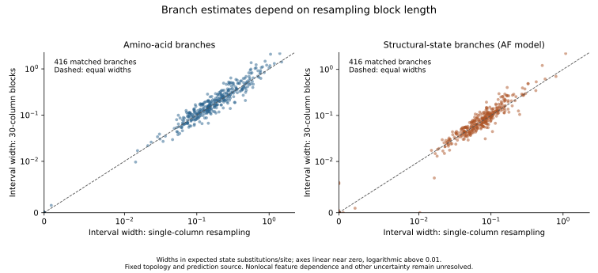
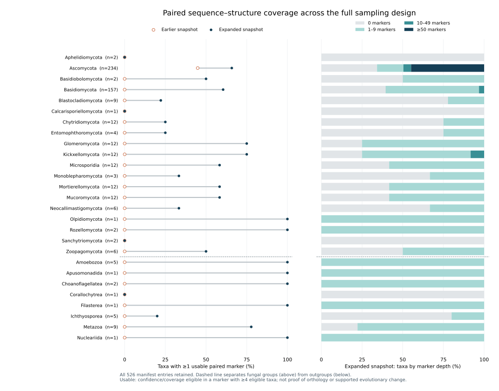

# Matched sequence and structural branch estimates

## Executed checkpoint

The full 526-taxon, 125-marker input space was audited (65,750 taxon-marker rows). The immutable 422-model AFDB acquisition snapshot supplies sufficient confident observations for 52 markers: 4–12 taxa and 91–1,181 retained columns per marker, with 105 taxa represented across these alignments. The other 73 markers remain explicitly listed as coverage-limited. This is a checkpoint within the full sampling design; ongoing acquisitions and predictions will expand coverage.

All 208 requested fits completed. They provide 416 matched unrooted branches, each with one amino-acid estimate and three structural-model estimates. These are point estimates conditional on marker sequence topologies, confidence-selected sites and substitution models. They are not the supported species phylogeny, change per year, physical displacement, or evidence of structural acceleration.

## Observation and alignment rules

`prepare_paired_phylogenetic_inputs.py` verifies the audited encoding, structural mapping and original profile-matrix receipts, model coordinate checksums, encoding sequence hashes, and residue correspondence. Each retained observation requires a canonical aligned amino acid, exact physical residue correspondence, a valid native 3Di feature, all six feature-context residues at pLDDT ≥70, and maximum directional PAE within that context ≤10 Å. Invalid terminal features are missing even when their printed state is the ordinary coil symbol. Nonfinite confidence is missing.

Both alphabets receive exactly the same missing-data mask (`?`). Taxa require at least max(50, ceil(0.3 × original marker columns)) observations; markers require four eligible taxa. Only columns that are entirely missing among eligible taxa are removed. Invariant columns remain, and every output column maps to the original marker and profile alignment. The emitted FASTAs are read back to verify dimensions, taxa and masks. All excluded taxa and markers remain in the coverage audit. These eligibility thresholds do not prove sufficient phylogenetic signal.

## Models and fitting

The authors' [Edmond deposit](https://doi.org/10.17617/3.1MJJBH), version 3.0, supplies the [Garg and Hochberg model](https://doi.org/10.1093/molbev/msaf124) files Q.3Di.AF and Q.3Di.LLM. Retrieval verifies publisher MD5, size and local SHA256. Each file has 190 positive finite lower-triangular exchangeabilities and 20 positive frequencies whose sum is unity within six-decimal publication rounding. Published bytes are retained unchanged.

The [IQ-TREE custom-model format](https://iqtree.github.io/doc/Substitution-Models#user-defined-empirical-protein-models) uses state order ARNDCQEGHILKMFPSTWYV. Here those letters denote structural states, not amino acids; the files contain exchangeabilities plus stationary frequencies, not a preconstructed instantaneous rate matrix. `-st AA` selects the 20-letter parser while the explicit custom file defines structural evolution.

IQ-TREE 3.0.1 searches an unrooted LG+F+G4 amino-acid tree for each matched marker. On this fixed topology (`-te`), it fits structural branches under Q.3Di.AF+G4, Q.3Di.AF+F+G4 and Q.3Di.LLM+G4. The AF matrix with published frequencies is the reference; empirical structural frequencies and the LLM-trained matrix are sensitivities. LLM here describes the published matrix's training source; our observed structural states were extracted from coordinates, not predicted directly from amino acids by ProstT5. The current sequence model also requires adequacy/sensitivity assessment.

Identical sequences remain (`-keep-ident`). Four independent workers use one CPU thread and a requested 2 GB memory allocation per fit. The resource plan preceded execution: 208 fits, provisional 0.1–10 minutes each, 0.1–9 hours at four workers, and 2 GB output headroom. Actual summed elapsed time across individual fits was 160.4 seconds. This short runtime does not forecast full-cohort or uncertainty-analysis costs.

Unrooted branches are identified by canonical taxon bipartitions, with a hash of the complete marker taxon set. A degree-two display root is suppressed by summing its two edge segments. Different marker taxon sets do not produce interchangeable branch identities. Structural fits must preserve the sequence splits exactly. No arbitrary display root is interpreted as an evolutionary ancestor.

## Audit findings and limits

The post-run audit verifies all input and result checksums, the model recorded in each IQ-TREE report, paired masks, complete marker coverage, tree taxa/topologies, branch-table values and total tree lengths. All 208 fits passed those integrity checks. There were warnings in 169 fits, and 85 fits had at least one branch ≤10⁻⁵ substitutions/site. No fitted branch reached 10 substitutions/site. The last threshold is a descriptive flag, not a saturation test or confidence bound.

Warnings include rare states, near-zero internal branches, high missingness, some tree-search convergence diagnostics and small-tree memory messages. They are preserved verbatim in `metadata/paired_marker_fit_warnings.tsv`. An audit of the pinned IQ-TREE source found that its memory-slot minimum can exceed its leaf-count cap for very small trees, triggering the “Too low -mem” message even with a large requested allocation; the source URL, checksum and reasoning are in `metadata/iqtree_small_tree_memory_audit.json`. This allocation diagnostic does not resolve the substantive rare-state or near-zero-branch concerns.

Do not divide structural by sequence branch length when the denominator may be near zero. Do not compare likelihoods across different observed alphabets. Comparisons among models fitted to the same structural alignment require parameter penalties and model checks. Site resampling must be paired between alphabets, and uncertainty work must consider dependence among overlapping and spatially linked 3Di features, topology uncertainty and confidence-driven ascertainment. Broader structure coverage, supported genealogies, model adequacy, alignment/indel sensitivity, prediction-source controls, direct-geometry benchmarking of branch estimates and shared-ancestry statistical analysis remain required before ranking accelerated clades or testing sequence–structure coupling.

## Reproduction and evidence

Run from the repository root, using new output directories if artifacts already exist. The fitting runner is restartable with unchanged configuration and verified completed outputs; an incomplete IQ-TREE job retains its native checkpoint.

```bash
python scripts/prepare_3di_models.py --output data/structural_models/garg-hochberg-v3
python scripts/prepare_paired_phylogenetic_inputs.py \
  --encodings results/structural_alphabet/audited-marker-v2 \
  --snapshot results/structural_markers/snapshot-v2 \
  --matrix results/phylogeny/profile-matrix-50-v1 \
  --output results/phylogeny/paired-structural-inputs-v1
python scripts/run_paired_marker_fits.py \
  --inputs results/phylogeny/paired-structural-inputs-v1 \
  --models data/structural_models/garg-hochberg-v3 \
  --output results/phylogeny/paired-marker-fits-v1
python scripts/summarize_paired_marker_fits.py \
  --inputs results/phylogeny/paired-structural-inputs-v1 \
  --models data/structural_models/garg-hochberg-v3 \
  --fits results/phylogeny/paired-marker-fits-v1 \
  --output results/phylogeny/paired-fit-audit-v1
python -m unittest discover -s tests -p 'test_paired*.py'
```

Seven focused tests cover invalid coil masking, physical correspondence rejection, nonfinite confidence, missing-state site statistics, invalid substitution files, display-root invariance and changed/invalid trees. Full-data validation is provided by the preparation and completed-fit audit, not by those tests alone. Compact receipts, marker coverage, fit summaries, warnings and 416 matched branch rows are versioned under `metadata/paired_*`. FASTAs, coordinate/state arrays, reports, downloaded files and detailed coverage remain outside Git with checksums and paths in receipts.

## Paired resampling and feature dependence

The next executed stage requests 200 paired draws for each of 52 markers under column/block lengths 1, 10 and 30: 31,200 paired draws and 62,400 fixed-topology fits. A draw samples circular blocks uniformly by starting column, concatenates them and truncates to the original alignment length. Both alphabets and all taxa use exactly the same indices. Circular wraparound is a resampling convention, not a claim that protein termini are biologically adjacent. Branches and gamma shape are re-estimated, with AA empirical frequencies recomputed for each draw. Structural fits use the published AF frequencies. Unestimable draws (an entirely missing taxon or no variable columns in either alphabet) are recorded without replacement; unexpected executable failures stop the affected work for inspection.

The resource plan reserves eight CPU workers, one thread and a requested 2 GB per fit, with 20 GB output headroom. A provisional 0.1–5 seconds per fit gives approximately 0.2–11 hours before initialization/I/O. Each request, deterministic PCG64 seed, source columns, alignment, command, tree, diagnostic log and receipt is retained. Per-draw checksums and complete-batch receipts support audit and continuation. The full run's status is established by its terminal receipt, not this planned count.

A feature-overlap audit of the actual paired inputs found 83,455 observed features across 286 taxon-marker alignments and 474,044 within-model pairs of features sharing at least one physical residue. Of these pairs, 223,510 (47.1%) have circular alignment separation ≥10 columns and 138,415 (29.2%) separation ≥30. Such pairs cannot co-occur within one sampled block of the corresponding length. These are potential dependencies, not measured covariances, independent observations or effective sample sizes. The finding shows why block-length sensitivity alone cannot establish valid uncertainty for all nonlocal structural dependencies.

The summarizer verifies every draw's source columns, FASTAs, checksums, model identity, topology and recorded branch lengths before calculating 2.5/97.5 percentiles. It requires at least 90% of requested draws to be estimable for a branch interval. These are conditional sampling-sensitivity intervals, not overall calibrated confidence bounds: protein-site stationarity, topology uncertainty, alignment uncertainty, model fit, prediction errors and nonlocal feature sharing remain unresolved. Paired resampling covariance can later inform an errors-in-variables analysis, but it does not itself measure evolutionary sequence–structure coupling.

```bash
python scripts/run_paired_branch_resampling.py \
  --inputs results/phylogeny/paired-structural-inputs-v1 \
  --models data/structural_models/garg-hochberg-v3 \
  --fits results/phylogeny/paired-marker-fits-v1 \
  --audit results/phylogeny/paired-fit-audit-v1 \
  --output results/phylogeny/paired-resampling-v1
python scripts/audit_3di_feature_overlap.py \
  --inputs results/phylogeny/paired-structural-inputs-v1 \
  --encodings results/structural_alphabet/audited-marker-v2 \
  --snapshot results/structural_markers/snapshot-v2 \
  --output results/structural_alphabet/paired-feature-overlap-v1
python scripts/summarize_paired_resampling.py \
  --inputs results/phylogeny/paired-structural-inputs-v1 \
  --fits results/phylogeny/paired-marker-fits-v1 \
  --resampling results/phylogeny/paired-resampling-v1 \
  --output results/phylogeny/paired-resampling-audit-v1
```

The [original phylogenetic bootstrap paper](https://doi.org/10.1111/j.1558-5646.1985.tb00420.x) motivates character resampling under independence assumptions. Our fixed-topology paired resampling addresses branch-estimation sensitivity rather than bootstrap clade support, and the native feature-overlap audit directly limits that independence assumption here.

### Completed resampling audit

All 156 marker/block batches finished. Of 31,200 paired draws, two were unestimable: marker 4977163at2759, block 30, draw 19 had an entirely missing taxon; marker 5001734at2759, block 30, draw 134 had no variable structural columns. Both remain recorded and were not replaced. The independent audit validated 62,396 fits and produced 2,496 interval rows (416 branches × three block lengths × two alphabets). Warnings were present in 47,590 fits and remain in the original reports. All interval batches had at least 199 estimable draws. Outputs occupy approximately 2.2 GB.

Median AA interval widths were 0.1447, 0.1552 and 0.1516 substitutions/site for blocks 1, 10 and 30; the corresponding structural widths were 0.06374, 0.06793 and 0.06431. Thirty-column blocks widened intervals for 203/416 AA branches and 202/416 structural branches compared with single columns. Thus larger blocks do not uniformly widen intervals, and similar medians do not validate independent sites or resolve nonlocal feature dependence. No acceleration ranking follows from these results.



The figure is generated with `python scripts/plot_paired_resampling.py --audit results/phylogeny/paired-resampling-audit-v1 --output results/phylogeny/paired-resampling-figures-v1`. Five focused tests cover resampling length/bounds/contiguity, paired missingness, deterministic seeds, remote feature overlap and graph components. All passed. Metadata receipts, conditional intervals and batch summaries are versioned; complete replicate artifacts remain outside Git.

## Expanded paired input execution

`run_expanded_paired_inputs.py` is running with control output
`results/phylogeny/paired-expanded-control-v1`. It waits on the recorded live
confidence-controller process identity, requires its complete verified receipt,
and then invokes the existing paired-input preparation on
`audited-gdm-expanded-v1`, `gdm-expanded-v1` and the unchanged
`profile-matrix-50-v1` matrix. Output is
`results/phylogeny/paired-inputs-gdm-expanded-v1`; main execution output is
`logs/expanded_paired_inputs_v1.log` and the child log is `preparation.log` in
the control directory. Configuration and resource estimates are versioned in
`metadata/expanded_paired_input_config.json` and
`metadata/expanded_paired_input_resource_plan.json`.

The planned coverage comparison requires identical matrix, confidence-mask and
eligibility definitions across snapshots and records eligible taxa and retained
columns for every marker. Availability and chosen predictions can both change.
These are acquisition/selection diagnostics, not biological rate estimates.
The job uses a new immutable paired output; interrupted partial preparation
requires inspection and a new output configuration. Expanded input completion,
model fits, support, geometric calibration and uncertainty remain pending.

## Support-aware expanded fitting

The fitting runner now records marker/taxon/column dimensions from its verified
input summary instead of retaining the first snapshot's 52-marker resource
assumptions. An empty eligible set fails before fitting. Expanded runs require
a separate resource estimate based on their completed inputs.

Optional `--alrt 1000 --bootstrap 1000` adds sequence-topology SH-aLRT and
NNI-refined ultrafast-bootstrap analysis. All bootstrap trees are retained;
every replicate must contain the full original taxon identities and the total
must match the requested count. Structural models still estimate branches on
the same fixed AA tree. Default support counts remain zero for the earlier
point-estimate behavior. These options do not provide structural branch-length
intervals or propagate sequence-topology uncertainty into structural fits.
Support-aware expanded fitting has not yet been launched.

Three focused tests cover support only on the searched sequence tree,
rejection of invalid replication counts, and detection of missing, repeated
or changed bootstrap taxon identities and incomplete replicate counts. The
two existing unrooted-edge correspondence tests also pass. Existing outputs
retain their original producer hashes; use a new output for the updated runner.

## Lineage coverage of the earlier paired snapshot

A full-grid coverage summary independently checked the actual 52 paired AA/3Di
FASTA taxon sets against every per-taxon usable-marker count. All 105 retained
taxa are Ascomycota; only two have at least ten usable markers. There are 286
usable taxon/marker combinations. The source snapshot has models for 118 taxa,
also entirely Ascomycota. Its conditional branch analyses therefore provide no
evidence for structural-rate differences across fungal phyla or outgroups.

Across 526 × 49,027 matrix cells, the sequential mask assigns 135,903 observed,
3,009,758 noncanonical/missing sequence, 22,618,607 absent structural mapping,
84 invalid native feature, 23,736 low feature pLDDT and 114 high feature PAE.
These counts include all markers before per-taxon and per-marker eligibility;
they are not the dimensions of the final paired alignments. Missing matrix
sequence includes gaps and noncanonical symbols, and missing structures do not
establish biological absence. Sequential reason counts are not independent
causal effects of each filter.

Reproduce with `summarize_paired_lineage_coverage.py --inputs
results/phylogeny/paired-structural-inputs-v1 --output
results/phylogeny/paired-lineage-coverage-v1` using a new output for reruns. The
same script will assess the expanded paired snapshot after it completes. All
27 manifest lineage/role groups remain in the tables, including zero-coverage
groups. Compact tables and readback receipts are versioned under
`metadata/paired_*coverage*`.

## Expanded paired inputs completed; supported fitting started

The expanded acquisition snapshot passes the unchanged paired masks and
coverage rules for 124 markers, up from 52. Marker 4999134at2759 remains
coverage-limited. Emitted alignments have 5–135 taxa and 73–1,184 columns per
marker; their union includes 322 taxa (304 fungal entries, 18 outgroups).
Independent FASTA readback checked every AA/3Di identity set, dimension,
missingness mask and per-taxon usable-marker count.

Twenty-three of 27 manifest lineage/role groups have usable markers.
Aphelidiomycota, Calcarisporiellomycota, Sanchytriomycota and the Corallochytrea
outgroup group have none in this snapshot. All 526 entries remain in the
coverage audit and ongoing acquisition/prediction design. Group presence does
not imply dense coverage or sufficient support for every branch. The complete
matrix-level sequential mask retains 4,160,922 observations before per-marker
eligibility/column removal; this is distinct from whole-model state counts.

The 496-fit batch has started: each of 124 markers receives an AA LG+F+G4 tree
search with 1,000 SH-aLRT and 1,000 NNI-refined ultrafast-bootstrap replicates,
then AF+G4, AF+F+G4 and LLM+G4 fits on that exact AA topology. Four concurrent
one-thread jobs use up to 2 GB memory each. Input dimensions, a conservative
1–96-hour runtime/10-GB output planning envelope, software and commands are
pinned in `metadata/expanded_paired_fit_resource_plan.json` and
`metadata/expanded_paired_fit_config.json`. Actual optimization has begun.

```bash
python scripts/run_paired_marker_fits.py \
  --inputs results/phylogeny/paired-inputs-gdm-expanded-v1 \
  --models data/structural_models/garg-hochberg-v3 \
  --output results/phylogeny/paired-marker-fits-gdm-expanded-v1 \
  --alrt 1000 --bootstrap 1000
```

These are candidate-marker branch fits conditional on selected sites and
sequence topology. Gene-copy issues, model adequacy, topology and branch-length
uncertainty, phylogenetic placement, geometry calibration and predictor
circularity remain to be addressed before acceleration or selection claims.

### Coverage depth across lineages



The expansion increases represented taxa from 105 to 322, but depth remains
uneven. Of all 526 entries, 204 have no usable paired marker, 200 have 1–9,
17 have 10–49 and 105 have at least 50. All members of the last category are
Ascomycota. Thus the presence of 23 lineage/role groups does not establish
balanced coverage or readiness for comparisons of rates across fungal phyla.
The figure uses every lineage's complete manifest count as its denominator and
retains zero-coverage groups. Thresholds summarize coverage, not statistical
power or independent replication.

Reproduce with `plot_paired_lineage_coverage.py --previous
results/phylogeny/paired-lineage-coverage-v1 --expanded
results/phylogeny/paired-lineage-coverage-expanded-v1 --output
results/phylogeny/paired-lineage-figure-v1`, choosing a new output for reruns.
SVG, PNG and PDF artifacts are available there; the PNG was visually inspected.
Source table hashes, group/denominator equality and nonnegative depth partitions
are checked. The figure receipt and an SVG copy are versioned.

### Feature dependencies in the expanded paired datasets

Applied the existing feature-overlap audit to both full frozen paired datasets,
with one worker per source and a combined 16 GB planning allowance. Both existing
overlap-graph tests passed. Source receipts and a 0.1–4 hour planning range are
tracked in `metadata/expanded_feature_overlap_resource_plan.json`.

The ESMFold audit completed: 72 markers, 4,669 taxon–marker alignments, 714,936
observed features, and 3,901,410 within-model feature pairs sharing coordinates.
Of these overlap pairs, 1,725,795 (44.24%) are separated by at least 10 circular
alignment columns and 1,004,510 (25.75%) by at least 30. These pairs cannot fit
together in a single block of the corresponding length. The calculation measures
potential shared-coordinate dependence, not covariance or effective sample size;
counts across related taxa are not independent observations.

Complete FASTA readback verified every emitted alignment identity, length and
observed-state count, with summary totals and component/count bounds. This is
not an independent reconstruction of every feature graph. Results are tracked
in `metadata/feature_overlap_esmfold*`. The expanded AlphaFold audit remains
running; no result is claimed for it yet.

```bash
OPENBLAS_NUM_THREADS=1 OMP_NUM_THREADS=1 python scripts/audit_3di_feature_overlap.py --inputs results/phylogeny/paired-inputs-esmfold-partial-v1 --encodings results/structural_alphabet/audited-esmfold-partial-v1 --snapshot results/structural_markers/esmfold-partial-v1 --output results/phylogeny/feature-overlap-esmfold-partial-v1
OPENBLAS_NUM_THREADS=1 OMP_NUM_THREADS=1 python scripts/audit_3di_feature_overlap.py --inputs results/phylogeny/paired-inputs-gdm-expanded-v1 --encodings results/structural_alphabet/audited-gdm-expanded-v1 --snapshot results/structural_markers/gdm-expanded-v1 --output results/phylogeny/feature-overlap-gdm-expanded-v1
```

Any expanded branch-resampling analysis must retain these limits: local block
sensitivity alone does not establish calibrated uncertainty for structural
change, and source-specific results cannot be pooled as independent replicates.

### Expanded AlphaFold feature audit completed

The expanded AlphaFold audit completed across all 124 ready markers and 13,565
taxon–marker alignments: 4,148,852 observed features and 23,393,290 within-model
feature pairs sharing coordinates. Of these pairs, 10,951,212 (46.81%) exceed
the reach of a length-10 circular block and 6,777,381 (28.97%) that of length 30.
As for ESMFold, these counts describe potential feature dependence, not measured
covariance, independent observations or effective sample sizes. The source
collections differ in taxa, proteins and length and are not predictor replicates.

The reusable `readback_feature_overlap_counts.py` verifies the entire paired
FASTA identity grid, lengths, observed-state counts, all summary totals, per-row
block fractions and graph count bounds. It passed on both expanded datasets.
The ESMFold v2 readback adds this reusable verification and fraction/total checks
to the earlier one-off readback; original records remain preserved. Neither
readback independently reconstructs all graphs.

```bash
python scripts/readback_feature_overlap_counts.py --overlap results/phylogeny/feature-overlap-gdm-expanded-v1 --inputs results/phylogeny/paired-inputs-gdm-expanded-v1 --output results/phylogeny/feature-overlap-gdm-readback-v1
python scripts/readback_feature_overlap_counts.py --overlap results/phylogeny/feature-overlap-esmfold-partial-v1 --inputs results/phylogeny/paired-inputs-esmfold-partial-v1 --output results/phylogeny/feature-overlap-esmfold-readback-v2
```

Results are tracked under `metadata/feature_overlap_gdm*` and
`metadata/feature_overlap_esmfold_readback_v2.json`. Both feature-overlap runs are
now complete; calibrated branch uncertainty still requires further work.

### Full frozen ESMFold paired fits completed and audited

All 72 markers completed four fits each: sequence LG+F+G4 topology search with
1,000 SH-aLRT and 1,000 UFBoot replicates with BNNI, followed by three structural
models fitted to the same sequence topology. The completed fit audit verifies
288 model fits and 9,122 paired branches, source/alignment hashes, paired masks,
identical topological splits, branch tables and reported total tree lengths.
The input collection spans 199 eligible taxa and remains source-specific.

There are 248 fits with recorded warnings and 208 with at least one branch
≤1e-5; none has a branch ≥10. Warnings include substantial missingness and rare
alphabet states. These are retained for review rather than hidden. Near-zero
branches preclude naive structural/sequence ratios. The estimates remain
conditional on marker topology, confidence selection and model assumptions,
not calibrated acceleration estimates or substitutions per unit time.

```bash
python scripts/summarize_paired_marker_fits.py --inputs results/phylogeny/paired-inputs-esmfold-partial-v1 --models data/structural_models/garg-hochberg-v3 --fits results/phylogeny/paired-marker-fits-esmfold-partial-v1 --output results/phylogeny/paired-fit-audit-esmfold-v1
```

### Paired uncertainty sensitivity expanded to every local marker

Started 200 paired draws at each block length 1, 10 and 30 across all 72 markers:
43,200 draws and at most 86,400 fixed-topology fits. The same sampled columns are
used for AA and 3Di in every taxon. This stage uses the published AF structural
frequencies; it does not repeat the three-model sensitivity on every draw.
Topologies remain fixed; AA frequencies, gamma and branch lengths are re-estimated
as in the earlier resampling protocol. Unestimable draws remain explicit.

The per-run resource plan allocates eight one-thread workers, requested 2 GB per
fit, 24 GB total planning memory and 100 GB disk, with a 1–48 hour allowance.
Original fixed-topology AF-3Di fits total 67.03 worker-seconds; AA refits, process
startup, altered parameters and file output widen runtime uncertainty. The
original AA searches/support are not repeated. All three existing resampling
tests passed. The live producer preserves configuration/seed hashes and per-draw
outputs for restart. Generic producer resource wording now points to the actual
per-run plan instead of quoting the older 52-marker counts.

```bash
OPENBLAS_NUM_THREADS=1 OMP_NUM_THREADS=1 python scripts/run_paired_branch_resampling.py --inputs results/phylogeny/paired-inputs-esmfold-partial-v1 --models data/structural_models/garg-hochberg-v3 --fits results/phylogeny/paired-marker-fits-esmfold-partial-v1 --audit results/phylogeny/paired-fit-audit-esmfold-v1 --output results/phylogeny/paired-resampling-esmfold-v1
```

Receipts, fit/branch/warning tables and resampling plan/configuration are tracked
in `metadata/esmfold_paired_*`. Expanded feature-overlap results still apply:
local blocks miss nonlocal dependencies. These draws estimate conditional
sampling sensitivity, not overall calibrated confidence intervals, shared-ancestry
adjustment or positive selection. Full resampling output remains pending.

### Full local paired-site geometry linked to fitted tree paths

Joined all 72 local markers' fitted sequence and three structural-model tree
path point estimates to 259,780 accepted paired-site geometry comparisons and
6,813 excluded pairs. Every expected taxon pair is accounted for. Paths are
sums of branch lengths crossing the pair's split indicators; all four topologies
and source tree hashes are verified. Independent Bio.Phylo traversals agree for
2,848 deterministic selected paths (up to ten pair identities per marker and
four models). Complete readback confirms every original geometry/exclusion field
is unchanged and all appended paths are finite and nonnegative.

The geometry uses each pair's shared qualified sites; tree fitting uses the full
paired alignment with taxon-specific missingness. This distinction is recorded
rather than claiming identical observed sites across every pair and tree.
Current marker-copy caveats and pending uncertainty status are explicit per row;
absence of a flag does not prove orthology. No structural/sequence ratios,
fitted association, significance or raw-geometry additivity claim is produced.
Resampling intervals and shared-ancestry analysis remain separate requirements.

```bash
OPENBLAS_NUM_THREADS=1 OMP_NUM_THREADS=1 python scripts/benchmark_paired_site_tree_points.py --inputs results/phylogeny/paired-inputs-esmfold-partial-v1 --fits results/phylogeny/paired-marker-fits-esmfold-partial-v1 --audit results/phylogeny/paired-fit-audit-esmfold-v1 --geometry results/structural_comparisons/paired-site-esmfold-v1 --review config/marker_orthology_review.json --output results/phylogeny/paired-path-points-esmfold-v1
```

The run uses one worker, with a prelaunch 4 GB memory/2 GB output plan.
Receipts, complete field-preservation readback and marker coverage are tracked
in `metadata/esmfold_tree_path_point_*`; full point tables remain outside Git.
The resampling producer remains active and unmodified by this benchmark.


## Expanded local resampling: inspected unestimable draw

While the full local run remains active, marker `4867008at2759`, block length
30, replicate 168 reported `all_missing_taxon`. Complete receipt/artifact hash
and original-column reconstruction checks passed for both sampled alignments.
Its 177 sampled columns contain no observed state for `F456999`; the original
paired alignment has 94 observed sites for that taxon in each alphabet.
The result has no fitted models and is retained without replacement. This is
a sampling-induced unestimable draw, not an execution failure. The final run
summary must count all such draws before reporting conditional uncertainty.
This single inspection does not establish the full-run failure frequency.
See `metadata/esmfold_unestimable_draw_4867008_block30_rep168.json`.

## FCS-overlap omission sensitivity: inputs audited, fits running

The audited contamination-report/CDS mapping motivated a sensitivity analysis
that omits marker–taxon observations overlapping FCS EXCLUDE, FIX or TRIM regions.
REVIEW-only observations remain. This tests sensitivity to a defined source-quality
flag; it does not declare the omitted proteins to be confirmed contaminants.

Every baseline marker has an explicit disposition. The earlier ESMFold dataset
loses 16 N. cerealis observations in 16 markers, requiring 64 new fits; its other
56 ready markers retain their unchanged baseline inputs and estimates. The
combined ESMFold dataset loses those 16 plus three A. colombiana observations,
affecting 18 markers and requiring 72 new fits; 71 ready markers are unchanged.
All affected markers retain at least four eligible taxa. No now-all-missing
columns arise in either dataset, so all remaining characters and original column
coordinates are preserved exactly. A whole-species deletion is not applied.

The preparer records all 125 marker dispositions, actual omitted observations,
source hashes and baseline-to-sensitivity column coordinates. Independent
readback validates the exact omission rule and every remaining character in both
alphabets: 506,502 characters for the earlier dataset and 969,968 for combined
ESMFold. It also checks that unchanged or previously ineligible markers are not
silently refitted or promoted. The sensitivity output directories contain only
changed, eligible alignments; their unchanged complements remain in the original
baseline directories.

Both full affected-marker queues are running. They re-infer sequence LG+F+G4
topologies with 1,000 SH-aLRT and 1,000 ultrafast bootstrap replicates plus BNNI,
then fit AF+G4, AF+F+G4 and LLM+G4 structural branches on each new sequence topology.
Each queue uses four one-CPU workers, 2 GB per fit, 10 GB disk allowance and a
conservative 1–48 hour planning window on the authorized host. The earlier
corresponding baseline fits consumed 5.076 summed worker-hours. This is a new
sensitivity run, with separate outputs; no existing input or running script was
changed.

```bash
python scripts/prepare_fcs_paired_sensitivity.py --inputs results/phylogeny/paired-inputs-esmfold-partial-v1 --mapping results/qc/fcs-cds-overlap-v1 --audit results/qc/fcs-cds-overlap-audit-v1 --output results/phylogeny/paired-inputs-esmfold-fcs-sensitivity-v1
python scripts/readback_fcs_paired_sensitivity.py --baseline results/phylogeny/paired-inputs-esmfold-partial-v1 --sensitivity results/phylogeny/paired-inputs-esmfold-fcs-sensitivity-v1 --mapping results/qc/fcs-cds-overlap-v1 --output metadata/esmfold_fcs_sensitivity_input_readback.json
OPENBLAS_NUM_THREADS=1 OMP_NUM_THREADS=1 python scripts/run_paired_marker_fits.py --inputs results/phylogeny/paired-inputs-esmfold-fcs-sensitivity-v1 --models data/structural_models/garg-hochberg-v3 --output results/phylogeny/paired-marker-fits-esmfold-fcs-sensitivity-v1 --alrt 1000 --bootstrap 1000
```

The combined commands substitute `paired-inputs-esmfold-combined-v1` as the
baseline and `esmfold-combined-fcs-sensitivity-v1` in sensitivity input/output
paths. Both queues are already running; do not launch duplicates. Use new paths
for later reproductions. Complete exact commands and observed producer identities
are in `metadata/fcs_paired_sensitivity_launch_receipt.json`; input receipts,
readbacks, marker dispositions and resource plans are versioned separately.

Full fit audits and comparisons on common taxon splits and paths remain pending.
Any topology changes must be distinguished from changes in branch lengths.
Site rates, exposure covariates and sequence–structure coupling also need
recomputation after the omission; refitted branch point estimates alone will not
establish robustness of the earlier coupling results.

## Expanded AlphaFold joint path uncertainty: September 16 continuation

The complete 124-marker resampling audit now covers 372 marker/block batches,
74,400 attempted paired draws and 148,770 validated fits. Fifteen draws were
unestimable. Its two artifact hashes and the full point-benchmark artifact
hashes were independently rechecked before downstream launch. The audit
receipt and 372-row batch summary are versioned under
metadata/gdm_expanded_paired_resampling_*.

Joint path uncertainty has completed for all 737,851 accepted and
7,002 excluded geometry pairs using the existing implementation. Each draw's
branches are summed before calculating path quantiles and covariance, preserving
correlated branch estimation error. This adds AA and 3Di AF summaries at block
lengths 1, 10 and 30; the other structural models remain point estimates.
The calculation uses one CPU core, single-thread BLAS, and a 32-GB memory/
10-GB disk planning allowance. No geometry cohort or fitted tree was changed.

Output results/phylogeny/paired-path-uncertainty-gdm-expanded-v1 now has a complete
receipt and 372 marker/block summaries, archived in
metadata/gdm_expanded_joint_path_uncertainty_receipt.json and
metadata/gdm_expanded_joint_path_marker_block_summary.tsv. Numerical readback
is running on one CPU core with an 8-GB memory planning allowance. The existing
auditor checks all inherited fields, accepted/excluded identities, draw counts,
interval bounds and covariance bounds. For one SHA256-selected pair per marker,
it independently traverses every estimable AA/3Di tree and recomputes path
percentiles, standard deviations and covariance with Python statistics.
This entails 148,770 tree traversals; other pairs' numerical summaries are not
independently recomputed. Validation remains pending its terminal receipt at
results/phylogeny/paired-path-uncertainty-readback-gdm-expanded-v1.
Resource plan and verified process identity are
metadata/gdm_expanded_joint_path_readback_{plan,launch}.json.
These are conditional sampling-sensitivity summaries, not calibrated confidence
intervals, evolutionary coupling estimates or structural-acceleration tests.
Topology, prediction, alignment and model uncertainty remain outside this stage.

The combined ESMFold baseline site-rate export is now running over all 89
eligible markers and four established model specifications (356 fits, 88,820
expected rate rows). It retains each marker's original paired mask and AA
topology, reestimates parameters under Gamma4, and automatically runs the
existing full output audit after successful fitting. Four single-thread fits
run concurrently, with 2 GB per fit and a 5-GB disk planning allowance. The
initial four-core affinity was subsequently widened by the user's temporary
compute increase; the fit concurrency remains four. Commands and source/script
pins are recorded in metadata/esmfold_combined_site_rate_{launch,resource_plan}.json.
Outputs are results/phylogeny/paired-site-rates-esmfold-combined-v1 and its
paired-site-rates-audit-esmfold-combined-v1 audit. FreeRate sensitivity,
optimization checks, exposure integration and expanded coupling are still
pending. These conditional rate multipliers are not rates per year or direct
physical structural changes.
