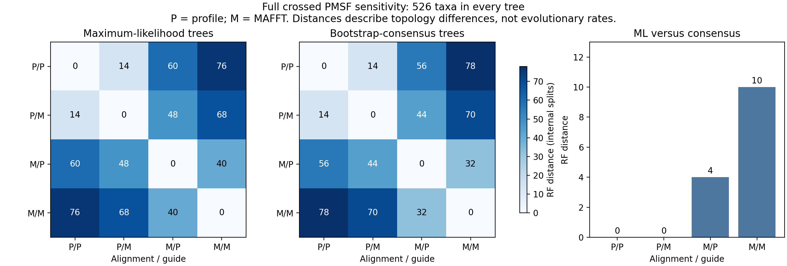

# Full crossed species-tree sensitivity — October 1, 2026

All four LG+C20+F+G4 PMSF analyses and full profile/tree/1,000-bootstrap audits
have completed. The crossed design uses profile or MAFFT alignment matrices
and profile or MAFFT guide trees on the same 526 study taxa. This comparison
advances the species framework; it does not yet establish a final rooted or
dated tree.

Both maximum-likelihood and bootstrap-consensus trees are retained for each
run. All eight views have 523 internal splits. The complete comparison covers
six cross-run ML pairs, six cross-run consensus pairs and four within-run
ML/consensus pairs. The union has 572 splits and 4,576 view/split cells. All
674 incompatible split-pair records preserve support values and a canonical
four-taxon witness. These are overlapping comparisons, not independent
biological conflicts or inferential tests.

Independent DendroPy raw-tree/node/bipartition reconstruction checked every
export field, absent cell, quartet and full grid against bound bootstrap audits.
Closure binds **115 hashes and both exact original process journals**. All nine
rehashed false exports were rejected in isolated complete actual-data copies,
including invented consensus SH-aLRT, changed RF values, promoted weak conflicts,
wrong witnesses and fabricated role boundaries.

ML trees share **480/523 internal splits (91.8%)** across all four runs.
Consensus trees share 483/523; 480 are shared across all eight views. Pairwise
ML RF distances range from 14 to 76; consensus RF distances range from 14 to 78.
Within-run ML/consensus RF distances are 0, 0, 4 and 10 for P/P, P/M, M/P and M/M.
P denotes profile and M denotes MAFFT, in alignment/guide order.

[Standalone SVG](figures/pmsf_four_run_RF_sensitivity_20261001.svg) and
[all 16 comparison rows](tables/pmsf_four_run_split_comparisons_20261001.tsv)
are available. Every plotted RF distance was independently recounted from the
complete verified split-presence grid. Both matrix artists, four bar heights
and 36 exported SVG value labels were checked; the PNG was visually inspected.

ML conflict labels require SH-aLRT ≥80 and empirical UFBoot ≥95 on each branch.
Consensus labels use empirical UFBoot ≥95 with unavailable SH-aLRT explicitly
blank. The six ML comparisons contain 14 overlapping split-pair records meeting
their criteria; the consensus comparisons also contain 14 under their separate
criterion. These labels do not establish correct topology, biological discordance
or significance. Raw likelihoods are not compared between matrices with different
site universes.

The designated 501-ingroup/25-outgroup split is present in six of eight views,
and absent in the profile-alignment/profile-guide ML and consensus trees.
The full [role-boundary table](tables/pmsf_four_run_role_boundary_20261001.tsv)
preserves the result without changing taxon roles or assigning a root.

An additional diagnostic exhausted both matrices and all eight raw trees.
It retains 1,052 taxon/matrix rows, separates canonical amino acids, gaps and
other ambiguous characters, and preserves every equally near split to the
declared outgroup set. BioPython/Counter counts were independently reconstructed
with a complete manual FASTA parser and string counts. DendroPy independently
reconstructed every nearest boundary. Closure binds **123 hashes and the exact
original diagnostic journal**.

The profile matrix has 49,027 sites and MAFFT has 63,750. There are 28 and 31
taxa, respectively, with fewer than half their cells represented by canonical
amino acids. The nearest P/P role boundary adds one ingroup taxon,
**F1243177, Amoeboaphelidium protococcarum**, to all 25 outgroups, with empirical
bootstrap support 73.9%. This taxon has only 164 canonical residues in the
profile concatenation (0.335%) and 204 in MAFFT (0.320%); the remainder is gaps.
This flags sparse representation and placement sensitivity. It does not prove
that missing data caused the topology difference or justify a preferred root.

Reproducibility records:

- [Full crossed plan](../metadata/pmsf_four_run_sensitivity_plan_20261001.json)
- [Final-plan source preflight](../metadata/pmsf_four_run_source_preflight_20261001_v2.json)
- [Independent comparison/journal closure](../metadata/pmsf_four_run_sensitivity_completed_20261001.json)
- [Full actual-data false-export checks](../metadata/pmsf_four_run_false_export_validation_20261001.json)
- [Checked figure and table provenance](../metadata/pmsf_four_run_figure_completed_20261001.json)
- [Full character/boundary diagnostics](../metadata/pmsf_role_boundary_character_completed_20261001.json)

Large full split/conflict artifacts remain outside Git in
`results/phylogeny/pmsf-four-run-ML-consensus-sensitivity-20261001-v1/`.
Full character/nearest-boundary tables are in
`results/phylogeny/pmsf-role-boundary-character-diagnostics-20261001-v1/`.
Each new stage used two CPUs, 8 GiB RAM and no swap, with estimates before
launch and no GPU or paid resources. The preliminary source-preflight record
preceded inclusion of the closure script; only v2 binds the launched final plan.

Taxon/marker coverage sensitivity, justified rooting, hybrid/taxonomic uncertainty,
model adequacy and gene-tree discordance remain required. Topology pruning alone
would not replace native refitting on a sensitivity dataset. Structural effects
must propagate relevant tree/placement uncertainty. All eight aims remain open.

## Native taxon sensitivity refits started — October 1

[Eight prepared matrices](../metadata/species_taxon_refit_inputs_completed_20261001.json)
passed complete independent raw FASTA/character/membership/site-map checks:
233,899,498 retained characters, 4,148 taxon/matrix cells, 2,104 membership rows
and 1,524 detailed lineage-retention rows. The completion binds 188 sources
and both exact original preparation/readback process journals. Original
retained sequences, all 125 markers, all columns and complete partition/site
mappings remain unchanged. The full 526-entry/25-outgroup baseline remains
primary; these sensitivities do not replace the requested sampling design.

| Taxon policy, applied to both aligners | Retained fungal entries | Retained outgroups | Total |
| --- | ---: | ---: | ---: |
| Exclude sparse boundary taxon F1243177 | 500 | 25 | 525 |
| Require at least 10% canonical occupancy in each original alignment | 499 | 23 | 522 |
| Exclude the two curated hybrids | 499 | 25 | 524 |
| Also exclude 21 incomplete species labels | 478 | 25 | 503 |

These are manifest entry counts, not established species identities. The
10% policy loses one complete fine-grained manifest lineage bin, Cryoendolithus;
the strict identity policy loses 12 such bins. The bins are full taxonomy paths
with mixed terminal ranks, not 13 independent major-clade extinctions or
wholesale loss of 13 phyla. Every original/retained/excluded/zero group is in
`results/phylogeny/native-taxon-refit-inputs-20261001-v1/lineage_retention.tsv`.
Sampling changes must accompany later tree comparisons; thresholds are
sensitivities, not calibrated reliability or final filtering criteria.

The [native plan](../metadata/species_taxon_pmsf_plan_20261001.json) fits all
16 combinations: four taxon policies, two full alignments and two conditioning
guides. Each LG+C20+F+G4 PMSF run refits mixture profiles on its actual subset,
then estimates a supported tree with 1,000 SH-aLRT and 1,000 ultrafast-bootstrap
replicates, BNNI and saved bootstrap trees. Topology pruning does not substitute
for inference. Four existing unsupported LG+F+G4 guides match the new hybrid/
label matrices byte-for-byte; these are frozen conditioning inputs with
input/build/config/artifact and raw report/tree/tip checks. Their reuse does
not claim new supported inference or retroactively validated original-process
completion. Four missing guides are freshly inferred.

The [controller launch](../metadata/species_taxon_pmsf_launch_20261001.json)
has started a fresh profile-alignment, sparse-boundary-exclusion guide search
on all 525 retained taxa and 49,027 columns. Every guide and native run uses
its exact matrix/guide/build/settings hashes; native PID/create/command captures
are retained in each run folder. Complete states are reusable with unchanged
configuration; uncheckpointed/changed states require inspection. Only one
mixture run can hold the shared species-PMSF lock. A live process must not be
restarted solely because observation expires.

The dimension-generalized auditor preserves every original full profile, raw
tree/report, 1,000-bootstrap tip/edge/NEXUS and empirical-support check. Its
[complete original-data regression](../metadata/species_taxon_pmsf_general_audit_validation_20261001.json)
passed all 526 taxa, 49,027 profiles and 1,000 raw trees, reproducing the
original 1,046 support rows byte-for-byte. This tests generalized code on
existing complete data, not subset results or model adequacy. Actual 503/522/
524/525 native outputs must pass their complete audits after refitting. Full
independent collection reconstruction, common-tip topology/support/root-boundary
comparison and original-journal/source closure remain required before accepting
these sensitivities as complete.

[Prelaunch resources](../metadata/species_taxon_pmsf_resources_20261001.json):
eight native threads, 650 GiB service limit, IQ-TREE mixture limit 600G, no swap
and one BLAS thread. Homogeneous guides need at least 64 GiB available memory
and use IQ-TREE's 32G limit. Each mixture launch waits for at least 650 GiB
currently available memory and 100 GiB disk reserve. Full baseline native logs
estimated 333,579 MB profile and 434,144 MB MAFFT mixture RAM; these are native
requirements, not measured peak RSS. Supported full baseline runs took about
44.6/58.7 hours at 16 threads; eight-thread subset runtimes are not inferred
from those values. Conservative planning allows 14–72 hours per missing guide
and 24–336 hours per supported run, or 440–5,664 hours for the serial batch
excluding potentially unbounded memory waits. This is an uncalibrated envelope,
not an ETA. Output allowance is 100 GiB. Existing local resources only, no
GPU or new charges. Original running scientific/retrieval jobs were preserved.

Native supported refits and robustness conclusions remain incomplete. Marker
selection/FCS sensitivity, model adequacy, justified rooting, gene discordance,
hybrid subgenomes, accepted species identity and dating uncertainty remain
separate required work. Structural effects must propagate relevant tree and
sampling uncertainty. All eight scientific aims remain incomplete.
