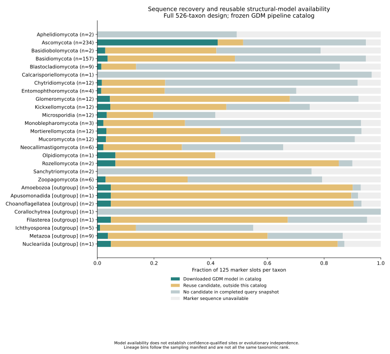

# Prediction-source controls and expanded mapping

Prediction pipelines are now explicit strata in marker mapping. The production default is provider **GDM**, tool **AlphaFold Monomer v2.0 pipeline**. Only exact provider/tool matches are eligible; there is no fallback to another pipeline when that source is missing. The deterministic confidence/version/model-ID ranking is applied within that source, and does not establish accuracy. The previous immutable structural snapshots remain historical checkpoints.

`map_marker_structures.py` freezes complete inventory records before mapping and audits source availability for every marker-protein link. A concurrent unfinished final record is excluded; malformed complete records raise an error. The frozen inventory is saved outside Git with a checksum. Alternatives remain in the inventory and are counted separately from source-eligible models. All 125 markers and the 526-taxon design remain in scope.

The expanded GDM mapping was launched with:

```bash
python scripts/map_marker_structures.py --output results/structural_markers/gdm-expanded-v1
```

Its terminal receipt establishes the final coverage; an existing output directory or partially written residue table does not establish completion. The previous 422-model snapshot continues to anchor the already executed comparisons until a new mapping, PAE and native-state audit are complete. An explicit provider-selection test verifies that a higher-confidence model from another tool cannot replace the requested source.

## Available same-sequence comparison

Every cross-pipeline, exact-sequence model pair in the frozen inventory was compared. At this checkpoint, there is **one distinct sequence** with such a pair: UniProt B9W6V0, 173 residues, GDM model AF-B9W6V0-F1 v6 and contributed ATBC model AF-0000000007270089 v1. The latter reports **ColabFold/AlphaFold2 Monomer v1.5.5 Pipeline**. This is the available subset of the full inventory, not a separately selected pilot or a representative sample of pipeline effects.

Full polymer identity, coordinate checksums, unambiguous complete CA positions, finite coordinates and confidence in [0,100] were verified. The literal polymer-sequence field is accepted when the canonical field is absent, with exact sequence equality and no guessing of modification codes. Both model-specific PAE matrices were retrieved and validated. The contributed PAE response is gzip-encoded; the reader now decodes transport compression before parsing and records the response checksum/encoding separately from the locally compressed JSON artifact.

At pLDDT ≥70 in both models, 171/173 residues remain. Their proper-rotation CA RMSD is **1.086 Å**, and mean PAE-filtered local CA-distance change is **0.193 Å**, retaining 3,331/3,337 eligible local pairs. At pLDDT ≥90, 141 residues remain, RMSD is 0.979 Å and local mean change is 0.163 Å. Confidence filtering changes the residue set; these differences do not show which model is more accurate.

Both pipelines use sequence-derived AlphaFold-family predictions. This comparison does not provide experimental validation, eliminate circularity, quantify systematic source effects across fungi, or establish equivalence of confidence scales. Broader cross-pipeline coverage, ESMFold controls and experimental structures remain required. In particular, do not treat pipeline-induced differences as evolutionary changes between identical sequences.

```bash
python scripts/compare_prediction_sources.py \
  --inventory results/structural_markers/gdm-expanded-v1/source_inventory.jsonl \
  --output results/structure_sources/available-pairs-v1
python -m unittest discover -s tests -p test_structure_source_selection.py
```

The comparison uses all available cross-pipeline pairs, records pLDDT thresholds 0/70/90, and separately labels insufficient coverage. Local CA pairs are within 15 Å in either model and separated by at least three sequence positions; directional PAE must be ≤10 Å in both models for the filtered metric. These are the same geometric definitions used elsewhere in the project. The one-pair resource estimate was recorded before execution: one CPU worker, cached/serial PAE retrieval, less than 1 GB RAM and 10 MB output expected, seconds to minutes, no paid resources.

Receipts and results are in `metadata/prediction_source_*`. The large frozen inventory and model/PAE data remain outside Git. A figure is not needed for this single available sequence; the complete three-row table is retained for reproducibility.

## Expanded model catalog and full-design coverage

The frozen inventory for the expanded mapper now has a separately validated model catalog: **13,153 distinct GDM models**, linked by complete sequence identity to **13,654 marker proteins in 322 taxa**. Every selected coordinate checksum was verified. This makes confidence-matrix retrieval independent of the slower alignment-to-coordinate mapping. Retrieval is running with two workers under the pre-launch estimate in `metadata/expanded_pae_resource_plan.json`; the conservative uncompressed JSON allowance is 56.8 GB. The 412 candidate cache receipts require readback before reuse.

The catalog and residue mapping have different receipts. Before prefetched confidence is used with the final mapping, their model identities, sequence identities, versions and coordinate hashes must agree. Once both producers finish, rerun the PAE retriever against the final mapping in a new output directory: its validated shared cache can supply the matrices while its new receipt binds them to that mapping. Catalog completion does not establish completed residue mapping, confidence-qualified coverage or native 3Di validation.

```bash
python scripts/prepare_marker_model_catalog.py \
  --inventory results/structural_markers/gdm-expanded-v1/source_inventory.jsonl \
  --output results/structural_markers/gdm-prefetch-catalog-v1
python scripts/retrieve_marker_pae.py \
  --snapshot results/structural_markers/gdm-prefetch-catalog-v1 \
  --output results/structural_pae/gdm-prefetch-v1
python scripts/audit_marker_model_coverage.py \
  --catalog results/structural_markers/gdm-prefetch-catalog-v1 \
  --inventory-inputs data/prediction_inputs/markers-full-inventory-v2 \
  --output results/structural_markers/gdm-coverage-audit-v2
```

The coverage audit includes all **526 taxa × 125 markers = 65,750 slots**, partitioned into four mutually exclusive states:

| State | Taxon–marker slots |
| --- | ---: |
| Downloaded GDM model in the frozen catalog | 13,654 |
| Reuse candidate outside this catalog | 17,764 |
| No candidate in the completed query snapshot | 28,422 |
| Marker sequence unavailable | 5,910 |

There are linked models for **304/501 fungal entries** and **18/25 outgroups**. All 204 taxa without catalog models remain in the tables. Aphelidiomycota, Calcarisporiellomycota, Sanchytriomycota and the Corallochytrea outgroup bin have no catalog models. Their recovered marker sequences have no candidate in the completed query snapshot; this is not evidence that the proteins or folds are biologically absent.



The gold category includes nominated retrievals, later downloaded models and potentially other pipelines outside this particular source catalog. Consequently, the prominent Ascomycota coverage advantage cannot be read as a biological difference: acquisition order and separately frozen checkpoints contribute to the pattern. Query scope and database coverage also limit the no-candidate category. Local predictions are not counted as downloaded GDM models. Sequence-identical model reuse preserves taxon links but does not create independent structural observations.

Each group uses an equal 125-marker denominator per taxon. Manifest lineage bins are descriptive and need not have equal taxonomic rank. Counts here are taxon–marker links, whereas the prediction-input queue counts unique sequences; those denominators must not be interchanged. Model availability also precedes the confidence, correspondence and alignment masks used in evolutionary inference.

The audit checks the exact marker universe, per-link protein/sequence identity, completed-inventory states, mutually exclusive count partition and every upstream receipt artifact. All output and script hashes passed independent readback, and the plotted figure was visually inspected. Versioned tables and receipts are `metadata/expanded_marker_*`; full catalog links and coordinates remain outside Git.

## Completed expanded residue mapping

The expanded mapper completed successfully with **4,895,692 matrix-to-structure residue links**, **13,654 marker proteins**, **13,153 models**, and **322 linked taxa**. There are at least four model-linked taxa for **124 markers**, before joint site/confidence filters. Completion and per-marker counts are recorded in `metadata/expanded_marker_mapping_receipt.json` and `metadata/expanded_marker_mapping_coverage.tsv`.

`verify_marker_catalog_mapping.py` checked every artifact in both receipts and exact agreement of the model/version identities, coordinate paths and checksums, complete-sequence hashes, source policy and all taxon–marker links. Its passing receipt is `metadata/expanded_marker_catalog_mapping_agreement.json`. The model-provenance JSON files have different row orders, so semantic identity is checked rather than assuming byte equality.

```bash
python scripts/verify_marker_catalog_mapping.py \
  --catalog results/structural_markers/gdm-prefetch-catalog-v1 \
  --mapping results/structural_markers/gdm-expanded-v1 \
  --output results/structural_markers/gdm-catalog-mapping-agreement-v1.json
python scripts/extract_structural_alphabet.py \
  --snapshot results/structural_markers/gdm-expanded-v1 \
  --output results/structural_alphabet/native-gdm-expanded-v1
```

Native Foldseek extraction was launched for all 13,153 models (6,910,765 full-model residues), using the previously pinned binary/source version and four threads. The prelaunch plan reserves 16 GB RAM and 5 GB additional output space on the existing host; original coordinates are reused through symlinks. See `metadata/expanded_native_3di_resource_plan.json`. Native extraction completion and native feature/confidence validation remain distinct gates. The prefetched PAE still requires completion and a validated receipt bound to this final mapping before downstream use.

Native extraction subsequently finished successfully. Independent export readback checked all **13,153 models**, **6,910,765 residues** and **69,107,650 descriptor values**: exact complete-sequence hashes, state alphabet/length, agreement between database FASTA and descriptor exports, finite ten-value feature vectors, and complete model coverage. There are 26,306 zero-log-sequence-offset rows; their exported letters are not accepted as valid structural observations. The native output occupies approximately 866 MB, within the planned disk envelope.

```bash
python scripts/audit_native_exports.py \
  --native results/structural_alphabet/native-gdm-expanded-v1 \
  --snapshot results/structural_markers/gdm-expanded-v1 \
  --output results/structural_alphabet/native-gdm-expanded-exports-v1.json
```

`metadata/expanded_native_export_audit_receipt.json` pins the checked exports; `metadata/expanded_native_3di_config.json` records commands and software/source identities. This completed export audit precedes coordinate-based reconstruction of native features/partners and the six-residue pLDDT/PAE audit, which remains pending completed confidence acquisition. The existing small-snapshot evolutionary benchmarks have not been rerun on this expansion yet.

## Coordinate audit independent of confidence acquisition

`audit_3di_features.py` now supports a coordinate-only stage by omitting `--pae`. It reconstructs the spatial partner and all ten native features from the coordinates, validates the native validity mask and descriptor tolerance, and records focal and six-residue minimum pLDDT. Its receipt has status `complete_native_3di_coordinate_audit`; it has no PAE receipt or joint-confidence count, and the NPZ files omit `feature_max_pae`. Missing confidence is not represented as zero or accepted as passing.

`qualify_native_pae.py` then joins a completed coordinate audit to completed PAE acquisition only when their mapping receipt hashes and complete model/version universes agree. It checks every encoding and PAE artifact hash and complete-sequence identity, then computes the maximum over all 36 directional entries in each six-residue feature context. Invalid sites remain NaN. It produces the same final encoding fields and confidence counts as the original integrated audit.

The full historical 422-model dataset was reprocessed through both stages. `compare_native_audits.py` verified exact agreement of **all 2,954 arrays**, every model summary and all totals with the earlier completed audit, including NaN placement. The reference contains 215,518 residues and 149,351 valid states passing both six-residue pLDDT70 and PAE10. Three geometry tests and two additional directional-context tests passed. This is a computational regression across an existing full checkpoint, not a new biological pilot or evidence of expanded-audit completion.

```bash
python scripts/audit_3di_features.py \
  --native results/structural_alphabet/native-marker-v2 \
  --snapshot results/structural_markers/snapshot-v2 \
  --output results/structural_alphabet/coordinate-regression-v1
python scripts/qualify_native_pae.py \
  --coordinates results/structural_alphabet/coordinate-regression-v1 \
  --pae results/structural_pae/snapshot-v1 \
  --output results/structural_alphabet/qualified-regression-v1
python scripts/compare_native_audits.py \
  --reference results/structural_alphabet/audited-marker-v2 \
  --candidate results/structural_alphabet/qualified-regression-v1 \
  --output results/structural_alphabet/staged-native-regression-v1.json
```

After this successful regression and a recorded resource estimate, the expanded coordinate-only audit was launched with one worker and numerical-library threads fixed at one:

```bash
OMP_NUM_THREADS=1 OPENBLAS_NUM_THREADS=1 MKL_NUM_THREADS=1 \
python scripts/audit_3di_features.py \
  --native results/structural_alphabet/native-gdm-expanded-v1 \
  --snapshot results/structural_markers/gdm-expanded-v1 \
  --output results/structural_alphabet/coordinate-gdm-expanded-v1
```

Its 13,153 models contain 6,910,765 residues; maximum model length is 2,413. The plan allows 8 GB RAM, 2 GB additional output and approximately 0.5–3 hours on the existing host, with no new charges. Coordinate parsing and quadratic within-model partner calculations can now overlap PAE retrieval. The existing output directory is immutable; a partial directory is not a completed audit or an automatically resumable result. Final mapping-bound PAE acquisition and both completed audit stages are still required before expanded phylogenetic inference. Logs: `logs/native_coordinate_gdm_expanded_v1.log`.
