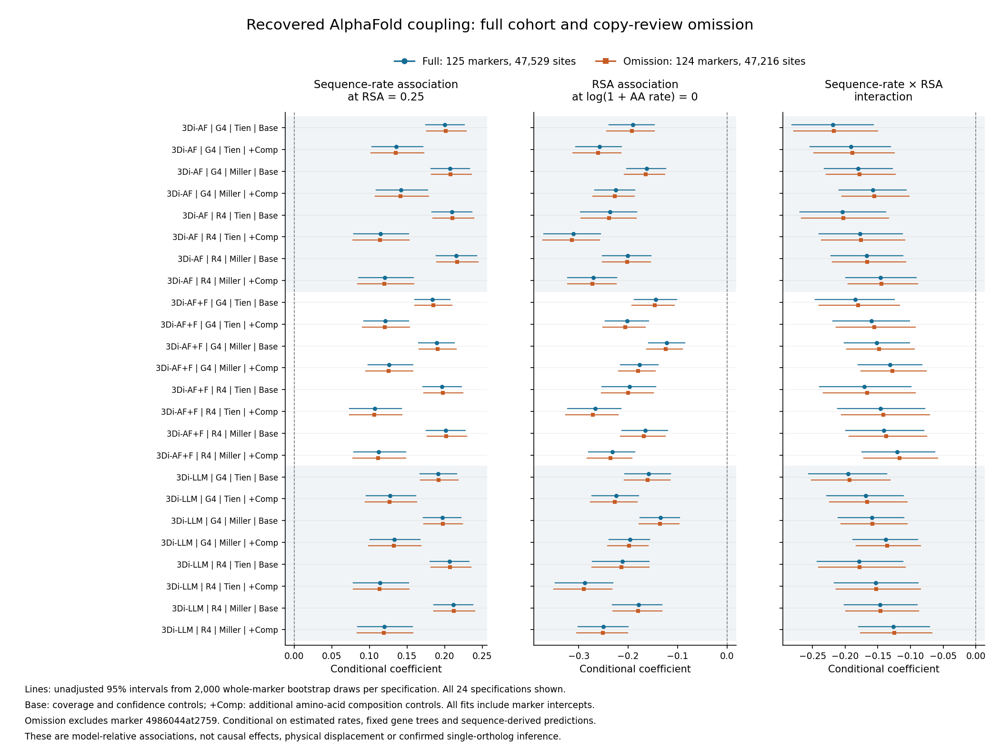

# Recovered AlphaFold site coupling: copy-review sensitivity



[Download the vector figure](figures/recovered_afdb_copy_review_coupling_20260928.svg).
The three panels show sequence-rate association at RSA 0.25, RSA association
at zero log1p amino-acid rate, and their interaction. All 144 plotted
intervals (432 numeric values) were checked against the source tables; the
rendered figure was inspected for clipping and legibility.

The completed exploratory analysis contains 47,529 sites from 125 markers.
Omitting marker `4986044at2759`, whose TFIIB/BRF1 gene-copy assignment remains
unresolved, removes 313 sites and leaves 124 markers. The retained covariate
table is exactly the corresponding subset of the full analysis.

Across all 24 specifications in each cohort, the coefficient of log1p
amino-acid relative site rate at relative solvent accessibility (RSA) 0.25
is positive. Its range is 0.107267–0.215640 in the full cohort and
0.106205–0.216445 after omission. The interaction with RSA is negative in
all specifications: sequence–structure rate coupling is weaker at more
exposed sites within these fitted models. The RSA coefficient at zero
log1p amino-acid rate is also negative throughout.

All 72 focal tests in each cohort have within-cohort BH q < 0.05. All 120
marker-bootstrap contrast intervals in each cohort exclude zero in the
corresponding direction, including the sequence-rate slope at observed mean
RSA. These percentile intervals are unadjusted sensitivity intervals. No
single-marker omission reverses any of the five reported contrast signs in
either cohort. These are dependent specifications and contrasts, not
independent biological replications.

The 72 focal coefficients from the separate reduced-cohort fits agree with
the full-cohort leave-one-marker-out calculation to a maximum absolute
difference of 6.39e-15. This numerical check, exact covariate-subset check,
and source/output hash checks passed. The two cohorts together contain
48,000 × 2 bootstrap fits and 3,000 + 2,976 marker-omission fits.

The outcome is log1p structural-alphabet relative site rate, not physical
displacement. Marker intercepts and marker-cluster uncertainty do not fully
account for shared ancestry across markers. Rate and tree uncertainty,
missingness, extant exposure measurements, structural-alphabet dependence,
and prediction circularity remain unresolved. This sensitivity analysis
does not establish causality, positive selection, or correct orthology for
the omitted marker, and does not complete the project's coupling aim.

The full matched coefficients and summaries are retained in
[matched coefficients](tables/recovered_afdb_copy_review_matched_focal_coefficients.tsv),
[focal terms](tables/recovered_afdb_copy_review_term_summary.tsv), and
[bootstrap contrasts](tables/recovered_afdb_copy_review_bootstrap_summary.tsv).
Provenance is recorded in
`metadata/recovered_afdb_copy_review_coupling_completed_20260928.json`.

Reproduce the comparison in a new output directory:

```bash
python scripts/compare_copy_review_coupling.py \
  --full results/phylogeny/site-coupling-afdb-recovered-full-20260927-v1 \
  --omission results/phylogeny/site-coupling-afdb-recovered-copy-omission-20260927-v1 \
  --full-resampling results/phylogeny/site-coupling-resampling-afdb-recovered-full-20260927-v1 \
  --omission-resampling results/phylogeny/site-coupling-resampling-afdb-recovered-copy-omission-20260927-v1 \
  --output results/phylogeny/site-coupling-copy-review-comparison-afdb-recovered-20260928-v1
```

Generate the figure from the audited comparison:

```bash
python scripts/plot_expanded_copy_review_coupling.py \
  --comparison results/phylogeny/site-coupling-copy-review-comparison-afdb-recovered-20260928-v1 \
  --full results/phylogeny/site-coupling-resampling-afdb-recovered-full-20260927-v1 \
  --omission results/phylogeny/site-coupling-resampling-afdb-recovered-copy-omission-20260927-v1 \
  --expected-full-markers 125 --expected-omission-markers 124 \
  --cohort-label 'Recovered AlphaFold' \
  --output results/figures/recovered-afdb-coupling-20260928-v1
```
