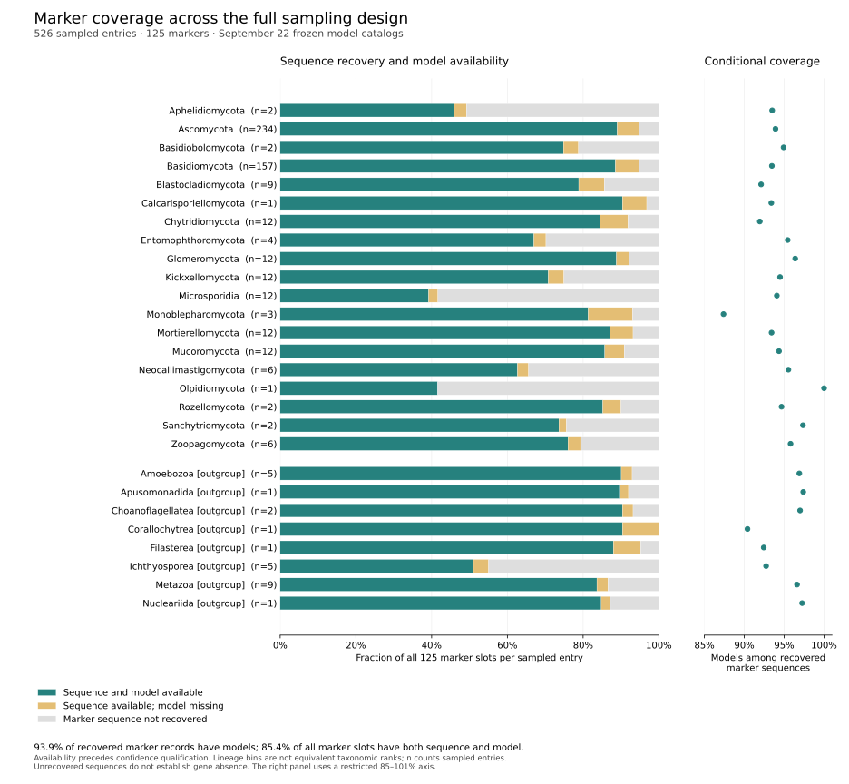

# Remaining recovered-marker model gaps

The current frozen ESMFold and GDM/AlphaFold catalogs leave 3,669 recovered
marker/protein records without a selected model. These correspond to 3,656
unique sequences across 508 sampled entries and 120 markers. They are gaps in
this recovered-marker inventory, not estimates of missing full-proteome
structures or biological gene absence.

Most remaining sequences exceed the completed ESMFold cohorts' 1,024-residue
limit: 3,533 unique sequences (96.6%). The longest is 5,502 residues.

| Protein length (residues) | Unique sequences | Canonical amino acids only | Contains X or B |
| --- | ---: | ---: | ---: |
| 1–512 | 68 | 27 | 41 |
| 513–768 | 30 | 5 | 25 |
| 769–1,024 | 25 | 2 | 23 |
| 1,025–1,536 | 2,718 | 2,701 | 17 |
| 1,537–2,048 | 286 | 284 | 2 |
| 2,049–3,072 | 504 | 502 | 2 |
| Above 3,072 | 25 | 25 | 0 |
| Total | 3,656 | 3,546 | 110 |

Only 34 canonical sequences fall within the previously executed length range.
The 110 sequences with noncanonical symbols comprise 109 containing X and one
containing B; 89 are at most 1,024 residues and 21 are longer. Thus the length
and noncanonical categories overlap. No residues were guessed, replaced or
trimmed, and no prediction run was launched.

## Cached alternative sources

The analysis replayed every record in the same 1,316,471-record frozen
retrieval log, retaining the latest record per accession and screening all
verified model providers/tools for these exact sequence hashes. It found no
alternative verified cached models for any remaining sequence. This does not
establish absence from public databases, later retrievals, unindexed caches or
other local prediction inventories. The current retrieval service continues
independently, so execution queues must be refreshed again before launch.

## Sampling implications

All 27 manifest lineage/role groups are retained in
[`metadata/current_marker_lineage_availability.tsv`](../metadata/current_marker_lineage_availability.tsv),
with recovered sequence counts, model-linked records and unrecovered marker
sequences separated. These lineage bins are not all equivalent taxonomic ranks.
For example, Monoblepharomycota has 305 model-linked records among 349 recovered
records (87.4%) across three entries. Aphelidiomycota has models for 115 of 123
recovered records (93.5%), but 127 of its 250 possible marker slots lack a
recovered sequence. A high conditional model-availability fraction therefore
does not establish adequate marker recovery or comparative sampling.

The residual gaps occur widely across taxa and markers and are strongly
length-associated. Downstream sequence–structure analyses must retain protein
length, missingness and lineage coverage as explicit covariates/sensitivities;
these descriptive counts do not quantify the bias in an evolutionary estimate.

## Next execution decisions

The short canonical sequences can be considered for a small additional queue
once all model inventories are reconciled and a GPU run window is authorized.
The longer sequences need resource estimates outside the completed length
range and review of unusually long annotations/domain architectures. Runtime
measurements from proteins at most 1,024 residues do not establish a reliable
ETA for proteins up to 5,502 residues. Arbitrary truncation would change the
scientific target and cannot substitute for full-length or defensibly defined
domain analyses. Noncanonical sequences require explicit annotation review;
ambiguous residues should remain documented rather than silently resolved.

## Reproduction and checks

Run `python scripts/characterize_remaining_marker_gaps.py --plan
metadata/current_marker_gap_plan.json` with a copied plan selecting a fresh
output directory. The full input inventory, all 125 unaligned marker FASTAs,
availability records and sampling manifest are checksum-pinned. The resource
plan is one CPU, 4 GiB memory, 1 GiB output and an uncalibrated 1–30 minute
allowance; no GPU or paid resource is used.

Outputs are in `results/structures/current-marker-gaps-20260922-v1/`:
`gap_marker_records.tsv`, `gap_unique_sequences.tsv`,
`alternative_cached_models.tsv` and `lineage_marker_availability.tsv`.
Archived receipts are `metadata/current_marker_gap_receipt.json` and
`metadata/current_marker_gap_readback.json`. An independent manual FASTA parser
verified every gap sequence hash, length and symbol set; a separate join of the
526-taxon availability table to the manifest reproduced every lineage count.
The alternative-source log replay was not independently repeated.


## Coverage figure



[Download the figure as PDF](figures/current_marker_coverage.pdf).
The left panel uses all 125 marker slots per sampled entry; the right panel
conditions on recovered marker sequences and explicitly uses an 85–101% axis.
Across all 526 entries, 56,171 of 65,750 marker slots have both sequence and
model (85.4%); the remaining slots contain 3,669 recovered sequences without a
selected model and 5,910 unrecovered sequences. Conditioning on sequence
recovery gives 56,171/59,840 = 93.9%. Neither denominator measures qualified
structural sites or whole-proteome coverage.

Reproduce into a fresh directory:

```bash
python scripts/plot_current_marker_coverage.py \
  --summary metadata/current_marker_lineage_availability.tsv \
  --receipt metadata/current_marker_gap_receipt.json \
  --readback metadata/current_marker_gap_readback.json \
  --output results/figures/current-marker-coverage-20260922-v1
```

Every saved bar count and denominator was checked against the validated source
table. The plotting script checks all 81 segment boundaries/widths and all 27
conditional point positions. The rendered PNG was visually inspected for
labels, legends, axis ranges and clipping. Figure provenance and review are in
`metadata/current_marker_coverage_figure_receipt.json` and
`metadata/current_marker_coverage_figure_review.json`. The figure is descriptive;
lineage bins have unequal sampling and are not equivalent taxonomic ranks.
