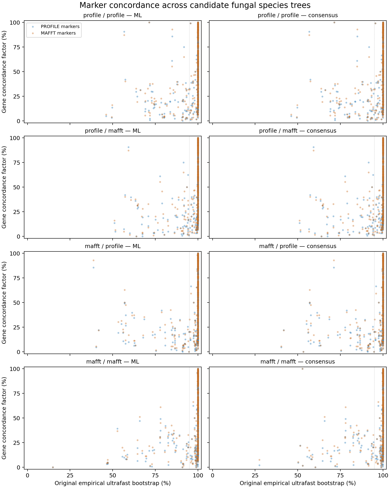

# Full marker concordance across candidate species trees

The full analysis uses all 125 audited profile-alignment marker trees and all
125 audited MAFFT marker trees against the eight completed original PMSF
species-tree views: maximum likelihood and bootstrap consensus for each of
the four crossed matrix/guide combinations. The reference cohort retains
526 working entries, including 25 outgroups. Gene trees may contain fewer
taxa. These are candidate species relationships; species identity, rooting,
model adequacy and the full taxon-sensitivity refits remain under assessment.
The October 2 artifact names use UTC; these jobs started October 1 Pacific
and Eastern local time.

For a reference branch, a gene is decisive if it samples at least one taxon
in each of the four adjacent clades. Gene concordance factor (gCF) is the
percentage of these decisive gene trees that recover the restricted reference
split. Two alternative resolutions and residual discordance are retained
separately. A gene missing an adjacent clade remains uninformative for that
branch, even when it contains many taxa elsewhere. See
[Minh, Hahn and Lanfear 2020](https://doi.org/10.1093/molbev/msaa106) and the
[official implementation documentation](https://iqtree.github.io/doc/Concordance-Factor).

## Complete execution and independent reconstruction

Sixteen native IQ-TREE 3.0.1 jobs have completed, covering 8,368 branch
summaries and 1,046,000 branch–marker cells. The two alignment sets each
contribute 125 gene trees to every reference view. These cell counts include
uninformative genes; they are overlapping computational observations, not
independent biological replicates. Before launch, a full source census passed
all four reference runs, 250 gene trees and 1,037 bindings. Producer loading
rechecks full source hashes and all prior completion receipts.

Reference internal labels are removed before the native calculation because
native reorientation can move existing labels. Original SH-aLRT and empirical
ultrafast-bootstrap support remain linked by the canonical taxon split.
No branch length, gene tree or reference topology is reoptimized by this stage.

The separate DendroPy reader reconstructs all gene and reference bipartitions,
all four adjacent-clade taxon counts and every decisive/concordant/alternative/
residual state. A single mapping between canonical alternatives and native
NNI labels must remain consistent across all genes for each reference branch.
It checks every aggregate count, percentage, verbose cell, native branch ID,
annotated Newick value, NEXUS aggregate and NEXUS per-gene annotation. Native
formats use different numerical precision, which is checked explicitly.
Zero decisive genes yield an unavailable gCF: this build writes all-NA count
and percentage fields and an unlabelled Newick branch. Independently computed
zero denominators are recorded without replacing native NA with a zero factor.

The first production reader rejected an incorrect artifact inventory because
it omitted the annotated NEXUS file. The original native batch, failed reader,
closure journals and launched code are preserved. A new v2 reader and closure
use separate outputs. The expanded native software checks include all possible
states, zero decisiveness and fractional percentages/long branch lengths;
all three cases passed and 26 altered exports were rejected. These synthetic
checks are software validation, not a biological pilot or production evidence.

The full v2 reader and original-journal closure have passed all 16 runs.
The closure verifies 1,217 source/output bindings and the exact original
producer and v2-reader completion journals. Files and commands:

```bash
python scripts/run_species_gene_concordance.py \
  --plan metadata/species_gene_concordance_plan_20261002.json
python scripts/readback_species_gene_concordance_v2.py \
  --plan metadata/species_gene_concordance_plan_20261002.json \
  --validation-plan metadata/species_gene_concordance_readback_plan_20261002_v2.json \
  --output results/phylogeny/full-species-gcf-independent-readback-20261002-v2/receipt.json
python scripts/close_species_gene_concordance_v2.py \
  --plan metadata/species_gene_concordance_completion_plan_20261002_v2.json
```

These paths identify the original run. A reproduction needs new frozen plans
and new output directories; launched plans and output files must not be edited.
The small completion locator is
`metadata/species_gene_concordance_completed_20261002_v2.json`; complete branch
and per-marker ledgers, raw native exports and full hashes remain outside Git.

Each serial producer/reader/closure uses two CPU cores, a 16 GiB memory cap,
no swap and one BLAS thread. Resources were estimated before launch: 2 GiB
output allowance, 100 GiB disk reserve, no GPU or new charges. The 0.01–4-hour
per-stage planning range was uncalibrated; it is not a remaining-time estimate.
The actual native batch took about 43 seconds including source loading.
Existing scientific analyses continue, and GPU prediction remains paused.

## Ledger fields and units

The independent branch ledger has one row per reference branch and marker
alignment (8,368 rows); the cell ledger has one row per branch and marker
(1,046,000 rows). Both include a run identifier. Field meanings:

| Field | Meaning |
| --- | --- |
| `canonical_split_id`, `split_taxa` | SHA256 of the sorted canonical taxon-side JSON and the explicit taxon list; identify an unrooted split |
| `canonical_split_mask` | Hexadecimal bitmask with bit indices from sorted manifest taxon IDs; canonical side is the smaller integer mask |
| `branch_id`, `tree_id` | Native reference-branch ID and one-based row in the frozen alignment-specific gene order; these are not universal node identities |
| `four_clades`, `clade_taxa_counts` | Full incident-clade memberships in the branch ledger and each gene's observed counts in the cell ledger |
| `state` | Concordant, canonical alternative 1/2, residual discordance, or not decisive because an incident clade is missing |
| `decisive`, `concordant`, `not_decisive` | Gene counts per branch; decisive plus not decisive equals 125 |
| `native_nni_mapping`, `native_nni_mapping_identified` | Canonical alternatives corresponding to native NNI labels; ambiguous when both alternatives are unobserved |
| `native_statistics` | Native aggregate strings, retaining all-NA zero-denominator rows |
| `gcf_percent` | Unrounded 100 × concordant / decisive in the joined table; empty when no gene is decisive |
| `original_sh_alrt`, `original_empirical_ufboot` | Original closed support percentages joined by unrooted split; consensus SH-aLRT is unavailable |

All classified gene trees are the audited inferred topologies, including
branches with uncertain support. This stage does not treat them as sampled
posterior trees or mask uncertainty by selecting only strongly supported genes.

## Interpretation and remaining requirements

The complete descriptive table joins every branch to original support:
8,368 rows, 8,358 available gCF values and ten zero-denominator rows retained
as unavailable. The complete table's branch counts, states, gCF values and
16 medians were rechecked against the closed independent ledgers. The rendered
figure was inspected and its source/output hashes and original process
completion checked. [Figure PDF](figures/species_gcf_support_20261002.pdf);
[small summary receipt](../metadata/species_gene_concordance_figure_completed_20261002.json).



Across reference views, median gCF is 52.1–52.6% for profile gene trees and
58.9–60.0% for MAFFT gene trees. Among branches with available gCF and original
empirical UFB >=95, 183–197 branches per view have profile-marker gCF <50%,
and 156–169 have MAFFT-marker gCF <50%. These are dependent descriptive
counts, not tests or probabilities. A median difference does not establish a
preferred alignment. Changing gene coverage can change the denominator;
percentages must be interpreted with their decisive counts.

The complete cell inventory is 494,990 concordant, 58,918 canonical first
alternative, 58,375 second alternative, 313,825 residual discordant and
119,892 uninformative missing-clade cells. These counts overlap across
reference views and do not estimate independent evolutionary events.

Reproduce the descriptive figure and table with a new output destination:

```bash
python scripts/summarize_species_gene_concordance.py \
  --completion metadata/species_gene_concordance_completed_20261002_v2.json \
  --plan metadata/species_gene_concordance_figure_plan_20261002.json \
  --output results/phylogeny/full-species-gcf-support-summary-20261002-v1
```

This identifies the original frozen plan; a reproduction needs a new plan and
output directory. Figure production used one CPU, 4 GiB, no swap/GPU/charges;
resources were estimated before launch. All large tables remain outside Git.


Raw gCF conditions on estimated gene topologies. It does not propagate gene
tree estimation uncertainty, resolve orthology or distinguish incomplete
lineage sorting, introgression, alignment error and model misspecification.
It is neither a bootstrap probability nor evidence that discordance caused
structural change. It complements the earlier supported-conflict diagnostic,
which is not a gCF calculation. Marker/taxon/model/root sensitivities,
gene-tree qualification and reconciliation uncertainty remain required before
these branches support evolutionary structural tests. All eight scientific
aims remain incomplete.
