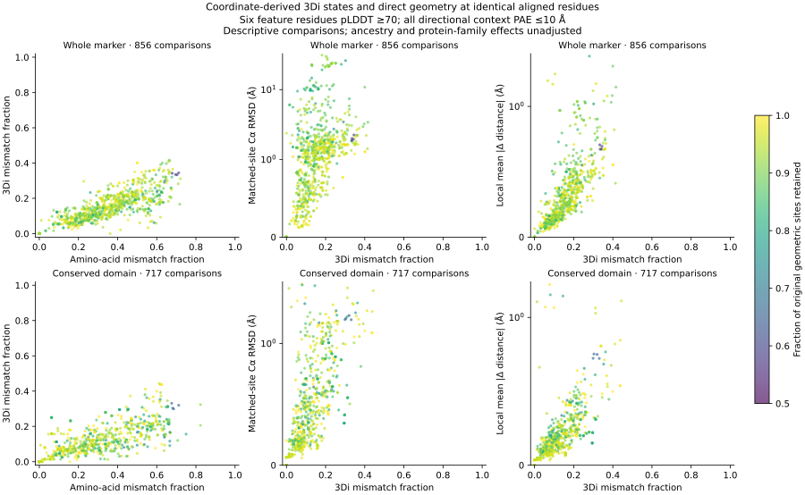

# Coordinate-derived structural alphabet benchmark

This stage evaluates 3Di state differences alongside direct geometry on exactly
the same aligned residues. It is an executed benchmark of the existing
422-model AFDB snapshot, not a completed benchmark of branch estimates or the
full fungal structural atlas.

The installed Foldseek executable reports commit
`e3fadcd07f971e864c094ac4f3a78bf4ed845e07`; its binary checksum, commands and
pinned source hashes are recorded. Native `createdb` derives states from the
coordinates, using four CPU threads and float CA storage. No ProstT5 sequence
prediction is used. The shared header database is linked with `lndb` before
exporting the 3Di FASTA. Native `structureto3didescriptor` exports the amino-acid
sequence, 3Di states and ten geometric features for each residue. See the
[Foldseek documentation](https://github.com/steineggerlab/foldseek) and
[original publication](https://doi.org/10.1038/s41587-023-01773-0).

An initial extraction needed the shared-header link before its FASTA conversion
could complete. Original command/error logs remain in native-marker-v1.
The complete scripted extraction was subsequently executed as native-marker-v2;
all 422 amino-acid sequences, state strings and descriptor records matched
exactly by model identity. File order is not assumed. The initial feature-audit
attempt stopped on output-path bookkeeping after one model; audited-marker-v2
is the completed, validated audit used below.

## Validity and feature confidence

The pinned [alphabet implementation](https://github.com/steineggerlab/foldseek/blob/e3fadcd07f971e864c094ac4f3a78bf4ed845e07/lib/3di/structureto3di.h)
assigns invalid residues to an ordinary coil state. Therefore an invalid state
cannot safely be recognized from its exported letter. We preserve a separate
validity mask; legitimate coil-state observations remain usable.

The [feature implementation](https://github.com/steineggerlab/foldseek/blob/e3fadcd07f971e864c094ac4f3a78bf4ed845e07/lib/3di/structureto3di.cpp)
uses focal residue i, its spatial partner j, and the backbone neighbors of both.
The audit reconstructs virtual centers, partner selection and all ten features
from the original full-backbone coordinates, including approximation of missing
CB positions. It compares every native descriptor to the reconstructed features.
This audits the encoding's inputs; neural discretization still comes from the
native executable. Native feature text has four significant digits, so the
comparison uses relative tolerance 0.00052 and absolute tolerance 1e-10.
Recovering j solely by inverting its rounded logarithmic sequence offset can
be ambiguous and is not used. Rigid-motion invariance, endpoint masking and
missing-backbone rejection tests passed.

All 422 complete sequences, native DB exports and native descriptors agreed.
All coordinate hashes, sequence identities, CA confidence values and PAE
provenance were checked. There are 215,518 residues and 214,674 valid states;
844 terminal states are explicitly invalid. An incomplete or degenerate
backbone would require review rather than silently acquiring a valid state.

For each valid residue, the audit stores its partner index, minimum CA pLDDT
across i−1, i, i+1, j−1, j, j+1, and maximum PAE over all directional pairs in
that six-residue context. The resulting model-level totals are:

| Confidence condition | Retained valid states |
|---|---:|
| Focal residue pLDDT ≥70 | 162,620 |
| All six feature residues pLDDT ≥70 | 149,496 |
| All six pLDDT ≥70 and maximum context PAE ≤10 Å | 149,351 |

These counts describe this snapshot, not all fungal proteins. PAE and pLDDT
are prediction-confidence measures, not experimentally calibrated guarantees.

## Matched-site benchmark

`benchmark_3di_geometry.py` reproduces all 858 original pLDDT≥70 whole-marker
comparisons and all 738 eligible domain comparisons. It verifies the physical
residue-to-alignment correspondence, then applies three confidence regimes.
For each regime, amino-acid mismatch, 3Di mismatch and direct geometry are
computed on identical retained positions. Whole-marker comparisons need at
least 50 residues, domain comparisons at least 30, and both need at least half
their original geometric site set. Invalid states and insufficient coverage
are excluded with an audit; neither becomes a zero difference.

| Regime | Whole-marker comparisons | Domain comparisons |
|---|---:|---:|
| Valid states and focal pLDDT ≥70 | 858 | 738 |
| Six-residue pLDDT ≥70 | 856 | 718 |
| Six-residue pLDDT ≥70 plus context PAE ≤10 Å | 856 | 717 |

The output contains 4,743 accepted and 45 excluded scope/regime rows. These
are repeated, dependent observations, not 4,743 independent evolutionary events.
The strictest regime retains a median 92.69% of the original whole-marker
sites and 94.12% of domain sites. Differences between regime summaries reflect
changes in both residue composition and retained comparisons; they are not
estimated causal effects of uncertainty.



3Di is a discrete 20-state encoding represented by amino-acid-like letters;
the states are not amino acids. The plotted mismatches are uncorrected state
fractions. The native feature vector also includes signed sequence-position
separation between focal and partner residues; insertion/deletion and partner
changes therefore require sensitivity analysis alongside geometric changes. These mismatch fractions are neither substitution-corrected branch lengths nor a
conversion into Angstrom displacement. Geometry includes proper rigid-fit CA
RMSD and the previously defined local distance-change metric, which is not
standard lDDT. No pooled correlation significance or evolutionary acceleration
claim is made. Shared ancestry, protein-family effects, sampling and sequence
saturation still require explicit modeling.

## Relation to the domain-placement control

For marker `4975094at2759`, Pseudovirgaria hyperparasitica vs Pachysolen
tannophilus, the strict feature-confidence regime retains 676 whole-marker
positions. Their 3Di mismatch is 0.2322, amino-acid mismatch 0.5030, CA RMSD
23.648 Å and local mean distance change 0.793 Å. The corresponding PH_SPT16
domain retains 93 positions: 3Di mismatch 0.1720, amino-acid mismatch 0.2903,
independent-fit RMSD 0.586 Å and local mean distance change 0.203 Å.

Those are newly matched site sets and should not be substituted for the earlier
unfiltered counts. Together with the separate interdomain PAE assessment, they
show why local feature confidence does not establish confidence in relative
placement of distant domains. Global geometric comparisons and domain-level
checks remain necessary even when structural-alphabet features are confident.
This is an artifact-control example, not a proven biological rearrangement.

## Reproduction and remaining work

```bash
python scripts/extract_structural_alphabet.py \
  --snapshot results/structural_markers/snapshot-v2 \
  --output results/structural_alphabet/native-marker-v2
OPENBLAS_NUM_THREADS=1 python scripts/audit_3di_features.py \
  --native results/structural_alphabet/native-marker-v1 \
  --snapshot results/structural_markers/snapshot-v2 \
  --pae results/structural_pae/snapshot-v1 \
  --output results/structural_alphabet/audited-marker-v2
OPENBLAS_NUM_THREADS=1 python scripts/benchmark_3di_geometry.py \
  --encodings results/structural_alphabet/audited-marker-v2 \
  --snapshot results/structural_markers/snapshot-v2 \
  --comparisons results/structural_comparisons/snapshot-v1 \
  --domains results/structural_domains/comparisons-v1 \
  --output results/structural_alphabet/benchmark-v1
python scripts/plot_3di_benchmark.py \
  --benchmark results/structural_alphabet/benchmark-v1 \
  --output results/structural_alphabet/figures-v2
python -m unittest discover -s tests -p test_3di_features.py
```

Existing output paths are immutable; choose new paths and propagate them for
reruns. The commands above record the actual provenance: the completed audit
used native-marker-v1, while native-marker-v2 independently reproduced its
contents. A clean rerun can feed the newly extracted native directory directly
to the auditor. Coordinate/descriptor/NPZ/benchmark files remain outside Git;
model summaries, software configuration, validation receipts, a six-row regime
summary and the figure are tracked.

This benchmark must expand as the atlas grows. Structural-alphabet substitution
models must be evaluated before branch inference; an ordinary amino-acid model
must not be assumed appropriate because the symbols resemble amino acids.
Branch estimates still need comparisons with direct geometry, uncertainty,
alignment and taxon sensitivities. Native coordinate encoding does not remove
sequence-derived prediction circularity: alternative predictors and experimental
structures remain required controls.

## Expanded confidence-qualified encodings completed

All 13,153 expanded GDM models have completed native coordinate and confidence
qualification. Their 6,910,765 residues contain 6,884,459 valid native states
and 26,306 explicitly invalid states. Of the valid states, 5,136,862 have focal
pLDDT at least 70, 4,719,638 meet that threshold across all six feature-context
residues, and 4,714,151 additionally meet maximum directional context PAE at
most 10 Å. These counts apply to complete model sequences, not just aligned
marker positions, and repeated model reuse across taxa is not independent data.

The controller checked complete acquisition, exact catalog/final-mapping
agreement, final-mapping-bound cache validation, native qualification and every
per-model NPZ hash/identity/joint count. Completed receipts are versioned as
`metadata/expanded_confidence_pipeline_receipt.json` and
`metadata/expanded_qualified_encoding_receipt.json`; detailed encodings and
model summary remain under `results/structural_alphabet/audited-gdm-expanded-v1`.
Expanded paired alignment preparation has started. Geometry calibration,
lineage-qualified coverage, structural model adequacy and evolutionary
inference for this expanded snapshot remain pending.
