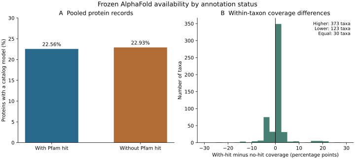

# Annotation-stratified structural availability

This full-data analysis measures the frozen AlphaFold catalog's availability
within each taxon separately for representative proteins with any Pfam
 gathering-threshold hit and proteins without such a hit. It covers all
5,815,847 proteins, preserving 1,319,513 available model links. Counts and
fractions describe this source snapshot before confidence qualification;
local ESMFold additions are excluded.

The primary calculation streams all annotation protein/query links and joins
the original catalog TSV by exact taxon, protein and sequence identity. It
requires every catalog protein to be consumed once and every source protein
to be counted. A second calculation uses SQLite grouping and the independently
verified structure/family bridge to reconstruct all per-taxon annotation strata.
The two complete tables must agree, and every taxon's totals must match the
original catalog coverage table. Sequence mismatches, missing scope or differing
aggregates terminate the run. Full-CLI fixtures verified the proportions for
a three-protein example and rejection of a mismatched sequence.

Outputs include `taxon_annotation_coverage.tsv` and a receipt with pooled
counts, fractions and source bindings. Pooled and taxon-level contrasts should
be retained separately because taxon sampling can confound pooled comparisons.
Proteins sharing sequence or family and related taxa are not independent
replicates. No significance test, causal effect, domain-loss call or structural
novelty claim is made. Annotation status means any retained raw gathering-
threshold hit, not a validated functional assignment or structural domain.

Script: `scripts/summarize_structure_annotation_coverage.py`.
Plan: `metadata/structure_annotation_coverage_plan.json`.
Output: `results/structures/annotation-stratified-coverage-20260923-v1`.
Unit: `fungal-structure-annotation-coverage-20260923.service`.

The process was confirmed live and recorded in
`metadata/structure_annotation_coverage_launch.json`. Resources are one CPU,
8 GiB RAM, no swap and no GPU. Output planning is 0.01 GiB; runtime planning
is an uncalibrated 0.25–4 hours. The source hashes come from the previously
audited catalogs/databases and are checked before and after the run. Results
are pending; no coverage contrast is reported yet.

## Completed coverage inventory and figure

The full 526-taxon, 1,052-stratum comparison passed both aggregation paths and
all original per-taxon catalog totals. Pooled availability is:

| Annotation status | Representative proteins | With catalog models | Availability |
| --- | ---: | ---: | ---: |
| At least one Pfam hit | 3,792,842 | 855,725 | 22.56% |
| No Pfam hit | 2,023,005 | 463,788 | 22.93% |

Within taxa, availability is higher for hit-containing proteins in 373 taxa,
lower in 123 and equal in 30. The median within-taxon difference is +0.078
percentage points, ranging from −23.70 to +26.34 points. These unweighted taxon
summaries and protein-weighted pooled fractions answer different descriptive
questions; neither demonstrates equal ascertainment or a causal annotation
effect. The per-taxon strata remain available for later sampling sensitivities.

Panel A pools protein records; panel B counts each taxon once, including the
30 ties in the bin containing zero. No confidence intervals or hypothesis tests
are implied. Proteins and taxa are dependent observations. The catalog excludes
local ESMFold additions and predates confidence qualification.

The figure was produced by `scripts/plot_structure_annotation_coverage.py`, with
all fractions and pooled totals checked against the full table and every taxon
accounted for in the histogram. SVG/PDF exports were generated and the rendered
figure visually reviewed. Source bindings, exact histogram bins/counts and
summary values are recorded in
`metadata/structure_annotation_coverage_figure_receipt.json`. The completed
analysis receipt and per-taxon table are archived as
`metadata/structure_annotation_coverage_completed_receipt.json` and
`metadata/structure_annotation_taxon_coverage.tsv`.
