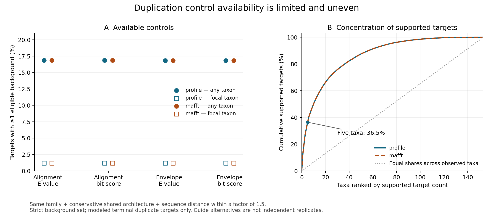

# Terminal sister-pair background inventory

The duplication analysis needs comparison groups before testing an association
between duplication and structural divergence. This inventory begins that work
across all 70,307 profile-guide and 70,412 MAFFT-guide resolved gene trees.
The full inventory and independent reconstruction are complete. Guide comparison,
orthology membership and matching remain downstream; no completed matched
background or duplication-effect test is claimed.

For every internal node with exactly two terminal children, retain both genes,
their taxa, family, node and parent identifiers, reported duplication flags for
the node and parent, both terminal sequence branch lengths and their sum.
Join each gene to the frozen structure bridge and retain four availability
states: two distinct models, identical model, one model, or no models. Missing
models do not remove pairs from the inventory. Internal or multifurcating
sister groups are outside this terminal-pair design; this is not an inventory
of all possible ortholog pairs or all evolutionary events.

Each pair receives one descriptive label, with reported duplication taking
precedence: reported duplication, same-taxon unreported, or cross-taxon
unreported candidate. **An unreported duplication is not proof of speciation.**
Cross-taxon candidates can retain deeper duplication ancestry and losses.
Parent duplication flags are retained separately rather than silently filtering
them away. The two guide outputs are dependent sensitivity alternatives.

Next steps are full independent reconstruction of the inventory, cross-guide
gene-pair comparison, and ortholog-membership checks before matching candidate
backgrounds to duplicated pairs by family and sequence divergence. Domain
architecture, length, confidence, taxon sampling and shared ancestry also need
to enter eligibility, matching or downstream models. Cross-species comparisons
and same-species duplicates differ in evolutionary context; matching alone will
not justify a causal duplication interpretation. No structural outcome is used
to select this initial pool.

Run `scripts/inventory_terminal_sister_backgrounds.py --plan
metadata/terminal_sister_background_plan_20260927.json`. Inputs and imported
helpers are checksum-pinned. Output is under
`results/orthology/terminal-sister-background-inventory-20260927-v1`; each guide
has a TSV and the final receipt records exact counts and hashes. The output
directory must be new. An interrupted run must be diagnosed before any new
version is launched; no partial TSV is a completed inventory.

Known-tree fixtures in `scripts/check_terminal_sister_background_cases.py`
passed canonical gene orientation, path lengths, reported node/parent flags,
all model availability states, same-taxon and multifurcation distinctions,
multiple cherries, and rejection of invalid branches, duplicated labels and
unknown taxa. These fixtures do not replace the full production readback.

The launch reserves one CPU, 8 GiB RAM, no swap, and a 2 GiB output allowance;
the planning range is 0.1–4 hours, not a calibrated ETA. Free disk was about
12 TiB and available RAM about 942 GiB before launch. The service enforces CPU
and memory limits. No GPU predictions or paid resources are used. Process
identity and the source-bound plan are recorded in
`metadata/terminal_sister_background_launch_20260927.json`.

## Full independent readback queued

`readback_terminal_sister_backgrounds.py` waits for the recorded producer
PID/creation time/command to exit, then requires its complete checksum-bound
receipt. It traverses every source tree in postorder, independently reconstructs
parent relationships and terminal pair sets, and compares every output field
against native trees, duplication tables and the frozen model bridge. Output
order within a family is not assumed. Missing, extra or repeated pairs and
changed fields fail the check. Model coverage and candidate-status totals must
also match the producer receipt. Both readers use Bio.Phylo's Newick parser;
the checker does not invoke the producer's tree-index or pair-generation code.

The checker has its own one-CPU/8-GiB/no-swap service and a 0.1–4 hour planning
range excluding the producer wait. Its pinned config is
`metadata/terminal_sister_background_readback_plan_20260927.json`; the final
output, only on success, is
`metadata/terminal_sister_background_completed_readback_20260927.json`.
Known-tree reconstruction and deliberate corruption of five exported fields
passed in `scripts/check_terminal_sister_readback_cases.py`. These are fixture
results; the full production readback is still pending. The checker rejects
changed source or producer hashes and rechecks them after traversing all rows.

## Inventory output and guide-comparison stage

The inventory completed with 1,577,204 profile-guide and 1,577,169 MAFFT-guide
terminal pairs. Cross-taxon unreported pairs with two distinct frozen models
number 71,858 and 71,822, respectively; a further 6,446 and 6,448 map to identical
models. These counts passed full independent reconstruction; they are not counts of
eligible matched controls. The inventory includes 70,307/70,412
source trees and retains all missing-model categories.

The queued `scripts/compare_terminal_sister_guides.py` requires that full
readback to pass before proceeding. It joins the complete pair universe by
lexically ordered gene identifiers, retaining changed family/node labels,
one-guide pairs, candidate-class disagreements, parent duplication flags,
sequence distances and frozen model identities. Shared model/taxon assignments
must be identical across guides. An indexed SQLite file preserves every source
row, `guide_comparison.tsv` contains the full union, and
`modeled_candidate_union.tsv` contains pairs labeled cross-taxon unreported in
at least one guide with two available models. Identical-model pairs are retained
and distinguished from distinct-model pairs. Selection uses no structural
outcome. Shared candidate labels and unreported parents are separate flags,
not proof of orthology or independent speciation events.

The comparison plan is
`metadata/terminal_sister_guide_comparison_plan_20260927.json`; outputs will be
in `results/orthology/terminal-sister-guide-comparison-20260927-v1`. One CPU,
4 GiB RAM, no swap, and an 8 GiB disk allowance cover the disk-backed join;
0.1–4 hours is an uncalibrated planning range excluding its dependency wait.
Known-guide fixtures passed label changes, candidate disagreements, one-guide
pairs, missing/identical models, and rejection of inconsistent identities.
Production comparison and independent output checking remain pending.

## Native orthology membership queued

The next source-bound stage queries both audited native ortholog-pair streams
for every row of the modeled candidate union, retaining all positive, negative
and disagreeing assignments. Protein IDs are exact zero-based line ordinals
from the pinned `SequenceIDs.txt`, qualified with the species mapping. The ID
files are identical across guides. Candidate pairs are sorted by their native
integer keys and merged against each complete reciprocal stream. Every stream
record is checked for ordering, canonical IDs and exactly one record in each
direction; stream hashes must match the earlier full multiplicity audits before
and after querying. A negative result means absent from that native output,
not independently established paralogy. These are reconciliation-derived
ortholog assignments and are not independent biological validation.

Run `scripts/query_terminal_background_orthology.py --plan
metadata/terminal_background_orthology_plan_20260927.json`. It waits for the
recorded guide-comparison process and its complete receipt, compiles
`scripts/query_ortholog_pair_membership.cpp`, runs known-set and corruption
fixtures, and exports all candidate fields plus both membership flags under
`results/orthology/terminal-background-orthology-20260927-v1`. It can compute
before the guide-comparison independent readback, but its receipt explicitly
requires that readback and independent membership verification before any
matched-control eligibility or scientific use.

The scanner passed exact comparison to a Python set, presence and leading,
interior and trailing absence, empty streams and queries, and rejection of six
corrupted stream/query cases. The queued production scan is not yet complete.
One CPU, 4 GiB RAM, no swap and 1 GiB output are budgeted; each roughly 15.7 GiB
input stream receives a complete scan and before/after checksums. The 0.1–4 hour
planning range excludes dependency wait. No predictions or paid resources run.

## Complete guide-union readback queued

`scripts/readback_terminal_sister_guides.py` waits for the exact guide-comparison
process to finish and requires complete, mutually bound producer and inventory
readback receipts. It checks every original inventory row against its stored
SQLite JSON record and verifies table counts and database integrity. It then
merges two sorted source cursors independently of the producer's SQL union,
reconstructing every exported field and the exact modeled-candidate subset.
Missing, extra, repeated or altered rows fail exact comparison. Presence counts,
classification cross-tabs and candidate counts are recomputed from all rows.
Source and output hashes are checked before and after the full pass.

The independent merge fixtures passed shared, left-only, right-only and empty
cases, changed family/class labels and identical-model candidate flags. The
production readback is queued, not complete. Its pinned config is
`metadata/terminal_sister_guide_readback_plan_20260927.json`; successful completion
will produce `metadata/terminal_sister_guide_comparison_completed_readback_20260927.json`.
One CPU, 4 GiB RAM and no swap are enforced, with a 0.1–4 hour planning range
excluding the upstream wait. This verifies joins and classifications; it does
not establish matched comparability or a biological duplication effect.

## Full inventory verified; membership readback queued

The independent inventory reconstruction completed successfully for all
140,719 source trees and all 3,154,373 guide-specific terminal pair records.
Every pair identity, exported field, model join, sequence branch length and
summary count passed. Evidence is recorded in
[the full readback receipt](../metadata/terminal_sister_background_completed_readback_20260927.json).
The inventory and guide alternatives remain conditional on the reconciled trees.

The independent membership checker `scripts/readback_background_orthology.py`
waits for both the membership producer and full guide-union checker. It requires
both complete, bound receipts, independently rebuilds protein ordinals and all
copied candidate fields, then uses fixed-record binary searches for every
candidate in each native stream. This differs from the producer's sequential
merge. Search records must contain reciprocal entries; absent queries require
appropriate bracketing. The prior full stream audit and before/after hashes
establish global ordering and multiplicity outside the accessed records.

Known-set checks passed all 91 possible pairs in a 14-ID universe, plus empty
stream and corrupt-record cases. The queued production check uses one CPU,
4 GiB RAM, no swap and a 0.1–4 hour planning range excluding its waits. Config:
`metadata/terminal_background_orthology_readback_plan_20260927.json`; success
output: `metadata/terminal_background_orthology_completed_readback_20260927.json`.
This validates native output membership, not independent biological orthology,
matched comparability or a causal effect of duplication.

## Guide comparison produced; measurement inventory queued

The guide comparison produced a union of 1,582,382 terminal pairs: 1,571,991
shared, 5,213 profile-only and 5,178 MAFFT-only. The modeled candidate union
contains 78,372 pairs, including 78,202 shared candidates, 102 profile-only and
68 MAFFT-only. Of the shared modeled candidates, 70,684 have unreported parents
in both guides. Shared pairs do not change the reported-duplication versus
cross-taxon-unreported label between guides. These are producer results;
independent guide-union readback and orthology membership remain running.

`prepare_background_measurements.py` is queued behind successful full native
membership readback, which itself requires the guide-union readback. It retains
all 78,372 candidate rows and adds separate per-guide flags requiring both the
cross-taxon-unreported label and native ortholog membership. Either-guide,
both-guide and both-guide/unreported-parent flags remain separate sensitivity
sets. These flags are computational qualification, not matched comparability.
Pairs qualifying in neither guide remain explicit in the output ledger.

Every gene is joined to the frozen sequence-qualified model bridge and catalog.
Model IDs, versions and coordinate paths must agree. The ledger adds sequence
hashes, lengths, mean C-alpha pLDDT and the fraction below 50 for each model.
Distinct model pairs qualified in either guide are partitioned into already
present in the primary queue, already present in the reference queue, or new.
Existing queue membership does not establish completed or valid measurements.
Identical models remain explicit without redundant alignment jobs. All candidate
models, active models and additional models absent from both prior model
inventories are exported separately; additional does not mean newly predicted.

Plan: `metadata/background_measurement_inventory_plan_20260927.json`.
Output: `results/structural_comparisons/background-measurement-inventory-20260927-v1`.
Known-case eligibility, pair-symmetry and version-sensitivity checks passed.
One CPU, 4 GiB RAM, no swap, 2 GiB output and a 0.1–2 hour planning range excluding
waits are budgeted. This stage parses no coordinates and launches no predictions
or alignments. Full output readback, additional-coordinate validation,
domain/coverage comparisons and matching remain necessary.

## Guide union verified and pre-matching support queued

The full independent guide-union check passed all 3,154,373 source records,
1,582,382 union rows and the exact 78,372-row modeled subset. See
[readback evidence](../metadata/terminal_sister_guide_comparison_completed_readback_20260927.json).
Native membership production also completed: 77,863 present/509 absent in the
profile stream and 77,857 present/515 absent in MAFFT. Independent membership
validation is still running; absence is not itself proof of paralogy.

`assess_background_matching_support.py` is queued after successful membership
readback. It retains all 218,473 reviewed guide-specific two-model duplicate
targets, including identical-model targets. The target pair, family, taxon and
node must match the independently audited terminal inventory. For each guide,
three background sets are considered: that guide's cross-taxon candidates with
native orthology, candidates qualified in both guides, and the latter with
unreported parents in both guides. All available models, including identical
models, remain in these feasibility pools.

For each target and set, count same-family backgrounds, those involving the
focal taxon, and those involving neither focal taxon. Also count each category
within multiplicative sequence-distance ranges of 1.25, 1.5 and 2.0 around the
target. These are descriptive sensitivity ranges, not calibrated matching
criteria. A zero target distance matches only exactly zero background distances;
no pseudocount is introduced. Pool counts are not numbers of independent events
or guarantees of usable structural comparisons. Targets with no support remain
in the 655,419-row output. No outcome-dependent target selection is performed.

Plan: `metadata/background_matching_support_plan_20260927.json`; output:
`results/orthology/background-matching-support-20260927-v1`. One CPU, 4 GiB RAM,
no swap, 1 GiB output and 0.1–2 hours excluding wait are budgeted. Per-family
sorted arrays and binary interval counts avoid Cartesian pair expansion.
Eighteen enumerated interval fixtures, zero/empty cases and nested qualification
sets passed. Production support counts and full independent validation remain
pending. This diagnoses possible support only: domain architecture, length,
confidence, coverage, taxonomic balance and shared ancestry still require
assessment before any matched effect test.

## Membership and measurement inventories verified; coordinates running

All 78,372 membership rows passed independent binary-search verification,
including exact protein ordinals and absent records. The guide comparison and
membership receipts are now both complete. The measurement inventory also passed
full independent reconstruction of every field, frozen model join, metadata
value, pair identity and model/work partition. Evidence:
[orthology readback](../metadata/terminal_background_orthology_completed_readback_20260927.json)
and [measurement readback](../metadata/background_measurement_inventory_completed_readback_20260927.json).

Of 78,372 candidates, 77,909 meet candidate-plus-native-ortholog criteria in at
least one guide, 77,707 in both, and 70,209 also have unreported parents in both.
The ledger retains 463 candidates qualified in neither guide and 6,448 identical-
model pairs. There are 71,461 qualified distinct-model pairs: 11 already in the
reference queue and 71,450 new pairs. The candidate universe uses 150,280 models,
of which 149,356 are active for the qualified pool and 148,104 are absent from
the prior primary/reference model inventories. These are existing predictions,
not a requirement to infer 148,104 new structures.

`validate_background_coordinates.py` is now validating every additional model,
using the existing pinned raw-CIF/shard validator. The input contains 66,498,349
residues and 63,311,748,521 coordinate bytes. Four CPU workers, 16 GiB RAM, no
swap, a 32 GiB output allowance and a 100 GiB free-disk reserve are configured.
The 0.5–24 hour interval is an uncalibrated planning range. Checkpoints contain
1,000 models and require unchanged source hashes for reuse. Content rejections
remain explicit; missing or changed files fail provenance checks. No new
predictions or structural alignments are launched by this stage.

Plan: `metadata/background_coordinate_validation_plan_20260927.json`; output:
`results/structural_comparisons/background-coordinate-validation-20260927-v1`.
The coordinate-array/checkpoint/rejection fixture passed with the additional
model inventory. An initial fixture invocation omitted its required `--models`
argument and exited with usage output; the corrected invocation passed before
launch. Full independent raw-coordinate readback remains downstream, followed
by input materialization, background alignments and domain/coverage matching.

The matching-support producer also completed all 655,419 target/set rows, but
that independent readback remains pending. Its provisional profile-guide counts
show 31,435 targets with no same-family background under the local-guide set;
only 53,184 have any background within the factor-1.5 distance range. These
preliminary support counts motivate retaining unsupported targets and reporting
the eventual matched estimand separately from the full target universe.

## Matching-support counts independently verified

Full independent readback passed all 218,473 target records and all 655,419
qualification-set rows. The checker reconstructs original target identities and
qualified background pools, then uses unsorted vector masks rather than the
producer's sorted binary interval counts. Every family, focal/nonfocal and
sequence-window count, the complete target/set grid and all summaries matched.
Evidence: [full support readback](../metadata/background_matching_support_completed_readback_20260927.json).

| Target/support category | Profile guide | MAFFT guide |
| --- | ---: | ---: |
| All reviewed duplicate targets | 109,245 | 109,228 |
| No same-family background, local-guide qualification | 31,435 | 31,414 |
| At least one background within factor 1.5, local-guide qualification | 53,184 | 53,188 |
| Within factor 1.5, both guides and unreported parents | 48,571 | 48,566 |
| Same as preceding row, with focal taxon represented in background pair | 5,103 | 5,100 |

Thus even sequence-distance/family support covers only part of the original
target universe, and focal-taxon representation is much more limited. These
are available-pool counts before length, domain, confidence and alignment
filters, not final match counts. Unsupported targets must remain in the
coverage report; an effect estimated in a selected matched subset cannot be
silently generalized to every duplicated gene or fungal lineage. Both guide
columns describe dependent sensitivity analyses, not independent replication.
The factor-1.25 and factor-2 alternatives and exact-zero cases remain in the
complete table and receipt.

## Complete background-coordinate readback queued

`readback_background_coordinates.py` waits for the exact coordinate producer,
requires its complete receipt and exact model/shard mapping, then uses the
pinned independent raw-CIF checker for every exported record. Accepted sequence,
C-alpha positions, pLDDT values and summary counts are reconstructed from atom
rows. Rejection identities and reasons are retained, but rejection causes are
not independently adjudicated by this checker. All raw/shard hashes are checked.
The wrapper adapts the existing full-coordinate checker to the background
producer status without changing any scripts pinned by existing jobs.

Plan: `metadata/background_coordinate_readback_plan_20260927.json`; output:
`results/structural_comparisons/background-coordinate-readback-20260927-v1`.
Four CPUs, 16 GiB RAM, no swap and 0.1 GiB output are budgeted, with an
uncalibrated 0.5–24 hour interval excluding producer wait. The fixture accepted
exact raw reconstruction and rejected six altered exports plus changed raw
bytes. Production coordinate validation is running; its full readback is queued.

## Background domain controls

The background models and pairs now have the same four-policy domain annotation
inventory as the duplicate targets. `inventory_background_domain_controls.py`
requires the independently verified measurement inventory and frozen Pfam
registry. It joins all 150,280 candidate models by exact sequence, model version,
length and path, then compares every one of the 71,461 qualified distinct-model
pairs under alignment/envelope and E-value/bitscore policy alternatives.

Ordered annotation signatures retain all Pfam types and repeated occurrences.
The five categories distinguish same ordered annotations, same content in a
different order, different content, one unannotated model, and neither annotated.
Single-copy Domain matches require one occurrence of that versioned accession
in each model and conservative interval eligibility on both sides. A second
ineligible copy still blocks single-copy classification. Missing annotations
are not biological absence, and annotation differences are not inferred gains,
losses or rearrangements. Residue-level confidence/coverage and domain-coordinate
comparison remain downstream.

Producer output contains all model annotations, 285,844 pair/policy records and
every matched single-copy domain interval pair. Under alignment/E-value policy,
50,539 pairs have the same ordered annotations, 5,867 differ in content, 11
share content in a different order, 2,833 have only one annotated model and
12,211 have neither annotated. There are 36,717 matched domain pairs under that
policy; the other three policies yield 36,683, 36,580 and 36,549. All counts passed full independent readback and are not independent
evolutionary events or matched-target counts. See the
[complete domain readback](../metadata/background_domain_control_completed_readback_20260927.json).

Plans are `metadata/background_domain_control_plan_20260927.json` and
`metadata/background_domain_control_readback_plan_20260927.json`; data are under
`results/structural_comparisons/background-domain-controls-20260927-v1`.
Both stages use one CPU, 16 GiB RAM and no swap; output allowances are 2 GiB and
0.01 GiB, respectively, with uncalibrated 0.1–6 hour planning ranges. No new
predictions or native structural alignments are launched. The readback joins
segments and policy membership separately and independently reconstructs every
exported annotation, architecture record and domain-pair match. Known cases and
1,000 independent pair fixtures passed.

The producer completed before its live PID could be captured. That prevented
creation of the first readback plan, and the initial readback service exited
with a missing-plan error before reading data. After verifying the completed
producer receipt and artifact hashes, a receipt-bound readback plan was created
and a new `fungal-background-domain-readback-20260927-v2` service launched.
The failed launch and replacement are recorded in
`metadata/background_domain_control_produced_20260927.json`; no producer data
were rerun or overwritten.

## Conserved-architecture support assessment running

`assess_architecture_matched_support.py` extends the verified family/sequence
support diagnostic to all four domain policies. Every one of the 218,473 target
records is retained under all three native-orthology qualification sets and all
four policies, producing 2,621,676 target/set/policy records. A qualified pool
requires the two background proteins and both target proteins to have the same
nonempty ordered signature of versioned Pfam accessions and types, with every
retained hit marked conservative under that policy. Repeats, order and versions
remain part of identity. This defines a within-conserved-architecture analysis;
it does not replace the separate aim of studying architecture-changing events.

Targets with neither model annotated, one model unannotated, different ordered
annotations, or a shared but nonconservative signature retain explicit status
and zero support under this particular comparison rule. Missing annotations are
not coded as a matching empty architecture. Identical-model targets/backgrounds
remain represented. Focal/nonfocal counts and all three sequence-distance ranges
are recomputed within each family/signature pool and must not exceed the prior
unrestricted support counts. The analysis uses no structural response variable.

Plan: `metadata/architecture_matching_support_plan_20260927.json`; output:
`results/orthology/architecture-matched-background-support-20260927-v1`.
One CPU, 8 GiB RAM, no swap and 4 GiB output are budgeted with a 0.1–4 hour
planning range. Known shared/missing/nonconservative/content/repeat/order cases
passed (`scripts/check_architecture_support_cases.py`). Production is running;
full independent output validation remains required. Length, prediction
confidence, coordinate coverage and phylogenetic dependence are still outside
this support diagnostic and remain necessary for final matching/inference.

## Full architecture-support readback running

The producer completed all 2,621,676 records. An independent readback now rebuilds
all target identities, signatures, qualification pools and architecture labels,
then recounts each family/focal/nonfocal distance window with unsorted NumPy
masks rather than binary interval searches. The checker verifies the exact full
row grid and every summary count; it samples no rows. One thousand independent
signature/status fixtures and an empty-annotation guard passed.

Config: `metadata/architecture_matching_support_readback_plan_20260927.json`;
success output: `metadata/architecture_matching_support_completed_readback_20260927.json`.
One CPU, 8 GiB RAM, no swap and 0.01 GiB output are budgeted, with an uncalibrated
0.1–4 hour planning range. Production verification remains running.

Provisional producer counts under alignment/E-value policy and the strict
both-guide/unreported-parent qualification set show 18,454 targets per guide
with at least one same-family, same-conservative-architecture background within
factor 1.5 sequence distance; 1,322 also have focal-taxon representation. The
profile guide has 34,819 shared-conservative-architecture targets overall,
13,100 shared but nonconservative, 10,192 different ordered annotations, 8,591
with one model unannotated and 42,543 with neither annotated. The full readback
must pass before treating these counts as verified. These distinctions preserve
architecture-changing and annotation-uncertain targets for separate analysis;
this conserved-architecture subset cannot stand for the entire project.

## Architecture support verified; alignment inputs queued

The full independent architecture-support readback passed all 218,473 targets
and 2,621,676 target/set/policy records. The previously provisional counts above
are now verified, including 18,454 targets per guide with strict-set,
alignment/E-value, factor-1.5 architecture-compatible support and 1,322 with
focal-taxon representation. Evidence:
[complete architecture-support readback](../metadata/architecture_matching_support_completed_readback_20260927.json).
This does not establish final matches or extend inference to unsupported targets.

`materialize_background_inputs.py` is queued behind the exact background
coordinate-readback process. It requires a complete bound coordinate audit,
validated model/shard identities, unchanged source and proof hashes, and the
verified additional-model partition. All 148,104 additional models receive
full and pLDDT≥70 dispositions (296,208 expected records). Original sequence
positions are retained; rejected content and masks with fewer than three
residues remain explicit. Existing primary/reference inputs for the other
background models will be joined separately with their existing proofs.

Serialization uses the existing pinned C-alpha writer. PDB coordinates are
rounded to 0.001 Å, confidence to 0.01, with overflow and rounding checks.
Masked comparisons normalize to retained length and must not be conflated with
full-model scores. This stage does not apply PAE screening, infer structures,
or run alignments. A fresh output directory prevents overwriting prior work.

Plan: `metadata/background_alignment_input_plan_20260927.json`; output:
`results/structural_comparisons/background-alignment-inputs-20260927-v1`.
One CPU, 8 GiB RAM, no swap, 32 GiB output and a 100 GiB free-disk reserve are
specified; 0.5–24 hours is an uncalibrated planning range excluding the wait.
The residue count gives an upper estimate near 10.8 GB of PDB atom text before
metadata and filesystem overhead. The complete synthetic handoff passed all
six fixture dispositions, sparse residue mapping, written hashes and changed
proof rejection. Four native rigid-transform alignments and full/noncontiguous
mask serialization checks also passed. Full production input readback and
background comparisons remain downstream.

## Background structural comparisons queued

Queued `fungal-background-alignments-20260927.service` with versioned plan and
launch identity. It waits for background input materialization, then checks the
complete, disjoint primary/reference/background input partitions, coordinate
readback bindings, exact raw-model provenance, both-mask disposition grids and
background inventory proof. All 71,450 new model pairs receive full and pLDDT70
comparisons in both input orders (285,800 maximum native calls/dispositions).
The 11 existing reference pairs are excluded from computation and must later be
joined from independently checked reference results. Identical-model and
ineligible candidates remain explicitly recorded in the original inventory.

Two CPU workers, 8 GiB RAM, no swap, 600-second per-call timeout and a 100 GiB
free-disk reserve are enforced. The output estimate is 48 GiB; the uncalibrated
12–1,050-hour planning interval scales the reference workload and excludes
waiting. This is not an ETA or a guaranteed bound. No GPU prediction or paid
resources were enabled. Ready input bytes are hash-checked before and after
each native comparison; excluded inputs, errors and timeouts remain explicit,
with no automatic substitution or retry.

The three-source fixture passed four native alignments and four short-mask
exclusions, existing-pair reuse, all checkpoint hashes, and rejection of altered
coordinate proofs, raw provenance and missing masks. Production measurements
remain pending. Independent numerical readback must precede scientific use;
matched effect estimation, domain/orientation controls and shared-ancestry
modeling remain outstanding. This stage measures whole-chain background
comparisons and does not establish biological orthology or duplication effects.

## Full background numerical readback queued

Queued an independent checker behind the background alignment controller. It
reconstructs the exact new-pair/two-mask/two-order grid from the frozen inventory,
checks every checkpoint and all source bindings, then independently parses PDB
residue positions, native alignment text, sequence identities and least-squares
RMSDs for every successful comparison. It does not invoke the producer handoff
or parser. The existing numerical helper remains unchanged because primary and
reference audits also pin it. TM-scores are checked against native text, not
independently reoptimized; errors/exclusions are checked for consistency rather
than independently rerun. All production numerical results remain pending.

The complete fixture passed eight dispositions including four native numeric
reconstructions. Deliberately altered RMSD metrics, with all enclosing file
hashes updated, were rejected. Production retains the strict 0.00501 Å printed
RMSD tolerance. The earlier domain audit's small-core discrepancy is not waived:
if a similar discrepancy appears here, this audit stops for explicit review.

Resources: one CPU, 16 GiB RAM, no swap, estimated 1 GiB output and uncalibrated
1–48 hours after producer completion. All 285,800 possible dispositions are in
scope. No GPU or paid infrastructure is used. Plan, script hashes, dependency
identity and checker launch are versioned in metadata.

## Taxonomic concentration of matching support

Regrouped all 2,621,676 verified architecture-support rows into 3,672
separate guide/background-set/policy/taxon cells. The output preserves all
153 observed target taxa, including zero-support taxa, architecture categories,
identical-model target counts, unique family counts and support at all three
sequence-distance ranges, with focal-taxon counts separately. An independent
pandas implementation verified every aggregate and concentration statistic.
Commands, hashes and all 24 guide/set/policy summaries are recorded in
`metadata/architecture_support_taxa_completed_20260927.json`; the full table is
`results/orthology/architecture-support-taxa-20260927-v1/taxon_support.tsv`.

For the alignment-E-value policy and the stricter both-guide/unreported-parent
background set, a multiplicative 1.5 sequence-distance range yields 18,454
supported target records in either guide. They occur in 143 of the 153 observed
target taxa; only 81 taxa have any supported target with a background that
includes the focal taxon. Five taxa account for 36.469% of supported targets:
F1507870, F5486, F28583, F5219 and F423460. Guide totals are sensitivity results,
not independent replicates or counts to add together.

This is availability, not completed matching. The denominator is modeled
terminal duplicate targets, not the complete 526-taxon sampling or all genes.
Taxa absent from that observed target universe are not represented by zero rows.
Identical-model targets remain explicit, and missing/different architectures
remain outside this conserved-architecture comparison without being discarded
from the larger project. Counts do not establish independent evolutionary events.

The concentration motivates reporting taxon-balanced as well as event-weighted
effects, leave-one-taxon-out sensitivity, and family/shared-ancestry adjustments
when structural responses are ready. Equal taxon weighting alone does not
correct phylogenetic dependence, missing structural coverage or assembly and
gene-copy uncertainty. Domain-architecture-changing events remain a separate
analysis, rather than being generalized from these conserved controls.

## Background domain interval inventory verified

Expanded all 146,529 single-copy Domain match records across the four annotation
policies into both alignment and envelope boundaries, preserving every original
model-pair, policy, accession and hit link. The resulting 293,058 links refer to
131,986 distinct intervals and 66,929 interval pairs across 54,004 models.
Intervals contain 21,223,719 residues in total, with a maximum length of 1,046.
This defines at most 267,716 directed full/pLDDT70 comparison dispositions
before checking for reusable target-domain computations or short masks.

Independent full reconstruction passed every source field, interval identity,
bound, sequence/raw-model provenance and exact deduplicated interval/pair set.
The interval helper also rejected invalid bounds and distinguished model
versions. Reproducible commands, source hashes and completion/readback records
are in `metadata/background_domain_pair*20260927.json`; large tables remain in
`results/structural_comparisons/background-domain-pairs-20260927-v1`.
The metadata expansion and readback were planned for one CPU, 8 GiB RAM and
2 GiB output (producer), with an uncalibrated 0.02–2-hour range per stage.

No new domain alignment is claimed. Next steps are reuse partitioning against
existing domain computations, coordinate input materialization after full raw
coordinate readback, both-mask/order comparisons and independent numeric
verification. Within-domain results will help separate fold changes from
whole-chain orientation differences. They do not alone establish domain
homology, biological orthology, inherited change, or functional effects.

## Domain overlap checked and coordinate extraction queued

Exact inventory comparison found 737 shared interval descriptors but **zero
shared domain pairs** between the background inventory and the existing target/
reference domain inventory. All shared descriptors, including raw-source hashes,
sequence identities and bounds, agree. Thus all 66,929 background domain pairs
require new measurements; no earlier pair result is being reused. The overlap
record does not certify existing coordinate serialization or native results.
Reproduce it with `scripts/check_background_domain_overlap.py --background
results/structural_comparisons/background-domain-pairs-20260927-v1 --existing
results/structural_comparisons/duplication-domain-pair-inventory-20260926-v1
--output metadata/background_domain_overlap_20260927.json`.

Queued `fungal-background-domain-inputs-20260927.service` behind the verified
live background coordinate-audit identity. It streams the three disjoint audited
coordinate collections and extracts all 131,986 domain intervals across 54,004
source models, producing 263,972 full/pLDDT70 dispositions. Every shard proof,
source identity and complete interval universe is checked. Original residue
positions are retained, with rejected sources and short masks explicit.

The three-source six-disposition fixture passed independent PDB coordinate,
confidence and original-position parsing, invalid-bound checks and altered-proof
rejection. One CPU, 8 GiB RAM, no swap, 8 GiB estimated output and a 100 GiB disk
reserve are configured. Planning is 0.5–24 hours after the audit wait; this is
uncalibrated. No GPU or paid resources are used. Production extraction,
independent serialization readback and domain comparisons remain pending.

## Full domain serialization readback queued

Queued `fungal-background-domain-input-readback-20260927.service` behind the
verified live extraction controller. The checker reconstructs every interval's
full/pLDDT70 residue selection independently, then parses every ready PDB atom
for original residue number, amino acid, XYZ, confidence and occupancy. It checks
the exact 131,986-interval/two-mask grid, all source identities and shard proofs,
rejected and short-mask dispositions, counts and output bytes. Coordinate
receipt bindings are checked again after the complete readback.

The three-source fixture passed six dispositions and all 16 emitted CA atoms.
A deliberately changed coordinate failed numerical reconstruction despite an
updated PDB hash. Source helpers pinned by other jobs remain unchanged. The
checker does not repeat the raw-CIF audit or validate biological domain bounds.

Resources: one CPU, 8 GiB RAM, no swap, negligible receipt output and an
uncalibrated 0.5–24 hours after extraction. At most 42.45 million atom visits
precede the effect of confidence masks. Production serialization verification
and all background domain alignments remain pending; no GPU was enabled.

## Full background domain alignments queued

Queued `fungal-background-domain-alignments-20260927.service` behind the verified
live domain serialization checker. The handoff requires the complete independent
input proof, exact inventory, complete two-mask grid and consistent interval
identities. All 66,929 interval pairs receive both input orders and full/pLDDT70
masks, for up to 267,716 native calls/dispositions. Native output and timing,
input hashes, excluded inputs, errors and timeouts are checkpointed explicitly.
Independent numerical reconstruction remains required before scientific use.

Native handoff fixtures passed both orders, short-mask exclusions, checkpoint
reuse/hashes and altered-proof rejection. The immutable native worker used by
prior domain runs is reused. No GPU prediction is enabled.

Resources: two CPU workers, 8 GiB RAM, no swap, 24 GiB output allowance,
100 GiB free-disk reserve and 600 seconds per native call. Sampling every 1,000th
prior target-domain checkpoint gave 282 full/order-zero dispositions with mean
0.06168005 seconds and median 0.02650365 seconds. A mechanical two-worker
extrapolation is 2.29 hours but omits hashing, I/O, audit, contention and shifts
in domain composition, and does not sample other masks/orders. The broader
4–72-hour planning range excludes dependencies and is not a guaranteed bound.
All production alignments and numeric verification remain pending.

## Full background domain numerical verification queued

Queued `fungal-background-domain-alignment-readback-20260927.service` behind
the verified live domain alignment controller. It checks the complete 267,716
pair/mask/order disposition grid, checkpoint hashes, source identities and
commands; every successful residue correspondence, exact sequence identity and
least-squares RMSD is independently reconstructed from hashed PDBs. Native
TM-scores are checked against the native text, not independently optimized.
Excluded/error/timeout cases are checked for consistency, not rerun.

The native fixture passed both input orders and excluded masks; deliberately
omitting a disposition was rejected despite an updated manifest hash. The
strict 0.00501 Å RMSD printed-rounding tolerance is unchanged. A discrepancy
stops this audit with the precise pair/mask/order and checkpoint path in the
error, preserving failures for review rather than qualifying them as passed.
This matters given the previously recorded small-core discrepancy in the target
domain audit; that earlier failure is neither erased nor waived here.

Resources: one CPU, 8 GiB RAM, no swap, estimated 1 GiB output and uncalibrated
1–48 hours after alignments finish. The checker performs no native reruns and
uses no GPU or paid infrastructure. Production measurements, numerical
verification, boundary/confidence sensitivity and biological effects remain
pending. The complete background domain pipeline is now queued through its
numerical verification stage.

## Control availability figure

[Vector PDF](figures/background_support_coverage_20260927.pdf) and
[SVG](figures/background_support_coverage_20260927.svg) are available, with
[coverage points](figures/background_support_coverage_20260927_coverage.tsv) and
[concentration points](figures/background_support_coverage_20260927_concentration.tsv).

Panel A reports the percentage of all observed modeled terminal duplicate
records with at least one same-family, conservative shared-architecture
background within a factor of 1.5 of sequence distance. Backgrounds require
native ortholog assignment and unreported parent duplication in both guides;
this does not establish speciation. Filled points allow either background taxon;
open points require the focal duplicate taxon among background endpoints.
Approximately 17% have any such control, compared with about 1.2% with focal
support. All four annotation policies and both guide alternatives are shown.

Panel B ranks all 153 observed target taxa by supported-target count under the
alignment-E-value policy. Five taxa contribute 36.5% of supported targets.
The dotted diagonal is an equal-share reference, not a statistical null test.
Identical-model targets and zero-support observed taxa remain explicit; taxa
outside the observed target universe are outside these denominators. Guides are
sensitivity alternatives, not independent replicates. This figure measures
availability, not matched effects, uncertainty intervals or causal inference.

Every one of the 16 coverage and 306 concentration points was independently
reconstructed from verified source rows, including denominators, ranks and
cumulative counts. The rendered PNG was visually inspected. Reproduction
commands and script/export hashes are recorded in
`metadata/background_support_figure_reproduction_20260927.json`.

## Full candidate matching graph launched

Started `fungal-background-match-graph-20260927.service` to enumerate actual
candidate controls, extending the verified support counts. All same-family,
conservative shared-architecture target/background pairs within a factor of two
of sequence distance are included for both guides and all four annotation
policies. Exact zero distances match only zero; tighter 1.25/1.5 distance flags
and focal-taxon membership are retained. Background nodes preserve both-guide
native-orthology and unreported-parent flags, so all three qualification sets
can be reconstructed without duplicating graph edges.

The full verified support table predicts 1,661,948 edges. All 218,473 target
records and 873,892 target/policy dispositions remain, including unsupported
ones. Target and background nodes retain gene/taxon/model/version identities,
raw and sequence hashes, endpoint lengths, mean CA pLDDT and low-confidence
fractions. These covariates are preserved for balancing, not yet used to claim
that a control is well matched. Structural responses do not enter construction.

The indexed distance search passed 1,000 direct-enumeration fixtures, exact-zero
and boundary cases, empty pools and invalid distances. Production cross-checks
every emitted target/policy's distance and focal counts against the independently
verified support table. Full independent graph reconstruction remains pending.
Reused controls and shared genes, taxa, families or guide alternatives must not
be treated as independent observations. Final control selection, covariate
balance, outcome eligibility, phylogenetic adjustment and effect estimation
remain outstanding.

Resource plan: one CPU, 16 GiB RAM, no swap, 4 GiB output allowance and
uncalibrated 0.1–4 hours. This is metadata processing only; no GPU prediction,
native structural comparisons or paid infrastructure was started.

## Full candidate graph produced; independent verification running

Production completed all 1,661,948 expected edges, 218,473 target nodes,
155,616 guide-specific background nodes and 873,892 target/policy dispositions.
The producer exited successfully. Started an independent full-data checker that
rejoins every node field to source genes, model descriptors and guide distances;
it does not import graph construction or annotation-classification helpers.

Every unique edge must satisfy the exact guide, family, conservative architecture
and sequence-distance requirements, with correct focal and tighter-range flags.
The checker reconstructs counts for all three background sets and all three
distance ranges and compares every one of 2,621,676 independently audited support
rows. Valid unique edges plus equal eligible counts establish completeness of
the graph; all unsupported target/policy dispositions are checked too. Source
annotation-status cases passed before launch. Production verification remains
pending, so the graph is not yet qualified for selecting controls.

Resources: one CPU, 24 GiB RAM, no swap, negligible receipt output, uncalibrated
0.1–4-hour planning range; no native structural comparisons, GPU or new charges.
The full objective, including architecture-changing events and phylogenetic
adjustment, is unchanged by this conserved-architecture candidate graph.

## Candidate graph verified; endpoint covariates running

Full independent graph verification passed all 218,473 target nodes, 155,616
background nodes, 1,661,948 edges, 873,892 target/policy dispositions and all
2,621,676 support-table rows. The proof is archived as
`metadata/background_match_graph_completed_readback_20260927.json`.

Started full-edge length/confidence characterization. For each of the two
possible endpoint correspondences, retain the maximum endpoint length ratio,
absolute mean-CA-pLDDT difference and absolute low-confidence-fraction difference.
Three prespecified descriptive sensitivity bands require all three quantities
to be within (1.1, 5, 0.05), (1.25, 10, 0.1) or (1.5, 15, 0.2), respectively.
At least one *single* correspondence must pass all components; favorable values
from different correspondences cannot be mixed. These are matching tolerances,
not validated model-reliability thresholds. Both raw mappings remain available.

All graph edges remain explicit. Shared genes, model/version identities and
sequence hashes are counted to expose dependence and potential trivial matches.
No exclusion or final match selection is claimed. Confidence balancing can
change the estimand and cannot eliminate sequence-derived prediction circularity.
Length/confidence handling does not replace alignment coverage, PAE, domain
orientation or phylogenetic controls.

Known cases passed identity, endpoint swaps, invalid covariates and a deliberate
case where lengths match only under one orientation and confidence only under
the other (correctly failing joint calipers). Resource plan: one CPU, 8 GiB RAM,
no swap, 2 GiB output, uncalibrated 0.1–4 hours. Production and full independent
covariate verification remain pending; no structural responses or GPUs are used.

## Covariates independently verified

Completed metadata differences and dependence flags for every one of the
1,661,948 graph edges. Started independent reconstruction using vector arrays
in 50,000-edge chunks rather than the producer's scalar endpoint loop. It checks
every original graph field and row order, both sets of numeric differences,
all joint tolerance flags, distinct shared gene/model/sequence counts and every
guide/policy summary. Exact node floats are loaded through JSON parsing; TSV
floats use round-trip parsing to avoid introducing precision loss in the audit.

One thousand independent scalar/array fixtures passed, along with invariance of
eligibility under endpoint swapping. Source proof and all completed artifacts
are bound by hash. Full production readback passed all 1,661,948 edges. One CPU, 8 GiB RAM,
no swap and negligible receipt output are allocated; the uncalibrated planning
range is 0.1–4 hours. No structural outcomes enter this check and no matches or
biological effects have been selected or estimated.

The checker completed before its live PID could be captured; its completed proof
and inactive/dead service with exit status zero were verified. It was not
restarted. The proof and complete verified production summary are archived in
`metadata/background_match_covariate_completed_readback_20260927.json` and
`metadata/background_match_covariates_completed_20260927.json`.

For profile/alignment-E-value, 55,785 of 207,950 candidate edges meet the tight
band, 127,538 the moderate band and 173,094 the wide band. No edge in this subset
shares a gene, model or sequence with its target. These are dependent edge
counts, not unique supported targets, selected matches or effective sample sizes.

## Metadata control selection launched

Started deterministic nearest-control selection over the full verified graph.
The sensitivity grid has 54 scenarios: three native-background qualification
sets × three sequence-distance ranges × three metadata tolerance bands × any-
or focal-taxon backgrounds. Both guides and all four annotation policies remain
separate. Every one of 873,892 target/policy records retains explicit matched
and unmatched scenario lists: 47,190,168 scenario decisions. Selected records
are sparse; the complete target universe and all denominators remain intact.

Within an eligible scenario, the fixed ranking score sums squares of:

- log(background/target sequence distance) divided by log(1.5);
- log(maximum endpoint length ratio) divided by log(1.25);
- maximum endpoint mean-pLDDT difference divided by 10;
- maximum endpoint low-confidence-fraction difference divided by 0.1.

A single endpoint correspondence must pass all calipers; among eligible
correspondences the lowest score is used. Zero target sequence distance admits
only zero background distance, contributing zero to that score component.
Exact ties use background node hash and then endpoint order. These scales are
fixed design choices, not learned effect-size weights or reliability guarantees.
No structural response is used to construct or rank controls.

Selection is one control per target/scenario with replacement. Shared target/
background genes, model identities or sequence hashes are excluded explicitly.
Identical-model pairs within a target or within a background remain marked in
the source node records. Reuse counts are exported separately for each guide,
policy and scenario. Matching does not make repeated controls, related taxa,
gene families or alternative guides independent. Outcome eligibility and
confidence adjustment can change the estimand and require explicit accounting.

Known tests passed all scenarios, ties, shared/focal/qualification exclusions,
empty pools, exact zero, distance boundaries and the joint-orientation
counterexample. Resources: one CPU, 16 GiB RAM, no swap, 8 GiB output allowance,
uncalibrated 0.25–8-hour planning range. Production, full independent selection
readback, measured covariate balance and phylogenetically informed effect tests
remain pending. No GPU or paid resources were enabled.
