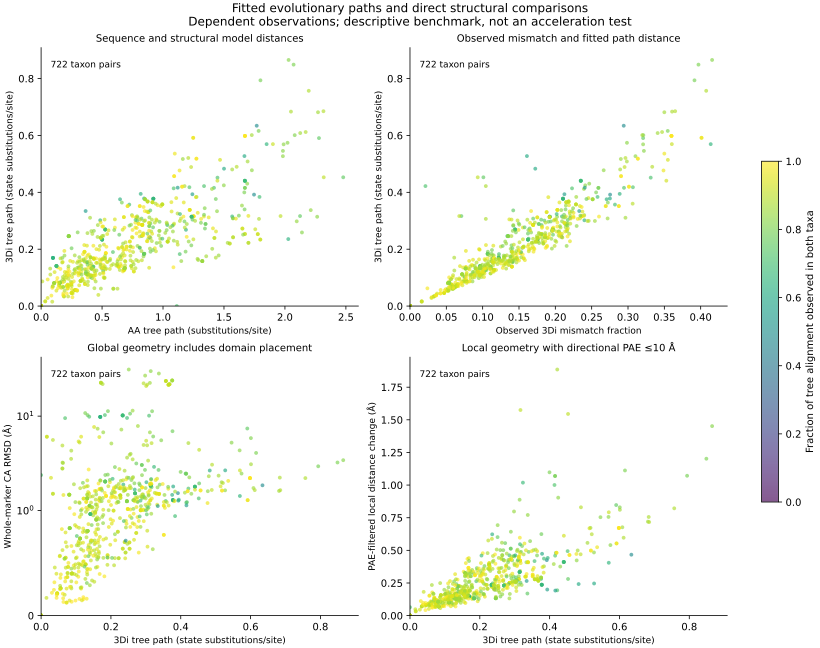

# Fitted tree paths and direct structural geometry

The executed benchmark connects the 52-marker phylogenetic checkpoint to physical coordinates. It accepts 722 within-marker taxon pairs and records eight coverage exclusions. This tests leaf-to-leaf fitted distances against direct geometry; it does not reconstruct physical displacement on individual evolutionary branches or finish the project's branch-rate validation.



## Method and evidence

The input, mapping, PAE, fitted-tree and resampling provenance chains are checked before comparison. Coordinates and PAE are checksum-verified. Each pair uses identical jointly observed positions for amino-acid mismatch, 3Di mismatch and geometry. These positions already satisfy the audited six-residue 3Di confidence mask. Pairs need at least 50 shared observations and coverage of at least half the observed sites of each taxon. Coverage relative to the complete marker alignment remains explicit.

For all four point-estimate models, the fitted path is the sum of branches whose canonical bipartitions separate the two tips. Every path is independently checked against Biopython tree traversal. Conditional path intervals use the audited block-30 resampling draws: sum the branches within each jointly fitted draw, then calculate the 2.5/97.5 percentiles. Adding the marginal branch intervals would discard branch covariance and is not used. All models use the same sequence-derived marker topology.

Tree fits use all retained marker positions and available taxa, whereas a given geometric comparison uses its jointly observed subset. This difference in information must remain visible; the plot colors show shared coverage. Path estimates are expected state substitutions/site, and geometry is measured in Å. One is not a conversion of the other.

The geometric measures are proper-rotation CA RMSD and local CA distance changes. Local pairs must be within 15 Å in either model and separated by at least three sequence positions in both. The PAE-filtered local comparison additionally requires both directional errors in both models ≤10 Å. This is a custom matched-CA metric, not standard lDDT. The confidence of the six-residue 3Di context does not establish confident relative placement of whole domains or other distant regions.

Median fitted AF structural path distance was 0.18362 state substitutions/site; median whole-marker RMSD was 1.162 Å and median PAE-filtered local distance change was 0.222 Å. The four-panel figure is descriptive. It contains dependent taxon pairs and reused coordinate models, and provides no independent-observation correlation, significance test, evolutionary coupling coefficient or acceleration ranking. Domain-level branch estimates, model adequacy, supported genealogies, broader coverage and prediction-source controls remain required.

## Maximum-RMSD case: an artifact-control priority

The diagnostic case was selected by the largest whole-marker RMSD among all accepted pairs, rather than by a desired biological explanation. Marker **5000823at2759** compares the flagged Saccharomyces cerevisiae × S. kudriavzevii hybrid (F332112, protein EHN08616.1) with Pachysolen tannophilus (F4918, protein ODV96959.1). Across 583 confidence-qualified shared residues, whole-marker RMSD is **31.12 Å**, but the PAE-filtered local mean distance change is **0.693 Å**. The fitted structural path is 0.2511 substitutions/site; none of these values alone identifies acceleration or positive selection.

Both proteins have a single nonoverlapping GA-qualified **PF22591.3, eIF3a_PCI_TPR-like**, annotation covering almost the complete HMM. Pfam classifies it as **Repeat**; the diagnostic does not relabel it an independent domain or assert experimentally established function. Of the benchmark sites, 315 lie within both annotated repeat-region spans. Their RMSD is 11.65 Å under the whole-marker fit but **1.47 Å under their own rigid fit**. Independent fitting necessarily improves RMSD, so that difference alone does not prove biological movement.

The PAE test adds a separate limit on interpretation: of 83,789 eligible cross-region pairs linking this repeat region to sites outside it in both proteins, only **12,712 (15.17%)** pass the directional PAE cutoff in both models. The unfiltered mean cross-region distance change is 11.13 Å, compared with 1.49 Å among the retained pairs. The latter comparison conditions on a different pair subset; it is not an estimate that filtering corrected an 11 Å biological displacement. The results support treating poorly constrained relative placement as a competing explanation for the extreme global RMSD.

The hybrid has no GA-qualified PCI hit in this annotation snapshot, whereas the Pachysolen protein does. This is a profile-detection observation, **not evidence of domain loss**. Sequence divergence, annotation quality, alignment, profile sensitivity and model geometry all require follow-up. The hybrid is already flagged for species-identity and exclusion sensitivity and must not be counted as a clean, independent species transition.

Next checks for this case are parental/orthologous sequence and coding-annotation review, repeat- versus full-protein comparisons under alternative prediction pipelines, and explicit taxon-exclusion/model sensitivity. Only after those checks should a mechanistic or experimental hypothesis be advanced. This case is presently an artifact-control candidate, not a validated functional innovation.

## Reproduction

```bash
python scripts/benchmark_tree_paths_geometry.py \
  --inputs results/phylogeny/paired-structural-inputs-v1 \
  --snapshot results/structural_markers/snapshot-v2 \
  --pae results/structural_pae/snapshot-v1 \
  --fits results/phylogeny/paired-marker-fits-v1 \
  --fit-audit results/phylogeny/paired-fit-audit-v1 \
  --resampling results/phylogeny/paired-resampling-v1 \
  --resampling-audit results/phylogeny/paired-resampling-audit-v1 \
  --output results/structural_alphabet/tree-path-geometry-v1
python scripts/plot_tree_path_geometry.py \
  --benchmark results/structural_alphabet/tree-path-geometry-v1 \
  --output results/structural_alphabet/tree-path-geometry-figures-v1
python scripts/diagnose_global_geometry_case.py \
  --benchmark results/structural_alphabet/tree-path-geometry-v1 \
  --inputs results/phylogeny/paired-structural-inputs-v1 \
  --snapshot results/structural_markers/snapshot-v2 \
  --annotations results/domains/marker-annotations-v1 \
  --pae results/structural_pae/snapshot-v1 \
  --output results/structural_alphabet/global-case-v1
python -m unittest discover -s tests -p test_tree_path_geometry.py
```

Use new immutable output directories if the named outputs already exist. Two focused tests verify path membership and joint-draw uncertainty, including a perfectly anticorrelated example where the path is constant despite variable individual branches. Full-data validation and global-RMSD reproduction passed, and the figure was visually inspected. Versioned tables and receipts are under `metadata/tree_path_geometry*` and `metadata/global_geometry_case*`; raw coordinate, PAE, tree and replicate files remain outside Git with recorded hashes.


## Exhaustive local-prediction geometry baseline

The frozen 5,121-model ESMFold snapshot now has comparisons for all 306,673
within-marker taxon pairs at focal pLDDT thresholds 50, 70 and 90. Of 920,019
pair/threshold rows, 677,982 pass the minimum of 50 matched residues and half of
shared profile positions; 242,037 remain explicit exclusions. At thresholds
50/70/90, accepted pairs are 294,878/266,788/116,316, spanning 80/79/64 markers.
The stricter paired phylogenetic inputs have additional context/PAE/family gates;
these descriptive pair counts are not their inference universe.

An independent audit verified every pair/threshold identity, matched-residue
count, canonical-AA/confidence eligibility, coordinate-identity flag and accepted
sequence difference. It independently recomputed geometry for 223 deterministically
selected rows (smallest identity hash in each accepted marker/threshold group),
using SciPy proper rotations and condensed pairwise distances instead of the
production helper. All checks passed. Geometry for unsampled rows was checked
for finite nonnegative values, not fully independently recomputed.

At focal pLDDT 70, the pair-weighted median aligned CA RMSD is 1.402 angstrom and
the custom local-distance mean-absolute-change median is 0.349 angstrom. These
are descriptive distances, not time-normalized rates or independent replicates.
The threshold strata differ in both pairs and residues. Pairwise PAE, domain
boundaries, six-residue alphabet context, phylogenetic uncertainty and predictor
artifacts must still be addressed before interpreting branch-level excess change.

```bash
OPENBLAS_NUM_THREADS=1 python scripts/compare_marker_structures.py \
  --snapshot results/structural_markers/esmfold-partial-v1 \
  --output results/structural_comparisons/esmfold-partial-v1
OPENBLAS_NUM_THREADS=1 python scripts/audit_pairwise_geometry.py \
  --mapping results/structural_markers/esmfold-partial-v1 \
  --comparisons results/structural_comparisons/esmfold-partial-v1 \
  --output results/structural_comparisons/esmfold-partial-readback-v1
python scripts/summarize_pairwise_geometry.py \
  --comparisons results/structural_comparisons/esmfold-partial-v1 \
  --output results/structural_comparisons/esmfold-partial-summary-v1
```

Use new output directories for deliberate reruns; existing snapshots are
immutable. Full tables remain outside Git; source hashes, audit receipts and the
small threshold summary are versioned under `metadata/`.
