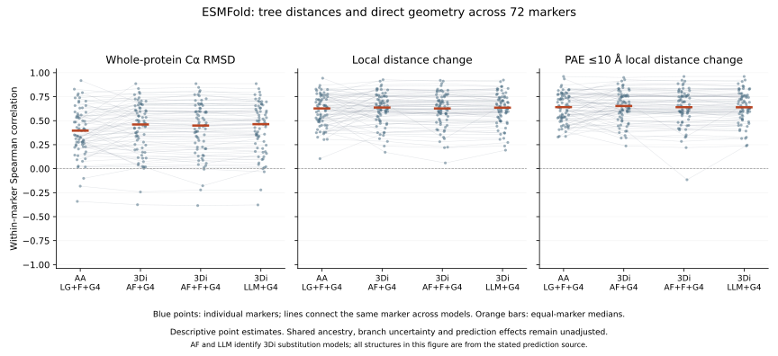

# Fitted tree paths and direct structural geometry

The executed benchmark connects the 52-marker phylogenetic checkpoint to physical coordinates. It accepts 722 within-marker taxon pairs and records eight coverage exclusions. This tests leaf-to-leaf fitted distances against direct geometry; it does not reconstruct physical displacement on individual evolutionary branches or finish the project's branch-rate validation.


## Method and evidence

The input, mapping, PAE, fitted-tree and resampling provenance chains are checked before comparison. Coordinates and PAE are checksum-verified. Each pair uses identical jointly observed positions for amino-acid mismatch, 3Di mismatch and geometry. These positions already satisfy the audited six-residue 3Di confidence mask. Pairs need at least 50 shared observations and coverage of at least half the observed sites of each taxon. Coverage relative to the complete marker alignment remains explicit.

For all four point-estimate models, the fitted path is the sum of branches whose canonical bipartitions separate the two tips. Every path is independently checked against Biopython tree traversal. Conditional path intervals use the audited block-30 resampling draws: sum the branches within each jointly fitted draw, then calculate the 2.5/97.5 percentiles. Adding the marginal branch intervals would discard branch covariance and is not used. All models use the same sequence-derived marker topology.

Tree fits use all retained marker positions and available taxa, whereas a given geometric comparison uses its jointly observed subset. This difference in information must remain visible; the plot colors show shared coverage. Path estimates are expected state substitutions/site, and geometry is measured in Å. One is not a conversion of the other.

The geometric measures are proper-rotation CA RMSD and local CA distance changes. Local pairs must be within 15 Å in either model and separated by at least three sequence positions in both. The PAE-filtered local comparison additionally requires both directional errors in both models ≤10 Å. This is a custom matched-CA metric, not standard lDDT. The confidence of the six-residue 3Di context does not establish confident relative placement of whole domains or other distant regions.

Median fitted AF structural path distance was 0.18362 state substitutions/site; median whole-marker RMSD was 1.162 Å and median PAE-filtered local distance change was 0.222 Å. The four-panel figure is descriptive. It contains dependent taxon pairs and reused coordinate models, and provides no independent-observation correlation, significance test, evolutionary coupling coefficient or acceleration ranking. Domain-level branch estimates, model adequacy, supported genealogies, broader coverage and prediction-source controls remain required.

## Maximum-RMSD case: an artifact-control priority

The diagnostic case was selected by the largest whole-marker RMSD among all accepted pairs, rather than by a desired biological explanation. Marker **5000823at2759** compares the flagged Saccharomyces cerevisiae × S. kudriavzevii hybrid (F332112, protein EHN08616.1) with Pachysolen tannophilus (F4918, protein ODV96959.1). Across 583 confidence-qualified shared residues, whole-marker RMSD is **31.12 Å**, but the PAE-filtered local mean distance change is **0.693 Å**. The fitted structural path is 0.2511 substitutions/site; none of these values alone identifies acceleration or positive selection.

Both proteins have a single nonoverlapping GA-qualified **PF22591.3, eIF3a_PCI_TPR-like**, annotation covering almost the complete HMM. Pfam classifies it as **Repeat**; the diagnostic does not relabel it an independent domain or assert experimentally established function. Of the benchmark sites, 315 lie within both annotated repeat-region spans. Their RMSD is 11.65 Å under the whole-marker fit but **1.47 Å under their own rigid fit**. Independent fitting necessarily improves RMSD, so that difference alone does not prove biological movement.

The PAE test adds a separate limit on interpretation: of 83,789 eligible cross-region pairs linking this repeat region to sites outside it in both proteins, only **12,712 (15.17%)** pass the directional PAE cutoff in both models. The unfiltered mean cross-region distance change is 11.13 Å, compared with 1.49 Å among the retained pairs. The latter comparison conditions on a different pair subset; it is not an estimate that filtering corrected an 11 Å biological displacement. The results support treating poorly constrained relative placement as a competing explanation for the extreme global RMSD.

The hybrid has no GA-qualified PCI hit in this annotation snapshot, whereas the Pachysolen protein does. This is a profile-detection observation, **not evidence of domain loss**. Sequence divergence, annotation quality, alignment, profile sensitivity and model geometry all require follow-up. The hybrid is already flagged for species-identity and exclusion sensitivity and must not be counted as a clean, independent species transition.

Next checks for this case are parental/orthologous sequence and coding-annotation review, repeat- versus full-protein comparisons under alternative prediction pipelines, and explicit taxon-exclusion/model sensitivity. Only after those checks should a mechanistic or experimental hypothesis be advanced. This case is presently an artifact-control candidate, not a validated functional innovation.

## Reproduction

```bash
python scripts/benchmark_tree_paths_geometry.py \
  --inputs results/phylogeny/paired-structural-inputs-v1 \
  --snapshot results/structural_markers/snapshot-v2 \
  --pae results/structural_pae/snapshot-v1 \
  --fits results/phylogeny/paired-marker-fits-v1 \
  --fit-audit results/phylogeny/paired-fit-audit-v1 \
  --resampling results/phylogeny/paired-resampling-v1 \
  --resampling-audit results/phylogeny/paired-resampling-audit-v1 \
  --output results/structural_alphabet/tree-path-geometry-v1
python scripts/plot_tree_path_geometry.py \
  --benchmark results/structural_alphabet/tree-path-geometry-v1 \
  --output results/structural_alphabet/tree-path-geometry-figures-v1
python scripts/diagnose_global_geometry_case.py \
  --benchmark results/structural_alphabet/tree-path-geometry-v1 \
  --inputs results/phylogeny/paired-structural-inputs-v1 \
  --snapshot results/structural_markers/snapshot-v2 \
  --annotations results/domains/marker-annotations-v1 \
  --pae results/structural_pae/snapshot-v1 \
  --output results/structural_alphabet/global-case-v1
python -m unittest discover -s tests -p test_tree_path_geometry.py
```

Use new immutable output directories if the named outputs already exist. Two focused tests verify path membership and joint-draw uncertainty, including a perfectly anticorrelated example where the path is constant despite variable individual branches. Full-data validation and global-RMSD reproduction passed, and the figure was visually inspected. Versioned tables and receipts are under `metadata/tree_path_geometry*` and `metadata/global_geometry_case*`; raw coordinate, PAE, tree and replicate files remain outside Git with recorded hashes.


## Exhaustive local-prediction geometry baseline

The frozen 5,121-model ESMFold snapshot now has comparisons for all 306,673
within-marker taxon pairs at focal pLDDT thresholds 50, 70 and 90. Of 920,019
pair/threshold rows, 677,982 pass the minimum of 50 matched residues and half of
shared profile positions; 242,037 remain explicit exclusions. At thresholds
50/70/90, accepted pairs are 294,878/266,788/116,316, spanning 80/79/64 markers.
The stricter paired phylogenetic inputs have additional context/PAE/family gates;
these descriptive pair counts are not their inference universe.

An independent audit verified every pair/threshold identity, matched-residue
count, canonical-AA/confidence eligibility, coordinate-identity flag and accepted
sequence difference. It independently recomputed geometry for 223 deterministically
selected rows (smallest identity hash in each accepted marker/threshold group),
using SciPy proper rotations and condensed pairwise distances instead of the
production helper. All checks passed. Geometry for unsampled rows was checked
for finite nonnegative values, not fully independently recomputed.

At focal pLDDT 70, the pair-weighted median aligned CA RMSD is 1.402 angstrom and
the custom local-distance mean-absolute-change median is 0.349 angstrom. These
are descriptive distances, not time-normalized rates or independent replicates.
The threshold strata differ in both pairs and residues. Pairwise PAE, domain
boundaries, six-residue alphabet context, phylogenetic uncertainty and predictor
artifacts must still be addressed before interpreting branch-level excess change.

```bash
OPENBLAS_NUM_THREADS=1 python scripts/compare_marker_structures.py \
  --snapshot results/structural_markers/esmfold-partial-v1 \
  --output results/structural_comparisons/esmfold-partial-v1
OPENBLAS_NUM_THREADS=1 python scripts/audit_pairwise_geometry.py \
  --mapping results/structural_markers/esmfold-partial-v1 \
  --comparisons results/structural_comparisons/esmfold-partial-v1 \
  --output results/structural_comparisons/esmfold-partial-readback-v1
python scripts/summarize_pairwise_geometry.py \
  --comparisons results/structural_comparisons/esmfold-partial-v1 \
  --output results/structural_comparisons/esmfold-partial-summary-v1
```

Use new output directories for deliberate reruns; existing snapshots are
immutable. Full tables remain outside Git; source hashes, audit receipts and the
small threshold summary are versioned under `metadata/`.


## Geometry on the paired inference sites

`prepare_paired_site_geometry.py` separates direct geometry preparation from
completed tree fitting and resampling. It checks the paired-input, structure
mapping and PAE receipts; uses the exact jointly observed AA/3Di columns; and
requires at least 50 shared sites covering at least half of each taxon's observed
sites. These input sites already pass six-residue pLDDT 70 and context PAE 10.
For the local-distance summary, both directions of pairwise PAE must additionally
be at most 10 in both models. These two PAE filters answer different questions.

The full local snapshot has 72 eligible markers and up to 266,593 taxon pairs.
The resource plan allows one CPU/BLAS thread, 16 GB RAM, 2 GB output and 1–12 hours
on the existing host. Per-marker coordinate/PAE caches are released between
markers. The extracted geometry workflow is checked against every shared field
in the prior 52-marker benchmark before the expanded run. This precomputation
produces no tree-path estimates or confidence intervals; those joins require
completed and audited model fits and joint branch resampling.

```bash
OPENBLAS_NUM_THREADS=1 python scripts/prepare_paired_site_geometry.py \
  --inputs results/phylogeny/paired-inputs-esmfold-partial-v1 \
  --snapshot results/structural_markers/esmfold-partial-v1 \
  --pae results/structural_pae/esmfold-partial-v1 \
  --output results/structural_comparisons/paired-site-esmfold-v1
```


## Expanded paired-site geometry and independent local audit

The local ESMFold run completed 266,593 taxon pairs across 72 markers, with
259,780 accepted and 6,813 excluded by the shared-site coverage rule.
`scripts/audit_paired_site_geometry.py` independently checked the complete pair
universe, duplicate absence, paired character masks, observed-site counts,
eligibility, dimensions and AA/3Di differences. It also recalculated direct
geometry for the smallest SHA256 taxon-pair identity within every marker:
72 checks using SciPy rotation and condensed distances, with direct indexing of
both directional PAE values in both models. All agreed within 1e-8 relative and
absolute tolerance. Geometry was independently recalculated for these 72 pairs,
not for all 259,780 accepted pairs. Upstream confidence-mask construction and
biological orthology are separate checks.

```bash
OPENBLAS_NUM_THREADS=1 OMP_NUM_THREADS=1 python scripts/audit_paired_site_geometry.py --comparisons results/structural_comparisons/paired-site-esmfold-v1 --inputs results/phylogeny/paired-inputs-esmfold-partial-v1 --snapshot results/structural_markers/esmfold-partial-v1 --pae results/structural_pae/esmfold-partial-v1 --output results/structural_comparisons/paired-site-esmfold-audit-v1
```

The same production geometry pipeline is now running on the expanded AlphaFold
inputs: 124 markers and up to 744,853 taxon pairs. It uses one CPU worker/thread,
24 GB memory planning and 10 GB disk headroom on the existing host. The broad
2–48 hour forecast reflects uncertainty from protein lengths and quadratic
residue-distance work; no paid infrastructure was provisioned. Inputs and code
are pinned in `metadata/paired_site_geometry_gdm_resource_plan.json`.

```bash
OPENBLAS_NUM_THREADS=1 OMP_NUM_THREADS=1 python scripts/prepare_paired_site_geometry.py --inputs results/phylogeny/paired-inputs-gdm-expanded-v1 --snapshot results/structural_markers/gdm-expanded-v1 --pae results/structural_pae/gdm-expanded-v1 --output results/structural_comparisons/paired-site-gdm-expanded-v1
```

The known mixed-copy TFIIB marker remains diagnostic and requires the existing
orthology-review overlay before confirmatory interpretation. Sources remain
separate. Joining direct geometry to supported fitted paths and resampling is
still required; these measurements do not themselves estimate branch rates or
establish additive physical distances.


## Complete local path benchmark and descriptive rank associations

The completed local fits now supply AA and three 3Di-model path estimates for
all 259,780 accepted geometry pairs across 72 markers. The 6,813 excluded pairs
remain explicit. Path calculations passed 2,848 separate tree traversals and
complete original-field readback (see `metadata/esmfold_tree_path_point_receipt.json`).
These are point estimates; full local paired resampling is running separately.

`scripts/summarize_tree_path_geometry_ranks.py` describes within-marker Spearman
correlations. Each geometry metric uses the same available pairs for all four
path models. Every one of 864 marker/model/geometry combinations was estimable;
all correlations, cohort counts and 12 equal-marker summaries passed a separate
calculation with SciPy `spearmanr` (the same underlying ranking library).

| Tree-path model | Whole-protein CA RMSD | Local distance change | PAE10 local distance change |
| --- | ---: | ---: | ---: |
| AA LG+F+G4 | 0.396 | 0.627 | 0.641 |
| 3Di AF+G4 | 0.461 | 0.637 | 0.653 |
| 3Di AF+F+G4 | 0.449 | 0.628 | 0.641 |
| 3Di LLM+G4 | 0.464 | 0.636 | 0.640 |

Entries are medians of 72 within-marker rank correlations, giving each marker
one contribution. They describe stronger rank association with local geometry
than with whole-protein displacement. They do not demonstrate model superiority:
shared ancestry, confidence selection, alignment coverage, topology and branch
uncertainty remain unadjusted. There are no significance tests or independent
pair assumptions. Correlation does not establish additive physical distances,
sequence–structure evolutionary coupling, or branch-specific acceleration.

```bash
OPENBLAS_NUM_THREADS=1 python scripts/summarize_tree_path_geometry_ranks.py --benchmark results/phylogeny/paired-path-points-esmfold-v1 --output results/phylogeny/path-geometry-ranks-esmfold-v1
```

Detailed results, source checksums and validation scope are preserved in
`metadata/esmfold_tree_path_marker_ranks.tsv`,
`metadata/esmfold_tree_path_rank_summary.tsv`,
`metadata/esmfold_tree_path_rank_receipt.json` and
`metadata/esmfold_tree_path_rank_readback.json`.


## All-marker benchmark figure



The figure displays all 864 estimable marker/model/geometry correlations, with
lines connecting the same marker across models and orange equal-marker medians.
The panels share the full correlation scale. AF and LLM in the axis labels are
3Di substitution models; all predicted coordinates here are ESMFold outputs.
All 12 displayed medians match the source summary exactly. SVG readback counted
864 marker symbols and 12 median symbols; the rendered PNG was visually checked.
No markers were dropped or sampled for visualization. This figure exposes
marker-level heterogeneity without adding significance or acceleration claims.

```bash
OPENBLAS_NUM_THREADS=1 python scripts/plot_tree_path_geometry_ranks.py --summary results/phylogeny/path-geometry-ranks-esmfold-v1 --output results/phylogeny/path-geometry-rank-figures-esmfold-v1 --source-label ESMFold
```

SVG, PNG and PDF outputs and hashes are preserved in the results directory;
figure provenance and readback are in `metadata/esmfold_tree_path_rank_figure_receipt.json`
and `metadata/esmfold_tree_path_rank_figure_readback.json`.


## Full local joint path sensitivity prepared

All 43,200 paired resampling draws have completed, with 43,184 reported
estimable draws and 16 retained unestimable draws. The full raw-output audit
is running. `scripts/append_paired_path_uncertainty.py` requires that completed
audit before computing path summaries for the existing exact-site benchmark.

The implementation retains all accepted and excluded geometry pairs and every
original point/geometry field. It updates the uncertainty-status label while
preserving its original value in `source_point_uncertainty_status`. For each
block length 1/10/30, it sums branches within each joint draw, then calculates
path percentiles, standard deviations and paired sampling covariance. It
summarizes AA and the published-frequency 3Di AF model, the only models in these
resampling draws; the other point-estimate models do not acquire intervals.
Unestimable draws remain counted, and fewer than 90% estimable draws suppress
percentile summaries. Sampling covariance is not evolutionary coupling.

Three targeted tests passed: negatively correlated branches with constant
path sums, signed covariance between paired AA/3Di draws, and rejection of
invalid or mismatched draw arrays. A full invocation correctly stopped at the
missing final audit receipt without creating output. Full-data execution and
readback remain pending. The implementation uses 512-pair chunks; planning
allows one CPU/BLAS thread, 8 GB RAM, 5 GB disk and 0.1–2 hours on the existing
host. No physical-displacement, additivity, calibrated-confidence, selection
or acceleration claim follows from these conditional summaries.

```bash
OPENBLAS_NUM_THREADS=1 python -m unittest discover -s tests -p test_joint_path_statistics.py
# Run only after the full resampling audit completes:
OPENBLAS_NUM_THREADS=1 OMP_NUM_THREADS=1 python scripts/append_paired_path_uncertainty.py --points results/phylogeny/paired-path-points-esmfold-v1 --inputs results/phylogeny/paired-inputs-esmfold-partial-v1 --fits results/phylogeny/paired-marker-fits-esmfold-partial-v1 --resampling results/phylogeny/paired-resampling-esmfold-v1 --resampling-audit results/phylogeny/paired-resampling-audit-esmfold-v1 --output results/phylogeny/paired-path-uncertainty-esmfold-v1
```


The path-summary command is now queued through
`scripts/advance_paired_path_uncertainty.py`. The controller waits for the exact
resampling-auditor process identity to finish, requires its complete audit
receipt, verifies pinned inputs and code, then launches the command with one
BLAS/OpenMP thread. It does not modify or restart the auditor. Configuration
is tracked in `metadata/esmfold_paired_path_controller_config.json`; controller
output is `results/phylogeny/paired-path-controller-esmfold-v1`. The controller
compiled and entered its expected waiting state. Execution of the full path
summaries and their readback remain pending.


### Full local joint path summaries completed

The full resampling audit validated all 86,368 fitted trees from 43,200 paired
draws across 72 markers and three block lengths. Sixteen draws remain
unestimable. Warnings occurred in 74,465 fits and are retained in the audited
records; completion does not establish model adequacy. The auditor produced
54,732 branch interval rows. Its receipt is tracked in
`metadata/esmfold_full_paired_resampling_audit_receipt.json`.

The queued path stage then completed all 259,780 accepted pairs and 6,813
geometry exclusions, retaining the original point and geometry fields. Each
path is summed within each joint draw before percentiles, standard deviations
and paired sampling covariance are calculated. Other structural substitution
models still have point estimates only. Full outputs are under
`results/phylogeny/paired-path-uncertainty-esmfold-v1`; its receipt is tracked in
`metadata/esmfold_joint_path_uncertainty_receipt.json`.

Independent readback command:

```bash
python scripts/audit_joint_path_uncertainty.py \
  --paths results/phylogeny/paired-path-uncertainty-esmfold-v1 \
  --points results/phylogeny/paired-path-points-esmfold-v1 \
  --resampling results/phylogeny/paired-resampling-esmfold-v1 \
  --resampling-audit results/phylogeny/paired-resampling-audit-esmfold-v1 \
  --output results/phylogeny/paired-path-uncertainty-readback-esmfold-v1
```

This check covers all inherited fields, cohort identities, counts, interval
ordering and covariance bounds. For one SHA256-selected pair per marker, it
independently traverses every estimable AA and 3Di tree with Bio.Phylo.distance
and recomputes summaries using Python statistics and explicit sorted linear
quantiles. It does not independently recompute numerical summaries for every
other pair. The readback completed successfully: 216 pair/block checks and 86,368
independent tree traversals passed. Its receipt, including the selected pairs,
is tracked in `metadata/esmfold_joint_path_uncertainty_readback.json`. All 216
source batch receipt pins and the run configuration were also rechecked against
the completed resampling receipt.
These remain conditional sampling sensitivities, not calibrated confidence
intervals, evidence of evolutionary coupling, or acceleration tests.
