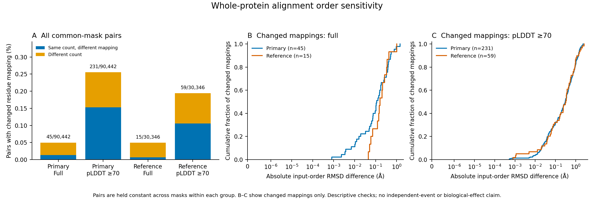

# Whole-protein input-order sensitivity

Full primary verification passed 193,642 pair/mask comparisons, reconstructing
387,284 native residue mappings and checking all 27 quantile rows. The corrected
checker changed only the parsed-argument variable name; its failed predecessor
is preserved. Reference verification covers 62,887 pair/mask comparisons.

[PDF](figures/whole_protein_order_sensitivity_20260927.pdf) ·
[SVG](figures/whole_protein_order_sensitivity_20260927.svg)

The same pairs are used across masks within each group: 90,442 primary and
30,346 reference pairs. Primary and reference groups are not matched to one
another in this descriptive figure.

| Group | Mask | Changed mappings / pairs | Changed (%) | Maximum absolute RMSD order difference (Å) |
|---|---|---:|---:|---:|
| Primary | Full | 45 / 90,442 | 0.0498 | 1.4643 |
| Primary | pLDDT ≥70 | 231 / 90,442 | 0.2554 | 2.3577 |
| Reference | Full | 15 / 30,346 | 0.0494 | 1.0165 |
| Reference | pLDDT ≥70 | 59 / 30,346 | 0.1944 | 2.6080 |

Panel A includes all pairs in these common cohorts and distinguishes changed
mappings with unchanged aligned-residue counts from changed counts. Panels B–C
show every RMSD difference among changed mappings only, with their conditional
denominators stated. Across the full distributions, 99th-percentile RMSD order
differences are below 9e-15 Å; that numerical agreement does not describe the
rare larger differences. The unconditioned full-mask cohorts contain 63 changed
mappings among 103,200 primary pairs and 23 among 32,541 reference pairs.

Changing input order rarely changes the residue correspondence under this
protocol, but individual outliers can have substantial RMSD differences. Both
orders remain in subsequent analyses. These differences describe alignment
sensitivity, not structural evolution, prediction accuracy or uncertainty bounds.
Pairs share taxa, families and models; percentages do not imply independent
observations or a tested difference between primary and reference groups.
Numerical qualification does not replace aligned-coverage or biological review.

Source tables and hashes are in
`results/structural_comparisons/whole-protein-order-sensitivity-figure-20260927-v1`:
`mapping_summary.tsv`, `all_metric_quantiles.tsv` and `receipt.json`. The latter
table retains all 54 group/cohort/metric quantile rows. Figure production verifies
audited source bindings and every exported table; the PNG was visually reviewed
for labels, denominators and clipping. Published copies match the source hashes.
Completion evidence: `metadata/whole_protein_order_sensitivity_completed_20260927.json`.

Reproduction uses `scripts/plot_whole_protein_order_sensitivity.py --plan
metadata/whole_protein_order_figure_plan_20260927.json`, which also checks source
provenance and prerequisite terminal success. As with other immutable outputs,
use a new versioned output directory and plan when reproducing a completed run.
