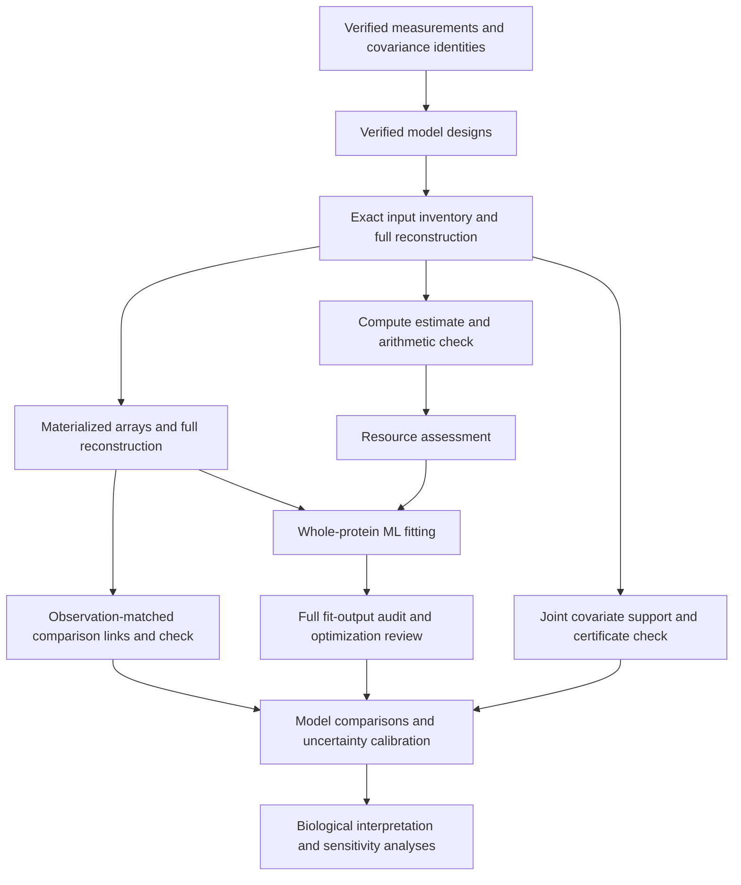

# Whole-protein sequence–structure workflow

Checkpoint: September 29, 2026. This workflow tests sequence–structure coupling
and duplication contrasts using whole proteins. It uses the frozen matched-pair
collection, not the entire expanded structural atlas. It does not complete the
project's eight scientific aims.

The collection contains 52,675 distinct matched pairs, 96 measurement settings,
five predictor designs and two structural outcomes. The 414,720 design/outcome
settings reduce to 75,070 exact numerical inputs; five species-tree alternatives
require 375,350 fits. Exact reuse retains every original setting association.
RMSD and mean-endpoint TM-divergence differences remain separate outcomes.

| Stage | Checkpoint status | Reproducibility record |
|---|---|---|
| Measurements, summaries and covariance index | Completed checks; historical summary mismatch was not reproduced, cause unresolved | [Detailed source checks](duplication-control-balance-20260927.md), [summary recovery](../metadata/whole_protein_summary_validation_recovery_20260928.json) |
| Five predictor designs | All 207,360 independently checked | [Design proof](../metadata/whole_protein_model_designs_v2_completed_readback_20260928.json) |
| Exact input inventory | Producer complete; full numerical reconstruction running | [Producer checkpoint](../metadata/whole_protein_input_inventory_producer_completed_20260929.json), [checker](../scripts/readback_whole_protein_input_inventory.py) |
| Compute estimates | Producer and arithmetic checker queued behind inventory validation | [Plan](../metadata/whole_protein_fit_workload_plan_20260929.json), [check plan](../metadata/whole_protein_fit_workload_readback_plan_20260929.json) |
| Joint covariate support | Producer and certificate checker queued | [Plan](../metadata/whole_protein_joint_support_plan_20260929.json), [check plan](../metadata/whole_protein_joint_support_readback_plan_20260929.json) |
| Materialized fitting inputs | Producer and full reconstruction checker queued | [Plan](../metadata/whole_protein_materialized_inputs_plan_20260929.json), [check plan](../metadata/whole_protein_materialized_input_readback_plan_20260929.json) |
| Observation-matched model links | Producer and full link checker queued | [Plan](../metadata/whole_protein_model_links_plan_20260929.json), [check plan](../metadata/whole_protein_model_links_readback_plan_20260929.json) |
| Ordinary-ML fitting | Adapter and runner implemented and fixture-tested; production unlaunched | [Adapter checks](../metadata/whole_protein_ml_adapter_fixtures_20260929.json), [runner checks](../metadata/whole_protein_ml_runner_fixtures_20260929.json), [runner](../scripts/run_whole_protein_ml.py) |
| Full fit-output audit | Payload checker and restartable runner fixture-tested; production unlaunched | [Payload checks](../metadata/whole_protein_payload_replay_fixtures_20260929.json), [audit checks](../metadata/whole_protein_output_audit_fixtures_20260929.json), [audit runner](../scripts/audit_whole_protein_ml_outputs.py) |
| Model comparisons, calibrated uncertainty and interpretation | Incomplete | [Methods draft](methods-draft.md#whole-protein-sequencestructure-contrasts-september-29), [scientific milestones](scientific-milestones-20260926.md) |

The model includes residual variance, reused-background effects, family-component
effects and the selected species covariance factor. Predictors are linear,
quadratic or cubic gene-distance contrasts, positive-log gene-distance contrasts,
or alignment-identity contrasts, with coverage, aligned-length and confidence
covariates. Polynomial contrasts use target power minus control power. Predictors
are scaled without centering, preserving the zero-contrast intercept.

Likelihood comparisons require the same outcome and ordered observations.
Positive-log exclusions can change that observation set. The link stage retains
these exclusions explicitly and checks identical responses and shared predictor
columns before identifying comparable pairs. Named-column inclusion establishes
a sufficient nesting relation; its absence does not exclude other column-space
equivalence. Comparisons also require matching tree alternatives and acceptable
numerical fits.

Plans record checksums, resource allowances and dependencies; corresponding
launch records identify exact processes. Scripts run from the repository root.
Queued jobs wait for successful terminal states and matching completion proofs.
Keep pinned scripts and plans unchanged while those jobs run. The production
fitting and audit runners accept `--plan`; their concrete production plans and
worker allocation remain to be issued after validation and workload review.
Large arrays and fit outputs stay outside Git history, with manifests and hashes
binding their identities.

Materialization budgets 80 GiB for an estimated 58.354 GiB of raw arrays. Other
stage allocations are in their plans. Timing scenarios from completed domain
fits are planning references, not whole-protein ETAs; unmatched size strata,
memory needs, setup and audit costs must remain explicit in the final allocation.

Optimization errors and review flags remain visible. Audit completion does not
make an error record a verified fit. Numerical stationarity, hull support and
agreement between implementations do not establish identifiability, global
optimality, calibrated intervals, prediction-source independence or a biological
effect. Those scientific checks remain part of the full project.
