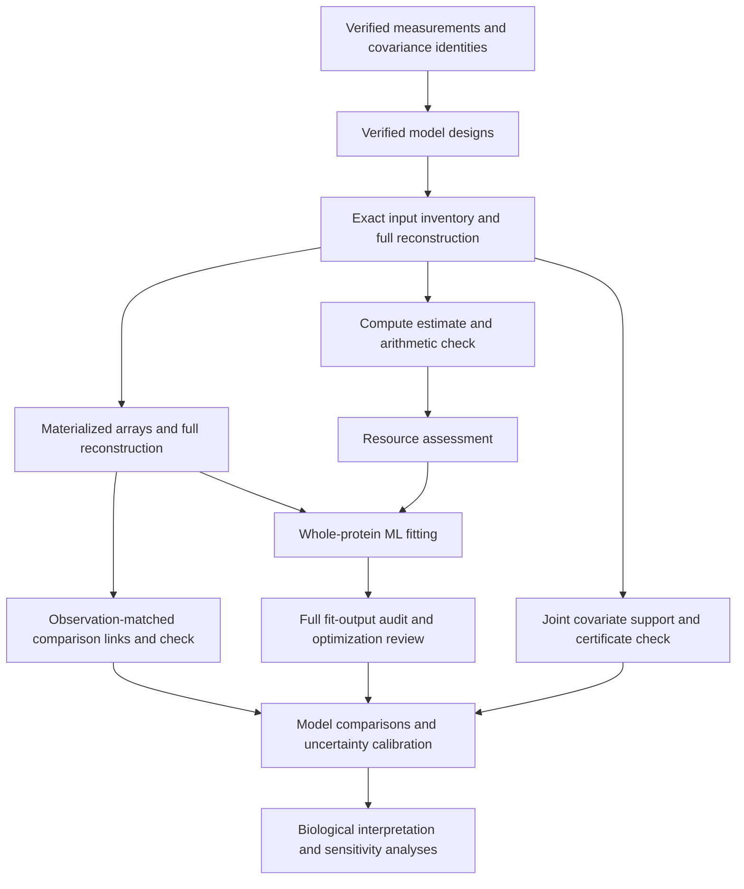

# Whole-protein sequence–structure workflow

Checkpoint: September 29, 2026. This workflow tests sequence–structure coupling
and duplication contrasts using whole proteins. It uses the frozen matched-pair
collection, not the entire expanded structural atlas. It does not complete the
project's eight scientific aims.

The collection contains 52,675 distinct matched pairs, 96 measurement settings,
five predictor designs and two structural outcomes. The 414,720 design/outcome
settings reduce to 75,070 exact numerical inputs; five species-tree alternatives
require 375,350 fits. Exact reuse retains every original setting association.
RMSD and mean-endpoint TM-divergence differences remain separate outcomes.

| Stage | Checkpoint status | Reproducibility record |
|---|---|---|
| Measurements, summaries and covariance index | Completed checks; historical summary mismatch was not reproduced, cause unresolved | [Detailed source checks](duplication-control-balance-20260927.md), [summary recovery](../metadata/whole_protein_summary_validation_recovery_20260928.json) |
| Five predictor designs | All 207,360 independently checked | [Design proof](../metadata/whole_protein_model_designs_v2_completed_readback_20260928.json) |
| Exact input inventory | Complete; all 414,720 settings and 75,070 unique recipes independently reconstructed | [Producer checkpoint](../metadata/whole_protein_input_inventory_producer_completed_20260929.json), [checker](../scripts/readback_whole_protein_input_inventory.py) |
| Compute estimates | Producer and arithmetic checker complete; 187,650 fits covered and 187,700 uncovered | [Plan](../metadata/whole_protein_fit_workload_plan_20260929.json), [check plan](../metadata/whole_protein_fit_workload_readback_plan_20260929.json) |
| Joint covariate support | Full independent check passed; six unresolved certificates retained | [Producer completion](../metadata/whole_protein_joint_support_producer_completed_20260929.json), [check plan](../metadata/whole_protein_joint_support_readback_plan_20260929.json) |
| Materialized fitting inputs | All 75,070 inputs independently reconstructed and checked | [Producer completion](../metadata/whole_protein_materialized_inputs_producer_completed_20260929.json), [check plan](../metadata/whole_protein_materialized_input_readback_plan_20260929.json) |
| Observation-matched model links | All 829,440 comparison links independently checked | [Plan](../metadata/whole_protein_model_links_plan_20260929.json), [check plan](../metadata/whole_protein_model_links_readback_plan_20260929.json) |
| Ordinary-ML fitting | Full 375,350-fit production run launched; 16 CPU workers | [Adapter checks](../metadata/whole_protein_ml_adapter_fixtures_20260929.json), [runner checks](../metadata/whole_protein_ml_runner_fixtures_20260929.json), [runner](../scripts/run_whole_protein_ml.py) |
| Full fit-output audit | Full output audit queued behind successful production completion | [Payload checks](../metadata/whole_protein_payload_replay_fixtures_20260929.json), [audit checks](../metadata/whole_protein_output_audit_fixtures_20260929.json), [audit runner](../scripts/audit_whole_protein_ml_outputs.py) |
| Model comparisons, calibrated uncertainty and interpretation | Incomplete | [Methods draft](methods-draft.md#whole-protein-sequencestructure-contrasts-september-29), [scientific milestones](scientific-milestones-20260926.md) |

The model includes residual variance, reused-background effects, family-component
effects and the selected species covariance factor. Predictors are linear,
quadratic or cubic gene-distance contrasts, positive-log gene-distance contrasts,
or alignment-identity contrasts, with coverage, aligned-length and confidence
covariates. Polynomial contrasts use target power minus control power. Predictors
are scaled without centering, preserving the zero-contrast intercept.

Likelihood comparisons require the same outcome and ordered observations.
Positive-log exclusions can change that observation set. The link stage retains
these exclusions explicitly and checks identical responses and shared predictor
columns before identifying comparable pairs. Named-column inclusion establishes
a sufficient nesting relation; its absence does not exclude other column-space
equivalence. Comparisons also require matching tree alternatives and acceptable
numerical fits.

Plans record checksums, resource allowances and dependencies; corresponding
launch records identify exact processes. Scripts run from the repository root.
Queued jobs wait for successful terminal states and matching completion proofs.
Keep pinned scripts and plans unchanged while those jobs run. The production
fitting and audit runners accept `--plan`; the
[production plan](../metadata/whole_protein_ml_plan_20260929.json) allocates 16 CPU
workers, and the [audit plan](../metadata/whole_protein_ml_output_audit_plan_20260929.json)
allocates eight workers after successful producer completion.
Large arrays and fit outputs stay outside Git history, with manifests and hashes
binding their identities.

Materialization budgets 80 GiB for an estimated 58.354 GiB of raw arrays. Other
stage allocations are in their plans. Timing scenarios from completed domain
fits are planning references, not whole-protein ETAs; unmatched size strata,
memory needs, setup and audit costs must remain explicit in the final allocation.

Optimization errors and review flags remain visible. Audit completion does not
make an error record a verified fit. Numerical stationarity, hull support and
agreement between implementations do not establish identifiability, global
optimality, calibrated intervals, prediction-source independence or a biological
effect. Those scientific checks remain part of the full project.

The inventory audit and workload arithmetic checks completed on September 29.
The [inventory completion](../metadata/whole_protein_input_inventory_audited_20260929.json)
and [workload completion](../metadata/whole_protein_fit_workload_audited_20260929.json)
bind their successful terminal states. Historical timing coverage excludes 93,300
fits outside observed record-count ranges and 94,400 fits with missing size
strata. Covered-only idealized scenarios must not be reported as full-run ETAs.
Array materialization, joint-support evaluation and their independent full
readbacks have completed. The observation-matched link checker also completed.
Production ordinary-ML fits launched after final provenance pins and a fresh
host-capacity check using the completed resource assessment below.

A [full-grid resource assessment](../metadata/whole_protein_fit_resource_assessment_20260929.json)
now specifies 16 single-thread workers, a 128 GiB memory cap, no swap and a 64 GiB
fit-output allowance. These are local CPU resources; no GPU or paid infrastructure
is involved. All 75,070 inputs and 375,350 tree fits remain in scope, including
the 187,700 fits outside historical timing coverage; there is no pilot subset.

The inspected solver uses nested background/family operations and a species
factor of rank at most 242. At the maximum 16,697 observations and seven
coefficients, an n-by-250 float64 array occupies 33,394,000 bytes. At most 182
distinct positive background sizes are possible because their minimum sum is
k(k+1)/2; the corresponding cached group-Gram stack is at most 91,000,000 bytes.
A planning allowance for multiple simultaneous arrays/stacks and interpreter
storage is about 1.04 GiB per worker, below the aggregate cap. This is a code-based
planning calculation, not measured peak RSS or a proved allocator bound.

Six complete-grid sensitivity scenarios assign the unmeasured fits the observed
covered mean cost multiplied by 1, 4 or 16, and vary covered costs by 1 or 4.
Their idealized durations span roughly 83–826 hours at 16 workers. This span is
not an ETA, uncertainty interval or upper bound: timing transfer and parallel
scaling are uncalibrated, and preparation, full audit and refinement are excluded.
The scenarios expose uncertainty rather than excluding expensive inputs. Actual
full-run timing records will inform revisions. The production run now uses this
allocation; its launch record identifies the exact process and immutable plan.

The joint-support producer completed all 75,070 unique inputs, mapping them to
15,270 exact covariate geometries. It reports zero supported to numeric tolerance
for 15,264 geometries and six unresolved certificates. All unresolved cases remain
explicit. The completion record verifies terminal success, 157 source hashes and
both output artifact hashes. The independent full certificate checker completed
successfully and retained all six unresolved classifications.
Hull inclusion alone does not establish interior overlap, dense support, model
adequacy or causal exchangeability.

Inspection of the six unresolved certificates found successful solver statuses
but negative sparse weights of approximately −4.46e−11 to −7.51e−10. The strict
nonnegative-weight requirement is the only failed certificate condition in the
saved values. These geometries map to 30 unique inputs and 112 setting/outcome
rows. The [diagnostic record](../metadata/whole_protein_unresolved_support_diagnostic_20260929.json)
preserves the source hashes, negative masses and per-case checks. Classifications
remain unresolved: no data or tolerances have been changed. Any projected or
reoptimized weights must form a separately verified certificate against validated
arrays using the original inclusion tolerance; this inspection does not replace
the full independent source readback.

A separate [weight-repair function](../scripts/repair_joint_support_weights.py)
now constructs a new witness by clipping negative sparse weights, normalizing
the remaining positive mass and recomputing the barycenter from supplied arrays.
It preserves the original certificate and solver fields, uses the existing
1e−8 inclusion tolerance, and passes the candidate through the independent
compensated-sum checker. Clipping alone never establishes support. Known exact
support and strictly outside-hull examples, preservation of the original, and
corruption rejection passed in the
[fixture record](../metadata/joint_support_weight_repair_fixtures_20260929.json).
This function has not been applied to project certificates. Source-array
validation and the full original-certificate readback have now completed; any
new witness still requires separate verification.

Materialization completed 75,070 NPZ inputs representing 453,351,822 record
occurrences and 375,350 planned tree-specific fits. Output files total
62,752,448,732 bytes. The producer completion record binds successful terminal
status, source hashes, the input manifest and receipt, unique input identities,
file sizes and occurrence totals. The independent reconstruction of all five serialized arrays subsequently
completed successfully for every input. Whole-protein production fits are now
running, with their full output audit queued.

The [launch handoff](../metadata/whole_protein_fit_prerequisites_verified_20260929.json)
records successful terminal states, validation-proof hashes and available host
capacity (683 GiB memory and 10,761 GiB disk at the prelaunch check). The
[fit launch](../metadata/whole_protein_ml_launch_20260929.json) and
[audit launch](../metadata/whole_protein_ml_output_audit_launch_20260929.json)
bind process identities and plans. The producer has a 128 GiB memory cap; the
queued auditor has a 64 GiB cap, with swap disabled for both. Audit timing remains
unmeasured: its plan exposes 1/10/100 seconds per disposition sensitivity
scenarios rather than a finish-date claim. No scientific aim is complete from
these preparation checks or launches.
