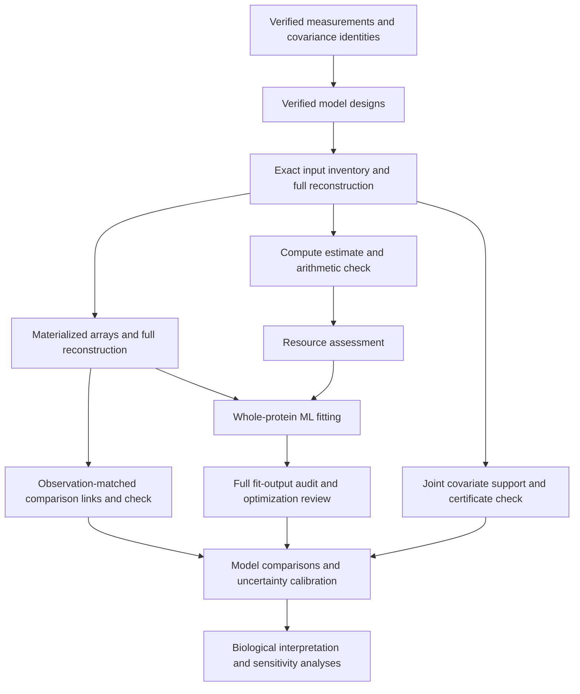

# Whole-protein sequence–structure workflow

Checkpoint: September 29, 2026. This workflow tests sequence–structure coupling
and duplication contrasts using whole proteins. It uses the frozen matched-pair
collection, not the entire expanded structural atlas. It does not complete the
project's eight scientific aims.

The collection contains 52,675 distinct matched pairs, 96 measurement settings,
five predictor designs and two structural outcomes. The 414,720 design/outcome
settings reduce to 75,070 exact numerical inputs; five species-tree alternatives
require 375,350 fits. Exact reuse retains every original setting association.
RMSD and mean-endpoint TM-divergence differences remain separate outcomes.

| Stage | Checkpoint status | Reproducibility record |
|---|---|---|
| Measurements, summaries and covariance index | Completed checks; historical summary mismatch was not reproduced, cause unresolved | [Detailed source checks](duplication-control-balance-20260927.md), [summary recovery](../metadata/whole_protein_summary_validation_recovery_20260928.json) |
| Five predictor designs | All 207,360 independently checked | [Design proof](../metadata/whole_protein_model_designs_v2_completed_readback_20260928.json) |
| Exact input inventory | Complete; all 414,720 settings and 75,070 unique recipes independently reconstructed | [Producer checkpoint](../metadata/whole_protein_input_inventory_producer_completed_20260929.json), [checker](../scripts/readback_whole_protein_input_inventory.py) |
| Compute estimates | Producer and arithmetic checker complete; 187,650 fits covered and 187,700 uncovered | [Plan](../metadata/whole_protein_fit_workload_plan_20260929.json), [check plan](../metadata/whole_protein_fit_workload_readback_plan_20260929.json) |
| Joint covariate support | Full independent check passed; six unresolved certificates retained | [Producer completion](../metadata/whole_protein_joint_support_producer_completed_20260929.json), [check plan](../metadata/whole_protein_joint_support_readback_plan_20260929.json) |
| Materialized fitting inputs | All 75,070 inputs independently reconstructed and checked | [Producer completion](../metadata/whole_protein_materialized_inputs_producer_completed_20260929.json), [check plan](../metadata/whole_protein_materialized_input_readback_plan_20260929.json) |
| Observation-matched model links | All 829,440 comparison links independently checked | [Plan](../metadata/whole_protein_model_links_plan_20260929.json), [check plan](../metadata/whole_protein_model_links_readback_plan_20260929.json) |
| Ordinary-ML fitting | Full 375,350-fit production run launched; 16 CPU workers | [Adapter checks](../metadata/whole_protein_ml_adapter_fixtures_20260929.json), [runner checks](../metadata/whole_protein_ml_runner_fixtures_20260929.json), [runner](../scripts/run_whole_protein_ml.py) |
| Full fit-output audit | Full output audit queued behind successful production completion | [Payload checks](../metadata/whole_protein_payload_replay_fixtures_20260929.json), [audit checks](../metadata/whole_protein_output_audit_fixtures_20260929.json), [audit runner](../scripts/audit_whole_protein_ml_outputs.py) |
| Model comparisons, calibrated uncertainty and interpretation | Incomplete | [Methods draft](methods-draft.md#whole-protein-sequencestructure-contrasts-september-29), [scientific milestones](scientific-milestones-20260926.md) |

The model includes residual variance, reused-background effects, family-component
effects and the selected species covariance factor. Predictors are linear,
quadratic or cubic gene-distance contrasts, positive-log gene-distance contrasts,
or alignment-identity contrasts, with coverage, aligned-length and confidence
covariates. Polynomial contrasts use target power minus control power. Predictors
are scaled without centering, preserving the zero-contrast intercept.

Likelihood comparisons require the same outcome and ordered observations.
Positive-log exclusions can change that observation set. The link stage retains
these exclusions explicitly and checks identical responses and shared predictor
columns before identifying comparable pairs. Named-column inclusion establishes
a sufficient nesting relation; its absence does not exclude other column-space
equivalence. Comparisons also require matching tree alternatives and acceptable
numerical fits.

Plans record checksums, resource allowances and dependencies; corresponding
launch records identify exact processes. Scripts run from the repository root.
Queued jobs wait for successful terminal states and matching completion proofs.
Keep pinned scripts and plans unchanged while those jobs run. The production
fitting and audit runners accept `--plan`; the
[production plan](../metadata/whole_protein_ml_plan_20260929.json) allocates 16 CPU
workers, and the [audit plan](../metadata/whole_protein_ml_output_audit_plan_20260929.json)
allocates eight workers after successful producer completion.
Large arrays and fit outputs stay outside Git history, with manifests and hashes
binding their identities.

Materialization budgets 80 GiB for an estimated 58.354 GiB of raw arrays. Other
stage allocations are in their plans. Timing scenarios from completed domain
fits are planning references, not whole-protein ETAs; unmatched size strata,
memory needs, setup and audit costs must remain explicit in the final allocation.

Optimization errors and review flags remain visible. Audit completion does not
make an error record a verified fit. Numerical stationarity, hull support and
agreement between implementations do not establish identifiability, global
optimality, calibrated intervals, prediction-source independence or a biological
effect. Those scientific checks remain part of the full project.

The inventory audit and workload arithmetic checks completed on September 29.
The [inventory completion](../metadata/whole_protein_input_inventory_audited_20260929.json)
and [workload completion](../metadata/whole_protein_fit_workload_audited_20260929.json)
bind their successful terminal states. Historical timing coverage excludes 93,300
fits outside observed record-count ranges and 94,400 fits with missing size
strata. Covered-only idealized scenarios must not be reported as full-run ETAs.
Array materialization, joint-support evaluation and their independent full
readbacks have completed. The observation-matched link checker also completed.
Production ordinary-ML fits launched after final provenance pins and a fresh
host-capacity check using the completed resource assessment below.

A [full-grid resource assessment](../metadata/whole_protein_fit_resource_assessment_20260929.json)
now specifies 16 single-thread workers, a 128 GiB memory cap, no swap and a 64 GiB
fit-output allowance. These are local CPU resources; no GPU or paid infrastructure
is involved. All 75,070 inputs and 375,350 tree fits remain in scope, including
the 187,700 fits outside historical timing coverage; there is no pilot subset.

The inspected solver uses nested background/family operations and a species
factor of rank at most 242. At the maximum 16,697 observations and seven
coefficients, an n-by-250 float64 array occupies 33,394,000 bytes. At most 182
distinct positive background sizes are possible because their minimum sum is
k(k+1)/2; the corresponding cached group-Gram stack is at most 91,000,000 bytes.
A planning allowance for multiple simultaneous arrays/stacks and interpreter
storage is about 1.04 GiB per worker, below the aggregate cap. This is a code-based
planning calculation, not measured peak RSS or a proved allocator bound.

Six complete-grid sensitivity scenarios assign the unmeasured fits the observed
covered mean cost multiplied by 1, 4 or 16, and vary covered costs by 1 or 4.
Their idealized durations span roughly 83–826 hours at 16 workers. This span is
not an ETA, uncertainty interval or upper bound: timing transfer and parallel
scaling are uncalibrated, and preparation, full audit and refinement are excluded.
The scenarios expose uncertainty rather than excluding expensive inputs. Actual
full-run timing records will inform revisions. The production run now uses this
allocation; its launch record identifies the exact process and immutable plan.

The joint-support producer completed all 75,070 unique inputs, mapping them to
15,270 exact covariate geometries. It reports zero supported to numeric tolerance
for 15,264 geometries and six unresolved certificates. All unresolved cases remain
explicit. The completion record verifies terminal success, 157 source hashes and
both output artifact hashes. The independent full certificate checker completed
successfully and retained all six unresolved classifications.
Hull inclusion alone does not establish interior overlap, dense support, model
adequacy or causal exchangeability.

Inspection of the six unresolved certificates found successful solver statuses
but negative sparse weights of approximately −4.46e−11 to −7.51e−10. The strict
nonnegative-weight requirement is the only failed certificate condition in the
saved values. These geometries map to 30 unique inputs and 112 setting/outcome
rows. The [diagnostic record](../metadata/whole_protein_unresolved_support_diagnostic_20260929.json)
preserves the source hashes, negative masses and per-case checks. Classifications
remain unresolved: no data or tolerances have been changed. Any projected or
reoptimized weights must form a separately verified certificate against validated
arrays using the original inclusion tolerance; this inspection does not replace
the full independent source readback.

A separate [weight-repair function](../scripts/repair_joint_support_weights.py)
now constructs a new witness by clipping negative sparse weights, normalizing
the remaining positive mass and recomputing the barycenter from supplied arrays.
It preserves the original certificate and solver fields, uses the existing
1e−8 inclusion tolerance, and passes the candidate through the independent
compensated-sum checker. Clipping alone never establishes support. Known exact
support and strictly outside-hull examples, preservation of the original, and
corruption rejection passed in the
[fixture record](../metadata/joint_support_weight_repair_fixtures_20260929.json).
The function has now been applied to all six unresolved project certificates
after source-array validation and full original-certificate readback completed.
The serialized candidates passed the independent compensated-sum checker against
all 30 associated exact inputs. The largest scaled barycenter distance was
5.19e−10, below the unchanged 1e−8 inclusion tolerance. Original certificates and
classifications remain preserved; downstream support overlay integration is still
required. The [completion record](../metadata/whole_protein_support_witness_completed_20260929.json)
binds the reproducible command, successful exit, receipt and output hashes.

Materialization completed 75,070 NPZ inputs representing 453,351,822 record
occurrences and 375,350 planned tree-specific fits. Output files total
62,752,448,732 bytes. The producer completion record binds successful terminal
status, source hashes, the input manifest and receipt, unique input identities,
file sizes and occurrence totals. The independent reconstruction of all five serialized arrays subsequently
completed successfully for every input. Whole-protein production fits are now
running, with their full output audit queued.

The [launch handoff](../metadata/whole_protein_fit_prerequisites_verified_20260929.json)
records successful terminal states, validation-proof hashes and available host
capacity (683 GiB memory and 10,761 GiB disk at the prelaunch check). The
[fit launch](../metadata/whole_protein_ml_launch_20260929.json) and
[audit launch](../metadata/whole_protein_ml_output_audit_launch_20260929.json)
bind process identities and plans. The producer has a 128 GiB memory cap; the
queued auditor has a 64 GiB cap, with swap disabled for both. Audit timing remains
unmeasured: its plan exposes 1/10/100 seconds per disposition sensitivity
scenarios rather than a finish-date claim. No scientific aim is complete from
these preparation checks or launches.

An [early frozen-prefix review](../metadata/whole_protein_initial_flag_review_completed_20260929.json)
checked all five flagged dispositions among the first 705 completed fits. These
are five distinct numerical inputs: three projected-gradient failures (maximum
absolute gradients 0.001077–0.001312 against the unchanged 0.001 criterion), one
full-face start disagreement, and one optimizer-reported failure despite a small
gradient. No case contacts the upper ratio bound. The existing independent payload
checker replayed all 110 candidate likelihoods and reconstructed fit parameters,
covariances, gradients and decision flags; the largest objective difference was
4.37e−11. Source and input hashes, full frozen prefix and result identities are
retained. Original outputs and review flags remain unchanged. This is an early
triage check, not the full output audit or an estimate of the final flag rate.
Targeted refinement must retain original candidates, validate any improved
solution and meet the existing numerical criteria before downstream use.

The [initial flagged-fit refinement](../metadata/whole_protein_initial_flag_refinement_plan_20260929.json)
is now launched for all five previously replayed flags in the frozen 705-fit
prefix. It uses the already validated ordinary-ML refinement solver: all eight
variance-component faces, the original candidate and an additional start at its
parameters are retained, giving 24 candidates per fit. Optimization uses up to
1,000 iterations, ftol 1e−14, gtol 1e−8 and maxls 80; acceptance thresholds remain
unchanged. Every candidate likelihood and the selected coefficients/covariance
are replayed with separate GLS normal-equation code sharing the covariance
operator. The adapter preserves the whole-protein intercept and uncentered
covariate scaling and exports coefficients in original units.

One CPU and a 16 GiB memory cap are allocated, without swap, GPU or new charges.
The 0.1–4 hour planning allowance covers stricter optimization and 120 candidate
replays; it is not a completion guarantee. The
[launch record](../metadata/whole_protein_initial_flag_refinement_launch_20260929.json)
binds the exact process. All outputs go to a separate versioned directory;
production fits and their flags remain untouched. The full production grid
continues. Refinement completion, serialized review, integration and resolution
of later flags are still required before using corrected results scientifically.

The [serialized refinement readback](../metadata/whole_protein_initial_flag_refinement_readback_plan_20260929.json)
is queued behind exact producer identity and successful terminal completion. It
replays all 120 saved candidate likelihoods, the full face/start grid, original
references, selected parameters, projected gradients, numerical classifications,
coefficients and covariance transformations. Its mathematical libraries are shared
with the existing validated checker; this is a separate-process saved-output
verification, not an independent mathematical model. One CPU and 16 GiB memory
are allocated, no swap, with 0.05–1 hour active-time planning. The
[checker launch](../metadata/whole_protein_initial_flag_refinement_readback_launch_20260929.json)
records the exact process. At launch, three producer cases had completed: two
passed numerical checks and one retained full-face start disagreement. Completion
of a readback will not itself resolve any retained optimization flag.

The refinement and its saved-output checker have now both completed successfully.
The [completion handoff](../metadata/whole_protein_initial_flag_refinement_handoff_20260929.json)
binds both terminal states and the [full readback](../metadata/whole_protein_initial_flag_refinement_completed_readback_20260929.json).
All 120 candidate likelihoods, coefficients, covariance transforms, gradients and
classification decisions were replayed; the largest objective difference was
4.37e−11. Four of five refinements met the unchanged numerical criteria. The
remaining full-face start disagreement was retained for further review.

An [endpoint gradient diagnostic](../metadata/whole_protein_remaining_start_gradient_diagnostic_20260929.json)
showed that the ratio-one start had stopped 17.4126 negative-log-likelihood units
above the other starts, with maximum projected gradient 221.641, despite reported
optimizer success. This endpoint fails stationarity; it is not evidence of a
second stationary optimum. The other three full-face endpoints had gradients
below 0.001.

The [separate recovery plan](../metadata/whole_protein_full_face_start_recovery_plan_20260929.json)
uses bounded SLSQP with direct residual likelihoods and the validated analytic
gradient, ftol 1e−12 and up to 1,000 iterations. It restarted all four full-face
endpoints and separately reran the original ratio-one initialization. All five
runs succeeded, had projected gradients below 0.001, and agreed in likelihood
within 1e−5. All original 24 candidates remain recorded and eligible for
selection, including the prematurely stopped endpoint; none was overwritten or
silently removed. One CPU, 16 GiB memory, no swap and no GPU were allocated;
0.05–2 hours was a planning allowance, not an ETA. The actual recovery consumed
47 seconds of CPU time.

The [recovery readback](../metadata/whole_protein_full_face_start_recovery_completed_readback_20260929.json)
reconstructed every retained likelihood, restart identity, initial point,
endpoint, selected parameters, GLS coefficient and covariance transform. It also
compared the analytic gradients with finite differences of the separate
normal-equation likelihood at two step sizes, including a one-sided derivative
at the failed endpoint's zero variance component. All checks passed. At the
smaller step, the largest gradient discrepancy was 3.86e−6; selected-point
discrepancy was 2.11e−6. The likelihood readback difference was at most 1.82e−12.
Both producer and checker finished with success and exit status zero. The
covariance operator is shared between these likelihood implementations.

The [five-fit candidate registry](../metadata/whole_protein_initial_five_recovery_candidates_20260929.json)
now records four audited refinements and one audited start recovery, with original
production paths, hashes, input identities and original review statuses. It
resolves numerical follow-up for this frozen prefix only. It has not yet been
applied to production model comparisons. Later flagged fits, full-grid readback,
integration, model adequacy and calibrated uncertainty remain outstanding; none
of the eight evolutionary aims is complete.

The [resolved covariate-support registry](../metadata/whole_protein_resolved_support_built_20260929.json)
has now been built for all 75,070 exact inputs, 15,270 covariate geometries and
414,720 design/outcome settings. It uses the earlier verified original
certificates for 15,264 geometries and the separately verified nonnegative
witnesses for the remaining six. These corrections affect 30 inputs and 112
settings. Each input retains its original support classification, input checksum,
geometry identity, chosen certificate source and certificate-file checksum;
every setting retains its original full specification and links to that choice.
Original certificates and active production-fit scripts remain unchanged.

The [integration plan](../metadata/whole_protein_resolved_support_plan_20260929.json)
allocates one CPU, 16 GiB memory, zero swap and 2 GiB output, with a 0.1–4 hour
active-time allowance. It verifies all original source artifacts, including the
62.75 GB input collection, before and after constructing the full registry. The
producer completed successfully with exit status zero. The new counts classify
every geometry as zero supported to the original numerical tolerance; this is a
certificate result, not a demonstration of dense or interior covariate overlap.

The [independent saved-output check](../metadata/whole_protein_resolved_support_readback_plan_20260929.json)
is running. It reconstructs each of the 75,070 stored matrices and ordered row
identities, checks the original exact input signature, rebuilds the covariate
geometry hash, and verifies every saved certificate choice. Compensated-sum
certificate checks run for each of the 15,264 original geometries and every one
of the 30 corrected inputs. All 414,720 setting rows are compared field by field
against the source inventory and independently reconstructed input registry.
No optimizer or altered tolerance is used. One CPU and 16 GiB memory are
allocated, no swap, with a 0.2–8 hour uncalibrated active-time allowance. These
resource estimates are planning allowances, not ETAs or timeouts. No GPU or
paid infrastructure is used.

The [support-registry reader](../scripts/whole_protein_support_registry.py)
requires the completed full-readback proof and matching receipt/artifact/source
hashes before exposing an input. Every lookup requires its exact input checksum
and preserves the original classification and certificate provenance. It returns
zero-reference support, without assigning model or scientific eligibility. Six
[consumer-gate fixtures](../metadata/whole_protein_support_registry_gate_fixtures_20260929.json)
passed, including rejection of pending verification, changed certificates and
tables, input-checksum mismatch and inconsistent verification scope. These small
fixtures test the reader's gate; they do not substitute for the full running
matrix/certificate check. Full registry validation and use in model comparisons
remain pending, alongside numerical-fit review and calibrated inference.

The [full resolved-support handoff](../metadata/whole_protein_resolved_support_completed_handoff_20260929.json)
now records successful completion of both support services. The
[saved-output proof](../metadata/whole_protein_resolved_support_completed_readback_20260929.json)
covers every one of the 75,070 matrices and ordered identities, all 15,270
geometries and every field of all 414,720 setting links. It checked 15,294
certificates: 15,264 original geometries and all 30 corrected inputs. The checker
consumed 8 minutes 24 seconds of CPU time and about 1 GiB peak memory.
The actual registry reader subsequently resolved every materialized input using
its exact checksum: 75,040 original certificate choices and 30 corrected choices.
Numerical support integration is verified. Dense/interior covariate overlap,
model adequacy and calibrated biological inference are still separate questions.

The [full comparison export](../metadata/whole_protein_ml_comparison_export_plan_20260929.json)
and its [serialized readback](../metadata/whole_protein_ml_comparison_readback_plan_20260929.json)
are now queued. The [live pipeline record](../metadata/whole_protein_ml_comparison_pipeline_queued_20260929.json)
binds both wrapper PIDs and commands. The export waits for the entire production
fit audit and the completed support audit to finish successfully. It covers all
829,440 prespecified within-setting model pairs across all five trees: 4,147,200
comparison rows. All 375,350 source fits are accounted for before comparison.

Each fit summary retains the original fit status, likelihood, input checksum
and source-file checksum. The five audited numerical recovery candidates are
applied explicitly, with selected-source identity and original review status
preserved; later flags remain unresolved. Both sides retain support provenance.
Different-observation links have null direct-comparison gains. Comparable fits
retain raw likelihood gains, including negative gains. Named nested models have
explicit added-coefficient counts and a numerical monotonicity flag at
1e−7 + 1e−9 times the larger absolute objective. This count is not assigned a
chi-square reference distribution. Identical named designs must agree within
that tolerance. Missing fits and unresolved numerical statuses remain visible.
No p-values, AIC selection or scientific eligibility are produced.

The independent saved-output stage reconstructs every source fit summary and
recovery choice, reads every setting/tree row, and separately checks gain
orientation, arithmetic, nesting and classification. The selected-summary reader
and verified support gate are shared; this is not an independent optimizer or
covariance implementation. Eight manually specified contrast cases and all five
real audited recovery cases passed the
[export fixtures](../metadata/whole_protein_ml_comparison_fixtures_20260929.json).
The [separate checker fixtures](../metadata/whole_protein_ml_comparison_readback_fixtures_20260929.json)
covered all eight cases and rejected a changed exported gain. Fixtures do not
substitute for the complete queued export/readback.

Each stage has one CPU, 16 GiB memory, zero swap and an uncalibrated 0.5–16 hour
active-time allowance. Export reserves 16 GiB output: a 3 KiB/raw-row scenario
is about 11.9 GiB before level-one gzip, plus fit summaries and receipts.
Checksummed per-tree checkpoints permit restarting the export under identical
source pins and plan. Prerequisite fit/audit waiting is excluded; these are
resource planning allowances, not completion estimates or timeouts. No GPU or
paid infrastructure is used. Full export completion, saved-output validation,
resolution of later optimization flags and inferential calibration remain
outstanding. The older frozen measurement atlas underlying these fits is not
silently replaced by the expanded duplication atlas.
