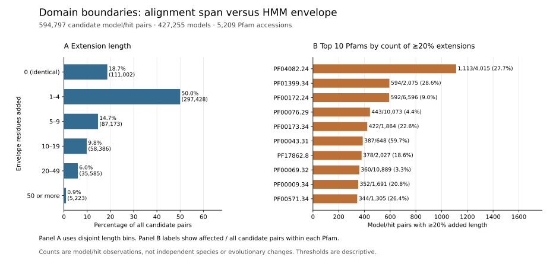
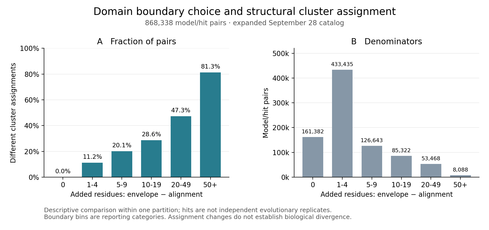

# Whole-proteome structural domain interval registry

The registry links every one of the frozen catalog's 1,290,278 AlphaFold models
to the independently audited full Pfam candidate-architecture database by exact
sequence hash. It retains the 1,319,513 original species/protein/model links,
checking each against the annotation protein table as well as the model table.
No prediction, structural clustering or evolutionary inference is performed
by this stage.

`structure_domains.sqlite` contains four related tables:

- `models`: structure identifier/version, sequence hash, length, path, raw-hit
  count and policy-agreement flag, including models without hits.
- `segments`: every distinct retained annotation hit across policies, including
  Pfam accession/version, type, clan, alignment bounds, envelope bounds and HMM
  coverage. Repeated hits remain separate through their source hit identifiers.
- `policy_hits`: retained hit membership for all four competition policies,
  conservative-architecture flags and domain-interval candidate flags.
- `protein_links`: every original taxon/protein association to its model.

Coordinates are **one-based inclusive source-protein positions**, with alignment
and envelope boundaries retained separately. Each interval must satisfy
`1 <= envelope_start <= alignment_start <= alignment_end <= envelope_end <= protein_length`.
Inconsistent same-hit fields across policies, repeated hits within a policy,
unknown model sequences, mismatched protein sequences and invalid bounds stop
the build. Database keys preserve distinct repeated occurrences.

Conservative architecture requires policy agreement and absence of rank ties,
unresolved overlaps, candidate nesting, alignment overlaps and retained partial
HMM hits below 0.70 coverage. A domain-interval candidate additionally requires
Pfam type `Domain`, HMM coverage >=0.70 and alignment span >=30 residues. These
are screening choices, not validated structural boundaries. All other types,
intervals and policy alternatives remain available for sensitivity analyses.
No-hit models remain explicitly unannotated; they are not domain-loss calls.

This registry does not extract coordinates or apply residue pLDDT/PAE criteria.
Those checks, independent registry readback, domain-level structural comparisons,
clustering and phylogenetic interpretation remain required. Exact sequence
identity supplies the intended residue numbering; it does not independently
validate every CIF coordinate here.

## Execution and resources

Script: `scripts/build_structure_domain_registry.py`.
Plan: `metadata/whole_proteome_structure_domain_registry_plan.json`.
Output: `results/domains/whole-proteome-structure-domain-registry-20260923-v1`.
Unit: `fungal-structure-domain-registry-20260923.service`.

The plan pins source data and code. Its catalog and architecture checksums were
also matched to the previously completed catalog and family-domain bridge
receipts before launch. Limits are one CPU, 16 GiB memory and no swap. Planning
allows 10 GiB output, at least 100 GiB free disk and an uncalibrated 0.5–12 hours;
no GPU or paid resources are used. The process was confirmed live in
`metadata/whole_proteome_structure_domain_registry_launch.json`.

Fixtures checked union-hit deduplication with preservation of four policy
memberships, conservative exclusion on policy disagreement and rejection of an
out-of-bounds envelope. A completed producer receipt will still be labeled
pending independent readback. At this checkpoint the build is running and no
registry result is claimed.

## Independent full readback queued

`readback_structure_domain_registry.py` now waits on the exact live registry
producer and requires its completed receipt, plan binding and database hash.
It reconstructs every model row from the catalog, every interval and policy
membership from the source annotation JSON, and every species/protein link
from both the catalog and original annotation protein table. It also checks
full table counts, foreign keys and database integrity. Source and output hashes
are checked before and after the readback.

The auditor does not import the producer's interval logic. In particular,
alignment overlap is recomputed by interval intersection, and partial-hit
exclusion is recomputed from each annotation's HMM coverage, instead of trusting
the producer's architecture summary counts. Fixtures show that stale summary
fields do not hide actual overlaps or partial HMM matches. This remains a check
against the same source annotations, not an independent Pfam search or a
validation of biological domain boundaries.

Plan: `metadata/whole_proteome_structure_domain_registry_readback_plan.json`.
Output: `results/domains/whole-proteome-structure-domain-registry-readback-20260923-v1`.
Unit: `fungal-structure-domain-readback-20260923.service`.
The controller is live; its launch record is archived in metadata. Limits are
one CPU, 16 GiB RAM and no swap; output planning is 0.01 GiB and uncalibrated
runtime planning is 0.5–12 hours after the producer. No GPU or paid service is
used. Independent validation is queued, not complete.

## Completed registry and independent readback

Both stages finished successfully. The full registry contains **1,290,278
models**, **1,319,276 distinct model/hit intervals**, **5,251,715 policy/hit
memberships** and all **1,319,513 protein links**. Of the models, 456,081 have
no qualifying Pfam hit; their records remain present.

The independent reconstruction matched every model field, interval, policy
membership, candidate flag and protein link, including recalculated interval
overlap and partial-HMM exclusions. Candidate Domain intervals number 594,425
under alignment/E-value ranking, 594,127 under alignment/bit-score ranking,
592,574 under envelope/E-value ranking and 592,279 under envelope/bit-score
ranking. These overlapping policy counts must not be added as unique domains.

The producer completed in about 264 seconds and the independent readback in
about 271 seconds, excluding their initial checks/waits. The SQLite SHA256 is
`90a2c795d2a0286fad037dad79a881757f365baaad50815ca6fb9fa4a4d0373e`.
Bound receipts are archived as
`metadata/whole_proteome_structure_domain_registry_completed_receipt.json` and
`metadata/whole_proteome_structure_domain_registry_completed_readback.json`.
The earlier queued/running text records launch history. Coordinate extraction,
residue confidence and PAE assessment, domain-level comparisons and evolutionary
interpretation remain unfinished.

## Complete domain extraction manifest

The union of candidate Domain hits across all four policies contains **594,797
model/hit pairs across 427,255 source models**. Preparing both alignment and
envelope spans yields **1,189,594 boundary associations**. Deduplication by the
full protein sequence hash and inclusive start/end coordinates retains
**1,078,592 unique intervals**, totaling **168,431,396 interval residues**; the
longest interval is 1,103 residues. The source models contain 198,306,563
full-protein residues.

The manifest retains every model/hit/boundary association in a deterministic
compressed table, so identical coordinates are stored once without losing
annotation provenance. It includes the full union, not a subsample. Interval
IDs hash the full source-sequence identity and bounds; they do not claim a
new evolutionary family or unique domain sequence.

Reproduce with `scripts/prepare_domain_extraction_manifest.py`, using a fresh
output directory. Outputs are under
`results/domains/domain-extraction-manifest-20260923-v1`; the archived receipt is
`metadata/domain_extraction_manifest_completed_receipt.json`. The producer
checked every boundary association against its original hit. The separate
`readback_domain_extraction_manifest.py` reconstructs the complete distinct
interval set with SQL UNION, then checks every exported model, source sequence,
path, bound, length and interval hash.

Coordinate extraction has not launched. Its dimension-based resource estimate
is recorded in `metadata/domain_coordinate_extraction_resource_estimate.json`:
four CPU workers, 32 GiB memory, no swap or GPU, 500 GiB output allowance and an
uncalibrated 6–96 hour planning range. The allowance covers potentially roughly
80–140 GiB of uncompressed all-atom PDB text, archives and validation outputs;
actual usage is not yet measured. Source coordinate hashes, full polymer
sequences, residue identity, missing atoms and confidence must be checked during
extraction. Domain boundaries, PAE qualification and downstream comparisons
remain separate checks.

The independent full manifest readback **passed** for all 1,078,592 intervals;
its receipt is `metadata/domain_extraction_manifest_readback.json`.

## Full coordinate extraction launched

The full 1,078,592-interval extraction is now running under
`fungal-domain-coordinate-extraction-20260923.service`; this supersedes the
not-yet-launched checkpoint above. The plan and verified live process record
are `metadata/domain_coordinate_extraction_plan.json` and
`metadata/domain_coordinate_extraction_launch.json`.

`extract_domain_coordinates.py` partitions all 427,255 source models into
1,000-model jobs and runs four CPU workers. Each worker reads each CIF once
into memory, checks that exact byte buffer against the catalog checksum,
verifies full polymer identity and atom-to-residue identities, and checks
finite coordinates, occupancy and confidence. Unsupported residues, alternate
locations, multiple models/chains, duplicate atoms and incomplete Cα coverage
receive explicit rejection dispositions. Missing other backbone atoms are
recorded on exported intervals and require downstream exclusion/review.

Exports retain all source atoms within the interval, with one-based local
residue numbering and the original start/end mapping in the manifest. PDB
coordinate/confidence rounding, serialized atom identity and fragment sequence
are checked before each export. Both boundary alternatives are retained through
the earlier reversible manifest. Each job produces an uncompressed tar archive,
a per-interval JSONL disposition/quality table and checksummed receipt. The
manifest includes source hashes, fragment sequence hashes, PDB hashes, mean
Cα pLDDT and fraction of Cα residues at pLDDT >=70. Those summaries do not make
an interval confidence- or PAE-qualified.

Independent Bio.PDB parsing checked serialized residue numbering, coordinates
and confidence on a real source fragment. Fixtures also rejected altered source
checksums and verified tar membership and completed-shard checksum checks. A
full independent archive readback is still required; these fixtures are not a
replacement for it. Completed shards carry receipts; unreceipted partial shards
require explicit recovery review rather than silent reuse. The top-level run
requires a fresh directory.

The run is capped at four CPUs, 32 GiB RAM and no swap. It requires 2 TiB free
disk before starting and checks a 1 TiB reserve before each source model. The
500 GiB storage allowance and 6–96 hour runtime range remain planning estimates.
On a worker failure, queued work is cancelled and already running bounded jobs
finish or reach their own checks. No GPU prediction, paid infrastructure,
biological domain-boundary validation or evolutionary inference is performed.

## Full domain archive readback queued

`readback_domain_coordinate_archives.py` now waits for the exact extraction
process and requires its completed receipt and plan binding. Before checking
archives it matches every job model to the original catalog and every job
interval to the full verified manifest, rejecting duplicate or missing scope.
It then uses four CPU workers to read every completed archive and disposition
record, checking hashes, exact tar membership and each exported atom against
original CIF arrays. Checks cover source/local residue numbering, atom and
residue names, elements, coordinates, occupancy, confidence, fragment sequence,
missing-backbone positions and confidence summaries. Standard PDB rounding
is allowed explicitly; altered coordinates are rejected by a fixture.

The auditor reconstructs expected atom sets and decodes PDB fixed-width fields
without importing the producer's extraction/serialization functions. The CIF
lexical parser is shared, so this is not a wholly independent file parser.
Rejected intervals must retain known identities and reasons; their rejection
causes are not independently adjudicated by this pass. The resulting receipt
will distinguish checked exports from excluded intervals. No PAE qualification
or biological boundary inference is implied.

Plan: `metadata/domain_coordinate_archive_readback_plan.json`.
Output: `results/domains/domain-coordinate-readback-20260923-v1`.
Unit: `fungal-domain-coordinate-readback-20260923.service`.
The live controller is recorded in `metadata/domain_coordinate_archive_readback_launch.json`.
Fixtures passed a complete real-source archive and rejected a changed coordinate.
Limits are four CPUs, 32 GiB memory, no swap and no GPU; output planning is
0.01 GiB and runtime planning is an uncalibrated 6–120 hours after extraction.
The readback is queued and not yet a completed validation result.

## First completed production archive checked against source atoms

While the full extraction continued, the queued auditor's shard-check routine
was applied to the complete `shard_00000` archive. It passed for **all 2,473
exported domains from 1,000 source models**. Every exported atom was checked
against original CIF arrays, including exact identities and membership,
coordinates within serialization precision, occupancy, confidence, fragment
sequence and missing-backbone flags. No interval in this archive was rejected
or had missing backbone atoms. The check took about 118 seconds.

`metadata/domain_coordinate_first_completed_shard_readback.json` binds the
result to unchanged job, shard receipt and auditor hashes. This is one complete
production archive, not the full extraction result: the global manifest/catalog
scope checks and all other archive readbacks remain pending. At the subsequent
checkpoint, extraction had completed 16/428 shards, producing 38,992 domains
from 16,000 models without rejections. It continues across the full manifest.

## Full domain search database queued

The installed Foldseek version was tested with a TSV list of tar archives using
two exported domains (279 residues) from the source-atom-checked archive. Native
lookup identifiers, full amino-acid hashes, 3Di length/alphabet and every float32
Cα coordinate matched. The test is reproducible with
`python scripts/check_domain_foldseek_archive_input.py`; its receipt is
`metadata/domain_foldseek_archive_fixture_checks.json`.

A full-database controller now waits for the all-archive original-atom auditor.
It requires that completed audit, its exact producer receipt and both plan
bindings. It checks each input tar/disposition hash and builds the database from
all successfully exported intervals, accounting separately for rejected inputs
and missing-backbone flags. Both boundary definitions retain their interval IDs;
these variants are not independent evolutionary observations.

Native `createdb` uses four CPU threads, pLDDT70 seeding masks and float32 Cα
storage. Domain 3Di encodings are calculated afresh on cropped coordinates;
they are not slices of the full-protein encodings. After conversion, every
lookup and amino-acid hash, structural-state length/alphabet and stored Cα
coordinate is checked against the audited PDB spans. Full archive hashes are
rechecked afterwards. This does not independently validate the native 3Di
network outputs or qualify alignments by residue confidence/PAE.

Script: `scripts/advance_domain_search_database.py`.
Plan: `metadata/full_domain_search_database_plan.json`.
Output: `results/structural_clusters/full-domain-database-20260923-v1`.
Unit: `fungal-full-domain-database-20260923.service`.
The live waiting controller is recorded in metadata. Limits are four CPUs,
64 GiB memory, no swap and no GPU. Launch gates require 500 GiB free disk and
128 GiB available RAM; planning allows 50 GiB output and an uncalibrated
2–48 hours after the full archive audit. Clustering, threshold/boundary
sensitivity, domain homology and evolutionary inference remain subsequent work.

## Full alignment/envelope boundary sensitivity

The complete extraction manifest contains **594,797 candidate model/hit pairs**
from **427,255 models**, counted once across the union of four annotation
policies. Comparing the two boundaries for every pair gives:

| Boundary comparison | Candidate pairs |
|---|---:|
| Identical alignment and envelope endpoints | 111,002 |
| Envelope extends beyond alignment | 483,795 |
| Envelope adds at least 10 residues | 99,194 |
| Envelope adds at least 20% of alignment length | 28,271 |

The last two rows overlap. Reporting thresholds are descriptive bins, not
validated exclusion criteria. The median added length is two residues; the
90th, 95th and 99th percentiles are 15, 24 and 47 residues, respectively, with
a maximum of 426. Thus the typical boundary difference is small, but the
longer tail warrants retaining both alternatives in structural comparisons.
These counts do not establish which boundary is biologically correct or
whether the difference changes a structural or evolutionary result.

`scripts/summarize_domain_boundary_sensitivity.py` validates the complete
manifest hashes, one alignment/envelope pair per candidate, containment and
length arithmetic, and writes every pair to
`results/domains/domain-boundary-sensitivity-20260923-v1/boundary_sensitivity.tsv.gz`.
A separate CSV/dictionary implementation in
`scripts/readback_domain_boundary_sensitivity.py` reconstructs every row from
the original manifest and checks the identity grid, endpoints, lengths,
extensions, fractions and threshold counts. The quantiles are producer
summaries and are not separately recomputed by this readback. Both receipts
are archived in `metadata/domain_boundary_sensitivity_{receipt,readback}.json`.

Reproduce with:

```bash
python scripts/summarize_domain_boundary_sensitivity.py \
  --manifest results/domains/domain-extraction-manifest-20260923-v1 \
  --output results/domains/domain-boundary-sensitivity-20260923-v1
python scripts/readback_domain_boundary_sensitivity.py \
  --manifest results/domains/domain-extraction-manifest-20260923-v1 \
  --result results/domains/domain-boundary-sensitivity-20260923-v1
```

Use a fresh output directory when rerunning the producer. This bounded local
CPU summary does not modify extraction inputs or launch GPU prediction.
Coordinate audits, PAE qualification and comparative structural tests remain
separate stages.

## Full domain structural clustering queued

`fungal-domain-clustering-20260923.service` waits for the exact full-domain
Foldseek database controller process, then requires its passing full sequence
and coordinate readback receipt, bound plan and all database artifact hashes.
The controller is `scripts/advance_domain_clustering.py`, with pinned plan
`metadata/domain_clustering_plan.json`; its verified live process is recorded
in `metadata/domain_clustering_launch.json`. The output directory is
`results/structural_clusters/full-domain-clusters-20260923-v1`.

The candidate partition uses the same initial settings as the queued
whole-protein clustering: native alignment type 2, bidirectional coverage 0.8,
E-value 0.001, sensitivity 7.5, maximum 1,000 prefilter candidates, greedy
set-cover clustering and reassignment. These are project discovery settings,
not validated homology cutoffs. Every successfully exported interval is
included; rejected intervals and missing-backbone counts remain explicit.
Alignment and envelope alternatives are both retained and are not independent
biological observations. Boundary and parameter sensitivity remain required.

After clustering and TSV export, every member must be a known interval,
assigned exactly once, and every representative must have self-membership.
The entire database is rehashed after execution. Partition fixtures passed a
valid multi-cluster case and rejected missing, duplicate, unknown and invalid
representative assignments. These tests do not independently verify native
alignment thresholds or the scientific validity of cluster membership.

Resources were assessed before queuing: approximately 868 GiB available RAM
and 11,831 GiB free disk. The service allows eight CPU equivalents, 128 GiB
RAM, no swap, no GPU and no paid resources; native split-memory is 64G.
Execution requires 192 GiB available RAM and 2 TiB free disk, with an emergency
1 TiB disk reserve that stops this controller's own native process group.
Output planning is 500 GiB and runtime planning is an uncalibrated 6–168 hours
after database completion. Temporary clustering files are retained.

Clustering is queued, not completed. Candidate structural groups do not by
themselves establish homology, orthology, function or evolutionary events.

### Native controller integration fixture

`scripts/check_domain_clustering_controller.py` now exercises the entire
queued domain controller CLI on two actual exported domains from the first
source-atom-checked archive. Native `createdb`, `cluster` and `createtsv` passed,
including the `domains` database prefix, full partition checks and propagation
of explicit exclusion/backbone counters. The two fixture domains formed two
clusters; this is software validation, not a biological clustering result.
The fixture uses a synthetic database-completion receipt and does not certify
production completion. It rejects incomplete status, a wrong plan binding and
a changed database artifact before any native clustering starts.

The initial fixture-only 1G split-memory limit was below the native prefilter's
minimum and failed explicitly. Repeating with the unchanged production 64G
setting passed. Production remains queued and its pinned scripts and plans
were not modified. The fixture uses one native thread, temporary local files,
no GPUs and no paid resources. Its receipt is archived in
`metadata/domain_clustering_cli_fixture_checks.json`; reproduce with
`python scripts/check_domain_clustering_controller.py`. Native alignment
thresholds and biological interpretation still require separate validation.

## Pfam-stratified boundary sensitivity

All 594,797 candidate model/hit pairs were joined exactly to the independently
audited domain registry, covering **5,209 Pfam accessions**. Every original
alignment/envelope endpoint matched. A separate SQL aggregation directly
from registry endpoints reproduced every per-Pfam integer summary: candidate
and model counts, identical boundaries, extension reporting bins, total added
residues and maximum added length. **2,232 accessions** contain at least one
hit whose envelope adds at least 20% of its aligned length.

The largest absolute counts in that reporting bin are:

| Pfam accession | Candidate model/hit pairs | At least 20% added | Fraction |
|---|---:|---:|---:|
| PF04082.24 | 4,015 | 1,113 | 27.72% |
| PF01399.34 | 2,075 | 594 | 28.63% |
| PF00172.24 | 6,596 | 592 | 8.98% |

This ranking reflects absolute observation counts and sampling; it is not an
enrichment test, a phylogenetically independent comparison or a demonstrated
structural effect. Repeated domains and shared full-sequence models remain
distinct from species counts. These are annotation-qualified candidates,
without residue confidence or PAE qualification. Both interval definitions
remain available for subsequent structural comparisons.

The complete table is versioned at `metadata/pfam_boundary_sensitivity.tsv`,
with `metadata/pfam_boundary_sensitivity_receipt.json` binding the source
registry, its audit, the boundary table, its audit and the generating script.
Reproduce with:

```bash
python scripts/summarize_pfam_boundary_sensitivity.py \
  --registry results/domains/whole-proteome-structure-domain-registry-20260923-v1 \
  --registry-readback metadata/whole_proteome_structure_domain_registry_completed_readback.json \
  --boundaries results/domains/domain-boundary-sensitivity-20260923-v1 \
  --output results/domains/pfam-boundary-sensitivity-20260923-v1
```

Use a fresh output directory for a rerun. This local CPU summary leaves all
production extraction inputs and running job plans unchanged.

## Paired boundary cluster sensitivity queued

A full-data successor now waits for the exact domain-clustering process and
its passing receipt. `scripts/compare_domain_boundary_clusters.py`, driven by
`metadata/domain_boundary_cluster_plan.json`, will join every original
model/hit boundary pair to the completed interval partition. It requires
bound clustering/database plans, receipt and lookup/member hashes, exact
partition coverage, representative self-membership and agreement between the
unclustered interval count and the recorded extraction exclusions.

Every pair receives one explicit disposition: identical interval; distinct
intervals in the same cluster; distinct intervals in different clusters;
alignment unclustered; envelope unclustered; or both unclustered. The identical
case is kept separate because it is a reused interval rather than two
independent structures. Missing intervals are retained in the denominator.
No disagreements are silently removed or interpreted as evolutionary change.
This analysis measures paired boundary agreement within one joint candidate
partition. It does not compare independently clustered datasets, validate
homology or quantify direct structural displacement.

All six classification fixtures passed. Duplicate boundaries, missing partners
and unknown boundary labels were rejected. These tests do not replace full
production output readback, which remains required. The full output will be
`results/structural_clusters/domain-boundary-dispositions-20260923-v1`.
The live waiting unit is `fungal-domain-boundary-clusters-20260923.service`,
recorded in `metadata/domain_boundary_cluster_launch.json`.

This stage requests one CPU, 8 GiB RAM, no swap and 2 GiB output planning,
with a 50 GiB free-disk gate. Planning allows an uncalibrated 1–60 minutes
after clustering completes; 869 GiB RAM and 11,826 GiB disk were available
before queuing. No GPUs, paid resources or changes to existing jobs are used.

### Full boundary-cluster output verification queued

`scripts/readback_domain_boundary_clusters.py` independently reconstructs
all seven fields for every model/hit output row from the original interval
manifest, both boundary links, database lookup and cluster membership table.
It does not import the producer's comparison or classification functions.
It checks that interval/model identities agree, both boundaries exist exactly
once, partition members cover the lookup exactly, representatives include
themselves, every result pair occurs once, and all disposition and exclusion
counts agree with the completed source receipts. Source files, plans and
receipts are bound by checksums checked before and after reconstruction.

The six-category fixture passed; 17 altered output/source cases were rejected,
including wrong assignments, missing/duplicated pairs, incorrect model links,
incomplete partitions and representatives lacking self-membership. Evidence:
`metadata/domain_boundary_cluster_readback_fixture_checks.json`. These are
synthetic table checks; the production comparison has not completed.

The full readback is queued as `fungal-domain-boundary-readback-20260923`,
waiting for the exact comparison process recorded in
`metadata/domain_boundary_cluster_readback_plan.json`. The launch record is
`metadata/domain_boundary_cluster_readback_launch.json`; the future output is
`results/structural_clusters/domain-boundary-dispositions-readback-20260923-v1`.
The job uses one CPU equivalent, 8 GiB RAM and no swap or GPUs. Its uncalibrated
runtime allowance is 1–60 minutes after its predecessor completes, with
0.1 GiB output planning and a 50 GiB free-disk gate. At launch, 858 GiB RAM and
11,809 GiB disk were available. No existing producer or pinned plan was changed.

A passing readback will establish complete output reconstruction within the
same partition. Independent clustering parameter sensitivity, alignment
threshold validation, homology, biological boundaries and evolutionary effects
remain separate requirements.

### Descriptive boundary-sensitivity figure



[Download the figure as PDF](figures/domain_boundary_sensitivity.pdf).

The left panel partitions all 594,797 candidate model/hit pairs into disjoint
bins for the number of residues added by the HMM envelope relative to the
alignment span. Half (297,428) add 1–4 residues, 111,002 have identical bounds,
and 5,223 add at least 50 residues. The right panel selects ten Pfam accessions
by the absolute number of candidate pairs with added length at least 20% of
the alignment-span length. Labels show affected/total pairs within each Pfam
and the corresponding percentage. This is a count ranking, not an enrichment
analysis; observations share models and taxa.

All 16 bar widths were checked against the saved plot-data table. Full-table
aggregation reproduced the independently checked source counts and Pfam totals.
The rendered PNG was inspected for readability, labels and clipping; SVG and
PDF exports use the same figure object. Data, receipt and visual review are
`metadata/domain_boundary_sensitivity_figure_{data.tsv,receipt.json,review.json}`.
Thresholds are reporting categories, not validated biological cutoffs.

Reproduce into a fresh output directory:

```bash
python scripts/plot_domain_boundary_sensitivity.py \
  --boundaries results/domains/domain-boundary-sensitivity-20260923-v1 \
  --pfam-table metadata/pfam_boundary_sensitivity.tsv \
  --pfam-receipt metadata/pfam_boundary_sensitivity_receipt.json \
  --output results/figures/domain-boundary-sensitivity-20260923-v2
```

## Completed coordinate and cluster outputs

All 1,078,592 intervals from 427,255 models were exported. The full atom
readback passed across all 428 archive shards, and the domain Foldseek database
passed sequence and coordinate readback for 168,431,396 residues. The complete
partition contains 70,537 candidate clusters, including 41,930 singletons.
These counts include alternative boundaries, which are not independent domains.

Independent readback covered all 594,797 alignment/envelope pairs and
1,189,594 boundary links. Among the 483,795 nonidentical pairs, 86,503 (17.88%)
have different cluster assignments in the joint partition.
[The extension-length figure](figures/boundary_cluster_extension.svg) reports
bin-specific numerators and denominators. This is within-partition boundary
sensitivity, not stability across separate clustering runs or evolutionary change.

Completion evidence is archived in:

- `metadata/domain_coordinate_full_completed_readback_20260923.json`
- `metadata/full_domain_database_completed_receipt_20260923.json`
- `metadata/full_domain_clustering_completed_receipt_20260923.json`
- `metadata/domain_boundary_clusters_completed_readback_20260923.json`
- `metadata/domain_boundary_extension_figure_receipt_20260923.json`

Remaining work includes clustering-parameter and confidence sensitivity,
direct comparisons within
homologous domains, and phylogenetic tests. Clusters alone do not establish
orthology, remote homology, domain gains/losses or structural acceleration.

## Validated family and taxon links

Full independent readback now verifies 439,217 source proteins and 688,246
distinct cluster/protein links across all 70,537 clusters. Both guide-specific
family mappings are preserved. The database retains interval coordinates and
source-model links, so alternative boundaries and proteins sharing a model
remain distinguishable. There are 16,648 clusters spanning multiple taxa;
7,353 span multiple inferred families under both guides. This identifies
candidate comparison groups, not established homology or evolutionary events.

See `metadata/domain_cluster_composition_completed_readback_20260923.json`
and `metadata/domain_cluster_composition_summary_20260923.json` for the
full-scope validation and descriptive census. Reproduce the producer and audit
with their respective `scripts/annotate_domain_cluster_composition.py` and
`scripts/readback_domain_cluster_composition.py` commands, passing the matching
`metadata/domain_cluster_composition_plan.json` and
`metadata/domain_cluster_composition_readback_plan.json` via `--plan`.
Existing outputs are protected; new runs require fresh output paths and
updated pinned plans/process identities.

## September28 expanded-catalog registry refresh

The independently validated1,910,138-model/1,955,694-protein-link catalog is
now entering the unchanged full domain-registry workflow. All four policies,
Pfam types, alignment/envelope boundaries and conservative-candidate flags
remain explicit. The11GiB annotation database and original script hashes were
verified against the previous plan before preparing new immutable inputs.
The original registry and all downstream analyses remain preserved.

New production plan:
`metadata/whole_proteome_structure_domain_registry_plan_20260928.json`;
output `results/domains/whole-proteome-structure-domain-registry-20260928-v1`.
Resources are one CPU,24GiB RAM, no swap,20GiB planned output and a100GiB
minimum free-disk gate. The0.5–24h allowance is conservative and uncalibrated,
reflecting approximately1.48 times as many models as the prior registry.
No GPU, paid infrastructure or new structure inference is used.

Independent row reconstruction is queued under
`metadata/whole_proteome_structure_domain_registry_readback_plan_20260928.json`.
The new waiting wrapper verifies process identity and requires terminal
systemd success/exit0 before invoking the unchanged full registry readback.
Launch records bind process IDs, creation times, commands and plan hashes.
Both stages are active/pending at this checkpoint; no expanded domain counts,
new coordinate extraction, confidence qualification or evolutionary events
are claimed. Existing domain clusters still describe the older frozen input.

### Expanded interval manifest queued

After successful full registry validation, a queued handoff will prepare all
candidate intervals and independently compare every emitted interval against
an SQL union of source alignment/envelope spans. Both boundaries and reversible
model/hit associations remain explicit. The v2 manifest producer/readback add
explicit input/output arguments to the previously completed algorithms;
reviewed diffs change only argument parsing and paths. CLI checks passed.

Plan `metadata/domain_interval_manifest_handoff_plan_20260928.json` and launch
record `metadata/domain_interval_manifest_handoff_launch_20260928.json` bind
the validator's PID, creation time, command and plan hash. The handoff requires
terminal success/exit0 before starting. Resources are one CPU,32GiB RAM, no
swap,2GiB output planning and0.1–4 active hours (uncalibrated, excluding waits).
Output is `results/domains/domain-extraction-manifest-20260928-v1`; full readback
will be `metadata/domain_extraction_manifest_readback_20260928.json`.
This stage prepares coordinates for later extraction only; it does not extract
structures or qualify confidence, homology or evolutionary changes.

### September28 registry independently verified

The refreshed registry and its independent full reconstruction both finished
successfully. Receipt bindings, current database checksum and both terminal
exit0 states were checked and recorded in
`metadata/whole_proteome_structure_domain_registry_completed_20260928.json`.
Verified totals are1,910,138 models,1,955,694 protein links,1,917,742 retained
annotation segments and7,633,452 policy/hit memberships. The683,755 models
without retained hits remain explicit. Segments include multiple Pfam feature
types; policy memberships repeat features and must not be added as independent
domains.

Candidate Domain-hit counts are867,368 for alignment/bitscore,867,819 for
alignment/E-value,864,732 for envelope/bitscore and865,188 for envelope/E-value.
The forthcoming union manifest deduplicates exact sequence intervals while
preserving every source association and both boundary definitions. These
annotation-based candidates still require coordinate extraction, confidence
qualification and structural assessment. Successful registry validation does
not establish biological domain boundaries or evolutionary changes.

### Expanded manifest verified; full coordinate extraction running

The new manifest and independent SQL-union readback completed successfully:
1,575,294 unique intervals from627,567 models,248,418,990 interval residues,
868,338 candidate model/hit pairs and1,736,676 reversible boundary links.
The maximum interval length is1,103 residues. All source identities, inclusive
bounds and interval hashes were checked. Completion is recorded in
`metadata/domain_extraction_manifest_completed_20260928.json` and
`metadata/domain_extraction_manifest_readback_20260928.json`.

The unchanged full extraction implementation is now running under
`metadata/domain_coordinate_extraction_plan_20260928.json`, output
`results/domains/domain-coordinates-20260928-v1`. It attempts every verified
interval in1,000-model shards; exact source hashes and full polymer/atom residue
identity are checked. All atoms are retained, with explicit rejection reasons
and missing-backbone flags. This is extraction from existing coordinates,
not new prediction. The old outputs remain reproducible separately.

Four CPU workers,32GiB RAM and no swap are configured. The previous full run
processed1,078,592 intervals from427,255 models in15,201.92 seconds, producing
107.82GB of tar archives. Simple interval/model scaling gives6.17–6.20 hours
for this extraction, not a guaranteed ETA; current load and lengths differ.
The conservative6–96h and500GiB output allowances remain, with2TiB starting
and1TiB emergency free-disk gates. More than11TiB was available at planning.
No GPU or paid infrastructure is used.

The complete atom-level archive readback is queued after verified terminal
producer success, using the unchanged independent implementation with its own
four-CPU/32GiB limits. Plans and launch identities are tracked under
`metadata/domain_coordinate_archive_readback_{plan,launch}_20260928.json`.
The wrapper requires matching PID/creation time/command and terminal
success/exit0. Coordinates are not qualified until that audit completes;
residue confidence, PAE, clustering and evolutionary integration remain
separate downstream work.

### Expanded structural search database queued (September 28)

The refreshed database controller is queued as
`fungal-full-domain-database-20260928.service`, with plan and launch identity in
`metadata/full_domain_search_database_{plan,launch}_20260928.json`.
It requires the identified full atom audit to reach terminal success with exit
code zero. The new wrapper checks PID, creation time, command and unit state;
the unchanged conversion implementation then checks matching extraction/audit
receipts and hashes before building
`results/structural_clusters/full-domain-database-20260928-v1`.

The scope is every successfully exported interval from the refreshed manifest
(up to 1,575,294 intervals and 248,418,990 residues). Conversion checks every
AA sequence, structural-alphabet length/alphabet and C-alpha coordinate against
the audited PDB spans. This is not independent reconstruction of 3Di states or
confidence qualification. Rejected intervals remain explicit. Both domain
boundary definitions remain available for downstream sensitivity analyses.

Resources are four CPU threads, 64 GiB RAM and no swap, GPU or paid resources.
The planning allowance is 100 GiB output and 3–72 active hours; this is not a
measured ETA. The new residue scope is about 1.475 times the previous database.
Conversion requires at least 500 GiB free disk and 128 GiB available RAM;
planning observed more than 11,000 GiB disk and 669 GiB RAM available. The
controller is waiting; no refreshed database or clustering is complete yet.

### Expanded domain clustering queued (September 28)

`fungal-full-domain-clustering-20260928.service` waits for the identified
refreshed database controller to finish successfully. Its PID, creation time,
command and terminal unit state are checked before the unchanged clustering
implementation verifies the database receipt and every artifact hash. The plan
and launch record are `metadata/domain_clustering_{plan,launch}_20260928.json`;
outputs will be in `results/structural_clusters/full-domain-clusters-20260928-v1`.

The full exported interval scope is retained, including both boundary choices.
Settings match the old baseline: alignment type 2, bidirectional coverage 0.8,
E-value 0.001, sensitivity 7.5, prefilter cap 1,000, cluster mode 0 and native
reassignment. All lookup identities must occur exactly once in the exported
partition, and every representative must include itself. These membership
checks do not independently validate alignment thresholds or establish
homology, orthology, confidence qualification or evolutionary events.
Boundary and parameter sensitivity remain necessary downstream analyses.

The queued service has eight CPU threads, 128 GiB memory and no swap or GPU.
Allow 1,000 GiB temporary/output space and 12–336 active hours; the expanded
search cost is nonlinear and this is not a measured ETA. Before starting it
requires 2 TiB free disk and 192 GiB available RAM, with a 1 TiB emergency disk
reserve during native execution. No new infrastructure or charges are used.
The controller is live but waiting; expanded clustering is not yet complete.


### Expanded pipeline completion and boundary comparison (September 29)

The September28 queued stages above have now completed with successful terminal
exit states. The full atom audit checked 1,575,294 exported intervals from 627,567
models. Database conversion checked 248,418,990 residues. The refreshed structural
partition contains 95,456 candidate clusters, including 58,816 singleton clusters;
the largest cluster has 14,934 intervals. All database and cluster output artifact
hashes were rechecked in the
[completion handoff](../metadata/expanded_domain_pipeline_completed_20260929.json).
This supersedes the earlier queued statuses, while preserving their resource and
method records. Cluster counts include both candidate boundary definitions and
are not counts of independent domains, homologous families or orthogroups.

The [expanded boundary plan](../metadata/domain_boundary_cluster_plan_20260929.json)
now compares alignment and envelope membership for every original model/hit pair,
separating identical intervals from distinct intervals assigned together. The
[independent output readback](../metadata/domain_boundary_cluster_readback_plan_20260929.json)
reconstructs every output field from interval identities, boundary links and the
partition. Both services use one CPU and a 16 GiB memory cap, with no swap, GPU or
paid infrastructure; each has an uncalibrated planning allowance of 1–120 minutes.
Their [producer launch](../metadata/domain_boundary_cluster_launch_20260929.json)
and [checker launch](../metadata/domain_boundary_cluster_readback_launch_20260929.json)
record exact process identities. The producer completed all 868,338 model/hit
pairs: 161,382 identical intervals, 576,872 distinct intervals sharing a cluster,
and 130,084 distinct intervals assigned to different clusters. The producer
and independent checker both exited successfully. Every output field for all
868,338 pairs passed reconstruction from the original sources; the
[completed readback](../metadata/domain_boundary_cluster_completed_readback_20260929.json)
binds the counts, terminal state and checked source hashes.
Within-partition agreement does not measure stability under independent reclustering;
alignment thresholds, parameter sensitivity, confidence, homology and evolutionary
interpretation remain separate requirements.


### Boundary extension and cluster assignment (September 29)

All 868,338 expanded model/hit pairs now have checked alignment/envelope lengths,
endpoints, extensions and reporting-threshold counts. The
[completed length readback](../metadata/expanded_domain_boundary_sensitivity_completed_20260929.json)
used independent CSV reconstruction; producer quantiles are not independently
verified. Both commands and their resource allowance are recorded in the
[execution plan](../metadata/expanded_domain_boundary_sensitivity_plan_20260929.json).

The [full boundary/cluster join](../metadata/expanded_boundary_cluster_extension_completed_20260929.json)
matched every pair exactly once and retained all 130,084 changed assignments.
Counts by total residues added at either terminus are:

| Added residues | Model/hit pairs | Different cluster assignments | Fraction |
|---|---:|---:|---:|
| 0 | 161,382 | 0 | 0.00% |
| 1-4 | 433,435 | 48,356 | 11.16% |
| 5-9 | 126,643 | 25,517 | 20.15% |
| 10-19 | 85,322 | 24,374 | 28.57% |
| 20-49 | 53,468 | 25,265 | 47.25% |
| 50+ | 8,088 | 6,572 | 81.26% |

These are descriptive counts within the single expanded partition. Models can
contribute multiple hits and bins, and protein links can share structures; counts
are not independent replicates. Larger extensions coincide with more assignment
changes, but domain length, family composition and clustering parameters can
also vary across bins. The table does not establish a causal boundary effect or
biological structural divergence. Boundary alternatives must remain explicit in
downstream family and architecture analyses. Serialization, count and fraction
arithmetic passed. A separate endpoint reconstruction subsequently reproduced
all six pair counts, assignment-change counts and fractions exactly, as recorded
below; per-bin distinct-model counts were not repeated by that check. The reproducible join command is recorded in
[its plan](../metadata/expanded_boundary_cluster_extension_plan_20260929.json).




[Download the vector PDF](figures/boundary-cluster-extension-20260929/boundary_cluster_extension.pdf).
The [plot script](../scripts/plot_expanded_boundary_cluster_extension.py) validates all six
source-table rows, recomputes each fraction from integer counts and records source
and output hashes. The [rendering review](../metadata/boundary_cluster_extension_figure_review_20260929.json)
records the reproducible command and visual inspection. Both panels use linear
axes. There are no inferential error bars because these descriptive model/hit
counts are not independent evolutionary replicates.


The [endpoint reconstruction check](../metadata/expanded_boundary_cluster_extension_endpoint_check_20260929.json)
now independently recalculates each extension from the original interval endpoints,
checks envelope containment and model identity, and compares assignments from the
fully audited cluster-disposition rows. Across all 868,338 pairs and 1,575,294
intervals, all six bin totals, changed-assignment counts and fractions exactly
match the separate derived-length join. It uses the existing endpoint-summary
implementation, preserving its original interface. This strengthens arithmetic
and provenance evidence for the figure; it is not independent reclustering or
biological validation, and it does not repeat per-bin distinct-model counts.
